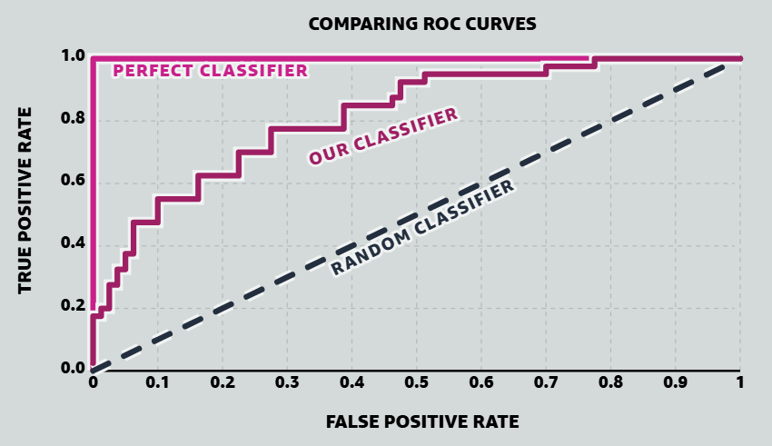

## Scoring classifiers
 
A binary classifier assigns each input to one of two classes, which we call positive ($P$) and negative ($N$). Some classifiers output a hard label directly. Others output a real-valued score $S(x)$ representing confidence that $x$ is positive, and turn that score into a prediction via a threshold: predict positive iff $S(x) \geq t$.
 
Working with scores instead of hard labels has two advantages. The score carries ranking information — how much more positive $x_a$ looks than $x_b$ — that a hard label throws away. And we can tune the threshold after training: raising $t$ predicts fewer positives (fewer false alarms, more missed detections), lowering $t$ does the opposite. A single scoring model gives us a whole family of hard classifiers, one for each threshold. The ROC curve shows this whole family at once.
 
The name "receiver operating characteristic" comes from radar signal detection in the 1940s. The receiver was the radar receiver, and its operating characteristic was the trade-off between detecting real echoes and mistaking noise for echoes. The math generalizes to any binary detection problem, but the name stuck.
 
## Rates at a fixed threshold
 
Fix a threshold $t$. Every input falls into one of four cells depending on its true label and its predicted label. Two rates matter for ROC analysis:
 
**True Positive Rate** (also called recall or sensitivity) — the fraction of positives we catch:
$$\text{TPR}(t) = \frac{\text{TP}}{\text{TP} + \text{FN}} = \frac{1}{|P|} \sum_{x \in P} \mathbb{I}\{S(x) \geq t\}$$
 
**False Positive Rate** (the complement of specificity) — the fraction of negatives we mislabel:
$$\text{FPR}(t) = \frac{\text{FP}}{\text{FP} + \text{TN}} = \frac{1}{|N|} \sum_{x \in N} \mathbb{I}\{S(x) \geq t\}$$
 
Both rates normalize within their true class, not across the whole dataset. Doubling the number of negatives leaves FPR alone — the numerator and denominator scale together. That is why ROC analysis works well when one class dominates, as in fraud detection or anomaly detection, where positives may be a fraction of a percent of the data and a global accuracy metric would rate an "always predict negative" classifier at 99.9%.
 
## Sweeping the threshold
 
As $t$ moves from $+\infty$ down to $-\infty$:
 
- At $t = +\infty$, nothing is predicted positive, so $\text{TPR} = \text{FPR} = 0$.
- At $t = -\infty$, everything is predicted positive, so $\text{TPR} = \text{FPR} = 1$.
- Lowering $t$ can only add samples to the "predicted positive" set, never remove any, so TPR and FPR both increase (weakly) as $t$ falls.
The curve traced in the $(\text{FPR}, \text{TPR})$ plane as $t$ sweeps is the **ROC curve**. It runs from $(0,0)$ to $(1,1)$, monotonically up and to the right.
 
Between two consecutive observed scores $S(x_{(i)}) < S(x_{(i+1)})$, no sample crosses the threshold, so TPR and FPR stay put. The ROC curve is a step function with breakpoints only at the $N$ observed score values. We only need to evaluate $(\text{FPR}, \text{TPR})$ at those $N$ thresholds — everything in between is copies.
 
Sort the samples in decreasing order of score, $S(x_{(1)}) \geq S(x_{(2)}) \geq \dots \geq S(x_{(N)})$. Setting $t = S(x_{(k)})$ predicts the top $k$ scored samples as positive. Grow $k$ from $0$ to $N$ one sample at a time:
 
- If $x_{(k)}$ has true label **positive**, TPR ticks up by $1/|P|$ — we step *up*, FPR unchanged.
- If $x_{(k)}$ has true label **negative**, FPR ticks up by $1/|N|$ — we step *right*, TPR unchanged.
There are only two kinds of breakpoint because a sample has only two possible true labels. The four confusion-matrix cells (TP, FP, TN, FN) are not four kinds of breakpoint: they classify samples *at a fixed threshold*. As $t$ drops past $S(x_{(k)})$, the sample $x_{(k)}$ moves from one cell to another — a positive sample moves from FN to TP, a negative from TN to FP — but this is the same one sample causing the same one step, just described in confusion-matrix language instead of true-label language.
 
So we can draw the ROC curve by walking down the sorted list: step up for each positive, step right for each negative. Every quantitative property of the ROC curve can be read off this walk.
 
<!-- embedded-visualization:roc-threshold-walk:v1 -->

 
The walk depends only on the *order* of samples by score, not on the score values. Any strictly increasing transformation $S \to f(S)$ (a logistic squash, a rank transform, an exponential) preserves every pairwise ordering, produces the identical walk, and yields the identical ROC curve. The curve captures *rank quality* — how well the score separates positives from negatives — and is blind to what the scores actually are.
 
That other property of a scoring classifier — whether the scores themselves are meaningful — is called *calibration*. A classifier is calibrated when, among samples assigned score $s$, a fraction $s$ actually belong to the positive class. The *calibration curve* plots the score against the observed positive fraction (binned by score); perfect calibration is the diagonal $y = x$. Rank quality and calibration are independent: a classifier can rank perfectly while outputting badly-scaled scores (all crushed near 0.5, or systematically overconfident), and a well-calibrated classifier can rank mediocre-ly. The ROC curve sees the first property and hides the second.
 
## Reference curves
 
**Perfect classifier.** Every positive scores strictly higher than every negative. The walk goes up all $|P|$ steps first, then right all $|N|$ steps. The curve traces $(0,0) \to (0,1) \to (1,1)$ and covers the whole unit square underneath it.
 
**Random classifier.** Scores are uncorrelated with labels. Positives and negatives are shuffled together in the sorted list, and each step is equally likely to be up or right. On average the walk hugs the diagonal from $(0,0)$ to $(1,1)$. This diagonal is the baseline every real classifier is measured against.
 
**Below the diagonal.** A curve below the diagonal isn't a broken classifier — the scores are informative, but with the wrong sign. Flipping $S \to -S$ reflects the curve across the diagonal, and turns AUC into $1 - \text{AUC}$. A classifier with AUC = 0 is as useful as one with AUC = 1, once we flip its sign.
 

 
*Comparing a perfect classifier, the article's classifier, and the random-classifier baseline. Visualization from [MLU-Explain: ROC & AUC](https://mlu-explain.github.io/roc-auc/).*
 
## AUC as area — which area?
 
The ROC curve gives us a whole family of operating points — one $(F(t), T(t))$ pair per threshold. Summarising this family with a scalar requires reducing the two-dimensional trajectory to one number *without* picking a threshold first, since deferring that choice is the reason we drew the curve. Reading $T$ at a single fixed $t$ throws the rest of the curve away. Averaging $T$ over $t$ depends on the scale of $t$ — and the curve is invariant to that scale, so the summary should be too. What is left is to average $T$ over something the curve does see.
 
The curve sees $F$. Every threshold produces some FPR value $F \in [0, 1]$, and as $t$ decreases from $+\infty$ to $-\infty$, $F$ sweeps monotonically from $0$ to $1$. Re-parameterise the curve by $F$ instead of by $t$: each $F$ corresponds to some achievable TPR $T(F)$. The average TPR over this sweep is
 
$$\int_0^1 T \, dF,$$
 
which is exactly the area between the curve and the $F$-axis. This gives AUC a direct reading: **the average detection rate, averaged uniformly over the allowed false-alarm rate**. A classifier that catches many positives while spending little false-alarm budget has $T$ high whenever $F$ is small — the curve sits near the top-left and the integral is large. A classifier that only reaches high $T$ after spending most of its budget keeps $T$ small until $F$ is close to $1$, and the integral is small. So the area measures how *quickly* $T$ climbs as we relax the FPR budget, which is what "ranks positives above negatives" translates into on the ROC plot.
 
Two consequences follow. The scale is naturally interpretable: the random-order baseline (diagonal, $T = F$) has AUC $= 1/2$; a perfect classifier has AUC $= 1$; an inverted classifier has AUC $= 0$. And the invariances the curve already has — of monotone score rescaling and of class balance $|P|/|N|$ — pass through the integral unchanged.
 
To compute the area, it is enough to look at the curve one segment at a time. Number the sorted breakpoints $k = 0, 1, \dots, N$ where breakpoint $k$ means the top-$k$ scored samples are called positive, and let $(F_k, T_k) = (\text{FPR}_k, \text{TPR}_k)$.
 
Between adjacent breakpoints the curve is a straight segment. What shape it is depends on which kinds of sample sat at the same score:
 
- If breakpoint $k+1$ adds only **negatives**, the walk moves purely right: $F_{k+1} > F_k$, $T_{k+1} = T_k$, and the region under this segment is a **rectangle** of width $F_{k+1} - F_k$ and height $T_k$.
- If it adds only **positives**, the walk moves purely up: $F_{k+1} = F_k$, $T_{k+1} > T_k$, and the region under this vertical segment has width $0$ — it contributes nothing to the area.
- If it adds **both** positives and negatives at the same score (a tie between the two classes), the walk moves diagonally, and the region under this segment is a **trapezoid** of width $F_{k+1} - F_k$ and heights $T_k$ (left) and $T_{k+1}$ (right).
All three cases fit the trapezoidal formula: a rectangle is a trapezoid with equal heights, and a vertical segment is a trapezoid with zero width. Summing over segments:
 
$$\text{AUC} = \sum_{k=0}^{N-1} \frac{T_k + T_{k+1}}{2} \cdot (F_{k+1} - F_k)$$
 
So area accumulates from **rightward motion**, and only rightward motion — that is, only when a negative sample is crossed. Upward motion is what a positive contributes; on its own it adds no area. The tied-both case gives a trapezoid that we can split into the rectangle a lone negative would have contributed, plus an extra triangle sitting on top of it from the positive that came along at the same score. That extra triangle is where "tied pairs count as half" comes from, and the next visualisation is where we look at it closely.
 
 
<!-- combined-visualizations:auc-area:v1 -->

 
## AUC as a probability
 
The area computation is mechanical. A more useful description of the same number:
 
> AUC is the probability that a randomly chosen positive scores higher than a randomly chosen negative.
 
If we draw $x_+$ uniformly from $P$ and $x_-$ uniformly from $N$, independently, then
 
$$\text{AUC} = \Pr[S(x_+) > S(x_-)] + \tfrac{1}{2} \Pr[S(x_+) = S(x_-)]$$
 
with ties contributing half. To see why this equals the area, go back to the walk and the segment-by-segment area formula from the previous section.
 
<!-- combined-visualizations:auc-ranking:v1 -->

 
**The distinct-score case.** When no two samples share a score, every segment is either a rectangle (a negative is being crossed) or a vertical (a positive is being crossed). Vertical segments contribute no area. Each *rectangle* has width $1/|N|$ and height $T_k$, the fraction of positives already crossed at the moment we cross this negative. Let $T(x_-)$ denote that height for the specific negative $x_-$ whose crossing produced the rectangle:
 
$$T(x_-) = \frac{\#\{x_+ \in P : S(x_+) > S(x_-)\}}{|P|}.$$
 
Summing the rectangle areas — one rectangle per negative — and unfolding $T(x_-)$,
 
$$\text{AUC} = \sum_{x_- \in N} \frac{1}{|N|} \cdot T(x_-) = \frac{1}{|P|\,|N|} \sum_{x_- \in N} \#\{x_+ \in P : S(x_+) > S(x_-)\}.$$
 
The right-hand side counts, over all $|P|\,|N|$ pairs $(x_+, x_-) \in P \times N$, the ones in which the positive outranks the negative. Dividing by the total number of pairs gives the probability that a random positive outranks a random negative — the tie-free version of the formula.
 
**Ties.** Now suppose $x_+$ and $x_-$ share a score. The walk crosses both at the same moment; the corresponding segment is a diagonal, and the area under it is a trapezoid rather than a rectangle. That trapezoid decomposes into two pieces:
 
- the rectangle we would have had if only $x_-$ had crossed at this moment (width $1/|N|$, height $T_k$), and
- a small triangle sitting on top of it (width $1/|N|$, height $1/|P|$, area $1/(2\,|P|\,|N|)$).
The rectangle behaves the same as before: over all pairs involving $x_-$, the rectangle records $\{x_+ : S(x_+) > S(x_-)\}$. The triangle is new: it counts, per tied pair, half of one pair. Summing rectangles over all negatives and adding triangles over all tied positive–negative pairs,
 
$$\text{AUC} = \frac{1}{|P|\,|N|} \sum_{x_+, x_-}\Bigl[\mathbb{I}\{S(x_+) > S(x_-)\} + \tfrac{1}{2}\, \mathbb{I}\{S(x_+) = S(x_-)\}\Bigr].$$
 
The area formula and the pair-counting formula compute the same number. This gives an estimator we can compute directly, without ever building the ROC curve — count ordered $(x_+, x_-)$ pairs, add $1$ for concordant, $1/2$ for tied, divide by $|P|\,|N|$.
 
## What follows from the probability form
 
**AUC inherits the rank-only invariance.** The ROC curve depends only on the ordering of samples by score, so its area does too. In particular, AUC says nothing about calibration.
 
**AUC ignores class balance.** Look at the probability again: it is a probability over one positive and one negative drawn from their own classes, and no other quantities enter. If we duplicate all the negatives (or drop half of them at random, without touching how they score), $\Pr[S(x_+) > S(x_-)]$ doesn't change — the marginals of $x_+$ and $x_-$ are unchanged. AUC is the population-level version of the same class-balance invariance we saw in FPR and TPR: doubling the negatives doubled both numerator and denominator of FPR, and here it duplicates every negative's contribution to the probability by the same factor, without changing the probability.
 
The two ways to compute the same number — area under the ROC curve, and the fraction of correctly-ordered positive–negative pairs — are equivalent by the segment-by-segment argument in the previous section. The pair-counting formula is often the more convenient one to work with: it gives a direct estimator and it makes the connection to Kendall's tau below transparent.
 
## Kendall's tau
 
Pearson's correlation coefficient measures *linear* association — it hits $\pm 1$ on $Y = aX + b$ and falls short for $Y = X^3$ or $Y = e^X$, even though $Y$ is a strictly increasing function of $X$ in both cases. Often we care about *monotone* association instead: does $Y$ tend to grow as $X$ grows, regardless of the shape? This comes up in feature screening, where we ask of each candidate feature whether it has any monotone relationship with the target, letting any strictly increasing $Y = f(X)$ score the same. Kendall's tau measures monotone association. It looks only at whether pairs of observations move in the same direction, so any strictly increasing transformation of $X$ or $Y$ leaves it unchanged.
 
Given paired observations $(X_1, Y_1), \dots, (X_N, Y_N)$ — for instance, two measurements of the same subjects, or one quantity measured under two conditions — we can ask how well the ordering of the $X$'s agrees with the ordering of the $Y$'s. For each unordered pair of observations $\{i, j\}$, one of three things holds:
 
- **Concordant**: $(X_i - X_j)$ and $(Y_i - Y_j)$ have the same sign. Both orderings agree on this pair.
- **Discordant**: the differences have opposite signs. The orderings disagree.
- **Tied**: at least one of the differences is zero.
Write $n_c$ for the number of concordant pairs and $n_d$ for discordant pairs across all $\binom{N}{2}$ pairs. Kendall's tau is the signed excess of concordance over discordance, normalized to $[-1, 1]$:
 
$$\tau = \frac{n_c - n_d}{n_c + n_d}$$
 
$\tau = +1$ is perfect agreement, $\tau = -1$ is perfect disagreement, $\tau = 0$ is no association beyond chance.
 
**Concordance as classification.** Consider all *ordered* pairs $(i, j)$ with $i \neq j$. Split them into two classes by the sign of $Y_j - Y_i$: call the pair "positive" if $Y_j > Y_i$, "negative" if $Y_j < Y_i$. Now we have a two-class problem. As a classifier of these pairs, use the difference $X_j - X_i$ itself — a real-valued score, in the same role that $S(x)$ played in the scoring-classifier setup — and predict "positive" iff $X_j - X_i > 0$. Then:
 
- A **concordant** unordered pair $\{i, j\}$ produces two ordered pairs, and both are correctly classified: one has $Y_j > Y_i$ and $X_j > X_i$ (a positive with a high score), the other has $Y_j < Y_i$ and $X_j < X_i$ (a negative with a low score).
- A **discordant** unordered pair produces one ordered pair with $Y_j > Y_i$ and $X_j < X_i$ (a positive with a low score) and its reverse (a negative with a high score). Both are misranked.
AUC in this classification problem is the probability that a random "positive" ordered pair outscores a random "negative" one. That fraction is
 
$$\text{AUC} = \frac{n_c}{n_c + n_d}$$
 
and the relation to $\tau$ is one line of algebra:
 
$$\tau = \frac{n_c - n_d}{n_c + n_d} = \frac{2 n_c - (n_c + n_d)}{n_c + n_d} = 2 \cdot \text{AUC} - 1$$
 
Kendall's tau is a rescaled AUC for the "does $X$ predict the ordering of $Y$?" classification problem. The map $\tau \mapsto (\tau + 1)/2$ sends the $\tau$-range $[-1, +1]$ affinely onto the AUC-range $[0, 1]$: $\tau = 0$ (no association) lands at AUC = 1/2 (random baseline), $\tau = 1$ (perfect agreement) lands at AUC = 1 (perfect classifier), $\tau = -1$ (perfect anticorrelation) lands at AUC = 0 (perfectly-inverted classifier).