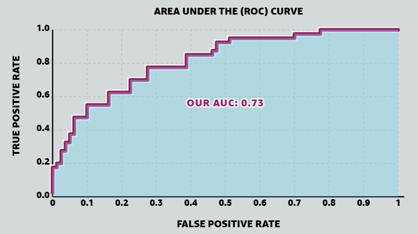

## Scoring classifiers

A binary classifier assigns each input to one of two classes, which we call positive ($P$) and negative ($N$). Some classifiers output a hard label directly. Others output a real-valued score $S(x)$ representing confidence that $x$ is positive, and turn that score into a prediction via a threshold: predict positive iff $S(x) \geq t$.

Working with scores instead of hard labels has two advantages. The score carries ranking information — how much more positive $x_a$ looks than $x_b$ — that a hard label throws away. And we can tune the threshold after training: raising $t$ predicts fewer positives (fewer false alarms, more missed detections), lowering $t$ does the opposite. A single scoring model gives us a whole family of hard classifiers, one for each threshold. The ROC curve shows this whole family at once.

The name "receiver operating characteristic" comes from radar signal detection in the 1940s. The receiver was the radar receiver, and its operating characteristic was the trade-off between detecting real echoes and mistaking noise for echoes. The math generalizes to any binary detection problem, but the name stuck.

## Rates at a fixed threshold

Fix a threshold $t$. Every input falls into one of four cells depending on its true label and its predicted label. Two rates matter for ROC analysis:

**True Positive Rate** (also called recall or sensitivity) — the fraction of positives we catch:
$$\text{TPR}(t) = \frac{\text{TP}}{\text{TP} + \text{FN}} = \frac{1}{|P|} \sum_{x \in P} \mathbb{I}\{S(x) \geq t\}$$

**False Positive Rate** (the complement of specificity) — the fraction of negatives we mislabel:
$$\text{FPR}(t) = \frac{\text{FP}}{\text{FP} + \text{TN}} = \frac{1}{|N|} \sum_{x \in N} \mathbb{I}\{S(x) \geq t\}$$

Both rates normalize within their true class, not across the whole dataset. Doubling the number of negatives leaves FPR alone — the numerator and denominator scale together. That is why ROC analysis works well when one class dominates, as in fraud detection or anomaly detection, where positives may be a fraction of a percent of the data and a global accuracy metric would rate an "always predict negative" classifier at 99.9%.

## Sweeping the threshold

As $t$ moves from $+\infty$ down to $-\infty$:

- At $t = +\infty$, nothing is predicted positive, so $\text{TPR} = \text{FPR} = 0$.
- At $t = -\infty$, everything is predicted positive, so $\text{TPR} = \text{FPR} = 1$.
- Lowering $t$ can only add samples to the "predicted positive" set, never remove any, so TPR and FPR both increase (weakly) as $t$ falls.

The curve traced in the $(\text{FPR}, \text{TPR})$ plane as $t$ sweeps is the **ROC curve**. It runs from $(0,0)$ to $(1,1)$, monotonically up and to the right.

Between two consecutive observed scores $S(x_{(i)}) < S(x_{(i+1)})$, no sample crosses the threshold, so TPR and FPR stay put. The ROC curve is a step function with breakpoints only at the $N$ observed score values. We only need to evaluate $(\text{FPR}, \text{TPR})$ at those $N$ thresholds — everything in between is copies.

Sort the samples in decreasing order of score, $S(x_{(1)}) \geq S(x_{(2)}) \geq \dots \geq S(x_{(N)})$. Setting $t = S(x_{(k)})$ predicts the top $k$ scored samples as positive. Grow $k$ from $0$ to $N$ one sample at a time:

- If $x_{(k)}$ is a true positive, TPR ticks up by $1/|P|$ — we step *up*, FPR unchanged.
- If $x_{(k)}$ is a true negative, FPR ticks up by $1/|N|$ — we step *right*, TPR unchanged.

So we can draw the ROC curve by walking down the sorted list: step up for each positive, step right for each negative. Every quantitative property of the ROC curve can be read off this walk.

The walk depends only on the *order* of samples by score, not on the score values. Any strictly increasing transformation $S \to f(S)$ (a logistic squash, a rank transform, an exponential) preserves every pairwise ordering, produces the identical walk, and yields the identical ROC curve. The curve captures *rank quality* — how well the score separates positives from negatives — and is blind to what the scores actually are.

That other property of a scoring classifier — whether the scores themselves are meaningful — is called *calibration*. A classifier is calibrated when, among samples assigned score $s$, a fraction $s$ actually belong to the positive class. The *calibration curve* plots the score against the observed positive fraction (binned by score); perfect calibration is the diagonal $y = x$. Rank quality and calibration are independent: a classifier can rank perfectly while outputting badly-scaled scores (all crushed near 0.5, or systematically overconfident), and a well-calibrated classifier can rank mediocre-ly. The ROC curve sees the first property and hides the second.

## Reference curves

**Perfect classifier.** Every positive scores strictly higher than every negative. The walk goes up all $|P|$ steps first, then right all $|N|$ steps. The curve traces $(0,0) \to (0,1) \to (1,1)$ and covers the whole unit square underneath it.

**Random classifier.** Scores are uncorrelated with labels. Positives and negatives are shuffled together in the sorted list, and each step is equally likely to be up or right. On average the walk hugs the diagonal from $(0,0)$ to $(1,1)$. This diagonal is the baseline every real classifier is measured against.

**Below the diagonal.** A curve below the diagonal isn't a broken classifier — the scores are informative, but with the wrong sign. Flipping $S \to -S$ reflects the curve across the diagonal, and turns AUC into $1 - \text{AUC}$. A classifier with AUC = 0 is as useful as one with AUC = 1, once we flip its sign.

*Comparing a perfect classifier, the article's classifier, and the random-classifier baseline. Visualization from [MLU-Explain: ROC & AUC](https://mlu-explain.github.io/roc-auc/).*

## AUC as area

Number the sorted breakpoints $k = 0, 1, \dots, N$ where breakpoint $k$ means the top-$k$ scored samples are called positive, and let $(F_k, T_k) = (\text{FPR}_k, \text{TPR}_k)$. Between adjacent breakpoints the curve is a straight segment. The area beneath a segment from $(F_k, T_k)$ to $(F_{k+1}, T_{k+1})$ is a trapezoid of width $F_{k+1} - F_k$ and average height $(T_k + T_{k+1})/2$:

$$\text{AUC} = \sum_{k=0}^{N-1} \frac{T_k + T_{k+1}}{2} \cdot (F_{k+1} - F_k)$$

*The shaded region is the area under the ROC curve. Visualization from [MLU-Explain: ROC & AUC](https://mlu-explain.github.io/roc-auc/).*

When scores are all distinct, each step changes exactly one of $F$ or $T$, and the trapezoid becomes a rectangle. Ties produce diagonal steps and honest trapezoids; we return to what that means below.

## AUC as a probability

The area calculation is mechanical. A more useful description of AUC:

> AUC is the probability that a randomly chosen positive scores higher than a randomly chosen negative.

If we draw $x_+$ uniformly from $P$ and $x_-$ uniformly from $N$, independently, then

$$\text{AUC} = \Pr[S(x_+) > S(x_-)] + \tfrac{1}{2} \Pr[S(x_+) = S(x_-)]$$

with ties contributing half. To see why this equals the area, we go back to the sorted walk.

Area accumulates under the curve only when we take a rightward step: a rightward step at height $T$ adds a rectangle of area $(1/|N|) \cdot T$. Upward steps add nothing (zero width).

At the moment we process a negative sample $x_-$, the height $T$ is the fraction of positives already processed — the positives with score strictly greater than $S(x_-)$:

$$T = \frac{\#\{x_+ \in P : S(x_+) > S(x_-)\}}{|P|}$$

Summing the rectangle areas over all negatives,

$$\text{AUC} = \sum_{x_- \in N} \frac{1}{|N|} \cdot T = \frac{1}{|P| \cdot |N|} \sum_{x_- \in N} \#\{x_+ \in P : S(x_+) > S(x_-)\}$$

The double sum counts pairs $(x_+, x_-) \in P \times N$ in which the positive outranks the negative. Dividing by $|P| \cdot |N|$ — the total number of such pairs — gives the fraction, which is the probability we wanted.

**Ties.** When a positive and a negative share a score, the walk takes a diagonal step from $(F, T)$ to $(F + 1/|N|, T + 1/|P|)$. The trapezoidal rule says this step adds area $(1/|N|) \cdot T + 1/(2 |P| |N|)$. The first piece is the rectangle we would have added had the negative come first (positive outranks — full credit); the second is a small triangle of area $1/(2 |P| |N|)$, which is the tie half-credit for that pair. Summing recovers the tie term in the probability formula exactly.

## What follows from the probability form

**AUC inherits the rank-only invariance.** The ROC curve depends only on the ordering of samples by score, so its area does too. In particular, AUC says nothing about calibration.

**AUC ignores class prevalence.** $\Pr[S(x_+) > S(x_-)]$ depends on the class-conditional score distributions, not on the mixing proportion $|P|/(|P|+|N|)$. Resampling to change the class balance leaves AUC alone in expectation, provided samples within each class come from the same conditional distribution. This is the population-level version of the imbalance invariance we saw in the FPR/TPR normalization.

**A direct combinatorial estimator.** Just count concordant pairs:

$$\widehat{\text{AUC}} = \frac{1}{|P| \cdot |N|} \sum_{x_+ \in P} \sum_{x_- \in N} \left[\mathbb{I}\{S(x_+) > S(x_-)\} + \tfrac{1}{2} \mathbb{I}\{S(x_+) = S(x_-)\}\right]$$

The area under the ROC curve and the fraction of correctly-ordered positive-negative pairs are two ways of computing the same number.

## Kendall's tau

Pearson's correlation coefficient measures *linear* association — it hits $\pm 1$ on $Y = aX + b$ and falls short for $Y = X^3$ or $Y = e^X$, even though $Y$ is a strictly increasing function of $X$ in both cases. Often we care about *monotone* association instead: does $Y$ tend to grow as $X$ grows, regardless of the shape? This comes up in feature screening, where we ask of each candidate feature whether it has any monotone relationship with the target, letting any strictly increasing $Y = f(X)$ score the same. Kendall's tau measures monotone association. It looks only at whether pairs of observations move in the same direction, so any strictly increasing transformation of $X$ or $Y$ leaves it unchanged.

Given paired observations $(X_1, Y_1), \dots, (X_N, Y_N)$ — for instance, two measurements of the same subjects, or one quantity measured under two conditions — we can ask how well the ordering of the $X$'s agrees with the ordering of the $Y$'s. For each unordered pair of observations $\{i, j\}$, one of three things holds:

- **Concordant**: $(X_i - X_j)$ and $(Y_i - Y_j)$ have the same sign. Both orderings agree on this pair.
- **Discordant**: the differences have opposite signs. The orderings disagree.
- **Tied**: at least one of the differences is zero.

Write $n_c$ for the number of concordant pairs and $n_d$ for discordant pairs across all $\binom{N}{2}$ pairs. Kendall's tau is the signed excess of concordance over discordance, normalized to $[-1, 1]$:

$$\tau = \frac{n_c - n_d}{n_c + n_d}$$

$\tau = +1$ is perfect agreement, $\tau = -1$ is perfect disagreement, $\tau = 0$ is no association beyond chance.

**Concordance as classification.** Consider all *ordered* pairs $(i, j)$ with $i \neq j$. Give each ordered pair a label from $Y$: call it "positive" if $Y_j > Y_i$, "negative" if $Y_j < Y_i$. Give it a score from $X$: $S_{ij} = X_j - X_i$. Now we have a classification problem — predict from $\text{sign}(X_j - X_i)$ whether $Y_j > Y_i$.

- A concordant unordered pair produces one ordered pair with $Y_j > Y_i, S_{ij} > 0$ (a positive with a high score), and its reverse — one with $Y_j < Y_i, S_{ij} < 0$ (a negative with a low score). Both are ranked correctly.
- A discordant unordered pair produces one ordered pair with $Y_j > Y_i, S_{ij} < 0$ (a positive with a low score), and its reverse — a negative with a high score. Both are misranked.

AUC in this classification problem is the probability that a random "positive" ordered pair outscores a random "negative" one. That fraction is

$$\text{AUC} = \frac{n_c}{n_c + n_d}$$

and the relation to $\tau$ is one line of algebra:

$$\tau = \frac{n_c - n_d}{n_c + n_d} = \frac{2 n_c - (n_c + n_d)}{n_c + n_d} = 2 \cdot \text{AUC} - 1$$

Kendall's tau is a rescaled AUC for the "does $X$ predict the ordering of $Y$?" classification problem. The map $\tau \mapsto (\tau + 1)/2$ sends the $\tau$-range $[-1, +1]$ affinely onto the AUC-range $[0, 1]$: $\tau = 0$ (no association) lands at AUC = 1/2 (random baseline), $\tau = 1$ (perfect agreement) lands at AUC = 1 (perfect classifier), $\tau = -1$ (perfect anticorrelation) lands at AUC = 0 (perfectly-inverted classifier).
