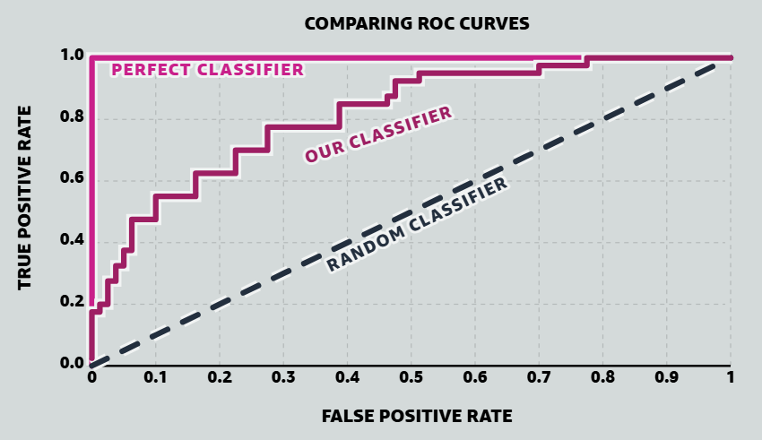

## Scoring classifiers

A binary classifier assigns each input to one of two classes:

* **Positive ($P$)**
* **Negative ($N$)**

Some classifiers output a hard label directly. Others output a **real-valued score $S(x)$** representing confidence that $x$ is positive, and turn that score into a prediction via a threshold: predict positive iff $S(x) \geq t$.

Working with scores instead of hard labels has **two key advantages**:

1. **Ranking Information:** The score carries information about how much more positive $x_a$ looks than $x_b$—data that a hard label throws away.
2. **Post-Training Threshold Tuning:** We can tune the threshold after training:
   * **Raising $t$** predicts fewer positives (fewer false alarms, more missed detections).
   * **Lowering $t$** does the opposite.

A single scoring model gives us a whole family of hard classifiers, one for each threshold. The **ROC curve** shows this whole family at once.

### Origin of the Name
The name **"receiver operating characteristic"** comes from radar signal detection in the 1940s:

* The **receiver** was the radar receiver.
* Its **operating characteristic** was the trade-off between detecting real echoes and mistaking noise for echoes.

The math generalizes to any binary detection problem, but the name stuck.

---

## Rates at a fixed threshold

Fix a threshold $t$. Every input falls into one of four cells in the confusion matrix depending on its true label and its predicted label. **While there are 4 individual counts in the confusion matrix, ROC analysis compresses them into two normalized rates:**

### 1. True Positive Rate ($\text{TPR}$)
Also called **recall** or **sensitivity**—the fraction of positives we catch:
$$\text{TPR}(t) = \frac{\text{TP}}{\text{TP} + \text{FN}} = \frac{1}{|P|} \sum_{x \in P} \mathbb{I}\{S(x) \geq t\}$$

### 2. False Positive Rate ($\text{FPR}$)
The complement of **specificity**—the fraction of negatives we mislabel:
$$\text{FPR}(t) = \frac{\text{FP}}{\text{FP} + \text{TN}} = \frac{1}{|N|} \sum_{x \in N} \mathbb{I}\{S(x) \geq t\}$$

ROC analysis splits the dataset into two completely isolated buckets:

* **Bucket 1: The Positives ($P$)**
* **Bucket 2: The Negatives ($N$)**

Each rate is calculated strictly inside its own bucket, completely blind to what happens in the other.

> **Key Property:** Doubling the number of negatives leaves FPR alone—the numerator and denominator scale together. That is why ROC analysis works well when one class dominates (e.g., fraud detection or anomaly detection, where positives may be a fraction of a percent of the data and a global accuracy metric would rate an "always predict negative" classifier at 99.9%).

---

## Sweeping the threshold

As $t$ moves from $+\infty$ down to $-\infty$:

* At $t = +\infty$, nothing is predicted positive, so $\text{TPR} = \text{FPR} = 0$.
* At $t = -\infty$, everything is predicted positive, so $\text{TPR} = \text{FPR} = 1$.
* Lowering $t$ can only add samples to the "predicted positive" set, never remove any, so TPR and FPR both increase (weakly) as $t$ falls.

The curve traced in the $(\text{FPR}, \text{TPR})$ plane as $t$ sweeps is the **ROC curve**. It runs from $(0,0)$ to $(1,1)$, monotonically up and to the right.

### Discrete Breakpoints
Between two consecutive observed scores $S(x_{(i)}) < S(x_{(i+1)})$, no sample crosses the threshold, so TPR and FPR stay put. The ROC curve is a **step function** with breakpoints only at the $N$ observed score values. We only need to evaluate $(\text{FPR}, \text{TPR})$ at those $N$ thresholds—everything in between is copies.

Sort the samples in decreasing order of score: $S(x_{(1)}) \geq S(x_{(2)}) \geq \dots \geq S(x_{(N)})$. Setting $t = S(x_{(k)})$ predicts the top $k$ scored samples as positive. Growing $k$ from $0$ to $N$ one sample at a time:

* If $x_{(k)}$ has true label **positive**: $\text{TPR}$ ticks up by $1/|P|$ — we step **up**, $\text{FPR}$ unchanged.
* If $x_{(k)}$ has true label **negative**: $\text{FPR}$ ticks up by $1/|N|$ — we step **right**, $\text{TPR}$ unchanged.

There are only two kinds of breakpoint because a sample has only two possible true labels. The four confusion-matrix cells ($\text{TP, FP, TN, FN}$) are not four kinds of breakpoint: they classify samples *at a fixed threshold*. As $t$ drops past $S(x_{(k)})$, the sample $x_{(k)}$ moves from one cell to another—a positive sample moves from $\text{FN}$ to $\text{TP}$, a negative from $\text{TN}$ to $\text{FP}$—but this is the same one sample causing the same one step, just described in confusion-matrix language instead of true-label language.

So we can draw the ROC curve by walking down the sorted list: **step up for each positive, step right for each negative.** Every quantitative property of the ROC curve can be read off this walk.

<!-- embedded-visualization:roc-threshold-walk:v1 -->


### Rank Quality vs. Calibration
The walk depends only on the **order** of samples by score, not on the score values. Any strictly increasing transformation $S \to f(S)$ (a logistic squash, a rank transform, an exponential) preserves every pairwise ordering, produces the identical walk, and yields the identical ROC curve. The curve captures **rank quality**—how well the score separates positives from negatives—and is blind to what the scores actually are.

That other property of a scoring classifier—whether the scores themselves are meaningful—is called **calibration**:

* A classifier is **calibrated** when, among samples assigned score $s$, a fraction $s$ actually belong to the positive class.
* The **calibration curve** plots the score against the observed positive fraction (binned by score); perfect calibration is the diagonal $y = x$.

Rank quality and calibration are independent: a classifier can rank perfectly while outputting badly-scaled scores (all crushed near 0.5, or systematically overconfident), and a well-calibrated classifier can rank mediocre-ly. **The ROC curve sees the first property and hides the second.**

---

## Reference curves

* **Perfect Classifier:** Every positive scores strictly higher than every negative. The walk goes up all $|P|$ steps first, then right all $|N|$ steps. The curve traces $(0,0) \to (0,1) \to (1,1)$ and covers the whole unit square underneath it.
* **Random Classifier:** Scores are uncorrelated with labels. Positives and negatives are shuffled together in the sorted list, and each step is equally likely to be up or right. On average the walk hugs the diagonal from $(0,0)$ to $(1,1)$. This diagonal is the baseline every real classifier is measured against.
* **Below the Diagonal:** A curve below the diagonal isn't a broken classifier—the scores are informative, but with the wrong sign. Flipping $S \to -S$ reflects the curve across the diagonal, and turns $\text{AUC}$ into $1 - \text{AUC}$. A classifier with $\text{AUC} = 0$ is as useful as one with $\text{AUC} = 1$, once we flip its sign.

*Comparing a perfect classifier, the article's classifier, and the random-classifier baseline. Visualization from [MLU-Explain: ROC & AUC](https://mlu-explain.github.io/roc-auc/).*

---

## AUC as area — which area?

The ROC curve gives us a whole family of operating points—one $(F(t), T(t))$ pair per threshold. Summarising this family with a scalar requires reducing the two-dimensional trajectory to one number *without* picking a threshold first, since deferring that choice is the reason we drew the curve:

* Reading $T$ at a single fixed $t$ throws the rest of the curve away.
* Averaging $T$ over $t$ depends on the scale of $t$—and the curve is invariant to that scale, so the summary should be too.

What is left is to average $T$ over something the curve does see: **it sees $F$**. Every threshold produces some $\text{FPR}$ value $F \in [0, 1]$, and as $t$ decreases from $+\infty$ to $-\infty$, $F$ sweeps monotonically from $0$ to $1$. Re-parameterise the curve by $F$ instead of by $t$: each $F$ corresponds to some achievable $\text{TPR}$ $T(F)$. The average $\text{TPR}$ over this sweep is:

$$\int_0^1 T \, dF$$

which is exactly the area between the curve and the $F$-axis. This gives AUC a direct reading: **the average detection rate, averaged uniformly over the allowed false-alarm rate**. 

* A classifier that catches many positives while spending little false-alarm budget has $T$ high whenever $F$ is small—the curve sits near the top-left and the integral is large. 
* A classifier that only reaches high $T$ after spending most of its budget keeps $T$ small until $F$ is close to $1$, and the integral is small. 

So the area measures how *quickly* $T$ climbs as we relax the FPR budget, which is what "ranks positives above negatives" translates into on the ROC plot.

### Core Consequences
1. **Interpretable Scale:**
   * **Random-order baseline** (diagonal, $T = F$): $\text{AUC} = 1/2$
   * **Perfect classifier**: $\text{AUC} = 1$
   * **Inverted classifier**: $\text{AUC} = 0$
2. **Preserved Invariances:** The invariances the curve already has—monotone score rescaling and class balance $|P|/|N|$—pass through the integral unchanged.

### Computing the Area Step-by-Step
Number the sorted breakpoints $k = 0, 1, \dots, N$ where breakpoint $k$ means the top-$k$ scored samples are called positive, and let $(F_k, T_k) = (\text{FPR}_k, \text{TPR}_k)$. Between adjacent breakpoints the curve is a straight segment, forming one of three geometric shapes:

* **Rectangle (Only Negatives Added):** $F_{k+1} > F_k$, $T_{k+1} = T_k$. The walk moves purely right; region width is $F_{k+1} - F_k$ and height is $T_k$.
* **Zero Area (Only Positives Added):** $F_{k+1} = F_k$, $T_{k+1} > T_k$. The walk moves purely up; width is $0$, contributing nothing to the area.
* **Trapezoid (Tied Scores — Both Added):** $F_{k+1} > F_k$, $T_{k+1} > T_k$. The walk moves diagonally; width is $F_{k+1} - F_k$ with left height $T_k$ and right height $T_{k+1}$.

All three cases fit the trapezoidal formula (a rectangle is a trapezoid with equal heights, and a vertical segment is a trapezoid with zero width). Summing over segments:

$$\text{AUC} = \sum_{k=0}^{N-1} \frac{T_k + T_{k+1}}{2} \cdot (F_{k+1} - F_k)$$

> **Takeaway:** Area accumulates **only from rightward motion** (crossing a negative sample). Upward motion is what a positive contributes; on its own, it adds no area. The tied case gives a trapezoid that splits into a rectangle (from the negative) plus an extra triangle on top (from the positive).

<!-- combined-visualizations:auc-area:v1 -->


---

## AUC as a probability

The area computation is mechanical. A more useful description of the same number:

> **AUC is the probability that a randomly chosen positive scores higher than a randomly chosen negative.**

If we draw $x_+$ uniformly from $P$ and $x_-$ uniformly from $N$, independently, then:

$$\text{AUC} = \Pr[S(x_+) > S(x_-)] + \tfrac{1}{2} \Pr[S(x_+) = S(x_-)]$$

with ties contributing half.

<!-- combined-visualizations:auc-ranking:v1 -->


### Derivation from Area

#### 1. The Distinct-Score Case
When no two samples share a score, every segment is either a rectangle (crossing a negative) or a vertical line (crossing a positive). Vertical segments contribute no area. Each **rectangle** has width $1/|N|$ and height $T(x_-)$, representing the fraction of positives already crossed when crossing negative $x_-$:

$$T(x_-) = \frac{\#\{x_+ \in P : S(x_+) > S(x_-)\}}{|P|}$$

Summing the rectangle areas over all negatives:

$$\text{AUC} = \sum_{x_- \in N} \frac{1}{|N|} \cdot T(x_-) = \frac{1}{|P|\,|N|} \sum_{x_- \in N} \#\{x_+ \in P : S(x_+) > S(x_-)\}$$

This counts the proportion of pairs where the positive outranks the negative out of all $|P|\,|N|$ possible pairs.

#### 2. Handling Ties
When $x_+$ and $x_-$ share a score, the walk moves diagonally, creating a trapezoid that decomposes into:

* **Rectangle:** The height $T_k$ reached before the tie (width $1/|N|$).
* **Triangle:** Sitting on top with width $1/|N|$, height $1/|P|$, and area $1/(2\,|P|\,|N|)$.

Summing rectangles over all negatives and adding triangles over all tied positive–negative pairs yields:

$$\text{AUC} = \frac{1}{|P|\,|N|} \sum_{x_+, x_-}\Bigl[\mathbb{I}\{S(x_+) > S(x_-)\} + \tfrac{1}{2}\, \mathbb{I}\{S(x_+) = S(x_-)\}\Bigr]$$

This gives an estimator we can compute directly without building the ROC curve: **count ordered $(x_+, x_-)$ pairs, add $1$ for concordant, $1/2$ for tied, and divide by $|P|\,|N|$.**

---

## What follows from the probability form

* **AUC Inherits Rank-Only Invariance:** The ROC curve depends only on the ordering of samples by score, so its area does too. In particular, AUC says nothing about calibration.
* **AUC Ignores Class Balance:** Look at the probability formula—it depends solely on one positive and one negative drawn from their respective classes. Duplicating or dropping negatives leaves $\Pr[S(x_+) > S(x_-)]$ unchanged. This matches the population-level class-balance invariance seen in FPR and TPR.

The two ways to compute the same number—area under the ROC curve and the fraction of correctly-ordered positive–negative pairs—are equivalent by the segment-by-segment argument in the previous section. The pair-counting formula is often the more convenient one to work with: it gives a direct estimator and makes the connection to Kendall's tau below transparent.

---

## Kendall's tau

Pearson's correlation coefficient measures *linear* association—it hits $\pm 1$ on $Y = aX + b$ and falls short for $Y = X^3$ or $Y = e^X$, even though $Y$ is a strictly increasing function of $X$ in both cases. Often we care about **monotone association** instead: *does $Y$ tend to grow as $X$ grows, regardless of the shape?* This comes up in feature screening, where we ask of each candidate feature whether it has any monotone relationship with the target, letting any strictly increasing $Y = f(X)$ score the same. Kendall's tau measures monotone association. It looks only at whether pairs of observations move in the same direction, so any strictly increasing transformation of $X$ or $Y$ leaves it unchanged.

Given paired observations $(X_1, Y_1), \dots, (X_N, Y_N)$—for instance, two measurements of the same subjects, or one quantity measured under two conditions—we can ask how well the ordering of the $X$'s agrees with the ordering of the $Y$'s. For each unordered pair of observations $\{i, j\}$, one of three things holds:

* **Concordant:** $(X_i - X_j)$ and $(Y_i - Y_j)$ have the same sign. Both orderings agree on this pair.
* **Discordant:** The differences have opposite signs. The orderings disagree.
* **Tied:** At least one of the differences is zero.

### Testing Monotonicity via Pair Direction
Kendall's Tau tests monotonicity by checking pair direction: take every possible pair of data points $(x_1, y_1)$ and $(x_2, y_2)$. If $y$ always increases whenever $x$ increases ($y_2 > y_1$ when $x_2 > x_1$), then every pair moves in the same direction, $n_d = 0$, and $\tau = 1$—regardless of whether the relationship is a straight line, an exponential, or a step function. 

Because monotonically increasing transformations preserve the order of every single pair ($x_2 > x_1 \iff f(x_2) > f(x_1)$), the count of concordant versus discordant pairs remains identical under any monotonic rescaling.

Write $n_c$ for the number of concordant pairs and $n_d$ for discordant pairs across all $\binom{N}{2}$ pairs. Kendall's tau is the signed excess of concordance over discordance, normalized to $[-1, 1]$:

$$\tau = \frac{n_c - n_d}{n_c + n_d}$$

* $\tau = +1$: Perfect agreement
* $\tau = -1$: Perfect disagreement
* $\tau = 0$: No association beyond chance

### Concordance as Classification
Consider all *ordered* pairs $(i, j)$ with $i \neq j$. Split them into two classes by the sign of $Y_j - Y_i$: call the pair "positive" if $Y_j > Y_i$, "negative" if $Y_j < Y_i$. Now we have a two-class problem. As a classifier of these pairs, use the difference $X_j - X_i$ itself—a real-valued score, in the same role that $S(x)$ played in the scoring-classifier setup—and predict "positive" iff $X_j - X_i > 0$. Then:

* **Concordant Unordered Pair $\{i, j\}$:** Produces two ordered pairs, and both are correctly classified: one has $Y_j > Y_i$ and $X_j > X_i$ (a positive with a high score), the other has $Y_j < Y_i$ and $X_j < X_i$ (a negative with a low score).
* **Discordant Unordered Pair:** Produces one ordered pair with $Y_j > Y_i$ and $X_j < X_i$ (a positive with a low score) and its reverse (a negative with a high score). Both are misranked.

$\text{AUC}$ in this classification problem is the probability that a random "positive" ordered pair outscores a random "negative" one:

$$\text{AUC} = \frac{n_c}{n_c + n_d}$$

The relation to $\tau$ follows via algebra:

$$\tau = \frac{n_c - n_d}{n_c + n_d} = \frac{2 n_c - (n_c + n_d)}{n_c + n_d} = 2 \cdot \text{AUC} - 1$$

### Key Relationship Between Tau and AUC
Kendall's tau is a rescaled $\text{AUC}$ for the "does $X$ predict the ordering of $Y$?" classification problem. The map $\tau \mapsto (\tau + 1)/2$ sends the $\tau$-range $[-1, +1]$ affinely onto the $\text{AUC}$-range $[0, 1]$:

* **$\tau = 0$ (No Association):** Lands at $\text{AUC} = 1/2$ (random baseline).
* **$\tau = 1$ (Perfect Agreement):** Lands at $\text{AUC} = 1$ (perfect classifier).
* **$\tau = -1$ (Perfect Anticorrelation):** Lands at $\text{AUC} = 0$ (perfectly-inverted classifier).