---

## § 0. The two-mode framework

The core object of what follows is the eigenvalue problem of a $2 \times 2$ Hermitian matrix. When such a matrix has two nearly-degenerate diagonal entries linked by a small off-diagonal entry, the eigenvalues split by a definite amount, the eigenvectors mix in a definite way, and the resulting dispersion relation traces out a hyperbola whose gap is the entire content of "bandgap," "stopband," "avoided crossing," and "cutoff." Because the algebra is a two-line calculation, once it is done, every subsequent section reduces to the identification: *what is the off-diagonal in this problem, and what physical mechanism produced it?*

The physical models used to develop the algebra here are two coupled mechanical oscillators. This is not a claim about the priority of mechanics — it is the shortest concrete realization of the algebra, and the intuition transfers verbatim to the wave settings that come later.

### § 0.1. Coupled mechanical oscillators

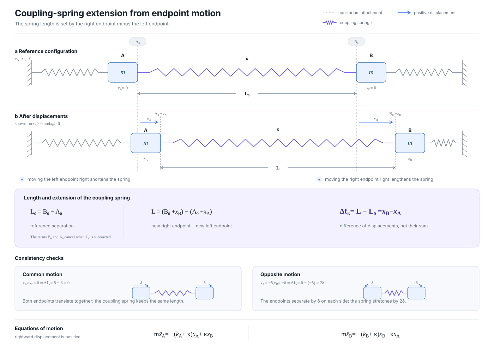

*The spring length is the right endpoint minus the left endpoint. After subtracting the equilibrium length, its extension is $x_B-x_A$, not $x_A+x_B$.*

Take two masses $m$, one at position $x_A$ and one at $x_B$, each pulled back to zero by its own restoring spring of stiffness $k_A$ and $k_B$ respectively. In isolation, each mass obeys Newton's law $m\ddot x = -kx$, whose solution is $x(t) = X\cos(\omega t + \phi)$ with a natural frequency $\omega = \sqrt{k/m}$: substitute the trial cosine into the ODE and $-m\omega^2 = -k$ falls out. Stiffer spring or lighter mass raises the frequency — the same $\sqrt{k/m}$ that reappears in every linear-restoring-force problem (a Lorentz oscillator model of a bound electron, an $LC$ circuit with $\omega = 1/\sqrt{LC}$, a longitudinal phonon). In the pendulum problem, $A$ alone would oscillate at $\omega_A = \sqrt{k_A/m}$ and $B$ alone at $\omega_B = \sqrt{k_B/m}$; the two frequencies would be the "unperturbed" frequencies if the masses did not know about each other.

Now link them by a third spring of stiffness $\kappa$. If $x_A$ and $x_B$ are displacements from equilibrium attachment points $A_0$ and $B_0$, the spring length is $L=(B_0+x_B)-(A_0+x_A)$. Since $L_0=B_0-A_0$, its extension is $\Delta L=L-L_0=x_B-x_A$. It therefore pulls $A$ toward $B$ with force $-\kappa(x_A-x_B)$ and $B$ toward $A$ with force $-\kappa(x_B-x_A)$. Newton's law gives

$$m\ddot{x}_A = -(k_A + \kappa) x_A + \kappa\, x_B, \qquad m\ddot{x}_B = -(k_B + \kappa) x_B + \kappa\, x_A.$$

Two coupled linear ODEs; "coupled" here means literally that each equation contains the other variable.

### § 0.2. The eigenvalue problem

Ask whether there is a solution in which both masses oscillate at a single common frequency $\omega$: $x_A(t) = X_A \cos\omega t$, $x_B(t) = X_B \cos\omega t$. Two time derivatives give $-\omega^2$ times each position, cosines cancel, and one is left with

$$\begin{pmatrix} k_A + \kappa - m\omega^2 & -\kappa \\ -\kappa & k_B + \kappa - m\omega^2 \end{pmatrix} \begin{pmatrix} X_A \\ X_B \end{pmatrix} = 0.$$

A nonzero $(X_A, X_B)$ exists only when the matrix is singular — that is, when its determinant vanishes:

$$(k_A + \kappa - m\omega^2)(k_B + \kappa - m\omega^2) - \kappa^2 = 0.$$

This is one quadratic equation in the unknown $\omega^2$ (multiply out and it is quadratic in $\omega^2$), so it has two roots — the two mode frequencies. Traditionally this determinant condition is called the **secular equation** in coupled-oscillator theory; the name is historical, but the object is just "the quadratic that comes from setting the determinant to zero."

Introduce two natural combinations: the **mean** and the **detuning** of the (already-coupling-loaded) diagonals, divided by $m$ for units of frequency-squared,

$$\bar\omega^2 = \frac{(k_A + \kappa) + (k_B + \kappa)}{2m}, \qquad \delta = \frac{(k_A + \kappa) - (k_B + \kappa)}{2m} = \frac{k_A - k_B}{2m}.$$

The word **detuning** comes from radio engineering: two oscillators are "in tune" when their natural frequencies match, and "detuned" when they do not. Here $\delta$ measures how far out of tune the two masses are on the frequency-squared axis. When $\delta = 0$, the two uncoupled oscillators would sit at exactly the same frequency; when $|\delta|$ is large, they are far apart, and the small coupling cannot bridge them. The intuition is worth planting once: **detuning is a distance on the frequency axis; coupling is the bridge strength**; the ratio $\kappa/\delta$ decides whether the bridge matters.

With these variables the secular equation becomes

$$(\omega^2 - \bar\omega^2)^2 = \delta^2 + \kappa'^2, \qquad \kappa' \equiv \kappa/m,$$

whose roots are

$$\boxed{\;\omega_\pm^2 = \bar\omega^2 \pm \sqrt{\delta^2 + \kappa'^2}.\;}$$

### § 0.3. Modes and the mixing angle

A **mode** is a particular solution in which every degree of freedom oscillates at a single common frequency, with fixed relative amplitudes and phases; equivalently, an eigenvector of the equations of motion together with its eigenvalue $\omega^2$. General motions are superpositions of modes.

Write the eigenvector as $(\cos\theta,\, \sin\theta)$ — this is not a loss of generality, because every unit vector in the plane has this form for some $\theta$. Impose $M\mathbf{v} = \lambda \mathbf{v}$ on the coefficient matrix

$$M = \begin{pmatrix} \bar\omega^2 + \delta & -\kappa' \\ -\kappa' & \bar\omega^2 - \delta \end{pmatrix},$$

which gives two component equations:

$$(\bar\omega^2 + \delta)\cos\theta - (\kappa')\sin\theta = \lambda \cos\theta,$$

$$-(\kappa')\cos\theta + (\bar\omega^2 - \delta)\sin\theta = \lambda \sin\theta.$$

The eigenvalue $\lambda$ is a nuisance parameter to eliminate. Divide the first equation by $\cos\theta$ and the second by $\sin\theta$; both give expressions for $\lambda$. Setting them equal removes $\lambda$ altogether:

$$(\bar\omega^2 + \delta) - (\kappa')\tan\theta = -(\kappa')\cot\theta + (\bar\omega^2 - \delta).$$

The $\bar\omega^2$ terms cancel between the two sides, leaving $2\delta = (\kappa')(\tan\theta - \cot\theta)$. Use $\tan\theta - \cot\theta = -2\cos(2\theta)/\sin(2\theta) = -2\cot(2\theta)$, so

$$\tan 2\theta = -\frac{\kappa'}{\delta}.$$

The sign is a convention: writing the second eigenvector as $(-\sin\theta, \cos\theta)$ (rotated by 90° in the plane) absorbs it, and the *magnitude* of $\theta$ is what carries physical meaning.

Dropping the sign for readability,

$$\boxed{\;\tan 2\theta = \frac{\kappa'}{\delta}.\;}$$

This is the **mixing angle**. It has two limits and a smooth interpolation:

- **Large detuning** ($|\delta| \gg \kappa'$): $\tan 2\theta \to 0$, so $\theta \to 0$. The eigenvector is $\approx (1,0)$: each mode is essentially one uncoupled oscillator, the other only slightly polluting through the small $\kappa$. The eigenvalues are $\omega_\pm^2 \approx \bar\omega^2 \pm |\delta|$.

- **Exact tuning** ($\delta = 0$): $\tan 2\theta \to \infty$, so $\theta = \pi/4$. The eigenvectors are the equal-mixture combinations $(1, 1)/\sqrt{2}$ and $(1, -1)/\sqrt{2}$. The eigenvalues are $\omega_\pm^2 = \bar\omega^2 \pm \kappa'$.

- **In between**: continuous rotation of the eigenvectors from single-oscillator-like to fully-mixed and out again as $\delta$ sweeps through zero.

At exact tuning the two combinations have a direct mechanical reading: the **common mode** $(1, 1)/\sqrt{2}$ has $x_A = x_B$ at every instant, so the coupling spring is never stretched and does not participate — the frequency comes out $\bar\omega^2 - \kappa'$, lower than the mean, because the diagonal $k+\kappa$ was overcounted; the **differential mode** $(1, -1)/\sqrt{2}$ has $x_A = -x_B$, stretches the coupling spring to twice the amplitude, and comes in at $\bar\omega^2 + \kappa'$, higher.

The same mixing angle recurs in every $2 \times 2$ problem here. It measures how much of each unperturbed mode enters the two coupled eigenmodes at a given detuning.

### § 0.4. The Pauli decomposition of any $2 \times 2$ Hermitian problem

Any $2 \times 2$ Hermitian matrix can be written as a real linear combination of the identity and the three Pauli matrices,

$$H = c_0\, I + c_x \sigma_x + c_y \sigma_y + c_z \sigma_z,$$

$$\sigma_x = \begin{pmatrix} 0 & 1 \\ 1 & 0 \end{pmatrix}, \quad \sigma_y = \begin{pmatrix} 0 & -i \\ i & 0 \end{pmatrix}, \quad \sigma_z = \begin{pmatrix} 1 & 0 \\ 0 & -1 \end{pmatrix}.$$

Each Pauli component has a specific physical meaning that is universal across the problems considered here, and it is worth committing them to memory at this stage.

- **$c_0 I$ (identity)**: uniform frequency shift of both modes together. In the oscillator problem, this is $\bar\omega^2$. Why does it shift both eigenvalues equally: for any vector $\mathbf{v}$, the identity satisfies $I\mathbf{v} = \mathbf{v}$, so $c_0 I$ contributes $+c_0$ to every eigenvalue regardless of which eigenvector one is looking at. It shifts the whole spectrum rigidly and does not open any gap. Physically neutral to the interesting dynamics.

- **$c_z \sigma_z$ (diagonal difference)**: detuning. This is $\delta$: it pulls the two diagonals apart and, in the absence of any off-diagonal, gives eigenvalues $\bar\omega^2 \pm \delta$ with eigenvectors $(1,0)$ and $(0,1)$. Physically: how far apart the two unperturbed modes sit on the frequency axis.

- **$c_x \sigma_x$ (real symmetric off-diagonal)**: the ordinary coupling term. It puts equal real numbers in the two off-diagonal slots and produces the standard hyperbolic anticrossing when combined with $c_z$. The coupled-oscillator spring gives $c_x = -\kappa'$; the periodic-index modulation of § 4 will give $c_x \propto \Delta\varepsilon$; any mechanism that couples the two modes symmetrically — spring, capacitive coupling in an $LC$ pair, index modulation — populates this slot.

- **$c_y \sigma_y$ (antisymmetric imaginary off-diagonal)**: a coupling that puts $+i$ in one off-diagonal slot and $-i$ in the other. For a passive classical system with no external bias, this slot is empty. Populating $c_y$ requires a physical mechanism that distinguishes clockwise from counterclockwise circulation in the two-mode space — a static magnetic bias is the standard one, and § 5 derives it in detail from the linearized magnetization equation of a biased ferrite. The reason such a bias is required (Onsager's reciprocity constraint) is derived in § 5.6; here we only note that populating $c_y$ has structural consequences distinct from those of $c_x$.

The eigenvalues of the full Hermitian matrix are

$$\omega_\pm^2 = c_0 \pm \sqrt{c_x^2 + c_y^2 + c_z^2},$$

with $\omega^2$ retained from § 0.2 since all subsequent physical instances will identify $c_0$ with a mean-frequency-squared and $c_x, c_y, c_z$ with coupling-frequency-squared scales. The gap is

$$\Delta \equiv \omega_+^2 - \omega_-^2 = 2\sqrt{c_x^2 + c_y^2 + c_z^2}.$$

Reading this: $c_z$ (detuning) and $(c_x, c_y)$ (couplings) combine in Euclidean quadrature to set the gap. At **exact tuning** ($c_z = 0$) the gap collapses to $2\sqrt{c_x^2 + c_y^2}$. This is the smallest gap achievable for a given pair of couplings, because the quantity under the square root then omits the $c_z^2$ term entirely and cannot be reduced further by any choice of operating point — increasing $|c_z|$ only makes the gap larger. Either coupling ($c_x$ or $c_y$) alone is enough to open a gap; both together add in quadrature.

Which $c$'s are nonzero in a given physical problem, and by what mechanism, becomes the entire content of every application section below.

### § 0.5. The eigenvalue hyperbola and the definition of gap

Plot the two eigenvalues $\omega_\pm^2$ against the detuning $\delta$ at fixed coupling. From § 0.2,

$$(\omega^2 - \bar\omega^2)^2 = \delta^2 + \kappa'^2.$$

This is a **hyperbola** in the $(\delta, \omega^2 - \bar\omega^2)$ plane. Its two branches are the two mode frequencies; they never come closer than $2\kappa'$ at $\delta = 0$.

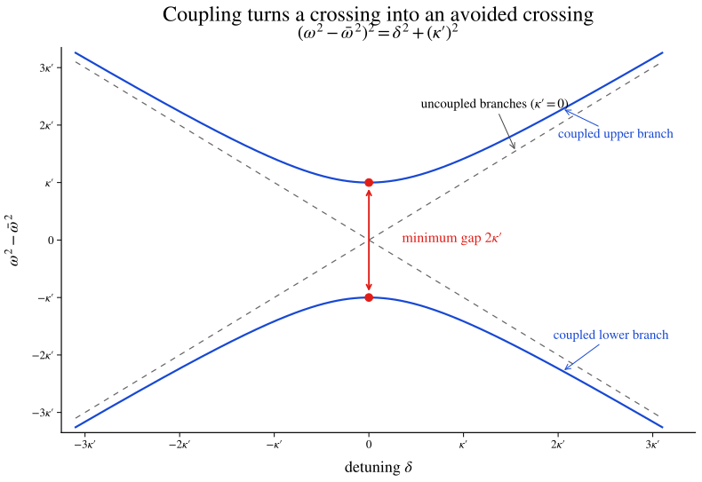

*Without coupling, the dashed branches cross. The coupling bends them apart and leaves a minimum separation $2\kappa'$ at zero detuning.*

The vertical separation between the two branches is what we shall consistently call the **gap**, and the term deserves precise naming since it will appear in every setting from now on.

- **Bandgap** or **stopband** — the *frequency* range in which no propagating mode exists at real wavenumber. The word "band" comes from the plot of $\omega$ against wavenumber. In free space (vacuum, uniform dielectric) the dispersion is a single straight line $\omega = c k/n$: for every $\omega$ there is one $k$, and the plot is a continuous line with no gaps — free-space propagation is entirely gap-free, all frequencies are allowed at some wavenumber. A structured medium (periodic, layered, guided) changes this: the plot is no longer a single line but a collection of curves stacked in $\omega$ at each $k$, and the ranges of $\omega$ in which any of these curves gives a real solution are called **bands**, while the ranges between them are **gaps**. When the gap appears as a range of frequencies that a wave *cannot propagate through* a specific medium (§§ 3, 4), the same object is called a **stopband** because the medium stops the wave. Same object, two names indexed by whether one is thinking of the medium (which stops) or the spectrum (which has a gap).

- **Avoided crossing** — same object, viewed as a plot of $\omega$ against detuning at fixed coupling. The two branches would have crossed at $\delta = 0$ if the coupling were absent; the coupling avoids the crossing by pushing them apart by the gap.

The three names are three views of the same $2 \sqrt{c_x^2 + c_y^2 + c_z^2}$ formula.

### § 0.6. Reading the hyperbola: propagation, evanescence, and the mass-like term

The above was the eigenvalue view: $\omega^2$ against $\delta$ at fixed coupling. Every wave problem of §§ 1–12 has a companion dispersion view in which one asks, for a given driving frequency $\omega$ (with detuning $\delta$ from some reference), what wavenumber $q$ the medium supports. In the setting here the answer is universally

$$\boxed{\;q^2 = \delta^2 - \kappa^2.\;}$$

Keeping the signed wavenumber $q$ gives a hyperbola in the $(q,\delta)$ plane:

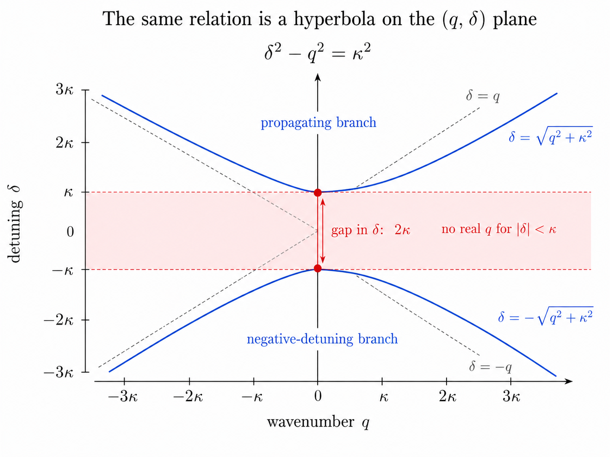

*The interval $|\delta|<\kappa$ contains no real $q$; the two propagating branches begin at $\delta=\pm\kappa$.*

Replacing $q$ by $q^2$ folds the $+q$ and $-q$ branches together. On the $(q^2,\delta)$ axes, the same algebraic relation therefore becomes a sideways parabola:

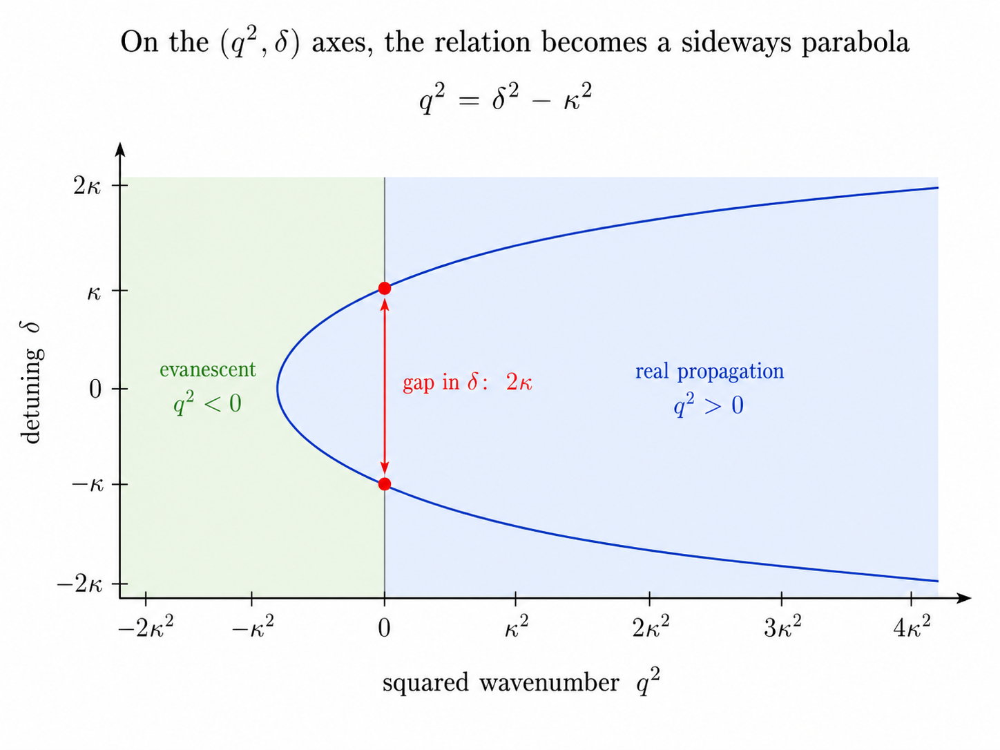

*Negative $q^2$ is the evanescent region; positive $q^2$ is the propagating region. Their boundary is $q^2=0$ at the two gap edges.*

The physical meaning of $q$ depends on the problem — a spatial wavenumber inside a Bragg grating (§ 4), a plane-wave $k_z$ in a waveguide (§ 6), a plasma wavenumber (§ 6) — but the interpretation is universal:

#### Outside the gap ($|\delta| > \kappa$):

$q^2 > 0$, so $q$ is real. The mode propagates. Far outside the gap ($|\delta| \gg \kappa$), $q \approx |\delta|$: coupling is invisible, the wave sees essentially the unperturbed medium. Approaching the band edge from outside, $q \to 0$: the wave slows to a stop (see § 0.7).

#### Inside the gap ($|\delta| < \kappa$):

$q^2 < 0$, so $q$ is imaginary; write $q = i\alpha$ with $\alpha = \sqrt{\kappa^2 - \delta^2}$. The mode's spatial factor $e^{iqz}$ becomes $e^{-\alpha z}$: exponential decay, not propagation. The decay length inside the gap is $1/\alpha$; at the gap center ($\delta = 0$) it takes its minimum value $1/\kappa$, called the **penetration depth** or (equivalently) the **Bragg length**. When the medium is finite, a wave incident at a frequency inside the gap penetrates only a few $1/\kappa$ before its amplitude drops to a fraction of its input value: this is what makes the Bragg mirror a mirror (§ 9).

#### At the gap edge ($\delta = \pm\kappa$):

$q = 0$ and the two eigenvectors become degenerate. The mode is a pure standing wave with zero wavenumber, and the group velocity vanishes (§ 0.7).

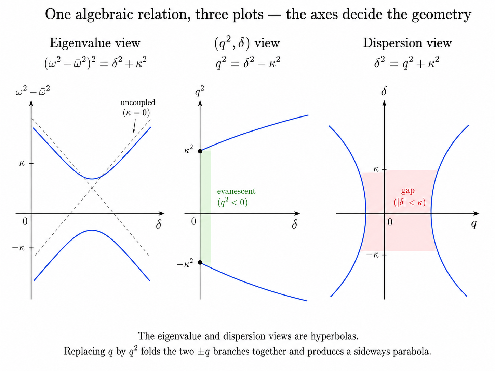

*The axes determine the visible geometry: the eigenvalue and signed-wavenumber views are hyperbolas, while replacing $q$ by $q^2$ folds the two signed branches into a sideways parabola.*

The formula $q^2 = \delta^2 - \kappa^2$ carries a further reading that unifies four apparently unrelated physical situations. Compare it with the Klein–Gordon dispersion relation of a relativistic massive particle,

$$E^2 = (pc)^2 + (mc^2)^2, \qquad \text{equivalently} \qquad p^2c^2 = E^2 - m^2 c^4.$$

Identifying $q \leftrightarrow p$, $\delta \leftrightarrow E$ (both measured from the reference), and $\kappa \leftrightarrow mc$, the two formulas are identical.

#### The gap edge behaves as a mass:

below the "energy" $\delta = \kappa$ no propagation is possible; above it, propagation resumes with an effective quadratic dispersion near threshold. § 6 collects the same relation applied to four physical settings (waveguide, plasma, band edge, matter wave) and shows how the four "masses" arise from four different mechanisms — but the algebra is the one written above.

### § 0.7. Group velocity: the slope of the dispersion curve

For a wavepacket concentrated in frequency around $\omega$ (or in detuning around $\delta$), the transported energy moves at the **group velocity**

$$v_g \equiv \frac{d\omega}{dq}.$$

Differentiating the hyperbola $q^2 = \delta^2 - \kappa^2$ (using $d\delta = d\omega$ in every setting where the detuning is proportional to $\omega$, up to a constant factor absorbed into units) gives

$$v_g = \frac{d\delta}{dq} = \frac{q}{\delta}.$$

Reading this:

- **Far outside the gap** ($|\delta| \gg \kappa$): $q \approx |\delta|$, so $v_g \approx 1$ — in the units of the specific problem, this is the free-medium propagation speed (in vacuum $c$; in a dielectric $c/n$; in a mechanical medium the appropriate wave speed).

- **Approaching the gap edge from outside** ($|\delta| \to \kappa^+$): $q \to 0$, so $v_g \to 0$. This is **slow light** — a wavepacket at frequencies near the band edge propagates arbitrarily slowly. In the DFB laser (§ 10) slow light multiplies the gain per unit length, an effect that will be picked up in that section by direct reference to the formula above.

- **Inside the gap**: $q$ is imaginary, so a real $v_g$ does not exist; the field does not propagate, it decays.

The group velocity is a universal concept for any dispersion curve $\omega(q)$; every later invocation of "slow light," "waveguide dispersion," "GVD," or "the wave sees no motion at cutoff" is just a reading of the slope of the appropriate hyperbola at the appropriate point.

The rate at which the slope itself changes — the **group velocity dispersion** or **GVD**,

$$\text{GVD} \equiv \frac{d^2 q}{d\omega^2} \propto \frac{d}{d\delta}\left(\frac{1}{v_g}\right),$$

diverges at the gap edge for the same reason $v_g$ vanishes there: the hyperbola has vertical tangent. A finite-bandwidth pulse near the band edge acquires enormous frequency-dependent phase and stretches in time. This effect is what chirped Bragg gratings (§ 12) exploit for pulse compression.

### § 0.8. Complex response: absorption, gain, and the meaning of a complex permittivity

Everything up to here has assumed real eigenvalues, corresponding to lossless propagation. Real materials have **losses** (absorption) or **gain** (amplification), and both enter the framework by allowing the diagonal elements of the $2 \times 2$ — the effective permittivity or the effective frequency-squared — to be complex.

Write the permittivity $\varepsilon = \varepsilon' + i\varepsilon''$ and the wavenumber $k = \omega\sqrt\varepsilon/c$; expanding for small $\varepsilon''$,

$$k \approx \frac{\omega}{c}\sqrt{\varepsilon'} + \frac{i\omega}{2c}\frac{\varepsilon''}{\sqrt{\varepsilon'}} = k' + \frac{i}{2}\alpha,$$

with $\alpha = \omega\varepsilon''/(c\sqrt{\varepsilon'})$ the intensity absorption coefficient. A wave $e^{ikz}$ propagates as

$$e^{ikz} = e^{ik' z}\, e^{-\alpha z / 2}.$$

The real part $\varepsilon'$ shifts the phase velocity ($n = \sqrt{\varepsilon'}$, refractive index in the usual sense); the imaginary part $\varepsilon''$ produces exponential attenuation ($\alpha > 0$) or amplification ($\alpha < 0$, i.e., **gain**, obtained in an inverted medium such as a semiconductor laser junction — § 10). The signs are set by the sign convention for the time-harmonic factor ($e^{-i\omega t}$ here); flipping the convention flips the sign of $\varepsilon''$.

Complex $\omega$ or complex $q$ arise the same way: a mode $e^{-i\omega t}$ with $\omega = \omega' - i\gamma$ decays as $e^{-\gamma t}$, and a mode $e^{iqz}$ with $q = q' + i\alpha/2$ decays spatially as $e^{-\alpha z/2}$. The distinction between "temporal decay" and "spatial decay" is a matter of which axis one holds fixed; the underlying object — a complex eigenvalue in the $2 \times 2$ — is the same.

Every mention of gain, absorption, or a complex refractive index in the sections that follow refers back to this identification. It is written out once here to avoid re-deriving it in every application.

### § 0.9. Causality and the Kramers–Kronig relations

The real and imaginary parts of $\varepsilon(\omega)$ — equivalently, of the electric susceptibility $\chi(\omega)$ where $\varepsilon = 1 + \chi$ — are not independent. Physical response requires **causality**: the polarization at time $t$ can only depend on the field at times $t' \leq t$, not on future fields. In the frequency domain, causality is equivalent to $\chi(\omega)$ being analytic in the upper half of the complex $\omega$-plane. A Cauchy contour integral around the closed upper half-plane then yields, for real $\omega$,

$$\chi'(\omega) = \frac{2}{\pi}\, \mathcal{P}\!\int_0^\infty \frac{\omega'\, \chi''(\omega')}{\omega'^2 - \omega^2}\, d\omega', \qquad \chi''(\omega) = -\frac{2\omega}{\pi}\, \mathcal{P}\!\int_0^\infty \frac{\chi'(\omega')}{\omega'^2 - \omega^2}\, d\omega',$$

the **Kramers–Kronig relations**. The symbol $\mathcal{P}$ is the **Cauchy principal value**: exclude a symmetric interval $[\omega-\epsilon, \omega+\epsilon]$ around the pole in the integrand, integrate over the rest, take $\epsilon \to 0$; the linear pole cancels between the two sides of the excluded interval and the result is finite.

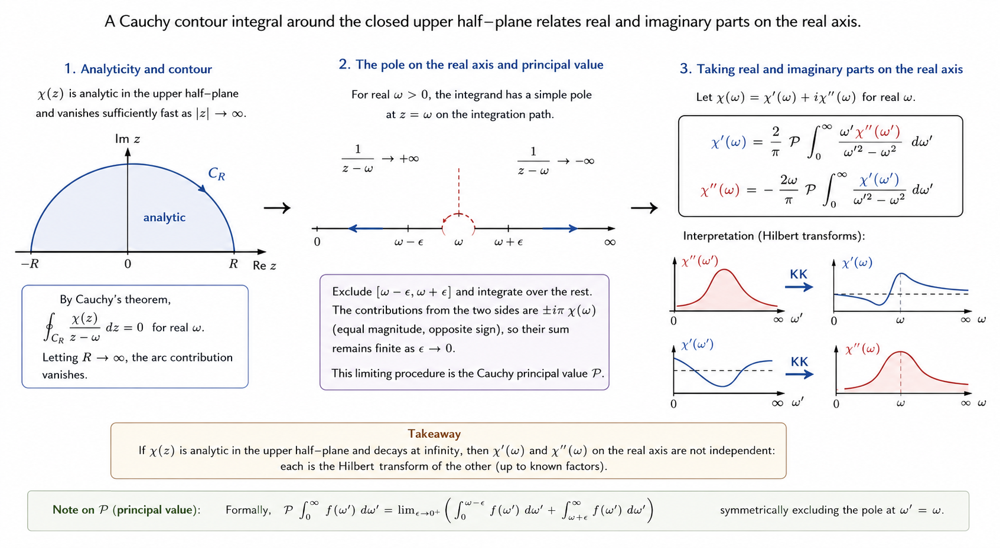

*The contour argument, the symmetric exclusion around the real-axis pole, and the final real–imaginary transform pair are shown as one continuous derivation.*

The engineering consequence is one of the most important statements in the framework, and it appears in three later contexts without repetition:

**You cannot modulate the real part of $\varepsilon$ without modulating the imaginary part somewhere in the spectrum.** A "pure index modulation" produced by any physical mechanism (thermal, electro-optic, carrier-injection) is always accompanied by a companion absorption or gain modulation elsewhere in $\omega$. In the DFB laser this is why "pure index coupling" is unattainable in real semiconductors and gain-coupled DFBs are their own regime (§ 10). In magneto-optic materials this is why Faraday rotators always have companion absorption (§ 5). In every subsequent context, Kramers–Kronig is the reason certain design goals are impossible to reach cleanly.

### § 0.10. What follows

The universal machinery is now in place. §§ 1–4 develop the wave setting: Maxwell's equations in an inhomogeneous medium (§ 1), Bloch's theorem for a periodic medium (§ 2), the Bragg condition (§ 3), and coupled-mode theory (§ 4) — the last of which shows that the small-modulation limit of Bragg scattering is literally the $2 \times 2$ of § 0 with $c_x \propto \Delta\varepsilon$, $c_z = k - k_{\text{Bragg}}$, $c_y = 0$. § 5 does the same identification for a magnetically biased ferrite, producing $c_y \neq 0$ as the Polder tensor. § 6 collects the "one edge of the gap" reading of § 0.6 into a unified section on waveguide, plasma, Klein–Gordon, and band-edge cutoffs. § 7 opens the reading of the hyperbola at band edges — standing waves, penetration depth, Bragg length — that governs the design of any Bragg-based device. § 8 develops the transfer-matrix formalism as the algorithmic dual to coupled-mode theory. §§ 9–12 are the applications: DBR mirrors, DFB lasers, non-reciprocal circulators and isolators, and further-engineered gratings.

---

## § 1. The scalar wave equation for an inhomogeneous medium

The following sections all specialize the framework of § 0 to a spatial wave problem: a wave propagating through a medium whose permittivity varies with position. This section derives the equation the wave obeys.

Start with the two curl equations of Maxwell in a linear, isotropic, source-free medium:

$$\nabla \times \mathbf{E} = -\partial_t \mathbf{B}, \qquad \nabla \times \mathbf{H} = \partial_t \mathbf{D}.$$

We assume the material is **nonmagnetic**, meaning its permeability equals the vacuum value $\mathbf{B} = \mu_0 \mathbf{H}$. This holds for every dielectric medium discussed in §§ 2–4 and §§ 7–10 (glasses, semiconductors, transparent dielectrics), because atomic magnetic moments cannot follow the electromagnetic field at $10^{14}$ Hz — the same inertial cutoff that will reappear in § 5 when we ask why ferromagnetic resonance dies at optical frequencies. § 5 is the one section in which $\mu \neq \mu_0$ matters.

Take the curl of Faraday's law, substitute Ampère's law, and use $\mathbf{D} = \varepsilon_0 \varepsilon(\mathbf{r}) \mathbf{E}$:

$$\nabla \times (\nabla \times \mathbf{E}) = -\mu_0 \partial_t (\nabla \times \mathbf{H}) = -\mu_0 \varepsilon_0 \varepsilon\, \partial_t^2 \mathbf{E}.$$

For a time-harmonic field $\mathbf{E}(\mathbf{r}, t) = \mathbf{E}(\mathbf{r})\, e^{-i\omega t}$, the double time derivative gives $-\omega^2$. The curl-of-curl identity is

$$\nabla \times (\nabla \times \mathbf{E}) = \nabla(\nabla \cdot \mathbf{E}) - \nabla^2 \mathbf{E}.$$

The first term $\nabla(\nabla \cdot \mathbf{E})$ vanishes for a homogeneous medium (Gauss's law $\nabla \cdot \mathbf{D} = 0$ combined with constant $\varepsilon$ gives $\nabla \cdot \mathbf{E} = 0$), but not for a $\varepsilon(\mathbf{r})$ that varies: an inhomogeneous $\varepsilon$ generates polarization-charge gradients that give $\mathbf{E}$ a nonzero longitudinal component, and dropping this term is a real approximation.

Restrict to two situations in which dropping it is legitimate: propagation along a direction transverse to a $z$-only-varying medium (the field polarization is perpendicular to $\nabla \varepsilon$), and normal incidence onto a 1D layered stack. Under these conditions the wave equation reduces to a **scalar Helmholtz equation** — Helmholtz because we have fixed the frequency, scalar because we have projected to one field component, source-free because we assumed no charges or currents:

$$\frac{d^2 E(z)}{dz^2} + \frac{\omega^2}{c^2}\, \varepsilon(z)\, E(z) = 0, \qquad c^2 \equiv \frac{1}{\mu_0 \varepsilon_0}.$$

This is the equation that governs §§ 2–10.

### The physical content of $\varepsilon(z)$

Matter is composed of positive nuclei and negative electron clouds; an electric field displaces the clouds relative to the nuclei by a small distance, producing induced electric dipoles. Each atom carries a tiny dipole moment $\mathbf{p}_{\text{atom}}$ pointing from displaced negative center to fixed positive center.

Aggregate over many atoms per unit volume, and define the **polarization density**

$$\mathbf{P}(\mathbf{r}) \equiv \text{net dipole moment per unit volume at } \mathbf{r}.$$

For a linear, isotropic medium the response is linear in the field:

$$\mathbf{P} = \varepsilon_0 \chi \mathbf{E},$$

which defines the **electric susceptibility** $\chi$. The displacement field is then the sum of the vacuum contribution and the material's polarization:

$$\mathbf{D} \;\equiv\; \varepsilon_0 \mathbf{E} + \mathbf{P} \;=\; \varepsilon_0 (1 + \chi) \mathbf{E} \;\equiv\; \varepsilon_0 \varepsilon\, \mathbf{E}, \qquad \varepsilon \equiv 1 + \chi.$$

So the permittivity is "one plus the material's electric response." Gases have $\chi$ close to zero; glasses have $\chi \sim 1.4$; semiconductors have $\chi \sim 10$; metals have complex $\chi$ that can be enormous. Later mentions of "modulation $\Delta\varepsilon$" in a photonic device refer literally to a spatial variation of this atomic-scale polarizability.

### Refractive index and complex response

The **refractive index** is $n(\mathbf{r}) = \sqrt{\varepsilon(\mathbf{r})}$. For a plane wave $E \propto e^{ikz}$ in a homogeneous medium, the Helmholtz equation gives $k = n\omega/c$, so the phase velocity is $c/n$: a wave slows by the factor $n$ inside a dense dielectric.

When the medium absorbs or amplifies, $\varepsilon$ acquires an imaginary part; the framework of complex response, absorption, gain, and the Kramers–Kronig link between real and imaginary parts of $\varepsilon(\omega)$ is developed once in § 0.8–0.9 and referenced elsewhere without repetition. The one specialization worth flagging here is that a modulation $\Delta\varepsilon(z)$ has both a real part (index modulation, gives coupling in the framework of § 4) and an imaginary part (gain/loss modulation) — the two cannot be independently engineered because of the Kramers–Kronig constraint, and this is the origin of the "gain-coupled DFB" mode in § 10.

---

## § 2. Bloch's theorem for a periodic medium

Specialize now to a medium whose permittivity is periodic in space with period $\Lambda$: $\varepsilon(z + \Lambda) = \varepsilon(z)$. The wave equation from § 1 becomes

$$\mathcal{L}\, E(z) \equiv \left(\frac{d^2}{dz^2} + \frac{\omega^2}{c^2} \varepsilon(z)\right) E(z) = 0,$$

with the crucial feature that the differential operator $\mathcal{L}$ commutes with the translation operator $T_\Lambda$ defined by $(T_\Lambda f)(z) = f(z + \Lambda)$. This section derives the consequence — every solution decomposes into Bloch waves, indexed by a wavevector defined modulo the reciprocal-lattice vector $G = 2\pi/\Lambda$.

### Bloch waves and the translation operator

Look for solutions on which $T_\Lambda$ acts by a scalar: $\psi(z + \Lambda) = \lambda\, \psi(z)$. For the solution to be bounded on the whole real line, $|\lambda| = 1$ (iterating $T_\Lambda^N$ multiplies by $\lambda^N$; anything with $|\lambda| \neq 1$ diverges at one end). Write $\lambda = e^{ik\Lambda}$ with $k$ real (any complex number of modulus 1 has this form for some real phase; $k$ carries units of inverse length).

The functional equation $\psi(z + \Lambda) = e^{ik\Lambda}\psi(z)$ has solutions of the form

$$\psi(z) = e^{ikz}\, u(z), \qquad u(z + \Lambda) = u(z).$$

Justification: factor $e^{ikz}$ out of any candidate $\psi$ by defining $u(z) \equiv e^{-ikz}\psi(z)$; the shift condition $\psi(z+\Lambda) = e^{ik\Lambda}\psi(z)$ then translates to $u(z+\Lambda) = u(z)$, no more and no less. So every eigenfunction of $T_\Lambda$ with eigenvalue $e^{ik\Lambda}$ is a plane wave times a periodic function; conversely, every such object is an eigenfunction.

The parameter $k$ is called the **Bloch wavenumber** or **crystal momentum**; the function $u(z)$ is the **Bloch amplitude**.

### Completeness of Bloch solutions

The claim: for a medium with $\varepsilon(z + \Lambda) = \varepsilon(z)$, every solution of the second-order wave equation $\mathcal{L}\, E = 0$ is a linear combination of at most two Bloch waves. This is nontrivial — the periodicity is what makes it true, and the argument requires that both $\mathcal{L}$ and $T_\Lambda$ act on the same solution space. Three steps.

#### Step 1 — the solution space is two-dimensional.

For a linear second-order ODE, specifying the initial values $E(0)$ and $E'(0)$ uniquely determines $E(z)$ everywhere (existence and uniqueness for linear ODEs). Solutions form a two-dimensional vector space, parameterized by these two initial values — the same two-dimensional space in which the transfer matrix $T$ of § 8 will act.

#### Step 2 — commuting operators send solutions to solutions.

Because $\varepsilon(z)$ is periodic, $\mathcal{L}$ and $T_\Lambda$ commute: shifting a periodic-coefficient ODE by one period gives an ODE with the *same* coefficients. Applying $T_\Lambda$ to a solution $E$ of $\mathcal{L}\, E = 0$ then gives another solution:

$$\mathcal{L}(T_\Lambda E) = T_\Lambda(\mathcal{L} E) = T_\Lambda(0) = 0.$$

So $T_\Lambda$ maps the solution space into itself.

A basic fact about commuting operators: **any family of matrices that commute with each other can be simultaneously diagonalized**. Concretely, if $A$ and $B$ commute, there exists a basis in which both are diagonal, and therefore a common set of eigenvectors — every eigenvector of $A$ is an eigenvector of $B$, and vice versa. So here, since $\mathcal L$ and $T_\Lambda$ commute (Step 2), we can find their eigenvectors together: restrict $T_\Lambda$ to the two-dimensional solution space of $\mathcal L$ (Step 1), where it acts as a $2 \times 2$ matrix; diagonalize that matrix; each of its two eigenvectors is simultaneously a solution of the wave equation and a Bloch eigenvector of $T_\Lambda$. That is what "diagonalize $T_\Lambda$ within the solution space" means concretely.

One more structural fact worth stating explicitly. $T_\Lambda$ is a **unitary** operator: it just relabels $z \to z + \Lambda$, permuting the values of a function without changing any of them, so it preserves the norm of any function it acts on. Two consequences from linear algebra: (i) the eigenvalues of a unitary matrix all have $|\lambda| = 1$ — the same conclusion reached by the boundedness argument in the previous subsection, now recovered by a cleaner algebraic route; (ii) eigenvectors of a unitary matrix at distinct eigenvalues are orthogonal, so the two Bloch waves at distinct eigenvalues of $T_\Lambda$ are orthogonal to each other.

#### Step 3 — two eigenvalues.

Any $2 \times 2$ matrix has two eigenvalues (over $\mathbb{C}$). For a lossless medium, the argument of the previous section fixes $|\lambda| = 1$ on both. In general, both roots satisfy $\lambda_1 \lambda_2 = \det T_\Lambda$; § 8 will show $\det T_\Lambda = 1$ from a conservation law. Together these imply that in a lossless medium either both eigenvalues have $|\lambda| = 1$ (a **band**), or they are real reciprocals with $\lambda_2 = 1/\lambda_1$ (a **gap**, where one solution grows exponentially with $z$ and the other decays).

Each eigenvalue produces one Bloch-form solution, and their linear combinations span the whole two-dimensional solution space. When both eigenvalues coincide at $\pm 1$, the two eigenvectors merge; this happens exactly at the top and bottom of each stopband and corresponds to the standing waves of § 7. That degeneracy is the special "double root" case where $\text{tr}(T_\Lambda) = \pm 2$ with $\det = 1$.

### Reciprocal-lattice equivalence

Because $u(z)$ is periodic, expand it in a Fourier series:

$$u(z) = \sum_{n \in \mathbb{Z}} u_n\, e^{i n G z}, \qquad G \equiv 2\pi/\Lambda.$$

Then

$$\psi(z) = e^{ikz} u(z) = \sum_n u_n\, e^{i(k + nG) z}.$$

The Bloch wave at wavenumber $k$ is a superposition of plane waves at wavenumbers $k + nG$ for all integers $n$. This is best read as **aliasing**: on a lattice with period $\Lambda$, one cannot tell a wave of wavenumber $k$ apart from waves of wavenumber $k + nG$, because they agree at every lattice site (any two of them differ by $e^{inG\Lambda} = e^{in\cdot 2\pi} = 1$ at $z = m\Lambda$). Every wavenumber $k$ and every wavenumber $k + nG$ leave the same footprint on the lattice, and the medium cannot distinguish between them. Formally: $e^{i(k+G)z}\cdot u(z) = e^{ikz}\cdot [e^{iGz} u(z)]$ and $e^{iGz}u(z)$ is another $\Lambda$-periodic function, so the "Bloch wave at $k+G$" is the same Bloch wave as at $k$ — different labels for the same object. So **$k$ is defined modulo $G$**: the natural domain is the **first Brillouin zone** $k \in (-\pi/\Lambda, \pi/\Lambda]$, or by convention $[0, G)$. In dispersion plots, the free-space parabola $\omega = ck$ (which was one-to-one) gets **folded** back into the Brillouin zone at each crossing of $k = \pm\pi/\Lambda$ — an aliasing artifact of the periodicity, and the geometric mechanism that later opens gaps at each folding point.

### Band structure and the group velocity

For each $k$ in the Brillouin zone, the eigenvalue problem has a discrete set of allowed frequencies $\{\omega_n(k)\}$ indexed by a **band number** $n = 0, 1, 2, \ldots$ — sweep $k$, and each $n$ traces a curve $\omega_n(k)$ called a **band curve**; the collection is the **band structure**.

For a homogeneous medium ($\varepsilon = \text{const}$), the band curves are straight lines $\omega = \pm ck/\sqrt{\varepsilon}$ folded into the Brillouin zone (they are called "folded" because the reciprocal-lattice equivalence forces $k$ into the first zone). For a periodic medium, the curves bend near the Brillouin-zone edge, and gaps open where no real $k$ gives a real $\omega$: this is the bandgap of § 0.5 appearing in its wave-mechanical guise.

The group velocity of a wavepacket centered at $k$ is $v_g = d\omega_n/dk$, whose interpretation was fixed once in § 0.7: nonzero and near the material speed far from the gap, vanishing at the band edges (slow light), imaginary inside the gap. Every subsequent reference to $v_g$ in the following sections refers back to that formula and its reading.

---

## § 3. The Bragg condition

Section 2 established that the eigenmodes of a periodic medium are Bloch waves and that bandgaps open at certain values of $k$. This section identifies *where* — for what direction of propagation and what wavelength does a specific gap open — and derives the answer from three complementary starting points that all reduce to the same relation.

### Picture 1: classical path-difference

Consider a periodic stack of parallel scattering planes separated by distance $\Lambda$ (perpendicular to the planes). A **monochromatic** wave — one containing only a single frequency, hence a single wavelength $\lambda$ inside the medium — is incident at angle $\theta$ measured from the planes (the traditional Bragg convention; note that this is the angle between the ray and the planes, not the plane normal).

Two waves reflect off two adjacent planes; the wave that penetrates one plane spacing before reflecting travels an extra path of $2\Lambda\sin\theta$ (each in-going leg contributes $\Lambda\sin\theta$). For the two reflections to interfere constructively at the detector, the extra path must equal an integer number of wavelengths:

$$m\lambda_{\text{medium}} = 2\Lambda\sin\theta, \qquad m = 1, 2, 3, \ldots$$

Expressing in the vacuum wavelength $\lambda_0 = n_{\text{avg}}\lambda_{\text{medium}}$:

$$m\lambda_0 = 2 n_{\text{avg}} \Lambda \sin\theta.$$

The integer $m$ is the **order** of diffraction. The formula is intuitive but has two limitations that motivate the next two derivations: it treats the reflection as if it happened at discrete planes, and it does not answer why no Bragg reflection exists for $\lambda > 2n_{\text{avg}}\Lambda$ or what the width of the resulting stopband is.

### Picture 2: elastic scattering with reciprocal-lattice momentum

For a monochromatic wave at frequency $\omega$ in a medium of average permittivity $\bar\varepsilon$, the wavevector magnitude is fixed by the dispersion relation $|\mathbf{k}| = \omega\sqrt{\bar\varepsilon}/c \equiv k$. A scattering process that reflects the wave from wavevector $\mathbf{k}_{\text{in}}$ to $\mathbf{k}_{\text{out}}$ is called **elastic** if $|\mathbf{k}_{\text{out}}| = |\mathbf{k}_{\text{in}}|$: the wavelength is preserved because the periodic lattice cannot absorb or emit any energy — it is static. Momentum is not conserved with the lattice, however: the lattice can absorb any momentum that is a **reciprocal-lattice vector**

$$\mathbf{G}_m = m\, \mathbf{G}_1, \qquad |\mathbf{G}_1| = \frac{2\pi}{\Lambda}, \quad m \in \mathbb{Z}.$$

So the momentum-conservation rule for scattering by a periodic medium reads

$$\mathbf{k}_{\text{out}} = \mathbf{k}_{\text{in}} + \mathbf{G}_m.$$

Combined with elasticity $|\mathbf{k}_{\text{out}}| = |\mathbf{k}_{\text{in}}| = k$, this fixes the two vectors on an isosceles triangle of side $k$ and one side of length $|m G_1|$. Geometry gives

$$m G_1 = 2 k \sin\theta \implies m\lambda_0 = 2 n_{\text{avg}} \Lambda \sin\theta,$$

the same formula as Picture 1.

### Picture 3: Fourier convolution and the master equation

The Bloch structure of § 2 already told us that any solution of the wave equation in a periodic medium has the form $E(z) = e^{ikz} u(z)$ with $u$ periodic. Fourier-expand $u$ (Bloch's completeness argument permits this at once), so

$$E(z) = \sum_{n \in \mathbb{Z}} E_n\, e^{i(k+nG_1) z}.$$

The index $n$ labels reciprocal-lattice shifts of the driving wavenumber $k$; each $E_n$ is the amplitude of the "aliased" plane wave at wavenumber $k+nG_1$, in the sense of the folding argument of § 2. Similarly, the modulation is periodic and expands as

$$\varepsilon(z) = \sum_m \varepsilon_m\, e^{i m G_1 z},$$

with $\varepsilon_0 = \bar\varepsilon$ the average and $\varepsilon_m$ for $m \neq 0$ the strengths of the higher spatial harmonics.

Substitute into the Helmholtz equation $E'' + (\omega/c)^2 \varepsilon(z) E = 0$. The second derivative brings down $-(k+nG_1)^2$ on each Fourier component of $E$; the product $\varepsilon(z) E(z)$ is a convolution in Fourier space (the Fourier coefficient of a product is the convolution of the Fourier coefficients), so

$$\varepsilon(z) E(z) = \sum_n \left(\sum_p \varepsilon_p E_{n-p}\right) e^{i(k+nG_1)z}.$$

Matching coefficients of $e^{i(k+nG_1)z}$ on both sides of the wave equation gives, for each $n$,

$$\left[(k+nG_1)^2 - \frac{\omega^2}{c^2}\bar\varepsilon\right] E_n \;=\; \frac{\omega^2}{c^2} \sum_{m \neq 0} \varepsilon_m\, E_{n-m}.$$

This is the **master equation**: an infinite system of linear equations coupling the $E_n$'s to one another through the Fourier coefficients of the modulation.

Written as an infinite matrix, with rows and columns indexed by $n$, the left side puts on-shell energies $D_n \equiv (k+nG_1)^2 - (\omega/c)^2\bar\varepsilon$ on the diagonal, and the right side puts the modulation-coupling entries $\varepsilon_{n-n'}$ (times $(\omega/c)^2$) in the off-diagonals:

$$\begin{pmatrix}
\ddots & \vdots       & \vdots       & \vdots      \\
\cdots & D_{-1}       & \varepsilon_1 & \varepsilon_2 & \cdots \\
\cdots & \varepsilon_1 & D_{0}        & \varepsilon_1 & \cdots \\
\cdots & \varepsilon_2 & \varepsilon_1 & D_{+1}      & \cdots \\
       & \vdots       & \vdots       & \vdots      & \ddots
\end{pmatrix} \begin{pmatrix} \vdots \\ E_{-1} \\ E_{0} \\ E_{+1} \\ \vdots \end{pmatrix} = 0.$$

The diagonal $D_n$ is the "detuning" of Fourier mode $n$ from being an on-shell plane wave in the average medium; the off-diagonal $\varepsilon_p$ is the "coupling" between mode $n$ and mode $n - p$, which physically transfers a wavenumber-$pG_1$ momentum kick from the lattice to the wave. This is the same structure as the $2\times 2$ of § 0, extended to infinitely many modes and populated by a specific mechanism: the periodic index modulation.

Coefficient by coefficient, the Bragg condition emerges as the resonance condition of this matrix: it is the value of $k$ at which two diagonals $D_n$ vanish simultaneously (up to $\omega^2 \bar\varepsilon /c^2$), so that the two corresponding modes are both on-shell and their off-diagonal coupling dominates. § 4 makes this quantitative by keeping only the two near-resonant modes.

### Same object, three pictures

The three pictures agree because the underlying object is the same: the Fourier decomposition of $\varepsilon(z)$. Picture 1 treats the modulation as discrete planes (a Fourier series with all $m$); Picture 2 labels the reciprocal-lattice vectors by $m$; Picture 3 works directly with the Fourier coefficients $\varepsilon_m$. Each picture makes a different question easy:

- **Picture 1 (path difference)** — *what geometry?* the angle where the constructive-interference condition is met for a given $m$.
- **Picture 2 (momentum conservation)** — *why integer $m$?* $m$ labels which reciprocal-lattice vector is invoked.
- **Picture 3 (Fourier convolution)** — *how strong?* the amplitude of the $m$-th order is set by $\varepsilon_m$, the $m$-th Fourier coefficient of the modulation profile.

The pattern of nonzero $\varepsilon_m$ is called the **structure factor** of the modulation, and it plays no role in the Bragg *angle* — that comes from geometry — but decides whether any given order actually diffracts and how strongly. For a purely sinusoidal modulation $\varepsilon(z) = \bar\varepsilon + \varepsilon_1\cos(G_1 z)$, only $\varepsilon_{\pm 1}$ are nonzero and only the first-order Bragg peak exists. For a square-wave modulation (as in a real Bragg reflector, § 9), $\varepsilon_m \propto 1/m$ for odd $m$ and vanishes for even $m$, so odd-order Bragg peaks exist and even-order ones do not.

### When Bragg cannot work: two ways to fail

Bragg backscattering requires two conditions simultaneously: (1) the geometry $m\lambda = 2n_{\text{avg}}\Lambda\sin\theta$ must hold for some integer $m$, and (2) the structure factor $\varepsilon_m$ for that order must be nonzero. When the wavelength is *much larger* than the modulation period, the geometry can nominally be satisfied by choosing a very high order $m$; but in practice one of two independent failure modes rules coherent backscattering out. Both are worth understanding, because they demarcate the "Bragg regime" of §§ 4–10 from the "effective-medium regime" of § 12.

Take an optical wavelength $\lambda_0 = 500\,\text{nm}$ striking a crystal with atomic-plane spacing $a \approx 0.3\,\text{nm}$. Backscattering ($\theta = 90°$) would require order $m = \lambda_0/(2n a) \approx 833$. Two independent things kill this scattering:

#### Failure 1 — thermal blurring of the planes (structure-factor washout).

Real atomic planes are not motionless: at any temperature (including absolute zero, because of quantum zero-point motion) each plane wobbles by a small displacement whose root-mean-square value is denoted $u_{\text{rms}}$ — of order $0.01\,\text{nm}$ at room temperature.

Let plane $j$ sit at $z_j + \Delta_j$ where $z_j = j\Lambda$ is its nominal position and $\Delta_j$ is a small random fluctuation. The wave scattered off plane $j$ carries a phase factor $e^{i m G_1 (z_j + \Delta_j)}$; the $z_j$ part is the coherent Bragg phase and the $\Delta_j$ part is the noise. The scattered amplitude summed over $N$ planes is

$$A \propto \sum_j e^{i m G_1 z_j}\, e^{i m G_1 \Delta_j}.$$

The observed intensity is $|A|^2 = \sum_{j,\ell} e^{i m G_1(z_j - z_\ell)} \langle e^{i m G_1(\Delta_j - \Delta_\ell)}\rangle$, where the angle brackets are the thermal average. For independent Gaussian-distributed $\Delta_j$ with mean zero and variance $u_{\text{rms}}^2$, the average of $e^{i m G_1 \Delta_j}$ is $e^{-\frac12 m^2 G_1^2 u_{\text{rms}}^2}$ (moment-generating function of a Gaussian). The cross-terms $j \neq \ell$ pick up two independent Gaussian averages, giving $e^{-m^2 G_1^2 u_{\text{rms}}^2}$; the diagonal terms $j = \ell$ give 1 and contribute incoherently. Splitting the sum,

$$|A|^2 = N + \big|\sum_j e^{i m G_1 z_j}\big|^2\, e^{-m^2 G_1^2 u_{\text{rms}}^2} - N \cdot e^{-m^2 G_1^2 u_{\text{rms}}^2}.$$

The coherent (constructive) piece — the "Bragg peak" — is the middle term: it is the noise-free coherent intensity multiplied by the **Debye–Waller factor**

$$e^{-m^2 G_1^2\, u_{\text{rms}}^2}$$

— a Gaussian suppression in $m^2$. For $m = 833$, $G_1 = 2\pi/a$, and $u_{\text{rms}} = 0.01\,\text{nm}$, the exponent is of order $10^5$: complete washout.

#### Failure 2 — the atoms are effectively invisible (geometric averaging).

Even at zero temperature the argument fails geometrically. An optical wavelength spans about 1500 atomic layers. For order $m = 833$, the required plane spacing is 833 times smaller than the wavelength, and reflections from a layer at depth $z$ interfere with reflections from a layer at depth $z + \lambda/(2m)$ (i.e., an additional half-wave in the medium) with a $\pi$ phase difference — perfect cancellation. Summed over 1500 layers, the coherent reflection integrates to essentially zero: on the scale of one wavelength the medium looks smooth, and no coherent backscattering happens regardless of the thermal state of the atoms.

#### Two failure modes, one conclusion.

When $\lambda \gg \Lambda$, coherent Bragg backscattering does not occur. Instead the wave sees only the *average* permittivity $\bar\varepsilon$ and propagates as if the medium were homogeneous — the **effective-medium regime** (§ 12). This is why visible light passes through glass and why X-ray crystallography needs X-rays.

Optical Bragg mirrors circumvent the issue by *engineering* $\Lambda$ to match the wavelength: multilayer stacks with $\Lambda \sim \lambda_0/(2 n_{\text{avg}})$ use only $m = 1$ Bragg reflection, and Failure 1 does not apply because engineered layer thicknesses are stable, while Failure 2 does not apply because the modulation period is one wavelength, not many. §§ 4–10 are the theory of this engineered $m = 1$ regime.

---

## § 4. Coupled-mode theory: the framework realized in a periodic dielectric

The master equation of § 3 was an infinite system: one linear equation per Fourier component $E_n$, with each $E_n$ coupled to every other through the modulation coefficients $\varepsilon_m$. Bloch's theorem in § 2 said only that solutions have the form $e^{ikz} u(z)$ with $u$ periodic — nothing about how many Fourier components of $u$ are needed, and generically all of them are nonzero. What makes the periodic dielectric problem tractable is not Bloch's theorem itself but a *dynamical* observation: for a small modulation amplitude $\Delta\varepsilon/\bar\varepsilon \ll 1$ and a driving wavenumber close to a specific Bragg resonance, only two of the infinitely many Fourier components carry appreciable amplitude. All the others are algebraically small in $\Delta\varepsilon/\bar\varepsilon$ and can be dropped at leading order. The result is a $2 \times 2$ eigenvalue problem in exactly the form of § 0, and this section derives it, identifies the framework's $\delta$ and $\kappa$ in terms of the modulation, and reads off the physical consequences by invoking § 0.5–0.7.

### From cosine modulation to Fourier coefficients

Start with a real sinusoidal modulation

$$\varepsilon(z) = \bar\varepsilon + \Delta\varepsilon\cos(G_1 z), \qquad G_1 = 2\pi/\Lambda,$$

with peak-to-peak modulation depth $\Delta\varepsilon$ small relative to the average $\bar\varepsilon$. Using $\cos\theta = (e^{i\theta} + e^{-i\theta})/2$,

$$\varepsilon(z) = \bar\varepsilon + \frac{\Delta\varepsilon}{2}\, e^{iG_1 z} + \frac{\Delta\varepsilon}{2}\, e^{-iG_1 z}.$$

Reading off the Fourier coefficients in the notation of § 3,

$$\varepsilon_0 = \bar\varepsilon, \qquad \varepsilon_{+1} = \varepsilon_{-1} = \frac{\Delta\varepsilon}{2}, \qquad \varepsilon_m = 0 \text{ for } |m| \geq 2.$$

A pure cosine has exactly two nonzero Fourier components (at $\pm 1$), each of amplitude $\Delta\varepsilon/2$; the "0" case is the arithmetic average. Every subsequent formula will treat $\varepsilon_1$ as the peak spatial harmonic of the modulation.

### Choosing the reference wavenumber and identifying near-resonant modes

The natural reference wavevector for first-order backscattering is

$$k_B \equiv G_1/2 = \pi/\Lambda,$$

the wavenumber whose free-space wavelength satisfies the classical Bragg condition of § 3 at $\theta = 90°$: substituting $m = 1$ and $\sin\theta = 1$ gives $\lambda_0 = 2n_{\text{avg}}\Lambda$, or in in-medium wavelength terms, $2 k_B = 2\pi/\lambda_{\text{medium}} \cdot 2n_{\text{avg}}\Lambda \cdot n_{\text{avg}}/(n_{\text{avg}}) = G_1$ — the reciprocal-lattice vector $G_1$ is exactly the round-trip momentum transfer that the grating imparts at first-order backscattering. So a wave with $k \approx k_B$ can be scattered by a $G_1$ kick into a wave at $k - G_1 = k - 2k_B \approx -k_B$: the backward wave.

Now examine the master equation matrix of § 3 for a wave at $k \approx k_B$. The diagonal at row $n$ is

$$D_n = (k + n G_1)^2 - \frac{\omega^2}{c^2}\bar\varepsilon,$$

i.e., the discrepancy between the aliased wavenumber $k + nG_1$ and the free-space wavenumber in the *average* medium. A mode is "near resonance" — it can carry appreciable amplitude — when its $D_n$ is small; a mode is "off resonance" — it is suppressed — when its $D_n$ is large in absolute value. Take $k \approx k_B$ and compute:

- $n = 0$: wavenumber $k$, $D_0 = k^2 - (\omega/c)^2\bar\varepsilon \approx k_B^2 - (\omega/c)^2\bar\varepsilon$. Near zero — this is a wave that satisfies the free-space dispersion in the average medium.
- $n = -1$: wavenumber $k - G_1 \approx -k_B$, $D_{-1} = (k - G_1)^2 - (\omega/c)^2\bar\varepsilon = (-k_B)^2 - (\omega/c)^2\bar\varepsilon = k_B^2 - (\omega/c)^2\bar\varepsilon \approx D_0$. **Also near zero** — because $(-k_B)^2 = k_B^2$, the backward wave is on-shell too.
- $n = +1$: wavenumber $k + G_1 \approx 3k_B$, $D_{+1} = (3k_B)^2 - (\omega/c)^2\bar\varepsilon = 9k_B^2 - (\omega/c)^2\bar\varepsilon \approx 8 k_B^2$. **Far from zero**.
- $n = -2$: wavenumber $\approx -3k_B$, $D_{-2} \approx 8 k_B^2$. Also far.
- $|n| \geq 2$: $D_n \approx (4|n|^2 - 1) k_B^2 \sim k_B^2 \cdot 4n^2$. Even further.

*Only* the diagonals $D_0$ and $D_{-1}$ vanish simultaneously when $k = k_B$; all other diagonals are of order $k_B^2$ (nonzero). This is the algebraic content of "$n = 0$ and $n = -1$ are near resonance": they are the two rows of the master-equation matrix whose diagonal entries are simultaneously anomalously small at the operating point.

### The two-wave truncation via amplitude suppression

Take any off-resonant mode, say $E_{+1}$, and solve its master equation row for $E_{+1}$ in terms of the others:

$$D_{+1}\, E_{+1} \;=\; \frac{\omega^2}{c^2}\left(\varepsilon_1 E_0 + \varepsilon_{-1} E_{+2} + \ldots\right).$$

Since $\varepsilon_m = 0$ for $|m| \geq 2$, only the $\varepsilon_{\pm 1}$ terms survive, coupling $E_{+1}$ to $E_0$ (via $\varepsilon_1$) and to $E_{+2}$ (via $\varepsilon_{-1}$). At leading order, dropping the further-off-resonant $E_{+2}$,

$$E_{+1} \;\approx\; \frac{(\omega/c)^2 \varepsilon_1}{D_{+1}} E_0 \;\approx\; \frac{k_B^2 \cdot (\Delta\varepsilon/2)}{\bar\varepsilon \cdot 8 k_B^2} E_0 \;=\; \frac{\Delta\varepsilon}{16\,\bar\varepsilon}\, E_0,$$

using the **on-shell approximation** $(\omega/c)^2 \bar\varepsilon \approx k_B^2$ (the driving frequency is close to the reference frequency, where an unperturbed free wave in the average medium has wavenumber $k_B$; "on shell" is the standard field-theory phrase for "satisfying the free dispersion relation"). So $E_{+1}$ is smaller than $E_0$ by a factor of $\Delta\varepsilon/(16\bar\varepsilon)$: at $\Delta\varepsilon/\bar\varepsilon = 0.01$, $E_{+1}$ is 1600× smaller than $E_0$, and its contribution to the physics of the near-resonant sector is negligible.

The same argument for $E_{-2}$ gives a similar suppression by $\Delta\varepsilon/(16\bar\varepsilon)$; for $E_{+2}$ and $E_{-3}$ the suppression is $\Delta\varepsilon^2/(\bar\varepsilon^2 \cdot O(k_B^4))$ because they only couple to the near-resonant modes at second order in the modulation.

In summary, at first order in $\Delta\varepsilon/\bar\varepsilon$, only $E_0$ and $E_{-1}$ carry amplitude; every other $E_n$ is suppressed by at least one power of $\Delta\varepsilon/\bar\varepsilon$ and can be dropped.

Retaining only $E_0$ and $E_{-1}$ in the master-equation matrix — and noting that inside the two-mode block only $\varepsilon_{\pm 1} = \Delta\varepsilon/2$ appears (the $\varepsilon_0 = \bar\varepsilon$ is absorbed into the diagonals) — one gets the **truncated master equation**

$$\begin{pmatrix} k^2 - (\omega/c)^2\bar\varepsilon & \; -(\omega/c)^2\, \Delta\varepsilon/2 \\ -(\omega/c)^2\, \Delta\varepsilon/2 & \; (k - 2k_B)^2 - (\omega/c)^2\bar\varepsilon \end{pmatrix} \begin{pmatrix} E_0 \\ E_{-1} \end{pmatrix} = 0.$$

The off-diagonal is real and symmetric: it is the coupling $\varepsilon_{-1}$ appearing at row 0, column $-1$ (which by Fourier conjugacy equals $\varepsilon_{+1}$ appearing at row $-1$, column 0), each times $(\omega/c)^2$.

### Identifying $\delta$, $\kappa$, and the § 0 Pauli slots

This truncated matrix is a Hermitian $2 \times 2$ eigenvalue problem in the framework of § 0.4. To identify which Pauli slot each entry populates, subtract the trace-half from both diagonals: writing $H = c_0 I + c_z \sigma_z + c_x \sigma_x + c_y \sigma_y$, one has
- $c_0 = $ half-sum of diagonals (the mean, shifts both eigenvalues equally, opens no gap),
- $c_z = $ half-difference of diagonals (the "detuning" in the sense of § 0.4),
- $c_x = $ real part of off-diagonal,
- $c_y = $ imaginary part of off-diagonal.

Compute each. The half-sum of the two diagonals is

$$c_0 = \frac{k^2 + (k - 2k_B)^2}{2} - (\omega/c)^2\bar\varepsilon \approx k_B^2 - (\omega/c)^2\bar\varepsilon \quad \text{(near reference)},$$

which vanishes on-shell — a uniform shift, irrelevant to the gap. The half-difference is

$$c_z = \frac{k^2 - (k - 2k_B)^2}{2} = 2k_B(k - k_B) + O((k - k_B)^2) \approx 2 k_B \, \delta, \qquad \boxed{\;\delta \equiv k - k_B.\;}$$

So the detuning in the framework's sense is proportional to the deviation of the driving wavenumber from the Bragg wavenumber; a linear function that vanishes at exact Bragg.

The off-diagonal is $-(\omega/c)^2\,\Delta\varepsilon/2$: real, so $c_x = -(\omega/c)^2\Delta\varepsilon/2 \approx -k_B^2 \Delta\varepsilon/(2\bar\varepsilon)$ and $c_y = 0$. Dividing $c_x$ by the same $2k_B$ factor that made $c_z$ proportional to $\delta$, one gets the natural coupling coefficient

$$\kappa \equiv \frac{k_B \Delta\varepsilon}{4\bar\varepsilon} = \frac{\pi \Delta n}{\lambda_B},$$

with $\Delta n = \Delta\varepsilon/(2n_{\text{avg}})$ and $\lambda_B = 2n_{\text{avg}}\Lambda$.

**The three Pauli slots for this problem:** $c_z \neq 0$ (detuning), $c_x \neq 0$ (real symmetric coupling from cosine index modulation), $c_y = 0$. That $c_y$ vanishes is the same statement as the passive-dielectric grating being **reciprocal**: exchanging the roles of "input" and "output" (running the wave backward) is the same as complex-conjugating the master-equation matrix, and a real symmetric matrix is unchanged by complex conjugation, so a wave that goes from left to right sees the same coupling as a wave from right to left. A nonzero $c_y$ — which would require an imaginary antisymmetric off-diagonal — would flip sign under complex conjugation and hence break reciprocity. This is the algebraic version of "why passive gratings are time-reversal-symmetric"; § 5 exhibits the one class of medium (magnetically biased ferrites) in which $c_y \neq 0$, and § 5.6 derives the connection to Onsager reciprocity in full.

Same Pauli slots as the coupled pendulum of § 0.1 (which also had $c_z \neq 0$, $c_x \neq 0$, $c_y = 0$): the mechanical spring and the periodic index modulation play the same algebraic role. That is the entire content of "coupled-mode theory as the framework realized in a periodic dielectric."

Substituting into the § 0.5 hyperbola,

$$\boxed{\;q^2 = \delta^2 - \kappa^2,\;}$$

where $q$ is the wavenumber of the Bloch mode measured from the Bragg wavenumber $k_B$.

### What § 0 already told us

Every consequence of the two-wave truncation is a reading of the § 0 framework at these values of $\delta$ and $\kappa$:

- The **stopband** — the range of frequencies for which no real $q$ exists — is $|\delta| < \kappa$, giving stopband width in wavenumber $\Delta k = 2\kappa$ and, using the group velocity of § 0.7 at the Bragg frequency, stopband width in frequency $\Delta\omega = 2\kappa v_g$.
- Inside the stopband the wave is evanescent with decay constant $\alpha = \sqrt{\kappa^2 - \delta^2}$, and at $\delta = 0$ the **penetration depth** is $1/\kappa$ — the Bragg length of § 0.6.
- **Group velocity** vanishes at the band edges $\delta = \pm\kappa$ where $q = 0$; the slow-light gain enhancement of the DFB laser (§ 10) is the direct consequence.
- **Group velocity dispersion** diverges at the band edges as $d^2q/d\omega^2 \to \infty$; § 12 uses this in a chirped Bragg grating.
- The **mixing angle** $\tan 2\theta = \kappa/\delta$ (§ 0.3) governs how much of the forward and backward components sit in each eigenmode. At exact tuning, the two eigenmodes are equal mixtures $(E_0 \pm E_{-1})/\sqrt 2$: pure standing waves. § 7 works out their nodes and antinodes.

The two-wave truncation, read through the framework, is the complete first-order theory of small-modulation Bragg gratings.

### When the two-wave truncation fails

The amplitude-suppression argument above required the ratio $\Delta\varepsilon/\bar\varepsilon$ to be small relative to the *detuning ratio* $|D_n|/k_B^2$ for every off-resonant mode. This gives the quantitative validity condition

$$\frac{\Delta\varepsilon}{\bar\varepsilon} \ll \frac{|D_n|}{k_B^2} = \begin{cases} 8 & \text{for } n = +1 \\ 4|n|^2 - 1 & \text{for higher } n \end{cases}$$

The tightest constraint comes from the closest off-resonant mode ($n = +1$), giving $\Delta\varepsilon/\bar\varepsilon \ll 8$. For $\Delta\varepsilon/\bar\varepsilon = 0.01$ (a typical fiber Bragg grating), corrections are of order $10^{-3}$: the two-wave approximation is essentially exact. For $\Delta\varepsilon/\bar\varepsilon = 0.3$ (an aggressive multilayer stack) corrections start to matter, and the exact transfer-matrix treatment of § 8 becomes necessary.

At second order, keeping $E_{+1}$ and $E_{-2}$ as small perturbations couples them back into the master-equation rows for $E_0$ and $E_{-1}$. Solving self-consistently, each near-resonant amplitude picks up a correction of order $\Delta\varepsilon/\bar\varepsilon$ from the suppressed mode's back-action, and this back-action shifts the effective coupling $\kappa$ by a further factor of $\Delta\varepsilon/\bar\varepsilon$. Net: the correction to $\kappa$ is of order $(\Delta\varepsilon/\bar\varepsilon)^2 \cdot \kappa$, small in the regime of validity above. Higher structure-factor coefficients $\varepsilon_2, \varepsilon_3, \ldots$ enter through their own suppression channels; for a cosine profile they are zero and no such corrections arise, but for a square-wave modulation (§ 9) they are present.

---

## § 5. Gyromagnetic media: the $\sigma_y$ realization

Section 4 identified the two-wave coupled-mode matrix of a Bragg grating as an instance of the § 0 framework with $c_z \neq 0$ (Bragg detuning), $c_x \neq 0$ (real symmetric coupling from index modulation), and $c_y = 0$. That last identification carries a physical statement worth restating: **$c_y = 0$ is equivalent to reciprocity of the medium**, in the sense that a wave reversed in time or in direction sees the same coupling matrix as the original wave. Concretely: reversing the direction of a propagating wave amounts to complex-conjugating the matrix (via the $e^{ikz} \to e^{-ikz}$ substitution); a matrix with $c_y = 0$ is real symmetric and unchanged by complex conjugation, so forward and backward waves see the same physics. A $c_y \neq 0$ matrix has entries $\pm i c_y$ in the off-diagonal; complex conjugation flips their signs, so forward and backward waves see *different* effective couplings — the medium is non-reciprocal. This section derives the one class of physical medium that produces $c_y \neq 0$: a magnetically biased ferrite. The linearized susceptibility tensor of such a medium (the **Polder tensor**) is exactly $c_0 I + c_y \sigma_y$ in the notation of § 0.4, with $c_y$ set by the bias field and the magnetization; its consequence — different phase velocities for the two circular polarizations, giving Faraday rotation and non-reciprocity — is the mechanism behind every device in § 11.

This section deals only with the theory of the gyromagnetic material; the device applications (Y-junction circulator, optical isolator, materials selection) are deferred to § 11 alongside the other applications.

### § 5.1. Gyroscopic precession as the underlying mechanism

Angular momentum $\vec{L}$ obeys a first-order equation of motion. If a torque $\vec\tau$ acts on a spinning body, then

$$\frac{d\vec{L}}{dt} = \vec\tau.$$

Unlike Newton's law for linear motion ($\vec{F} = m\ddot{\vec{r}}$, second order), this equation is first order in time — angular momentum plays the role of position and there is no separate "velocity of angular momentum." This is why gyroscopes precess rather than oscillate.

For a torque of the form $\vec\tau = \vec{a} \times \vec{L}$ with constant $\vec{a}$, the equation reads $d\vec{L}/dt = \vec{a}\times\vec{L}$. Read this: the right-hand side is always perpendicular to $\vec{L}$, so $|\vec{L}|$ cannot change, only its direction. $\vec{L}$ traces a cone around $\vec{a}$, precessing at angular frequency $|\vec{a}|$.

#### The link between angular momentum and magnetic moment.

A charged spinning body is a current loop and hence a magnetic dipole; the two are proportional:

$$\vec\mu = \gamma\, \vec{L}, \qquad \gamma \equiv \text{gyromagnetic ratio}.$$

For a classical charged particle of mass $m$ and charge $q$, $\gamma = q/(2m)$; for an electron spin (a quantum-mechanical property), $\gamma_e = -g_e e/(2m_e)$ with $g_e \approx 2$. Numerically $\gamma_e/(2\pi) \approx 28\,\text{GHz/T}$: a bias of 1 tesla gives a natural frequency in the low microwave band. This is the reason ferrite devices are useful at microwave frequencies but not at optical frequencies (§ 5.7).

In an external magnetic field $\vec{B}$, the torque on a magnetic moment is $\vec\tau = \vec\mu\times\vec{B}$. Substituting $\vec\mu = \gamma\vec{L}$ into $d\vec{L}/dt = \vec\tau$ and multiplying by $\gamma$,

$$\frac{d\vec\mu}{dt} = \gamma\, \vec\mu\times\vec{B}.$$

For a static field $\vec{B} = B_0\hat z$, $\vec\mu$ precesses around $\hat z$ at the **Larmor frequency**

$$\omega_0 = \gamma B_0.$$

Aggregate over the many magnetic moments in a unit volume to define the **magnetization** $\vec{M}$ (total magnetic moment per unit volume). Because each $\vec\mu$ obeys the same equation, so does $\vec{M}$:

$$\frac{d\vec{M}}{dt} = \gamma\, \vec{M}\times\vec{B}.$$

This is the **magnetization equation of motion**. (Historically named the Bloch equation, after a different Bloch than the one behind Bloch's theorem for periodic media in § 2; the naming coincidence is unfortunate but the theorems are unrelated.)

### § 5.2. Small-signal linearization: the Polder tensor

Apply a large static bias $\vec{B}_0 = B_0\hat z$ that fully saturates the ferrite: all moments align with $\hat z$, giving $\vec{M} = M_s\hat z$ with $M_s$ the **saturation magnetization**. Superpose a small time-varying field $\vec b(t) = \vec b\, e^{i\omega t}$ with $|\vec b|\ll B_0$; the magnetization responds with a small transverse deviation $\vec m(t) = \vec m\, e^{i\omega t}$ with $|\vec m|\ll M_s$:

$$\vec M(t) = M_s \hat z + \vec m(t), \qquad \vec B(t) = B_0 \hat z + \vec b(t).$$

Only the transverse components of $\vec b$ produce any response. A component along $\hat z$ contributes to the torque as $\vec\mu\times(b_z\hat z) = 0$ (parallel vectors), and moreover cannot magnetize further because $\vec M$ is saturated. So only $b_x, b_y$ matter.

Substitute into the equation of motion, expand the cross product, and drop the doubly-small term $\vec m\times\vec b$ (linearization). In the frequency domain ($d/dt \to i\omega$):

$$i\omega \vec m = \omega_M\, \hat z\times\vec b + \omega_0\, \vec m\times\hat z,$$

with $\omega_0 = \gamma B_0$ and $\omega_M = \gamma M_s$. Component by component:

$$i\omega\, m_x = -\omega_M b_y + \omega_0 m_y,$$

$$i\omega\, m_y = \omega_M b_x - \omega_0 m_x.$$

Solve this linear $2\times 2$ system for $(m_x, m_y)$ in terms of $(b_x, b_y)$:

$$\vec m = \hat\chi\, \vec b, \qquad \hat\chi = \frac{1}{\omega_0^2 - \omega^2}\begin{pmatrix} \omega_0\omega_M & -i\omega\omega_M \\ i\omega\omega_M & \omega_0\omega_M \end{pmatrix}.$$

The permeability tensor is $\hat\mu = \mu_0(I + \hat\chi)$; absorbing $\mu_0$ into units,

$$\boxed{\;\hat\mu_r = \begin{pmatrix} \mu & -i\kappa_P \\ i\kappa_P & \mu \end{pmatrix},\;}$$

with the diagonal $\mu = 1 + \omega_0\omega_M/(\omega_0^2 - \omega^2)$ and the antisymmetric imaginary off-diagonal $\kappa_P = \omega\omega_M/(\omega_0^2 - \omega^2)$. This is the **Polder tensor**. (The subscript $_P$ distinguishes the Polder coupling from the Bragg coupling of § 4 — see § 5.4 below.)

### § 5.3. Identification with the § 0 framework

The Polder tensor is exactly $\mu\, I + \kappa_P\, \sigma_y$: it has $c_y = \kappa_P \neq 0$ and $c_x = c_z = 0$. The identification with § 0 is direct:

- $c_0 = \mu$: uniform shift of both eigenvalues.
- $c_y = \kappa_P$: **antisymmetric imaginary off-diagonal**, the signature of broken time-reversal symmetry that § 0.4 flagged as physically realized only by a magnetic bias.
- $c_x = 0$: the medium is not periodically modulated, so no Bragg-style coupling.
- $c_z = 0$: no imposed detuning; the isotropy of the ferrite in the transverse plane makes $\mu_{xx} = \mu_{yy}$.

The gyromagnetic mechanism activates the $\sigma_y$ slot of the framework; § 4's Bragg mechanism activates the $\sigma_x$ slot; the two are algebraically distinct entries in the same universal Hermitian matrix.

### § 5.4. Circular polarization: the eigenbasis of the framework

Since $c_x = c_z = 0$ and $c_y = \kappa_P$, § 0's general formula $\lambda_\pm = c_0 \pm \sqrt{c_x^2 + c_y^2 + c_z^2}$ gives eigenvalues $\mu_\pm = \mu \pm \kappa_P$. The corresponding eigenvectors of $\sigma_y$ are $(1, \pm i)/\sqrt 2$, which are the **circular polarizations** (CP):

- $(1, i)/\sqrt 2$ is right-CP for propagation along $+\hat z$: $\hat x$-component 90° ahead of $\hat y$-component, so the vector rotates counterclockwise as seen from the direction of propagation;
- $(1, -i)/\sqrt 2$ is left-CP.

The Polder tensor is diagonal in the CP basis:

$$\hat\mu_{\text{CP}} = \begin{pmatrix} \mu_+ & 0 \\ 0 & \mu_- \end{pmatrix}.$$

Why CP is the natural eigenbasis: the gyromagnetic medium has axial rotation symmetry around the bias direction $\hat z$, so any tensor consistent with this symmetry must be diagonal in a basis invariant under axial rotations — and the two states invariant under rotation around $\hat z$ (up to a global phase) are RCP and LCP.

Substituting the explicit forms and simplifying, one gets

$$\mu_+ = 1 + \frac{\omega_M}{\omega_0 - \omega}, \qquad \mu_- = 1 + \frac{\omega_M}{\omega_0 + \omega}.$$

The RCP permeability $\mu_+$ has a pole at $\omega = \omega_0$: **ferromagnetic resonance (FMR)**. The LCP permeability $\mu_-$ has no such resonance. Physically: the RF field co-rotating with the natural precession of the spins can push the precession efficiently, driving a resonance; the counter-rotating field pushes at the wrong phase every cycle and drives no response.

Since the refractive index for propagation along $\hat z$ is $n = \sqrt{\varepsilon\mu_r/\mu_0}$, the two CP components see two different refractive indices,

$$n_\pm = \sqrt{\varepsilon (\mu \pm \kappa_P)/\mu_0},$$

and propagate at different phase velocities. This is the mechanism of Faraday rotation.

### § 5.5. Faraday rotation

A linearly polarized wave along $\hat z$ decomposes as an equal superposition of RCP and LCP,

$$\vec E_{\text{lin}}(z=0) = \tfrac12(\vec E_+ + \vec E_-).$$

After distance $z$, each acquires its own phase $k_\pm z$:

$$\vec E(z) = \tfrac12(\vec E_+\, e^{ik_+ z} + \vec E_-\, e^{ik_- z}).$$

The sum's linear-polarization direction depends on the relative phase between the two components, and this phase increases by $\Delta k\cdot z = (k_+ - k_-) z$ as the wave propagates. Because the two CP components rotate in opposite senses in the transverse plane, a differential phase produces a rotation of the linear polarization by half the differential phase,

$$\theta_F(z) = \tfrac12 (k_+ - k_-)\, z = \frac{\omega}{2c}(n_+ - n_-)\, z.$$

This is the **Faraday rotation angle**.

For non-resonant operation ($|\omega - \omega_0|$ far from any pole), $n_+ - n_-$ is linear in the bias field $B_0$, and one writes

$$\theta_F = V\, B_0\, L,$$

where $V$ is the **Verdet constant** of the material and $L$ the propagation distance. Verdet constants vary by many orders of magnitude across candidate materials; § 11 covers the materials selection.

#### Non-reciprocity.

This is the property that makes Faraday-based devices useful. Consider a wave reflecting off a mirror and returning through the same medium. In an ordinary reciprocal polarization rotator (sugar solution, chiral quartz), reversing the direction of propagation reverses the sense of rotation, and the round-trip rotation cancels to zero. But Faraday rotation is set by the *bias direction $\vec B_0$ in the lab frame*, not by the direction of propagation. Reversing the wave does not reverse $\vec B_0$; the sense of rotation stays the same in the lab frame; the forward and reverse trips *add* their rotations. **A wave making a round trip through a 45° Faraday rotator returns with its polarization rotated by 90°** — orthogonal to what it started as. § 11 uses exactly this fact to build an optical isolator.

### § 5.6. Onsager reciprocity: why the off-diagonal must be antisymmetric

The antisymmetry $\chi_{xy} = -\chi_{yx}$ in the Polder tensor is not accidental. Onsager reciprocity — a statistical-mechanical constraint valid for any linear response — requires

$$\chi_{ij}(\vec B) = \chi_{ji}(-\vec B).$$

This is time-reversal symmetry: reversing time flips the sign of the magnetic field but leaves the response otherwise the same. At $\vec B = 0$ this forces $\chi_{ij}(0) = \chi_{ji}(0)$: an unbiased medium has a *symmetric* susceptibility tensor — hence $c_y = 0$ for every unbiased problem in the framework.

With $\vec B_0 \neq 0$ the constraint becomes $\chi_{ij}(B_0) = \chi_{ji}(-B_0)$. When the response is linear in the bias (as in the small-signal Polder tensor), flipping the bias flips the off-diagonal's sign, so $\chi_{ij}(B_0) = -\chi_{ji}(B_0)$: antisymmetric. **The antisymmetric imaginary off-diagonal is the algebraic footprint of a linear-in-$\vec B_0$ break of time-reversal symmetry**, and this is why $\sigma_y$ appears here and not in any of the passive-dielectric problems.

### § 5.7. Why the mechanism has to change at optical frequencies

The Larmor frequency $\omega_0 = \gamma B_0$ places FMR in the low microwave range for typical bias fields. At optical frequencies ($10^{14}$ Hz), $\omega \gg \omega_0$ by many orders of magnitude and the spin system cannot follow — the material's magnetic response averages to zero from the spins' point of view. So the microwave mechanism cannot work optically. Yet Faraday rotation *is* observed at optical frequencies (every fiber-optic isolator relies on it), which means a different mechanism must produce the same $\sigma_y$ tensorial structure. That mechanism is the linear-in-$\vec B_0$ splitting of bound-electron oscillator frequencies (the **Zeeman effect**) — the same physics that broadens atomic spectral lines in a magnetic field.

Treat a bound electron as a mass on a spring with resonant frequency $\omega_e$ in the optical range. When the electron oscillates in the transverse plane with a bias field $B_0\hat z$, the Lorentz force $-e\vec v\times\vec B_0$ pushes the electron radially — inward or outward, depending on the sense of orbital rotation. Co-rotating oscillation (RCP): Lorentz force outward, restoring spring effectively softer, resonant frequency drops. Counter-rotating (LCP): Lorentz force inward, spring stiffer, frequency rises. The two CP components then see slightly different oscillator resonances and hence slightly different refractive indices — Faraday rotation, produced at optical frequencies by bound-electron dynamics rather than by spin precession.

The magnitude of the splitting is $\Delta\omega_e \sim eB_0/m_e$: linear in the bias, as required for a $\sigma_y$ realization. The resulting tensorial structure is identical to the Polder tensor,

$$\hat\varepsilon = \begin{pmatrix} \varepsilon & -i\xi \\ i\xi & \varepsilon \end{pmatrix},$$

with $\xi$ the bound-electron off-diagonal (proportional to $B_0$ times a material-specific factor). Everything else in this section — CP eigenmodes, split refractive indices, Faraday rotation, non-reciprocity, the Onsager constraint — applies with $\hat\mu \to \hat\varepsilon$ and $\kappa_P \to \xi$. § 11 will address the two regimes (microwave / spin, optical / bound electron) with a common device architecture and separate materials selection.

### Naming: the two $\kappa$'s

The document has now introduced two distinct $\kappa$'s in the framework. In § 4 the Bragg coupling coefficient $\kappa = \pi\Delta n/\lambda_B$ played the role of $c_x$: real symmetric off-diagonal produced by periodic index modulation. Here in § 5 the Polder coefficient $\kappa_P = \omega\omega_M/(\omega_0^2 - \omega^2)$ plays the role of $c_y$: antisymmetric imaginary off-diagonal produced by a magnetic bias. Both sit in the same slot of § 0.4's Hermitian matrix — the off-diagonal — but in orthogonal Pauli directions ($\sigma_x$ versus $\sigma_y$). When both mechanisms are present simultaneously (a magnetically biased Bragg grating), the eigenvalue formula of § 0.4 gives the gap as $2\sqrt{\kappa^2 + \kappa_P^2 + \delta^2}$: quadrature sum, exactly the § 0 combination.

The third $\kappa$ used above is the coupled-oscillator spring stiffness of § 0. That, too, sits in the $\sigma_x$ slot — real symmetric coupling — but for a different physical reason (a mechanical spring). All three share notation because all three occupy the same algebraic role: **off-diagonal element that lifts two-mode degeneracy**. The physical mechanism must be supplied from context.

---

## § 6. Cutoff phenomena: the same hyperbola in four settings

Section 0.6 read the dispersion hyperbola $q^2 = \delta^2 - \kappa^2$ as the source of the concept of a **gap**: a range in one variable ($\delta$) for which the other variable ($q$) has no real solution. This section applies the same reading to four physical settings in which the concept is called "cutoff" rather than "bandgap," and shows that all four are the same hyperbola with different physical interpretations of $\delta$ and $\kappa$.

The point is dedupication: rather than introducing "waveguide cutoff," "plasma cutoff," and "Klein–Gordon mass" as separate topics, this section shows they are one topic — a lower edge of the gap in the framework of § 0 — with four different underlying mechanisms setting the coupling $\kappa$.

### § 6.1. The general shape

The gap of § 0 has two edges: an upper one at $\delta = +\kappa$ and a lower one at $\delta = -\kappa$. In a symmetric situation both edges matter (Bragg gratings: § 4, § 7). In an asymmetric situation only the lower edge is physically accessible — the wave lives above $\delta = 0$, and the gap is a *cutoff* below which no propagation exists. This asymmetric form is what the four settings below share.

Rewrite the hyperbola with $\delta \to \omega$ (the driving frequency) and $\kappa \to \omega_c$ (the coupling now labeled as a cutoff frequency):

$$q^2 = \frac{\omega^2 - \omega_c^2}{v^2}.$$

Here $v$ is the propagation speed at high frequencies (far above cutoff). Reading the formula:

- $\omega > \omega_c$: propagation, $q$ real, group velocity $v_g = v\sqrt{1 - (\omega_c/\omega)^2}$.
- $\omega = \omega_c$: $q = 0$, standing wave, $v_g = 0$.
- $\omega < \omega_c$: evanescent, $q$ imaginary, spatial decay rate $\alpha = \sqrt{\omega_c^2 - \omega^2}/v$.

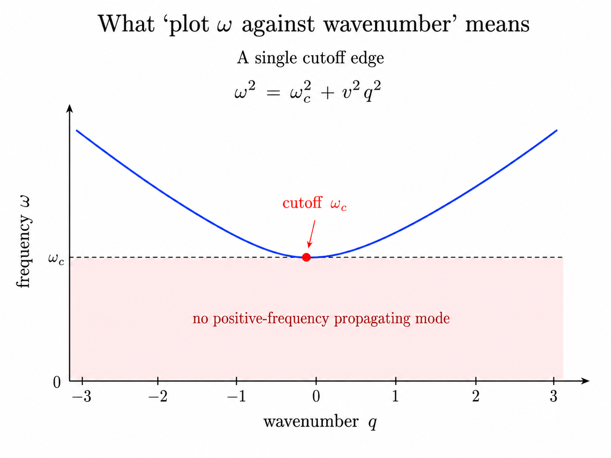

*Only the positive-frequency branch is physically retained here, so the lower edge of the hyperbola appears as a single cutoff rather than a two-sided bandgap.*

Every setting below is this formula with a specific mechanism setting $\omega_c$.

### § 6.2. Waveguide cutoff

A rectangular metallic waveguide of transverse dimension $a$ (in the direction perpendicular to propagation) supports transverse modes with quantized wavevector $k_\perp = m\pi/a$ for integer $m$. The wave equation in vacuum reads

$$\left(-\nabla^2 - \frac{\omega^2}{c^2}\right)E = 0.$$

Separating variables into a transverse-mode function times $e^{ik_z z}$ gives

$$k_z^2 = \frac{\omega^2}{c^2} - k_\perp^2.$$

Identify $q \to k_z$, $\omega/c \to \omega/v$ with $v = c$, and $\omega_c/c \to k_\perp = m\pi/a$: same hyperbola. The cutoff frequency of the $m$-th transverse mode is

$$\omega_c = \frac{m\pi c}{a}.$$

Physical origin of the coupling: the metallic walls impose $E_\parallel = 0$ at $x = 0, a$, which forces the transverse field to vibrate at least once between them (the fundamental $m = 1$ mode has half a wavelength in the transverse dimension). Any driving frequency low enough that the wave "wants" a smaller transverse wavenumber than $k_\perp$ cannot fit — evanescent.

### § 6.3. Plasma cutoff

Electrons in a plasma (or a metal) respond to an applied field but with inertia. Their response is captured by the Drude permittivity

$$\varepsilon(\omega) = 1 - \frac{\omega_p^2}{\omega^2}, \qquad \omega_p^2 = \frac{n_e e^2}{m_e \varepsilon_0},$$

with $n_e$ the electron number density and $\omega_p$ the **plasma frequency**. Substituting into the free-space dispersion $k^2 = \omega^2\varepsilon/c^2$,

$$k^2 = \frac{\omega^2 - \omega_p^2}{c^2}.$$

Same hyperbola. The cutoff is $\omega_c = \omega_p$. Physical origin of the coupling: the free-electron plasma has a natural collective oscillation at $\omega_p$, and an electromagnetic wave below $\omega_p$ is fully screened out — the electrons rearrange themselves to cancel the applied field within a skin depth $c/\omega_p$. This is why metals reflect visible light: the plasma frequency of typical metals is in the ultraviolet, so all frequencies below UV are below cutoff and are reflected. It is also why the ionosphere reflects short-wave radio: the ionospheric plasma frequency ($\sim 10$ MHz) is above short-wave frequencies and below the frequencies that go through to space.

### § 6.4. The Klein–Gordon equation

A relativistic scalar particle of mass $m$ has energy–momentum relation

$$E^2 = (pc)^2 + (mc^2)^2, \qquad \text{equivalently} \qquad p^2 = \frac{E^2 - m^2c^4}{c^2}.$$

Identify $q \to p/\hbar$, $\omega \to E/\hbar$, $\omega_c \to mc^2/\hbar$: same hyperbola. The cutoff is set by the **rest energy** of the particle, $\hbar\omega_c = mc^2$. Physical origin: producing a particle at rest requires an energy input of $mc^2$; any driving with less energy cannot excite the field. Below cutoff there is no propagating particle; the field is Yukawa-suppressed (the "evanescent decay" of § 0.6 in the relativistic setting). This is what makes short-range forces mediated by massive particles fall off exponentially with distance, with the exponential decay length equal to the Compton wavelength $\hbar/(mc)$.

### § 6.5. The Bragg band edge, once more

Section 4 already worked out the Bragg case. At the lower band edge ($\delta = -\kappa$ in the § 4 notation), $q = 0$ and the wave is a standing wave: same as $\omega = \omega_c$ in the other three settings. The Bragg case is *symmetric* — there is an upper band edge as well at $\delta = +\kappa$ — because both edges of the gap are physically accessible in the Bragg setting, whereas in the waveguide/plasma/KG case only the lower edge is meaningful (there is no natural physical variable that goes below zero for propagation). This is the sole way in which the Bragg problem is richer than the three cutoff problems: it has two edges instead of one.

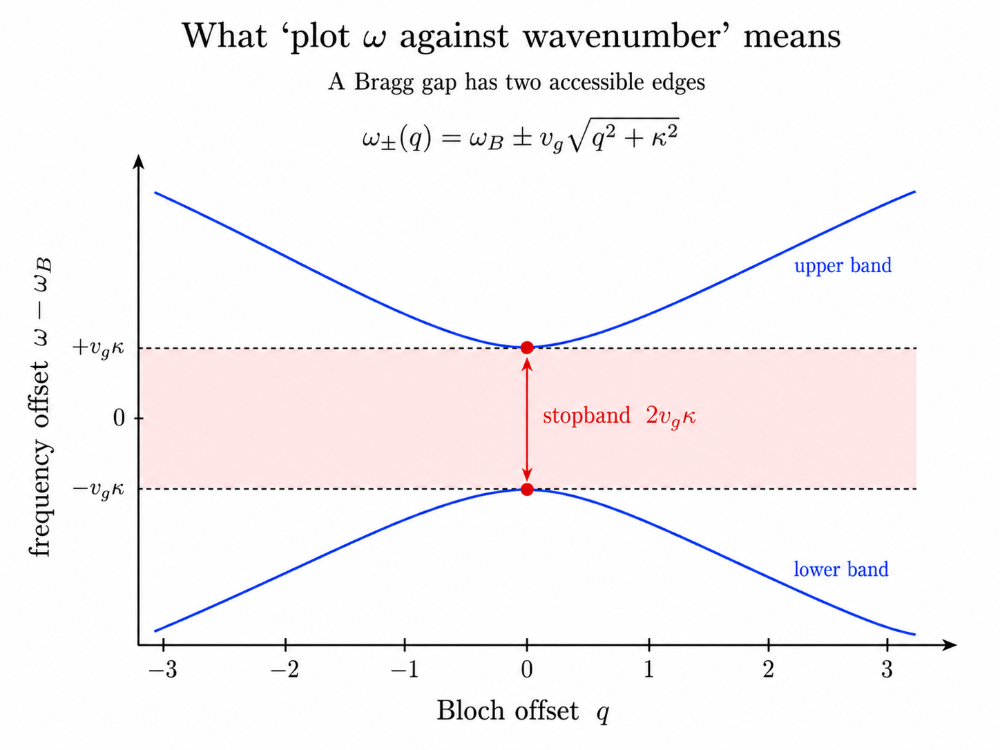

*Unlike a one-sided cutoff, the Bragg dispersion has a lower band below the stopband and an upper band above it.*

### § 6.6. What is the same, what is different

In all four settings the algebra is $q^2 = (\omega^2 - \omega_c^2)/v^2$: a single formula, one hyperbola, one gap. What differs is the mechanism setting the cutoff.

| Setting     | Cutoff mechanism                    | $\omega_c$                    |
| ----------- | ----------------------------------- | ----------------------------- |
| Waveguide   | Quantized transverse mode           | $m\pi c/a$                    |
| Plasma      | Collective electron oscillation     | $\omega_p = \sqrt{n_e e^2/(m_e\varepsilon_0)}$ |
| Klein–Gordon| Particle rest energy                | $mc^2/\hbar$                  |
| Bragg edge  | Periodic index modulation           | $\pi \Delta n / \lambda_B \cdot v_g$ (from § 4) |

Each mechanism has its own downstream consequences (skin depth in metals, mode filtering in optical fibers, Yukawa fall-off of short-range forces, DBR mirror engineering), but the mathematical object is the same and every "cutoff" or "band edge" behavior in the sections that follow is a reading of this single hyperbola.

The mass-like reading is worth planting once. Near the cutoff, expand $\omega^2 = \omega_c^2 + q^2 v^2$; for small $q$ (i.e., barely above cutoff) this behaves as $\omega \approx \omega_c + q^2 v^2/(2\omega_c)$. This is a *quadratic* dispersion in $q$, just as a nonrelativistic massive particle has $E = p^2/(2m)$. Comparing coefficients gives an **effective mass** $m_{\text{eff}} = \hbar\omega_c/v^2$ — a genuine dynamical mass that governs the transverse spreading of a wave packet near cutoff. In every setting, the wave near the cutoff behaves like a massive particle whose mass is set by the mechanism-specific coupling.

---

## § 7. Bragg band edges: standing waves, penetration, and phase-error catastrophe

Section 4 identified the two-wave truncation with a specific hyperbola of the § 0 framework and enumerated the general reading (stopband, evanescence, group velocity vanishing at band edges). This section develops three specific readings of that framework in the Bragg setting: (a) *what* the standing waves at the two band edges look like in real space, (b) *how deep* the wave penetrates into a finite mirror, and (c) *why the stopband has the width it has*, from an accumulation-of-error viewpoint.

None of these adds new algebra to § 0 — they are geometric readings of the same $q^2 = \delta^2 - \kappa^2$ hyperbola in the specific Bragg context.

### § 7.1. The two standing waves at the band edges

At the Bragg wavenumber ($k = k_B$, hence $\delta = 0$), the two-wave truncation reduces to the pure-coupling problem $H = \kappa \sigma_x$: the diagonal has been zeroed by choice of reference wavenumber, and only the off-diagonal is left. Its eigenvalues are $\pm\kappa$ — the two band-edge frequencies above and below the reference — and its eigenvectors are the equal-mixture combinations

$$(A, B) = (1, 1)/\sqrt 2 \quad \text{and} \quad (A, B) = (1, -1)/\sqrt 2.$$

Translated to real-space fields via $E(z) = A\, e^{ik_B z} + B\, e^{-ik_B z}$:

- $(1, 1)/\sqrt 2$ gives $E(z) \propto e^{ik_Bz} + e^{-ik_Bz} = 2\cos(k_B z)$ — a **cosine standing wave**;
- $(1, -1)/\sqrt 2$ gives $E(z) \propto e^{ik_Bz} - e^{-ik_Bz} = 2i\sin(k_B z)$ — a **sine standing wave**.

These are the two eigenvectors of the framework's $2\times 2$ matrix at $\delta = 0$; equivalently, they are the two modes that live exactly at the two band edges of the dispersion diagram (where $q = 0$). Same eigenmodes, two different viewpoints — the eigenvalue-versus-detuning view puts them at the boundary of the gap; the real-space view shows them as standing waves at the Bragg period.

The two standing waves have their intensity maxima at complementary positions in the unit cell of the modulation. The cosine peaks where $\cos(2k_Bz) = \cos(G_1 z)$ peaks — that is, where the permittivity $\varepsilon(z) = \bar\varepsilon + \Delta\varepsilon\cos(G_1 z)$ is largest. The sine peaks where the permittivity is smallest.

### § 7.2. Why the two frequencies differ, from a variational principle

The Helmholtz equation from § 1, $E'' + (\omega/c)^2\varepsilon(z) E = 0$, can be rewritten as an eigenvalue problem for $\omega^2$:

$$\omega^2 = c^2 \frac{-\int E^* E''\, dz}{\int \varepsilon(z)|E(z)|^2\, dz}.$$

This is a Rayleigh-quotient form; the eigenvalues correspond to stationary points of this quotient over trial fields. Reading the quotient: for a fixed shape of $E(z)$ (fixed numerator), a larger weighted $\int \varepsilon|E|^2$ gives a *smaller* $\omega^2$.

The cosine standing wave concentrates $|E|^2$ in high-$\varepsilon$ regions: large denominator, **lower frequency $\omega_-$**. The sine standing wave concentrates $|E|^2$ in low-$\varepsilon$ regions: small denominator, **higher frequency $\omega_+$**. The frequency separation is exactly $2\kappa v_g$ — the stopband width computed via the hyperbola.

In the language of two nearby bands: the lower band-edge mode has its field in the high-index material and is called the **dielectric band edge**; the upper band-edge mode has its field in the low-index material and is called the **air band edge**. Both names are just labels for the eigenvectors of $\sigma_x$ read against a specific real-space modulation profile.

The choice of *which* mode is cosine and which is sine depends on the phase of the modulation relative to the origin of coordinates; only the pattern of high-index / low-index concentration is universal.

### § 7.3. Penetration into a finite Bragg mirror

Section 0.6 defined the **Bragg length** $L_B = 1/\kappa$: the $1/e$ decay length of the evanescent wave at the center of the gap. Two engineering readings follow directly.

**Reflectivity of a finite grating.** A grating of physical length $L$ presents to an incident wave at exact Bragg tuning a reflectivity of

$$R = \tanh^2(\kappa L),$$

which follows from solving the coupled-mode equations with the boundary conditions "input forward wave, zero input backward wave at the far end." The result depends only on the product $\kappa L$: length in units of Bragg lengths. For $R > 99\%$, one needs $\kappa L > 2.65$, i.e., $L > 2.65\, L_B$; fewer than about three Bragg lengths and the mirror is significantly leaky.

#### Effective mirror position.

A finite Bragg mirror does not reflect from its physical surface: at exact tuning, the wave decays exponentially into the stack, and the peak of $|E|^2$ (or the effective reflection point for phase-matching purposes) sits at depth $\sim L_B/2$ inside. For a cavity bounded by two such mirrors, the effective cavity length for longitudinal-mode counting is

$$L_{\text{eff}} = L_{\text{physical}} + 2L_{\text{pen}}, \qquad L_{\text{pen}} = L_B/2,$$

so the free-spectral range is $c/(2n_{\text{eff}}L_{\text{eff}})$ — not $c/(2n_{\text{eff}}L_{\text{physical}})$. A strong grating (large $\kappa$) has both a wider stopband ($\propto\kappa$) and a shorter effective cavity ($L_{\text{pen}}\propto 1/\kappa$) — one design lever, two consequences.

### § 7.4. The stopband width as an accumulation-of-error argument

The formula $\Delta\omega = 2\kappa v_g$ was delivered by § 4 as a bare algebraic result. It has a physical reading from the layered-mirror viewpoint that is worth spelling out, because it exposes why $\kappa$ and $L_B = 1/\kappa$ appear together as reciprocals in every design formula.

Take a mirror at exactly its design wavelength $\lambda_0$: each quarter-wave layer contributes a round-trip phase of exactly $\pi$, and combined with the boundary-reflection phase, all reflections arrive at the input in constructive interference.

Now shine the same mirror with a wavelength $\lambda$ that is off by 1%, so $\lambda = 0.99 \lambda_0$. The round-trip phase per layer is

$$\phi_{\text{RT}} = 2 k d = 2\left(\frac{2\pi n}{\lambda}\right)\left(\frac{\lambda_0}{4n}\right) = \pi\frac{\lambda_0}{\lambda} \approx 1.01\pi.$$

Each layer contributes a phase *error* of $0.01\pi \approx 2°$ — small. But the wave enters the stack and accumulates error across many layers:

- 10 layers: accumulated error $\approx 18°$. Still constructive.
- 50 layers: accumulated error $\approx 90°$. Reflections from deep and shallow layers are 90° out of phase — neither constructive nor destructive.
- 100 layers: accumulated error $\approx 180°$. Reflections from deep and shallow layers are opposed: constructive interference has become destructive, and the mirror stops accumulating reflectivity.

For this specific 1% detuning, the effective penetration depth is $\sim 100$ layers $\sim 30\,\mu\text{m}$. Different detunings give proportionally different penetration depths.

The **stopband edge** is where the detuning is large enough that the *first* Bragg period already accumulates a phase error of $\pi$: that is, the detuning at which the destructive contribution from within a single unit cell already dominates over the constructive contribution.

This is the origin of the $2\kappa$ formula. Writing $\kappa$ as $\pi \Delta n/\lambda_B$: it is the inverse length over which accumulated phase error becomes $\pi$ for the largest detuning that still gives coherent reflection. The stopband width in wavenumber is $2\kappa$ (the range of detunings for which the accumulated error stays below $\pi$ over one Bragg length); the penetration depth is $1/\kappa$ (the length over which the accumulated error hits $\pi$ at the largest surviving detuning). Both come from one condition; both scale together, and this is why they appear as reciprocals throughout the theory.

---

## § 8. Transfer matrix formalism

Sections 2–4 answered the eigenvalue question in $k$-space: given a frequency $\omega$, what wavenumber $q$ does the periodic medium allow? This section answers the complementary question in $z$-space: given the field $(E, E')$ at one point, what is it at another point? The reformulation is *operational* — it exposes propagation as matrix multiplication — and provides the algorithmic basis for computing reflectivity, transmission, and cascading of finite structures. It also recovers the band structure of §§ 2–4 by a different route: as an eigenvalue problem on the propagation matrix.

### § 8.1. The local state and the propagation matrix

The wave equation from § 1 is second-order in $z$; a second-order linear ODE has a two-dimensional solution space parameterized by initial conditions $E(z_0)$ and $E'(z_0)$. Define the **local state**

$$\mathbf{v}(z) = \begin{pmatrix} E(z) \\ E'(z) \end{pmatrix}.$$

The wave equation rewrites as a first-order system

$$\frac{d\mathbf{v}}{dz} = A(z)\, \mathbf{v}, \qquad A(z) = \begin{pmatrix} 0 & 1 \\ -(\omega/c)^2\varepsilon(z) & 0 \end{pmatrix}.$$

Because the ODE is linear, its solution defines a linear map from initial state to final state: for any two points $z_0, z_1$ there is a $2\times 2$ matrix $T(z_0, z_1)$ such that

$$\mathbf{v}(z_1) = T(z_0, z_1)\, \mathbf{v}(z_0).$$

This is the **transfer matrix**. It is defined for *any* $\varepsilon(z)$, not just periodic — the same 2×2 solution space that Bloch's theorem in § 2 used to prove the completeness of Bloch waves.

### § 8.2. Cascading and $\det T = 1$

The most useful property: transfer matrices compose by multiplication. Breaking $[z_0, z_n]$ into subintervals,

$$T(z_0, z_n) = T(z_{n-1}, z_n)\, T(z_{n-2}, z_{n-1})\, \cdots\, T(z_0, z_1).$$

For a periodic medium with unit-cell transfer matrix $T_{\text{cell}}$, propagation through $N$ unit cells is $T_{\text{cell}}^N$: matrix power replaces ODE integration through the long structure.

The matrix $A(z)$ has zero trace, and a standard theorem on linear ODEs states that if $A$ is traceless then $\det T(z_0, z)$ is conserved. At $z = z_0$ the transfer matrix is the identity with $\det = 1$, so $\det T \equiv 1$ everywhere. Physically, the conserved quantity is the **Wronskian**

$$W(z) = E_1(z) E_2'(z) - E_2(z) E_1'(z)$$

of any two solutions $E_1, E_2$; it is proportional to the Poynting flux of any coherent superposition of the two and its preservation is energy conservation in a lossless medium. Matrices with $\det = 1$ form the group $SL(2, \mathbb{R})$ (or $SL(2, \mathbb{C})$ if losses are present), and everything below is the representation theory of $SL(2, \mathbb{R})$ applied to wave propagation.

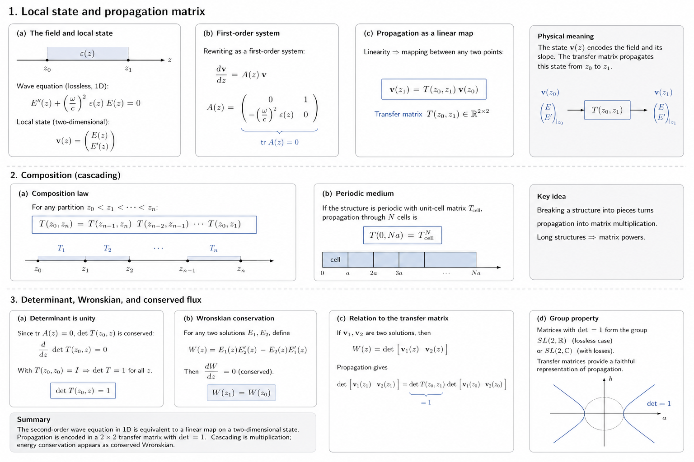

*The second-order wave equation becomes a two-component local state; propagation is a linear map, long structures are products of those maps, and the conserved Wronskian appears as $\det T=1$.*

### § 8.3. Band structure from the trace

For a periodic medium, the Bloch waves of § 2 are the eigenvectors of the unit-cell transfer matrix — states that reproduce themselves up to a factor after one period. The eigenvalues satisfy

$$\lambda^2 - \text{tr}(T)\, \lambda + 1 = 0 \implies \lambda = \frac{\text{tr}(T) \pm \sqrt{\text{tr}(T)^2 - 4}}{2}.$$

Two cases distinguished by the sign of the discriminant:

#### Case A: $|\text{tr}(T)| < 2$ (band).

Discriminant negative; $\lambda$ complex-conjugate pair with $|\lambda_1| = |\lambda_2| = 1$ (product is $\det T = 1$). Write $\lambda_{1,2} = e^{\pm iK\Lambda}$; then

$$\cos(K\Lambda) = \frac{1}{2}\text{tr}(T),$$

which defines the **Bloch wavenumber** $K$ for that frequency — the same $K$ that Bloch's theorem produced abstractly in § 2.

#### Case B: $|\text{tr}(T)| > 2$ (gap).

Discriminant positive; eigenvalues real reciprocals $\lambda_{1,2} = e^{\pm\alpha\Lambda}$ with $\alpha > 0$. One eigenmode grows exponentially, the other decays: a wave in a semi-infinite medium selects the decaying mode. The frequency is inside a stopband; the decay rate is $\alpha$, per unit length after averaging over one period.

#### Transition ($|\text{tr}(T)| = 2$):

both eigenvalues equal $\pm 1$; the two Bloch eigenvectors coincide and the second solution grows linearly with $z$. This is the band edge — the same standing-wave configuration whose real-space form § 7 spelled out.

The complete band structure of any 1D periodic medium reduces to computing $\text{tr}(T(\omega))$ as a function of $\omega$: stopbands are the ranges where $|\text{tr}(T)|/2 > 1$; band edges are where equality holds; propagating bands are where the trace is in $[-2, 2]$.

### § 8.4. Layered Bragg mirror: explicit computation

Consider the alternating-layer Bragg structure with high and low index $n_H, n_L$ and thicknesses $d_H, d_L$.

In each homogeneous layer the wave equation is $E'' + k_i^2 E = 0$ with $k_i = \omega n_i/c$. Integrating the ODE gives the layer transfer matrix

$$T_i = \begin{pmatrix} \cos(k_i d_i) & (1/k_i)\sin(k_i d_i) \\ -k_i \sin(k_i d_i) & \cos(k_i d_i) \end{pmatrix}, \qquad \det T_i = \cos^2 + \sin^2 = 1.$$

The unit cell is one high layer followed by one low layer, so $T_{\text{cell}} = T_L T_H$.

At the design wavelength satisfying quarter-wave thickness ($k_i d_i = \pi/2$), each $T_i$ simplifies to $\begin{pmatrix} 0 & 1/k_i \\ -k_i & 0\end{pmatrix}$, and the product is

$$T_{\text{cell}} = \begin{pmatrix} -k_H/k_L & 0 \\ 0 & -k_L/k_H \end{pmatrix} = \begin{pmatrix} -n_H/n_L & 0 \\ 0 & -n_L/n_H \end{pmatrix}.$$

The trace is $-(n_H/n_L + n_L/n_H)$: for any $n_H \neq n_L$ this is more negative than $-2$, so $|\text{tr}(T)| > 2$ and the wave is evanescent — the mirror is inside a stopband at its design wavelength, as expected.

For $n_H/n_L = 1.5$ (typical semiconductor DBR), $|\text{tr}(T)|/2 \approx 1.083$; solving $\cosh(\alpha\Lambda) = 1.083$ gives $\alpha\Lambda \approx 0.408$. With a Bragg period $\Lambda \approx \lambda_0/(2n_{\text{avg}}) \approx 200$ nm at $\lambda_0 = 1\,\mu$m, the effective decay rate per unit length is $\alpha \approx 2\times 10^6\,\text{m}^{-1}$, giving a Bragg length $L_B = 1/\alpha \approx 490$ nm. Twenty periods give $\alpha N\Lambda \approx 8.2$; reflectivity $R = \tanh^2(8.2) \approx 1 - 10^{-7}$: essentially perfect. Real DBRs use 20–40 periods for this reason.

### § 8.5. Fresnel-plus-kinematic-phase reading

The transfer-matrix calculation makes the DBR's stopband come out as $|\text{tr}(T)| > 2$, but there is an interference-based reading that connects to the phase-error catastrophe of § 7.4.

At the boundary between materials $n_1$ and $n_2$ (normal incidence), the amplitude reflection coefficient is $r_{12} = (n_1 - n_2)/(n_1 + n_2)$. Sign convention: low-to-high transition gives $r < 0$, a phase shift of $\pi$; high-to-low gives $r > 0$, no phase shift. One-way propagation through a quarter-wave layer contributes a kinematic phase of $\pi/2$; a round trip is $\pi$.

Comparing two reflections in a quarter-wave HL stack:
- Reflection off the first (air|H) surface: Fresnel phase $\pi$ (low→high), no propagation.
- Reflection off the (H|L) surface: round-trip through H contributes $\pi$; Fresnel phase 0 (high→low). Total $\pi$.

Both reflections arrive in phase — constructive interference. Away from the design wavelength, the kinematic phases become $\pi \pm \varepsilon$ instead of exactly $\pi$, the interferences dephase, and the mirror stops working; § 7.4 spelled out how this accumulates over the Bragg length to determine the stopband width.

### § 8.6. Comparison with the coupled-mode approach

The coupled-mode formalism of § 4 and the transfer-matrix formalism of this section answer different questions on the same physics:

| Question               | Coupled-mode (§ 4)                | Transfer matrix (§ 8)          |
| ---------------------- | --------------------------------- | ------------------------------ |
| Fixed variable         | $k$ (Bloch wavenumber)            | $\omega$ (frequency)           |
| Solved for             | Allowed frequencies $\omega(k)$   | Bloch wavenumber $K(\omega)$   |
| Vector represents      | Fourier components $(E_0, E_{-1})$| Local field state $(E, E')$    |
| Matrix structure       | Hermitian, small-modulation limit | $SL(2, \mathbb{R})$, exact     |
| Best for               | Analytical, near-Bragg regime     | Finite structures, numerical   |

The coupled-mode approach is the natural language for analytical work near the Bragg wavelength in the small-modulation regime, giving closed-form expressions for stopband width, Bragg length, and mode structure. The transfer-matrix approach is the natural language for finite devices with strong modulation, aperiodic profiles, chirped or apodized gratings (§ 12), and any numerical calculation of reflectivity or transmission. The two are equivalent in their common domain of validity.

---

## § 9. Distributed Bragg reflectors: design

The **distributed Bragg reflector (DBR)** is a periodic multilayer dielectric stack designed to produce high reflectivity in a target wavelength band. Its design follows directly from the coupled-mode formulas of § 4, the band-edge geometry of § 7, and the transfer-matrix calculation of § 8. This section brings the pieces together into concrete engineering parameters.

### § 9.1. The quarter-wave stack and reflectivity

The standard DBR alternates high-index and low-index layers, each of optical thickness $\lambda_0/4$ where $\lambda_0$ is the target vacuum wavelength. § 8.5 already explained why the quarter-wave choice: at the design wavelength each layer contributes exactly $\pi/2$ of one-way phase, and combined with the Fresnel $\pi$-flip at low-to-high interfaces, all reflected contributions arrive at the input in constructive interference.

For a stack of $N$ high-low bilayer periods plus a final high layer between substrate index $n_s$ and incident medium $n_0$, at the design wavelength the closed-form reflectivity is

$$R = \left(\frac{n_0\, n_L^{2N} - n_s\, n_H^{2N}}{n_0\, n_L^{2N} + n_s\, n_H^{2N}}\right)^2.$$

The formula comes from taking the transfer-matrix product analytically at the quarter-wave point (§ 8.4). For $n_H/n_L$ substantially above 1, $R$ saturates at essentially unity for $N \sim 10$; for lower contrasts $N$ must grow. Concretely:
- GaAs/AlAs semiconductor DBR, $n_H/n_L \approx 1.15$: needs $N = 25$–30 periods;
- Ta$_2$O$_5$/SiO$_2$ dielectric DBR, $n_H/n_L \approx 1.5$: manages with $N = 10$–15 periods.

### § 9.2. Stopband width from the coupling constant

Section 4 gave the coupling constant of a sinusoidal grating with peak-to-peak index modulation $\Delta n$ as $\kappa = \pi \Delta n/\lambda_B$. A square-wave modulation (real DBR) is a Fourier series with fundamental coefficient $4/\pi$ times the peak-to-peak amplitude, so the effective coupling at the fundamental Bragg wavelength is

$$\kappa_{\text{DBR}} = \frac{2 \Delta n}{\lambda_0}, \qquad \Delta n \equiv n_H - n_L.$$

The stopband width in frequency (from § 4) is $\Delta\omega = 2\kappa v_g$, giving a fractional bandwidth

$$\frac{\Delta\omega}{\omega_0} = \frac{4}{\pi}\frac{\Delta n}{n_{\text{avg}}}.$$

For $\Delta n/n_{\text{avg}} = 0.5$ (high-contrast dielectric stack), the fractional bandwidth is around 60%: a very broadband mirror. For semiconductor DBRs with $\Delta n/n_{\text{avg}} \sim 0.05$, it is around 6% — adequate for the narrow-linewidth needs of a single-mode laser but not for broadband applications.

Cross-reference to § 7.3: with the same $\kappa$, the Bragg length is $L_B = 1/\kappa$ and the reflectivity of a length-$L$ mirror is $\tanh^2(\kappa L)$.

### § 9.3. Higher-order stopbands and structure factor engineering

A square-wave DBR has, in principle, stopbands at odd sub-multiples of the design wavelength ($\lambda_0/3, \lambda_0/5, \ldots$) because the same quarter-wave layer is a $3\lambda/4$, $5\lambda/4$, … layer at those wavelengths. The strength of the $m$-th stopband is set by the corresponding Fourier coefficient $\varepsilon_m$ of the modulation profile — the structure factor argument of § 3. For a square wave, $\varepsilon_m \propto 1/m$ for odd $m$; higher-order stopbands are weaker but present.

Two engineering opportunities follow:
- To *suppress* higher-order stopbands, use a modulation that is closer to sinusoidal (only $\varepsilon_1 \neq 0$). Fiber Bragg gratings are typically apodized (§ 12) to approximate this.
- To *engineer* multiple simultaneous stopbands, choose a modulation whose Fourier spectrum has structure at the desired periods. § 12 develops this in the context of sampled gratings for multi-wavelength lasers.

### § 9.4. Angular dependence: polarization sensitivity

At normal incidence, both polarizations of the incoming wave see the same reflectivity because the layer normal has no preferred transverse direction. When the wave is incident at an angle $\theta_0$ from the layer normal, three things change simultaneously: the effective path length through each layer becomes $d/\cos\theta_i$ (with $\theta_i$ the in-layer angle from Snell's law), which shifts the Bragg condition; and the two polarizations (transverse-electric TE, and transverse-magnetic TM) see different Fresnel coefficients at each interface, so they now have distinct coupling constants and distinct stopbands.

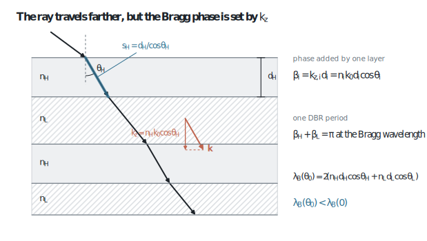

*The geometric path is longer, but the layer phase is set by the normal wavevector component $k_z$. The resulting cosine factors shift the Bragg wavelength to shorter values as the angle increases.*

The Fresnel coefficients at the interface between $n_1$ and $n_2$ are

$$r_{\text{TE}} = \frac{n_1\cos\theta_1 - n_2\cos\theta_2}{n_1\cos\theta_1 + n_2\cos\theta_2}, \qquad r_{\text{TM}} = \frac{n_2\cos\theta_1 - n_1\cos\theta_2}{n_2\cos\theta_1 + n_1\cos\theta_2}.$$

The two are equal at $\theta_i = 0$; they diverge with angle. Critically, $r_{\text{TM}}$ vanishes at the **Brewster angle** $\theta_B = \arctan(n_2/n_1)$, at which TM light passes through the interface with zero reflection.

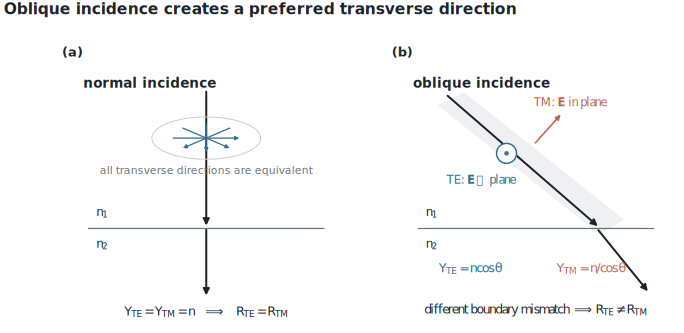

*At normal incidence all transverse directions are equivalent. An oblique ray defines a plane of incidence, so TE and TM see different boundary admittances and therefore different reflection strengths.*

The consequence for a DBR: when the in-medium angle approaches Brewster's angle, the TM coupling coefficient shrinks toward zero, the TM stopband narrows and eventually disappears, and the DBR becomes a **polarization-selective mirror** — reflecting TE but transmitting TM at the same wavelength. This is exploited in laser cavities to force operation in a single polarization; and it matters in the design of edge-emitting laser waveguides where the internal mode angle is not zero.

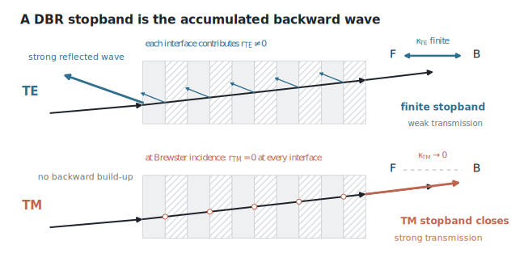

*The TE backward wave keeps accumulating across the interfaces. For TM at Brewster incidence, each interface contributes essentially no reflected amplitude, so the distributed stopband closes.*

At the small internal angles of a VCSEL (§ 10), polarization effects are negligible and normal-incidence design suffices. At the larger internal angles of a strong-confinement waveguide, the two polarizations may need separate designs.

---

## § 10. Semiconductor lasers with Bragg feedback: DFB, DBR, and tunable architectures

The Bragg physics of §§ 4, 7, 9 becomes engineering when the grating is embedded in a gain medium. This section covers the three principal architectures: the DFB laser (grating co-located with gain), the DBR laser (grating outside the gain region), and the multi-section tunable DBR (multiple gratings for wavelength tuning). The theory is the same throughout — a photonic bandgap acts as a wavelength-selective mirror — but the placement of the grating relative to the gain changes what the device can and cannot do.

### § 10.1. Reference: the flat-mirror semiconductor laser

A conventional edge-emitting semiconductor laser has two flat, wavelength-independent mirrors on either end of a rectangular waveguide of length $L$ and effective index $n_{\text{eff}}$. The mirrors are usually flat-cleaved end facets with Fresnel reflectivity $R \approx 0.3$ (for $n = 3.5$ against air), independent of wavelength.

The cavity has free spectral range $\Delta\nu_{\text{FSR}} = c/(2n_{\text{eff}}L)$; the gain medium's emission bandwidth is many THz, containing thousands of longitudinal modes; and every mode has essentially identical mirror loss because the flat mirror does not discriminate by wavelength. The laser typically runs multi-mode or hops between modes with drive current and temperature — unacceptable for coherent optical communications.

### § 10.2. DFB: Bragg grating co-located with gain

Replace the flat facets with a Bragg grating written into the active waveguide itself. The grating provides high reflectivity only within the stopband; modes outside the stopband have no feedback and cannot lase. Two questions immediately follow: (i) which mode inside the stopband actually lases, and (ii) can we guarantee exactly one?

#### A Bragg grating is itself a distributed cavity.

A long Bragg grating at its band edge supports slow-light resonances that look exactly like Fabry–Pérot modes — the grating acts as both mirrors and cavity simultaneously. In the limit of a defect-free uniform grating these band-edge resonances merge into the band structure. In a grating *with a defect* (a phase shift or physical spacer), the periodicity is broken to introduce a localized state inside the stopband — a Fabry–Pérot mode in everything but name, held in place by the surrounding grating rather than by physical mirrors.

The DFB and the VCSEL differ in which of these architectures they use: the DFB uses a distributed self-cavity co-located with the gain, while the VCSEL uses two DBRs bracketing a physical gain region. The underlying mode-selection physics — a localized state inside a photonic bandgap — is the same.

### § 10.3. Where the DFB wants to lase: the two-band-edge problem

Consider a defect-free Bragg grating embedded in a gain medium with broad spectral gain. The reflection is strong throughout the stopband, strongest at exact tuning where the evanescent decay rate is largest. Lasing requires not only reflection but also gain accumulation — the wave must interact with the gain medium enough to overcome loss on each round trip.

At exact Bragg tuning the mode is the standing wave analyzed in § 7.1: no net translation, all reflection. At the two band edges $\delta = \pm \kappa$ the eigenmodes have $q = 0$ (still standing waves, but at the boundary of the gap where the group velocity vanishes) and two independent enhancements act on them:

#### Enhancement 1 — density of states.

The 1D density of photonic modes per unit frequency is $\rho(\omega) = 1/(\pi v_g)$; near a band edge, $v_g \to 0$ (§ 0.7) and the density of states diverges as an inverse square root: $\rho(\omega) \propto 1/\sqrt{\omega - \omega_{\text{edge}}}$. By Fermi's golden rule the spontaneous and stimulated emission rates into a mode are proportional to $\rho$, so emitters preferentially couple into band-edge modes.

#### Enhancement 2 — field–gain spatial overlap.

The band-edge modes are standing waves concentrated in complementary regions of the grating unit cell (§ 7.1); if the gain material is placed at the intensity maxima of one mode, the effective gain per unit length seen by that mode is

$$\gamma_{\text{eff}} = \gamma_0 \frac{\int_{\text{gain region}}|E|^2\, dz}{\int |E|^2\, dz},$$

which can exceed the volume-averaged gain by a substantial factor. When the gain (in the high-index material, i.e., the quantum wells) sits at the intensity maxima of the low-frequency band-edge mode (cosine standing wave, from § 7.1), that mode wins.

#### The remaining problem: two band edges.

A pure index-modulated DFB has two nearly-degenerate band-edge modes, and generic small perturbations can hop the laser between them.

#### The two solutions:

- **Quarter-wave phase shift at the grating center.** Introducing a $\lambda/4$ optical-thickness spacer breaks the two-edge degeneracy by creating a *single* defect mode at the exact center of the stopband, localized around the phase-shift point. This mode is spatially symmetric under $z \to -z$ (whereas the two band-edge modes are related by half-period translation), so it has no degenerate partner. The $\lambda/4$-shifted DFB is the industry-standard telecom single-mode laser.

- **Gain coupling.** If the modulation is not pure index but has a gain-modulation component, one band-edge mode overlaps the high-gain regions and the other overlaps the low-gain regions — the two are no longer degenerate. § 10.4 develops this.

The defect mode of the $\lambda/4$-shifted DFB is exactly analogous to a bound state in a semiconductor's electronic bandgap: a localized state inside the gap, decaying exponentially into the surrounding stopband. The decay length is the Bragg length $L_B = 1/\kappa$ from § 0.6.

### § 10.4. Index-coupled vs. gain-coupled DFB

The modulation of $\varepsilon(z) = \bar\varepsilon + \Delta\varepsilon(z)$ decomposes into real (index) and imaginary (gain–loss) parts:

$$\Delta\varepsilon(z) = \Delta\varepsilon'(z) + i\, \Delta\varepsilon''(z).$$

Real semiconductor DFBs have both components in general, and the two produce dramatically different behavior:

- **Pure index coupling** ($\Delta\varepsilon'' = 0$): two symmetric band edges with identical loss in the absence of structural asymmetry; mode selection prone to hopping; the $\lambda/4$ shift is needed to break degeneracy reliably.
- **Pure gain coupling** ($\Delta\varepsilon' = 0$): the mode overlapping the gain-modulation peaks has lower net loss than the mode overlapping the loss peaks; single-mode operation is intrinsic without a $\lambda/4$ shift. The trade-off is fabrication: gain coupling requires physically corrugating the active region or using a periodic quantum-well structure.

#### The Kramers–Kronig constraint.

§ 0.9 established that the real and imaginary parts of $\varepsilon(\omega)$ are linked by causality — one cannot modulate real $\varepsilon$ without modulating imaginary $\varepsilon$ somewhere in the spectrum, and vice versa. In a semiconductor DFB, injecting current into a gain-modulated region simultaneously produces a periodic index modulation via carrier-induced refractive-index change, so "pure gain coupling" is unattainable in practice; the actual device is a mixture, and designers choose the operating point in the gain band to weight the desired component while minimizing the unwanted one.

### § 10.5. Linewidth of a DFB

The DFB linewidth is set by cavity Q, gain, and the coupling between amplitude and phase noise via the carrier-density-dependent index (parametrized by the Henry linewidth-enhancement factor $\alpha_H$). The **Schawlow–Townes linewidth** including the Henry factor is

$$\Delta\nu_{\text{ST}} = \frac{\pi h\nu\, (\Delta\nu_c)^2\, n_{sp}}{P_{\text{out}}}(1 + \alpha_H^2),$$

with $\Delta\nu_c$ the cold-cavity linewidth, $n_{sp}$ the spontaneous-emission factor, and $P_{\text{out}}$ the output power. Typical high-power DFBs achieve 100 kHz to 1 MHz — hundreds of times narrower than a flat-mirror multi-mode laser. External-cavity DFBs and DBR lasers with long external gratings push this below 1 kHz for coherent-optical communication.

### § 10.6. Tuning a DFB: fundamental limits

Tuning a DFB requires shifting the Bragg wavelength itself: $\lambda_B = 2n_{\text{avg}}\Lambda$. Since $\Lambda$ is set by lithography, tuning proceeds by changing $n_{\text{avg}}$. Two mechanisms:

- Temperature: thermo-optic and thermal-expansion coefficients give in InGaAsP roughly $0.1$ nm/K; total tuning range about 5 nm, response time in milliseconds.
- Current injection: injected carriers change $n_{\text{avg}}$ (fast, nanosecond) but only by $\sim 0.01$ nm/mA and with output-power coupling.

Both mechanisms tune the *entire* laser (grating and gain simultaneously), and both are limited to a few nm. For 10 nm and wider, one has to split the grating from the gain — the DBR-laser architecture.

### § 10.7. DBR laser: separating grating from gain

A DBR laser places the Bragg grating *outside* the gain region: the gain sits in a central active section, and one or both ends of the waveguide are terminated by a passive Bragg grating serving as a wavelength-selective mirror. The grating and the gain are electrically isolated (separate contacts, separate current-injection paths), so their refractive indices can be tuned independently.

Tuning strategies:

- **Grating-only tune:** change the index of the DBR section by carrier injection or thermal drift. This shifts the Bragg wavelength while leaving the cavity length (and hence the longitudinal mode spacing) essentially fixed. Mode hopping occurs when the moving Bragg wavelength crosses adjacent cavity modes.
- **Cavity-only tune:** change the index of a separate passive phase-shift section between grating and gain. This shifts the cavity modes without moving the Bragg wavelength. Continuous tuning (no mode hop) is possible over one FSR.
- **Combined:** tune both simultaneously to keep a specific mode centered in the stopband as $\lambda_B$ moves. This gives the widest continuous tuning range of any single-Bragg architecture.

The trade-off relative to DFB: the DBR laser has more sections to control (typically three or four), but achieves wider tuning without mode hops.

### § 10.8. Multi-section tunable DBR: extending the range with a comb

To achieve tuning ranges of 40 nm or more (the whole telecom C-band), a single grating is insufficient — one exploits *two* gratings with slightly different periods, playing them against each other via the Vernier principle.

**The Vernier-tunable DBR** has a gain section between two DBRs whose stopbands are narrow combs of reflection peaks (rather than single peaks) with slightly different comb periods. Only where a front-mirror peak and a rear-mirror peak coincide does the cavity have low loss; only that wavelength lases. Tuning one comb slightly slides its peaks across the other comb's peaks, and the coincidence jumps to a new wavelength — accessible over the entire span of the comb envelope.

To make a DBR reflect as a comb rather than at a single wavelength, one modulates the underlying Bragg grating with a slow envelope — a **sampled grating**. If the grating consists of short bursts of Bragg modulation separated by longer unmodulated segments, the Fourier transform of the effective modulation is a comb (the transform of a comb-of-delta-functions is another comb), and the DBR reflects at the comb frequencies. The comb spacing is set by the sampling period, and different sampling periods produce different comb spacings — Vernier tuning follows.

Sampled-grating DBR lasers are the workhorse of tunable telecom transmitters, offering wavelength selection across dozens of channels from a single device.

---

## § 11. Non-reciprocal devices

Section 5 derived the linearized gyromagnetic response — the Polder tensor $\hat\mu = \mu I + \kappa_P \sigma_y$ — as the physical realization of the $\sigma_y$ Pauli component in the § 0 framework, and showed that its immediate consequence is Faraday rotation of a linearly polarized wave by $\theta_F = (\omega/2c)(n_+ - n_-)z$. This section builds the three devices that make Faraday rotation and gyrotropy useful: the Y-junction circulator (microwave), the optical isolator (all frequencies), and the material set (YIG family for microwaves, TGG and Bi:YIG for optics).

### § 11.1. The Y-junction circulator

A **circulator** is a three-port device that routes signals cyclically: an input at port 1 emerges at port 2 with port 3 isolated; an input at port 2 emerges at port 3 with port 1 isolated; and so on around the cycle. It is the microwave workhorse of non-reciprocity.

The device is a thin disk of ferrite biased perpendicular to the disk plane ($\vec B_0 \parallel \hat z$, disk in the $xy$-plane), with three coplanar waveguide ports coupling in and out at 120° around the rim (at angles $\phi = 0°, 120°, 240°$).

#### Step 1 — cavity modes without bias.

With no bias, the disk is a passive circular resonator. Its electromagnetic modes are Bessel-function standing waves labeled by an azimuthal quantum number $m = 0, \pm 1, \pm 2, \ldots$ The two dipole modes at $m = \pm 1$ have one nodal diameter and one antinodal diameter perpendicular to it. Because the disk has rotational symmetry, $m = +1$ and $m = -1$ are exactly degenerate and every linear combination is also an eigenmode. Exciting the disk from port 1 induces a standing wave whose antinode aligns with port 1 and whose nodal line lies perpendicular to it. Ports 2 and 3, at 120° from port 1, receive equal amounts of energy — a passive 3-way power splitter, not a circulator.

#### Step 2 — modes with bias.

Turn on $\vec B_0$. Section 5 established that the CP eigenmodes (which are the $m = +1$ and $m = -1$ modes with respect to axial rotation) see different effective permeabilities $\mu_\pm = \mu \pm \kappa_P$, and hence resonate at different frequencies $\omega_\pm \propto 1/\sqrt{\mu_\pm}$. The two formerly-degenerate modes are split by an energy gap of order $\kappa_P \omega_0$.

#### Step 3 — operating at the mid-frequency.

Operate at $\omega_{\text{op}} = (\omega_+ + \omega_-)/2$. At this frequency both $m = +1$ and $m = -1$ modes are excited but each is off-resonance by $\pm\kappa_P\omega_0/2$; each picks up a phase shift. The superposition that forms the standing wave has its nodal line and antinode line **rotated** relative to the equilibrium positions. With disk diameter and bias field chosen appropriately, the rotation is exactly $30°$.

#### Step 4 — 30° null placement.

With the standing-wave pattern rotated by $30°$, the antinode moves from $\phi = 0°$ to $\phi = 30°$ and the nodal line from $\phi = 90°$ to $\phi = 120°$ — **exactly on port 3**. Port 3 sees zero field and receives zero energy: it is isolated. Port 2, which sits closer to the rotated antinode than port 3, receives all the energy. So port 1 → port 2 with port 3 isolated. The disk's 120° rotational symmetry then gives port 2 → port 3 and port 3 → port 1 by the same argument.

Reversing $\vec B_0$ reverses the sense of gyrotropic precession and hence the direction of circulation: the device is non-reciprocal, and its non-reciprocity is what makes the routing cyclic rather than symmetric.

### § 11.2. Ferrite vs. metal: why the circulator body must be an insulator

A magnetic RF field entering a good conductor produces circulating induced currents (eddy currents) via Faraday's law: $\nabla \times \vec E = -\partial\vec B/\partial t$, and in a conductor $\vec J = \sigma\vec E$. By Lenz's law the induced currents produce a magnetic field that opposes the applied field.

At microwave frequencies ($\omega \sim 10^{10}\,\text{Hz}$), the induced eddy currents at the surface of a metal are so intense that they cancel the applied magnetic field within a thin surface layer — the **skin depth**

$$\delta_{\text{skin}} = \sqrt{2/(\mu\sigma\omega)}.$$

For iron at 10 GHz, $\delta_{\text{skin}} \sim 1\,\mu\text{m}$: the RF field cannot penetrate more than a micron into the bulk. So most of an iron-based circulator's magnetic material would be invisible to the RF wave and its Polder gyrotropy inaccessible. Worse, the eddy currents dissipate the RF energy as heat at rate $J^2/\sigma$, which would melt any high-power device.

**Ferrites** — magnetic materials that are chemically insulators — solve both problems. The electrons responsible for magnetism are localized on atomic sites (not itinerant as in a metal), so DC conductivity is essentially zero, eddy currents are suppressed, and the RF field penetrates the bulk to interact with the spin precession that produces the Polder tensor. Common examples include yttrium iron garnet Y$_3$Fe$_5$O$_{12}$ (YIG) for high-Q microwave applications and various nickel–zinc and manganese–magnesium compounds for lower-frequency and higher-power work.

### § 11.3. Damping: the Landau–Lifshitz–Gilbert equation

The Larmor equation of § 5.1 predicts undamped precession forever. Real ferrites have finite linewidths. To describe this, add a phenomenological damping term perpendicular to $\vec M$ that pushes the precession toward alignment with $\vec B$:

$$\frac{d\vec M}{dt} = \gamma\, \vec M\times\vec B - \frac{\alpha}{M_s}\, \vec M\times\frac{d\vec M}{dt}.$$

This is the **Landau–Lifshitz–Gilbert (LLG) equation**. The dimensionless **Gilbert damping** $\alpha$ (small: $\sim 10^{-5}$ for high-quality YIG, larger for lossy materials) measures how quickly angular momentum leaks from the spins to the lattice.

Linearizing the LLG equation as in § 5.2, the resonant denominator $\omega_0^2 - \omega^2$ acquires a small imaginary part $\to (\omega_0 - \omega) + i\alpha\omega$ near resonance, so

$$|\chi_-(\omega)|^2 \propto \frac{1}{(\omega_0 - \omega)^2 + (\alpha\omega)^2}.$$

This is a **Lorentzian** of full width at half maximum $\Delta\omega \approx 2\alpha\omega_0$: the FMR linewidth is directly proportional to the Gilbert damping, and this is how it is measured.

Narrower linewidth means less damping means higher device Q. YIG's exceptionally low $\alpha$ is the reason it dominates high-quality microwave circulator design.

### § 11.4. Materials for magneto-optic devices

Three families of magneto-optic materials cover the practical spectrum.

- **YIG** (yttrium iron garnet, Y$_3$Fe$_5$O$_{12}$): microwave workhorse. Extremely narrow FMR linewidth (MHz-scale), stable at room temperature. Optically opaque because the Fe$^{3+}$ electronic transitions absorb visible-to-near-IR light strongly.

- **TGG** (terbium gallium garnet, Tb$_3$Ga$_5$O$_{12}$): paramagnetic, no self-magnetization at room temperature, but exhibits a large **Verdet constant** at visible and near-IR wavelengths through strong spin–orbit coupling in the Tb$^{3+}$ ion. Standard material for optical Faraday rotators used in high-power laser isolators (e.g., protecting 1064 nm cutting lasers from back-reflection). Trade-off: needs an external permanent magnet of order 1 T to deliver the required rotation angle.

- **Bi:YIG** (bismuth-substituted YIG): the workhorse of *fiber-optic* isolators. YIG's optical opacity is largely opened in the C-band (1550 nm telecom window) by substituting Bi$^{3+}$ for Y$^{3+}$; the substituted material has a much larger Verdet constant while retaining YIG's ferrimagnetic self-magnetization, so a millimeter-thick chip is a complete self-biased optical isolator — an essential component for every long-haul optical transmitter.

### § 11.5. The optical isolator: 45° Faraday rotation plus polarizers

The most common optical isolator combines a Faraday rotator with two linear polarizers.

**Forward** (laser to load):
1. Input polarizer at $0°$ transmits horizontally polarized light.
2. Faraday rotator rotates by exactly $+45°$ (adjustable by the design of $B_0 L$).
3. Output polarizer at $45°$ (aligned with the rotated field) transmits.
- Net forward rotation $+45°$; throughput $\sim 100\%$.

**Backward** (reflection returning to laser):
1. Reflected light enters via the output polarizer (45°).
2. Faraday rotator rotates by another $+45°$ (same lab-frame sense, § 5.5) — polarization now at $90°$.
3. Input polarizer at $0°$ blocks the $90°$-polarized light.
- Net backward rotation $+90°$; throughput $\sim 0\%$.

The device isolates the laser from back-reflections. Extended to a three-port geometry (using polarizing beam splitters instead of polarizers, so the blocked back-reflection is routed to a third port rather than dumped), it becomes an **optical circulator** — the fiber-optic analog of the Y-junction circulator, essential for bidirectional transmission on a single fiber.

Non-reciprocity is a scarce physical resource — impossible to achieve with any passive, dielectric, non-magnetic medium — and the entire ecosystem of optical isolators and circulators relies on Bi:YIG and TGG. Their importance to the fiber-optic industry is out of proportion to their volume.

---

## § 12. Beyond the idealized grating: apodization, chirp, and quasi-phase matching

The formalism of §§ 4–10 assumed a sinusoidal modulation with a fixed spatial period. Real gratings are engineered with spatial variation in both amplitude (**apodization**) and period (**chirp**) to shape their spectral response, and the Bragg momentum-conservation argument extends beyond linear wave propagation into nonlinear frequency conversion (**quasi-phase matching**). This section covers the three techniques.

### § 12.1. Apodization: shaping the modulation amplitude

A uniform grating of length $L$ with coupling $\kappa$ has a rectangular spatial-window profile: full modulation over the length of the grating, zero outside. Its transmission spectrum shows the sinc-like sidelobes characteristic of a rectangular window — the reflectivity peaks in the stopband but has ripples on either side that leak light into unwanted wavelengths.

**Apodization** means making $\kappa$ vary smoothly with $z$: $\kappa(z) = \kappa_0\, w(z)$, with $w(z)$ a window function that vanishes smoothly at both ends. Common choices are Gaussian, raised-cosine, and Kaiser windows. Fourier-analytically, the grating's spectral response is the Fourier transform of its coupling profile, and apodization is exactly the standard window-function technique of filter engineering.

The trade-off is universal: reducing sidelobes with a smoother apodization broadens the main stopband. A Gaussian-apodized grating has essentially no sidelobes but a wider stopband than the same-length rectangular grating. In fiber Bragg gratings used as wavelength-division-multiplexing channel filters, apodization is essential to avoid cross-talk between adjacent channels.

### § 12.2. Chirp: spatially varying the period

**Chirp** means making $\Lambda$ (or equivalently the local Bragg wavelength $\lambda_B(z) = 2n_{\text{avg}}\Lambda(z)$) a function of $z$: different regions of the grating reflect different wavelengths. For a linear chirp, $\Lambda(z) = \Lambda_0(1 + \alpha z)$ and $\lambda_B(z) = \lambda_{B,0}(1 + \alpha z)$.

A wave incident from the left at wavelength $\lambda$ propagates into the grating until reaching the depth $z^*$ at which $\lambda_B(z^*) = \lambda$; there it is Bragg-reflected. Different wavelengths reflect at different depths and hence acquire different round-trip times. The result is a **dispersive reflector**: the group delay as a function of wavelength has a controlled slope, and the sign and magnitude of that slope can be engineered.

The primary application is **chromatic dispersion compensation** in fiber-optic communications. Standard telecom fiber has group-velocity dispersion of about $17\,\text{ps}/(\text{nm}\cdot\text{km})$, so a 10 nm-bandwidth pulse broadens by 170 ps over 1 km. A chirped fiber Bragg grating with the *opposite* dispersion compensates the fiber's spreading, and the received pulse is re-compressed to its original width. In practice the design has to match not just first-order dispersion but also the slope (second-order dispersion) and polarization dependence, so real designs are done with full transfer-matrix simulation (§ 8).

A closely related use is intracavity dispersion compensation in femtosecond laser cavities: the round-trip GVD from prisms, air, and the gain medium has to be cancelled to sustain sub-picosecond pulses, and chirped mirrors deliver a designed group-delay dispersion for exactly this purpose. Titanium–sapphire lasers producing sub-10-fs pulses rely on chirped mirrors as a critical dispersion-management element.

The theory is a direct reading of § 0.7's group-velocity dispersion diverging at the band edge: chirping the grating slides the position of the band edge in $z$, so different wavelengths encounter their band edges at different depths, integrate different accumulated phases, and emerge with the designed dispersion.

### § 12.3. Co-propagating coupling and long-period gratings

The coupled-mode theory of § 4 was worked out for a forward-and-backward wave pair: two waves propagating in opposite directions, coupled by a grating whose period matched the round-trip momentum difference $2k_B$. The same formalism applies to *forward-and-forward* coupling: two guided modes of a waveguide, propagating in the same direction with different wavenumbers $k_1 > k_2$, coupled by a grating with $G = k_1 - k_2$.

The coupled-mode equations are

$$\frac{dA_1}{dz} = i\delta A_1 + i\kappa A_2, \qquad \frac{dA_2}{dz} = -i\delta A_2 + i\kappa A_1,$$

which look superficially like § 4's counter-propagating case but with a critical sign difference in the second equation: both $A$'s have coefficients of the same sign, not opposite signs. The consequence is that $d(|A_1|^2 + |A_2|^2)/dz = 0$: total power is *conserved between the two modes* (both are forward-propagating and neither escapes), and energy sloshes back and forth periodically along the grating.

Contrast with the counter-propagating case, where $d(|A|^2 - |B|^2)/dz = 0$: the *difference* of forward and backward power is conserved (the net Poynting flux), and inside the stopband the absolute powers grow exponentially as the standing wave builds up. These two coupling regimes are physically distinct: the counter-propagating case produces a stopband and Bragg reflection; the co-propagating case produces periodic energy transfer between two guided modes.

**Long-period fiber gratings** exploit the co-propagating regime. A grating with period much longer than the Bragg period (typically 100–500 μm versus $\sim 0.5\,\mu$m for a fiber Bragg mirror) couples the core-guided fundamental mode to a co-propagating cladding mode. The cladding mode leaks out through the fiber jacket, so from the input viewpoint the long-period grating behaves as a *bandpass loss*: at wavelengths satisfying the phase-matching condition $\Lambda = \lambda_0/(n_{\text{core}} - n_{\text{cladding}})$, power is lost. These devices are used as gain-equalization filters in erbium-doped fiber amplifiers and as sensing elements for temperature and strain.

### § 12.4. Quasi-phase matching in nonlinear optics

A powerful use of periodic modulation appears in **nonlinear optics**. Consider second-harmonic generation: an input wave at $\omega$ drives a nonlinear polarization at $2\omega$ through the nonlinear susceptibility $\chi^{(2)}$. For the polarization to drive a growing free wave at $2\omega$, the polarization's wavevector (which is $2k(\omega)$, twice the input wavevector) must equal the free-space wavevector at the second-harmonic frequency ($k(2\omega) = 2\omega n(2\omega)/c$). This requires $n(\omega) = n(2\omega)$: perfect phase matching. But dispersion generically makes $n(\omega) \neq n(2\omega)$, so the phase mismatch $\Delta k = k(2\omega) - 2k(\omega) \neq 0$, and the second-harmonic amplitude oscillates rather than grows.

The Bragg-inspired trick: modulate the sign of $\chi^{(2)}(z)$ periodically with spatial period $\Lambda = 2\pi/\Delta k$. Each half-period, the induced polarization sign is inverted so that it re-syncs with the free-space second-harmonic wave. Fourier-decomposing the modulation,

$$\chi^{(2)}(z) = \sum_m \chi_m^{(2)} e^{imG z}, \qquad G = 2\pi/\Lambda,$$

each Fourier component provides a "grating momentum" $mG$ available to compensate a specific phase mismatch. Choosing $\Lambda$ so that $G = \Delta k$ compensates the fundamental mismatch: the polarization now drives a wave at $2\omega$ with an effective wavevector $2k(\omega) + G = k(2\omega)$, and perfect phase matching is recovered *through momentum contribution from the grating*.

This is the same momentum-conservation argument that produced Bragg reflection in § 3, applied to a nonlinear polarization instead of a linear wave. **Quasi-phase matching (QPM)** in periodically poled lithium niobate or KTP is the workhorse of frequency-conversion devices for telecom wavelength conversion, entangled-photon-pair generation, and quantum-communication protocols. The design principle is the Bragg condition wearing a different physical hat: momentum kick from a periodic modulation, tuned to close a mismatch that the underlying medium alone could not close.

---

## § 13. Higher dimensions and neighboring domains

Every result so far has been 1D: one direction of propagation, one direction of periodicity. Extending to 2D and 3D introduces new phenomena — complete bandgaps, polarization mixing, and the possibility of confining light in air. This section sketches the extensions and closes with the parallel between photonic band structure and its analog in solid-state physics.

### 2D and 3D photonic crystals

The Bloch-theorem foundation of § 2 extends immediately to any dimension: for a medium with $\varepsilon(\mathbf{r} + \mathbf{R}) = \varepsilon(\mathbf{r})$ for lattice vectors $\mathbf{R}$, the Bloch waves are

$$\mathbf{E}(\mathbf{r}) = e^{i\mathbf{k}\cdot\mathbf{r}}\, \mathbf{u}_{\mathbf{k}}(\mathbf{r}),$$

with $\mathbf{u}_{\mathbf{k}}$ periodic with the same lattice. The wavevector $\mathbf{k}$ lives in the Brillouin zone, a fundamental domain for the equivalence $\mathbf{k} \sim \mathbf{k} + \mathbf{G}$.

The band structure is now a set of *surfaces* $\omega_n(\mathbf{k})$ over the Brillouin zone. Two key differences from 1D emerge:

#### Difference 1: not all directions have gaps.

In 1D, a stopband is a stopband: no propagation, period. In 2D or 3D, a wave with wavevector at angle $\theta$ to the crystal's symmetry axes may or may not lie in a gap. For a stopband to exist in *some* direction it suffices that a gap opens along that particular direction — this is easy. For a **complete photonic bandgap** — a frequency range where no wave can propagate in *any* direction — the gap must open at all points of the Brillouin zone simultaneously. This is much harder.

Complete bandgaps exist only for specific lattice symmetries. The **face-centered cubic (FCC) diamond structure** is the classic 3D geometry that supports a complete bandgap; **inverse opal** structures (self-assembled from colloidal spheres) also work. In 2D, the **triangular lattice** with air holes in high-index background supports complete gaps for both TE and TM polarizations if the geometry is right.

#### Difference 2: polarization mixing.

In 1D, TE and TM decouple exactly for propagation along the axis of periodicity. In 2D/3D, a general Bloch wave has both TE- and TM-like character, and the two mix through the geometry. Photonic-crystal designs must consider polarization from the start.

### Photonic bandgap fibers vs. total internal reflection

Conventional optical fibers guide light by **total internal reflection (TIR)**: a high-index core surrounded by lower-index cladding traps light in the core through Snell's-law-based reflection at the core-cladding boundary. This works only for waves whose transverse-in-cladding component would need a "greater than 1" sine, which fails for wavelengths that are too long or angles that are too shallow.

A **photonic bandgap fiber (PBGF)** guides light through a fundamentally different mechanism: a 2D photonic crystal cladding provides bandgap confinement to the core. Wavelengths lying in the cladding's photonic bandgap cannot propagate in the cladding, so they are trapped in the core — *even if the core has lower refractive index than the cladding*.

The stark consequence: PBGFs can have **air cores**. Light propagates in vacuum-filled voids, without ever touching the dielectric. This eliminates absorption, nonlinearity, and dispersion of the material — enabling extreme applications:
- **High-power laser delivery** (multi-kW industrial lasers) without fiber damage.
- **Gas-based nonlinear optics** (filling the core with a gas allows extreme nonlinearities in a controlled linear-material chassis).
- **Precision spectroscopy** in the core (the light interacts only with a specific gas fill).

TIR fibers cannot do any of this. Photonic-bandgap fibers are examples of applied Bragg physics beyond the mirror-and-cavity paradigm.

### The parallel with electronic band structure

The mathematical framework of a wave in a periodic potential is the same for electrons in a crystal, phonons in a lattice, and photons in a photonic crystal. This is not an analogy; it is a genuine mathematical identity, because Bloch's theorem depends only on translation symmetry.

The **Kronig-Penney model** is the simplest 1D electron-in-periodic-potential system: an electron with wave function $\psi$ satisfies

$$-\frac{\hbar^2}{2m} \psi''(z) + V(z) \psi(z) = E \psi(z), \qquad V(z + \Lambda) = V(z).$$

Compare with the photonic wave equation

$$E''(z) + \frac{\omega^2}{c^2} \varepsilon(z) E(z) = 0.$$

Structurally identical: a second-order ODE with a periodic coefficient. The Bloch-theorem analysis, the appearance of bands and gaps, the meaning of the Brillouin-zone edge as the location of the first bandgap — all of this transfers between the two systems.

The differences are conventional:
- The electron energy $E$ plays the role of $\omega^2$.
- The periodic potential $V(z)$ plays the role of $-\varepsilon(z)$.
- Electron band structure is typically parabolic near the bottom of a band ("effective mass" $m^*$), whereas photonic band structure is typically linear ("group velocity" $v_g$).
- Electrons are fermions (Pauli exclusion, Fermi surface); photons are bosons (many photons can occupy the same mode). This affects statistical mechanics, not the single-particle band structure.

The transfer of concepts is a two-way street. Ideas developed for electronic solids (topological insulators, Berry phase, band inversion) have been adapted to photonics; ideas developed for photonic crystals (defect engineering, sub-wavelength homogenization) have found application in electronic materials (superlattices, quantum-well engineering). The unifying framework is Bloch's theorem and its consequences for the algebra of $2 \times 2$ near-degenerate coupling.

### The universality of the two-mode picture

We opened the document with the observation that any near-degenerate coupled pair gives the same hyperbola. To close: here are systems in which this pattern appears, all obeying essentially the same $2 \times 2$ algebra:

- **Coupled pendulums** (§ 0): two mechanical oscillators linked by a spring.
- **Bragg reflection** (§ 4): forward and backward waves coupled by a periodic index modulation.
- **Waveguide TE/TM mixing:** two polarization modes coupled by an anisotropic perturbation.
- **Directional couplers:** two adjacent waveguides with overlapping evanescent tails; the fundamental mode of the pair is a symmetric combination, the higher mode antisymmetric.
- **Atomic-transition dressed states:** a two-level atom driven by a resonant laser field; the "bare" excited and ground states hybridize into "dressed" symmetric and antisymmetric superpositions, split by the Rabi frequency $\Omega$.
- **Superconducting flux qubits:** two current-carrying states in a Josephson junction ring; coupling comes from tunneling between the states, opening a gap in the flux-energy dispersion.
- **Topological edge states:** two counterpropagating modes on opposite edges of a Chern insulator can be gapped by coupling; the resulting bulk gap defines the topological phase.

In each case, the same equation $\lambda^2 = \delta^2 + \kappa^2$ (or $\delta^2 - \kappa^2$ depending on which variable is the eigenvalue) describes the hyperbolic separation of the two modes near their degeneracy. The engineering problem is always: how do I identify $\delta$ and $\kappa$ in my specific system? What physical mechanism produces each? Once that's answered, the algebra runs on rails.

### What lies beyond the two-mode picture

Real coupled-mode systems occasionally violate the two-mode assumption. The most common violations, and their consequences:

#### Three or more coupled modes.

Nonlinear frequency conversion (SHG, DFG, four-wave mixing) naturally couples three or four waves. The formalism generalizes: you write down each wave's amplitude, identify the couplings between them via phase-matching conditions, and get a system of coupled ODEs whose invariants (energy, momentum, Manley-Rowe relations) are analogous to the two-mode conservation laws. The behavior is qualitatively richer: energy can flow *around* the coupled triangle in complex ways depending on initial conditions.

#### Very strong coupling ($\kappa$ comparable to the mode separation from other modes).

The rotating-wave approximation of § 4 breaks down. Additional Fourier components must be retained, and the two-mode picture is only a first approximation. This regime shows up in "ultrastrong coupling" experiments in cavity QED and in high-contrast photonic crystals where the modulation is not perturbative.

#### Non-Hermitian couplings.

When gain and loss are unbalanced, the coupling matrix is not Hermitian, and its eigenvalues become complex. Exceptional points — where two eigenvalues and eigenvectors coalesce — appear generically. This regime is the subject of **parity-time-symmetric optics**, which has led to devices exhibiting one-way transparency, loss-induced transmission, and novel sensor sensitivities.

#### Continuous distributions of coupled modes.

When the coupled modes form a continuum (as in the coupling of a discrete cavity mode to a radiation continuum), the two-mode picture gives way to a Fano-resonance analysis. Fano resonances, exhibited as asymmetric spectral features, appear ubiquitously in guided-mode resonance devices, plasmonic structures, and molecular spectra.

Each generalization has its own literature; the *core two-mode formalism* is universal, and that recognizing it in a new system is the first step in analyzing that system.

---

## § 14. Summary, notation, and what was derived

### The universal thread

Every phenomenon in the sections above is a reading of the same $2 \times 2$ Hermitian eigenvalue problem introduced in § 0. A specific physical setting fixes the values of $c_0, c_x, c_y, c_z$ in the Pauli decomposition; the eigenvalues, eigenvectors, and dispersion hyperbola then follow by universal algebra. The table summarizes:

| Setting                        | $c_x$ (σₓ)         | $c_y$ (σᵧ)             | $c_z$ (σ_z)                  | Section |
| ------------------------------ | ------------------ | ---------------------- | ---------------------------- | ------- |
| Coupled mechanical oscillators | mechanical spring  | 0                      | difference of stiffnesses    | § 0     |
| Bragg grating                  | index modulation   | 0                      | $k - k_B$                    | § 4     |
| Biased ferrite                 | 0                  | Polder $\kappa_P$      | 0                            | § 5     |
| Magneto-optic dielectric       | 0                  | Zeeman off-diagonal    | 0                            | § 5     |
| Waveguide mode                 | 0                  | 0                      | $\omega^2 - \omega_c^2$      | § 6     |
| Plasma                         | 0                  | 0                      | $\omega^2 - \omega_p^2$      | § 6     |
| Klein–Gordon                   | 0                  | 0                      | $E^2 - (mc^2)^2$             | § 6     |

The gap width in every row is $2\sqrt{c_x^2 + c_y^2 + c_z^2}$ at the operating point; the mixing angle is $\tan 2\theta = \sqrt{c_x^2+c_y^2}/c_z$; the eigenvalue hyperbola is $q^2 = \delta^2 - \kappa^2$ with $\delta \leftrightarrow c_z$ and $\kappa \leftrightarrow \sqrt{c_x^2+c_y^2}$. Every subsequent design formula — stopband width, penetration depth, Bragg reflectivity, group velocity vanishing at the edge, Faraday rotation angle — is a reading of that hyperbola at a specific point.

### What was derived

Explicit derivations were provided for:

- The coupled-oscillator eigenvalue problem, its eigenvectors, the mixing angle $\tan 2\theta = \kappa/\delta$, and the eigenvalue hyperbola. § 0.
- The Pauli decomposition of the general $2 \times 2$ Hermitian matrix and the identification of each component with a physical mechanism. § 0.
- The universal reading of the dispersion hyperbola as bandgap / stopband / evanescent decay / mass-like term / cutoff. § 0.5–0.6.
- Group velocity as slope of the band curve; slow light and GVD near the band edge. § 0.7.
- Complex response, gain and absorption, and the Kramers–Kronig relations from causality. § 0.8–0.9.
- Maxwell → scalar Helmholtz in an inhomogeneous nonmagnetic medium, and the physical content of $\varepsilon$ as $1 + \chi$ from polarization density. § 1.
- Bloch's theorem, including the completeness proof (2D solution space, commuting operators, two eigenvalues of the translation operator) and the reciprocal-lattice equivalence $\mathbf{k} \sim \mathbf{k} + \mathbf{G}$. § 2.
- The Bragg condition in three equivalent pictures: classical path difference, elastic scattering with reciprocal-lattice momentum, Fourier-convolution master equation. § 3.
- The structure factor as the Fourier decomposition of $\varepsilon(z)$; two failure modes for coherent Bragg backscattering (Debye–Waller, geometric averaging). § 3.
- Coupled-mode theory as the two-wave truncation of the master equation, with identification $\delta = k - k_B$ and $\kappa = \pi\Delta n/\lambda_B$ playing the roles of $c_z$ and $c_x$ in the § 0 framework. § 4.
- Gyroscopic precession from Newton's law for rotation; the magnetization equation of motion; the small-signal linearization to the Polder tensor $\hat\mu = \mu I + \kappa_P \sigma_y$. § 5.
- Diagonalization of the Polder tensor in the CP basis, $\mu_\pm = \mu \pm \kappa_P$, and Faraday rotation $\theta_F = (\omega/2c)(n_+ - n_-)z$ as the immediate consequence. § 5.
- Onsager reciprocity as the algebraic source of the antisymmetric imaginary off-diagonal. § 5.
- The four cutoff phenomena (waveguide, plasma, Klein–Gordon, Bragg band edge) as the same hyperbola $q^2 = (\omega^2 - \omega_c^2)/v^2$ with four physically distinct mechanisms for $\omega_c$. § 6.
- Standing-wave band edges as the real-space form of the § 4 eigenvectors; the variational reading of why one edge is high-frequency and the other low; Bragg length $L_B = 1/\kappa$; the dephasing-catastrophe argument for the stopband width. § 7.
- Transfer matrix formalism, $\det T = 1$ from Wronskian conservation, band structure from $\text{tr}(T)$, and the explicit computation for a quarter-wave Bragg stack. § 8.
- DBR design: quarter-wave stack reflectivity formula, stopband width from $\kappa$, higher-order stopbands and structure factor engineering, angular dependence and polarization sensitivity through Fresnel coefficients. § 9.
- DFB laser architecture: two-band-edge problem and its two solutions ($\lambda/4$ phase shift, gain coupling); Kramers–Kronig constraint on the DFB modulation; slow-light-plus-DOS-plus-overlap gain enhancement; Schawlow–Townes linewidth. § 10.
- DBR laser and Vernier-tunable sampled-grating DBR architectures. § 10.
- Y-junction circulator: derivation of the 30° null placement from CP mode-splitting under bias. § 11.
- Ferrite versus metal argument via skin depth and eddy currents. § 11.
- LLG damping and the resulting Lorentzian FMR linewidth. § 11.
- The 45°-Faraday + polarizers optical isolator design and its non-reciprocity. § 11.
- Apodization as window-function design; chirp as spatially varying $\lambda_B$; co-propagating coupled-mode theory and long-period fiber gratings; quasi-phase matching as Bragg momentum-conservation applied to a nonlinear polarization. § 12.

### Not fully derived (only summarized)

- The exact Purcell factor formula: quoted rather than derived; requires the full cavity-QED normalization.
- Schawlow–Townes linewidth: quoted with the Henry $\alpha_H$ correction, not derived.
- 2D and 3D photonic-crystal band structures: only conceptually sketched.
- The Vernier comb spectra of sampled-grating DBRs: only the operating principle.
- Nonlinear coupled-mode envelope equations beyond phase matching: not developed.

### Notational conventions

- **Coupling constant $\kappa$**: defined via $q^2 = \delta^2 - \kappa^2$ from the SVEA derivation of § 4 with a $\cos(G_1 z)$ modulation. Two other $\kappa$'s appear: the mechanical coupling $\kappa$ of § 0, and the Polder $\kappa_P$ of § 5. All three occupy the off-diagonal slot of the § 0 framework but arise from three unrelated physical mechanisms.
- **Detuning $\delta$**: defined as $k - k_B$ at leading order (§ 4), or as a specific fixed-mean-of-diagonals distance in § 0. Some textbooks use $\Delta\beta = \beta - \beta_B$ (propagation-constant notation); it is the same variable.
- **Fresnel phase convention**: the derivations here place the $\pi$ Fresnel shift on the low-to-high interface, consistent with the standard sign of the reflection coefficient. Some optics texts use the opposite convention; the physics is identical.

The whole document is one $2 \times 2$ eigenvalue problem taken seriously, with each section identifying the physical mechanism that populates one Pauli component of the general Hermitian matrix. Every design formula in every application section reduces to a reading of $q^2 = \delta^2 - \kappa^2$ at the appropriate parameter values.
