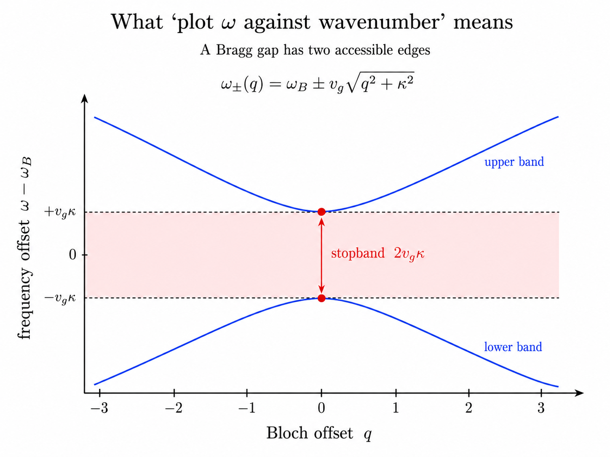

## § 0. The two-mode framework {#sec-0}

The core object of what follows is the eigenvalue problem of a $2 \times 2$ Hermitian matrix whose two nearly equal diagonal entries are linked by a small [coupling](#defn-coupling) — one complex number in an off-diagonal slot, with its conjugate at the mirror slot as Hermiticity requires.

Solving it once produces three quantities used everywhere later:

- **Two eigenvalues.** A hyperbolic separation.
- **Two eigenvectors.** A [mixing angle](#defn-mixing-angle).
- **A minimum eigenvalue separation.** The value attained when the two diagonal entries are made exactly equal.

Each later section reduces to identifying, for one physical setting, *which two amplitudes sit in the vector, what fills the off-diagonal, and which physical process — a spring, a periodic index modulation, a magnetic bias — supplies that filling*.

We develop the algebra on a pair of coupled mechanical oscillators. Two masses joined by a spring is the shortest concrete realization of the matrix; nothing about the derivation is specific to mechanics, and the same object reappears as a dispersion relation in each of the wave settings that follow.

### § 0.1. Coupled mechanical oscillators {#sec-0-1}

Take two masses $m$, one at displacement $x_A$ and one at displacement $x_B$, each pulled back toward its own equilibrium point by a spring of stiffness $k_A$ or $k_B$. In isolation, each mass obeys $m\ddot{x}=-kx$, so a trial motion $x(t)=X\cos(\omega t+\phi)$ gives the natural frequency $\omega=\sqrt{k/m}$. Thus $A$ alone would oscillate at $\omega_A=\sqrt{k_A/m}$ and $B$ alone at $\omega_B=\sqrt{k_B/m}$.

**What changes when the coupling spring is added?**

- **The outer springs still act locally.** Each one pulls its own mass back toward its own equilibrium, so the two natural frequencies $\omega_A,\omega_B$ do not disappear.
- **The middle spring reads both masses at once.** It stretches or compresses according to how far apart the endpoints are at this instant, not according to where either mass sits on its own.

*That single geometric fact — one spring, two endpoints — is what mixes the two motions and produces every subsequent formula in this section.*



**The middle spring measures separation, not position.** Neither displacement alone stretches the middle spring. What stretches it is the *change in distance between its two endpoints*, and that change is $x_B-x_A$: the two individual displacements enter only through their difference. So the middle spring introduces one new coupled variable, $x_B-x_A$, and every appearance of $\kappa$ below is that variable in disguise.

**Derive the extension from the endpoint coordinates.** Let the equilibrium attachment points be $A_0$ and $B_0$. After the masses move, the endpoints are at $A_0+x_A$ and $B_0+x_B$, so the instantaneous spring length is

$$
L=(B_0+x_B)-(A_0+x_A).
$$

Its equilibrium length is $L_0=B_0-A_0$. Therefore

$$
\Delta L=L-L_0=x_B-x_A.
$$

A positive $\Delta L$ means that the spring is stretched; a negative $\Delta L$ means that it is compressed. Hooke's law therefore gives the coupling forces

$$
F_{A,\mathrm{c}}=-\kappa(x_A-x_B),
\qquad
F_{B,\mathrm{c}}=-\kappa(x_B-x_A).
$$

Adding the two outer restoring springs gives

$$
m\ddot{x}_A=-(k_A+\kappa)x_A+\kappa x_B,
\qquad
m\ddot{x}_B=-(k_B+\kappa)x_B+\kappa x_A.
$$

These are coupled equations in the literal sense that each acceleration depends on both displacements.

### § 0.2. The eigenvalue problem {#sec-0-2}

**Ask whether there is a motion in which both masses oscillate at one common frequency.**

$$
x_A(t)=X_A\cos(\omega t),
\qquad
x_B(t)=X_B\cos(\omega t).
$$

**Substitute the common-frequency trial motion.** The two coupled equations of motion become, term by term,

$$
-m\omega^2X_A\cos(\omega t)=-(k_A+\kappa)X_A\cos(\omega t)+\kappa X_B\cos(\omega t),
$$

$$
-m\omega^2X_B\cos(\omega t)=\kappa X_A\cos(\omega t)-(k_B+\kappa)X_B\cos(\omega t).
$$

**Remove the common time dependence.** Two time derivatives on the left contribute the factor $-m\omega^2$, and the common $\cos(\omega t)$ divides out. Moving every term to one side and grouping the coefficients of $X_A$ and $X_B$ leaves a purely algebraic system,

$$
(k_A+\kappa-m\omega^2)X_A-\kappa X_B=0,
\qquad
-\kappa X_A+(k_B+\kappa-m\omega^2)X_B=0,
$$

which is exactly the linear system

$$
\begin{pmatrix}
k_A+\kappa-m\omega^2 & -\kappa\\
-\kappa & k_B+\kappa-m\omega^2
\end{pmatrix}
\begin{pmatrix}
X_A\\X_B
\end{pmatrix}
=0.
$$

**Require a nonzero amplitude vector.** Such a vector exists only when the matrix is singular:

$$
(k_A+\kappa-m\omega^2)(k_B+\kappa-m\omega^2)-\kappa^2=0.
$$

This is a quadratic equation in $\omega^2$, so it has two roots: the two normal-mode frequencies.

> Introduce the **mean**{:#defn-mean} $\bar\omega^2$ and the **detuning**{:#defn-detuning} $\delta$ of the [coupling](#defn-coupling)-loaded diagonal entries — each divided by $m$ so that both have units of frequency squared:
>
> $$
> \bar\omega^2=\frac{(k_A+\kappa)+(k_B+\kappa)}{2m},
> \qquad
> \delta=\frac{(k_A+\kappa)-(k_B+\kappa)}{2m}
>       =\frac{k_A-k_B}{2m}.
> $$

The two quantities now have distinct roles:

- **[Detuning](#defn-detuning) $\delta$** measures the mismatch between the two diagonal frequencies.
- **Coupling scale $\kappa'$** measures the off-diagonal strength that can mix them.

Explicitly,

$$
\kappa'\equiv\frac{\kappa}{m}.
$$

In these coordinates the eigenvalue matrix (after division by $m$) takes the compact form

$$
M-\omega^2 I=
\begin{pmatrix}
\bar\omega^2+\delta-\omega^2 & -\kappa'\\
-\kappa' & \bar\omega^2-\delta-\omega^2
\end{pmatrix},
$$

so the competition is visible directly on the matrix:

- **$\delta$** is the half-difference between the diagonals.
- **$\kappa'$** is the off-diagonal coupling.

The relevant comparison is the dimensionless ratio $|\kappa'/\delta|$, and it distinguishes two regimes:

- **$|\kappa'/\delta|\ll 1$** — the off-diagonal $\kappa'$ is small compared with the diagonal spread $2\delta$. Each eigenvector remains concentrated on one mass, and the coupling produces only a small admixture of the other.
- **$|\kappa'/\delta|\gtrsim 1$** — the off-diagonal is comparable to or larger than the diagonal spread. Neither mass can be treated independently, and the eigenvectors become strong mixtures.

The ratio does not merely say that coupling is present; it says whether the coupling is large enough to overcome the separation of the uncoupled frequencies.

With these variables, the determinant condition becomes

$$
(\omega^2-\bar\omega^2)^2=\delta^2+\kappa'^2,
\tag{1}\label{eq:hyperbola-eigenvalue}
$$

and hence

$$
\boxed{
\omega_\pm^2=\bar\omega^2\pm\sqrt{\delta^2+\kappa'^2}.
}
\tag{2}\label{eq:omega-pm}
$$

### § 0.3. Modes and the mixing angle {#sec-0-3}

A **mode**{:#defn-mode} is a motion in which both masses oscillate at one common frequency with a fixed ratio of their two amplitudes; equivalently, it is an eigenvector of the coefficient matrix together with its eigenvalue $\omega^2$. Every mode picks a single number — the amplitude ratio $X_B/X_A$ — and rides that ratio at fixed frequency forever. Every general motion is a superposition of the two modes.

**Parameterize the amplitude ratio by an angle.** Write a normalized eigenvector as

$$
\mathbf v=
\begin{pmatrix}
\cos\theta\\
\sin\theta
\end{pmatrix}.
$$

Every real unit vector in the plane has this form for some angle $\theta$; the angle $\theta$ *is* the amplitude ratio in disguise, since $\tan\theta=X_B/X_A$. We will call it the **mixing angle**{:#defn-mixing-angle}, and the eigenvalue problem below fixes its two allowed values in terms of $\delta$ and $\kappa'$.

The coefficient matrix, after division by $m$, is

$$
M=
\begin{pmatrix}
\bar\omega^2+\delta & -\kappa'\\
-\kappa' & \bar\omega^2-\delta
\end{pmatrix}.
$$

Imposing $M\mathbf v=\lambda\mathbf v$ gives

$$
(\bar\omega^2+\delta)\cos\theta-\kappa'\sin\theta
=\lambda\cos\theta,
$$

$$
-\kappa'\cos\theta+(\bar\omega^2-\delta)\sin\theta
=\lambda\sin\theta.
$$

For a generic mixed eigenvector, divide the first equation by $\cos\theta$ and the second by $\sin\theta$. Both expressions equal $\lambda$, so

$$
\bar\omega^2+\delta-\kappa'\tan\theta
=
\bar\omega^2-\delta-\kappa'\cot\theta.
$$

The mean term cancels:

$$
2\delta=\kappa'(\tan\theta-\cot\theta).
$$

Using

$$
\tan\theta-\cot\theta=-2\cot(2\theta),
$$

one obtains $\tan(2\theta)=-\kappa'/\delta$. Reversing the sign assigned to one basis vector reverses the sign of $\theta$ without changing the physical mixture. With that convention suppressed, the result is

$$
\boxed{
\begin{gathered}
\text{Dropping the sign for readability,}\\[2pt]
\tan(2\theta)=\dfrac{\kappa'}{\delta}.
\end{gathered}
}
\tag{3}\label{eq:mixing-angle}
$$

This is the **mixing angle**. It has two limiting cases:

- **Large [detuning](#defn-detuning)** ($|\delta|\gg\kappa'$): $\theta\to0$, so each mode is close to one uncoupled oscillator.
- **Exact tuning**{:#defn-tuning} ($\delta=0$): $\theta=\pi/4$, so the two eigenvectors are the equal mixtures $(1,1)/\sqrt2$ and $(1,-1)/\sqrt2$.

At exact [tuning](#defn-tuning), those two combinations can be read directly from the spring motion:



In the **common mode**, $x_A=x_B$ at every instant, so $\Delta L=x_B-x_A=0$: the [coupling](#defn-coupling) spring exerts no force. Its frequency is

$$
\omega_-^2=\frac{k}{m}=\bar\omega^2-\kappa'.
$$

Read the two right-hand sides side by side:

- **Bookkeeping form: $\bar\omega^2-\kappa'$.** The diagonal entry carried the extra $\kappa$ into the matrix.
- **Physical form: $k/m$.** The common mode never stretches the coupling spring, so that extra restoring contribution never acts.

The two forms are equal because subtracting $\kappa'$ removes the *unspent* contribution that had been booked on the diagonal. Nothing was subtracted from a real restoring force; a placeholder was subtracted from a matrix entry.

In the **differential mode**, $x_A=-x_B$. Substituting into the spring geometry,

$$
\Delta L=x_B-x_A=(-x_A)-x_A=-2x_A,
$$

Two consequences follow:

- **Geometric effect.** The middle spring's length changes by *twice* the amplitude of either mass.
- **Restoring-force effect.** The two outer springs contribute $-k x_A$ and $-k x_B$ as usual, while the middle spring adds $-\kappa\cdot(x_B-x_A)$ to each mass in opposite senses. On mass $A$ this becomes $-\kappa(-2x_A)=+2\kappa x_A$ with the sign convention rearranged, giving a total restoring stiffness of $k+2\kappa$ per mass.

The frequency is therefore

$$
\omega_+^2=\frac{k+2\kappa}{m}=\bar\omega^2+\kappa'.
$$

> The same [mixing angle](#defn-mixing-angle) will recur in every $2\times2$ problem below. It measures how much of each uncoupled basis state enters the two coupled eigenmodes.

### § 0.4. The Pauli decomposition of any $2 \times 2$ Hermitian problem {#sec-0-4}

Any $2 \times 2$ Hermitian matrix can be written as a real linear combination of the identity and the three Pauli matrices,

$$H = c_0\, I + c_x \sigma_x + c_y \sigma_y + c_z \sigma_z,$$

$$\sigma_x = \begin{pmatrix} 0 & 1 \\ 1 & 0 \end{pmatrix}, \quad \sigma_y = \begin{pmatrix} 0 & -i \\ i & 0 \end{pmatrix}, \quad \sigma_z = \begin{pmatrix} 1 & 0 \\ 0 & -1 \end{pmatrix}.$$

Each Pauli component has a specific physical meaning that is universal across the problems considered here. *This four-part dictionary is the one to keep in mind throughout the article:*

- **$c_0 I$ (identity).** Uniform frequency shift of both modes together. In the oscillator problem, this is $\bar\omega^2$. Why does it shift both eigenvalues equally: for any vector $\mathbf{v}$, the identity satisfies $I\mathbf{v} = \mathbf{v}$, so $c_0 I$ contributes $+c_0$ to every eigenvalue regardless of which eigenvector one is looking at. It shifts the whole spectrum rigidly and does not open any [gap](#defn-gap). Physically neutral to the interesting dynamics.

- **$c_z \sigma_z$ (diagonal difference).** [detuning](#defn-detuning). This is $\delta$: it pulls the two diagonals apart and, in the absence of any off-diagonal, gives eigenvalues $\bar\omega^2 \pm \delta$ with eigenvectors $(1,0)$ and $(0,1)$. Physically: how far apart the two unperturbed modes sit on the frequency axis.

- **$c_x \sigma_x$ (real symmetric off-diagonal).** The ordinary **coupling**{:#defn-coupling} term. It puts equal real numbers in the two off-diagonal slots and produces the standard hyperbolic anticrossing when combined with $c_z$. The coupled-oscillator spring gives $c_x = -\kappa'$; the periodic-index modulation of [§ 2](#sec-2) will give $c_x \propto \Delta\varepsilon$; any mechanism that couples the two modes symmetrically — spring, capacitive [coupling](#defn-coupling) in an $LC$ pair, index modulation — populates this slot.

- **$c_y \sigma_y$ (antisymmetric imaginary off-diagonal).** A coupling that puts $+i$ in one off-diagonal slot and $-i$ in the other. For a passive classical system with no external bias, this slot is empty. Populating $c_y$ requires a physical mechanism that distinguishes clockwise from counterclockwise circulation in the two-mode space — a static magnetic bias is the standard one, and [§ 3](#sec-3) derives it in detail from the linearized magnetization equation of a biased ferrite. The reason such a bias is required (Onsager's reciprocity constraint) is derived in [§ 3.6](#sec-3-6); here we only note that populating $c_y$ has structural consequences distinct from those of $c_x$.

The eigenvalues of the full Hermitian matrix are

$$\omega_\pm^2 = c_0 \pm \sqrt{c_x^2 + c_y^2 + c_z^2},
\tag{4}\label{eq:pauli-eigenvalues}$$

with $\omega^2$ retained as the eigenvalue variable of equations \eqref{eq:hyperbola-eigenvalue} and \eqref{eq:omega-pm}, since all subsequent physical instances will identify $c_0$ with a mean-frequency-squared and $c_x, c_y, c_z$ with coupling-frequency-squared scales. The gap is

$$\Delta \equiv \omega_+^2 - \omega_-^2 = 2\sqrt{c_x^2 + c_y^2 + c_z^2}.
\tag{5}\label{eq:pauli-gap}$$

**How to read the gap formula.**

- **Detuning and coupling add in quadrature.** $c_z$ and $(c_x,c_y)$ combine through $c_z^2+c_x^2+c_y^2$.
- **Exact [tuning](#defn-tuning) gives the minimum gap.** At $c_z=0$, the gap becomes $2\sqrt{c_x^2+c_y^2}$; increasing $|c_z|$ can only make it larger.
- **Either coupling component can open the gap.** $c_x$ or $c_y$ alone is sufficient, and when both are present they add in quadrature.

Which $c$'s are nonzero in a given physical problem, and by what mechanism, becomes the entire content of every application section below.

### § 0.5. The eigenvalue hyperbola and the definition of gap {#sec-0-5}

Plot the two eigenvalues against [detuning](#defn-detuning) at fixed [coupling](#defn-coupling). From equation \eqref{eq:hyperbola-eigenvalue},

$$
(\omega^2-\bar\omega^2)^2=\delta^2+\kappa'^2.
$$

This is a hyperbola in the $(\delta,\omega^2-\bar\omega^2)$ plane. The two branches are the two mode frequencies, and at $\delta=0$ they are separated by $2\kappa'$.



The vertical separation between the branches is the **gap**{:#defn-gap}.

- **Bandgap** or **stopband** — a frequency interval in which the medium has no propagating solution at real wavenumber. *Bandgap* names the missing interval in the spectrum; *stopband* names the same interval by what the medium does to a wave sent at it from the outside (an **incident wave**) — such a wave at a stopband frequency cannot propagate through the medium and is instead reflected.
- **Avoided crossing** — the same splitting viewed while detuning is swept. Without coupling, the two uncoupled branches cross at $\delta=0$; with coupling, the eigenvalues remain separated there.

These names emphasize different plots or experiments, but the underlying operation is the same eigenvalue splitting.

### § 0.6. Reading the hyperbola: propagation, evanescence, and the mass-like term {#sec-0-6}

There are two complementary ways to read the same coupled problem:

- **Eigenvalue view.** Plot frequency against [detuning](#defn-detuning) at fixed [coupling](#defn-coupling).
- **Dispersion view.** At a chosen driving frequency, ask *what spatial wavenumber does the medium support?*

The later wave problems — beginning with [the scalar-wave-equation refresher](#picture-3-scalar-wave-equation) and [the Bloch-theorem refresher](#picture-3-bloch-theorem) beneath [Picture 3](#picture-3), and continuing through [Bragg Mirrors, Laser Cavities, and Engineered Gratings](/posts/bragg-mirrors-and-lasers/) — require the second view. Near the coupled-mode crossing, the answer takes the form

$$
\boxed{
q^2=\delta^2-\kappa^2.
}
\tag{6}\label{eq:hyperbola-q}
$$

Two details matter when reading it:

- **Keep the sign of $q$** to display the two propagation directions. Plotting $q^2$ folds those directions together, so the same relation appears with a different visible geometry.
- **Interpret $q$ according to the problem.** It may be a spatial wavenumber inside a Bragg grating ([§ 2](#sec-2)), a plane-wave $k_z$ in a waveguide ([§ 4](#sec-4)), or a plasma wavenumber ([§ 4](#sec-4)); the mathematical reading is universal.

**Why normalize by $\kappa$?** It is the *only* intrinsic scale left once units are stripped. Dividing both axes by it produces one dimensionless hyperbola for every realization — Bragg grating, waveguide, or plasma:

- the [gap](#defn-gap) edges always sit at $\delta/\kappa=\pm1$;
- the propagating branch always has the same shape;
- a specific problem merely chooses its value of $\kappa$ and stretches the axes accordingly.



**Outside the gap ($|\delta|>\kappa$).** Here $q^2>0$, so $q$ is real and the field propagates. Far from the gap, $q\approx|\delta|$ and the coupling produces only a small correction. Approaching the band edge from outside, $q\to0$ and the group velocity tends to zero ([§ 0.7](#sec-0-7)).

**Inside the gap ($|\delta|<\kappa$).** Here $q^2<0$. Write

$$
q=i\alpha,
\qquad
\alpha=\sqrt{\kappa^2-\delta^2}.
$$

Then the spatial factor $e^{iqz}$ contains the decaying solution $e^{-\alpha z}$ rather than a propagating phase. The amplitude decay length is $1/\alpha$. At the center of the gap, $\delta=0$, this becomes

$$
L_B=\frac{1}{\kappa},
$$

the **Bragg length**. The [finite-mirror boundary-value problem](/posts/bragg-mirrors-and-lasers/#sec-2-2) — how much of the incident amplitude a grating of length $L$ reflects — is taken up in [Bragg Mirrors, Laser Cavities, and Engineered Gratings](/posts/bragg-mirrors-and-lasers/).

**At the gap edge ($\delta=\pm\kappa$).** Here $q=0$. The forward and backward waves combine into a standing wave, and the group velocity vanishes. The threshold structure of \eqref{eq:hyperbola-q} — a hyperbolic curve in $(q,\delta)$ separating a propagating branch from an evanescent one, with the gap edge acting as a mass-like term — appears identically in the waveguide, plasma, and Klein–Gordon problems. [§ 4](#sec-4) treats it in the Bragg setting and points to [Cutoff phenomena](/posts/cutoff-phenomena/) for the other three cases.

### § 0.7. Group velocity: the slope of the dispersion curve {#sec-0-7}

The two views now meet:

- **Eigenvalue view:** fix the parameters and solve for the allowed eigenvalues.
- **Dispersion view:** fix $\omega$ and obtain $q(\omega)$ from \eqref{eq:hyperbola-q}.

The slope of the dispersion curve is a physical velocity: the speed at which a localized superposition of nearby-frequency plane waves advances along $z$, in the sense of the envelope-versus-crest distinction developed in [§ 2 of *Justification of the de Broglie relation*](/posts/justification-of-the-de-broglie-relation/). In this document that superposition is the physically launched wave — a pulse of Bragg light in [§ 2](#sec-2), or a beam approaching cutoff in [§ 4](#sec-4). Its speed is the **group velocity**

$$v_g \equiv \frac{d\omega}{dq}.$$

The derivation has two steps:

1. **Relate detuning to frequency.** In every setting used here, $\delta$ is linear in $\omega$. For the Bragg problem, \eqref{eq:delta-bragg} gives $\delta=k-k_B$ with $k=\omega\sqrt{\bar\varepsilon}/c$, so $d\delta=(\sqrt{\bar\varepsilon}/c)\,d\omega$. Absorbing this constant slope into units — so the *reduced* group velocity is measured relative to the wave speed in the average medium — gives $d\delta=d\omega$.
2. **Differentiate the hyperbola.** Holding $\kappa$ fixed in equation \eqref{eq:hyperbola-q}, $q^2=\delta^2-\kappa^2$, produces

$$v_g = \frac{d\delta}{dq} = \frac{q}{\delta}.$$

Reading this:

- **Far outside the [gap](#defn-gap)** ($|\delta| \gg \kappa$): $q \approx |\delta|$, so the reduced $v_g \approx 1$; the physical group velocity approaches the wave speed in the average medium — for a light wave in a dielectric that is $c/n_{\text{avg}}$, for a wave on a string it is $\sqrt{T/\mu}$, and so on. The dispersion-relation examples worked out in [§ 2](/posts/justification-of-the-de-broglie-relation/#sec-2) of [Justification of the de Broglie relation](/posts/justification-of-the-de-broglie-relation/) give the mapping in each case.

- **Approaching the gap edge from outside** ($|\delta| \to \kappa^+$): $q \to 0$, so $v_g \to 0$. The energy transport speed vanishes at the band edge; a pulse whose central frequency sits at the edge advances arbitrarily slowly. This is the same collapse of $v_g$ that appears at every cutoff, worked through in [§ 6](/posts/cutoff-phenomena/#sec-6) of [Cutoff phenomena](/posts/cutoff-phenomena/#sec-6).

- **Inside the gap.** $q$ is imaginary, so a real $v_g$ does not exist; the field does not propagate, it decays.

**The next derivative measures pulse distortion.** The rate at which the slope itself changes — the **group velocity dispersion** or **GVD** — is

$$\text{GVD} \equiv \frac{d^2 q}{d\omega^2} \propto \frac{d}{d\delta}\left(\frac{1}{v_g}\right),$$

diverges at the gap edge for the same reason $v_g$ vanishes there: the hyperbola has vertical tangent. A pulse of finite frequency width near the band edge acquires frequency-dependent phase across its width and stretches in time. [Bragg Mirrors, Laser Cavities, and Engineered Gratings](/posts/bragg-mirrors-and-lasers/#sec-3-2) uses this effect in a chirped Bragg grating.

### § 0.8. What follows {#sec-0-8}

The universal machinery is now in place. The wave setting begins in [§ 1](#sec-1):

- **[Picture 1](#picture-1) and [Picture 2](#picture-2).** Derive the Bragg condition geometrically.
- **[Picture 3](#picture-3).** Combines two background results kept directly beneath it as collapsible refreshers: [the scalar wave equation for an inhomogeneous medium](#picture-3-scalar-wave-equation) and [Bloch's theorem for a periodic medium](#picture-3-bloch-theorem).
- **[§ 2](#sec-2).** Uses those results to show that the small-modulation limit of Bragg scattering is literally the $2 \times 2$ of [§ 0](#sec-0), with $c_x \propto \Delta\varepsilon$, $c_z = k - k_{\text{Bragg}}$, and $c_y = 0$.
- **[§ 3](#sec-3).** Does the same identification for a magnetically biased ferrite, producing $c_y \neq 0$ as the Polder tensor.
- **[§ 4](#sec-4).** Collects the "one edge of the [gap](#defn-gap)" reading of [§ 0.6](#sec-0-6) into a unified section on waveguide, plasma, Klein–Gordon, and band-edge cutoffs.
- **[§ 5](#sec-5).** Develops the transfer-matrix formalism as the algorithmic dual to coupled-mode theory.

Two further pieces apply what the framework establishes:

- **[Bragg Mirrors, Laser Cavities, and Engineered Gratings](/posts/bragg-mirrors-and-lasers/).** Takes the coupled-mode identification of [§ 2](#sec-2) to the band edges — standing waves, penetration depth, and Bragg length — and applies those readings to DBR mirrors, distributed-feedback lasers, and gratings shaped in amplitude or period.
- **[Optical Isolators and Y-Junction Circulators](/posts/isolators-and-circulators/).** Uses the $\sigma_y$ realization of [§ 3](#sec-3) to build the two devices that non-reciprocity makes possible.

## § 1. Background: the Bragg condition {#sec-1}

The next section, [§ 2](#sec-2), is the point at which the two-mode framework of [§ 0](#sec-0) lands on a periodic dielectric and becomes coupled-mode theory: the main route of the article. This section prepares the ground for that identification by deriving the geometric condition — *for what direction of propagation and what wavelength does a specific [gap](#defn-gap) open?* — from three complementary starting points that all reduce to the same relation.

### Picture 1: classical path-difference {#picture-1}

Consider a periodic stack of parallel scattering planes separated by distance $\Lambda$ (perpendicular to the planes). A **monochromatic** wave — one containing only a single frequency, hence a single wavelength $\lambda$ inside the medium — is incident at angle $\theta$ measured from the planes (the traditional Bragg convention; note that this is the angle between the ray and the planes, not the plane normal).

Two waves reflect off two adjacent planes; the wave that penetrates one plane spacing before reflecting travels an extra path of $2\Lambda\sin\theta$ (each in-going leg contributes $\Lambda\sin\theta$). For the two reflections to interfere constructively at the detector, the extra path must equal an integer number of wavelengths:

$$m\lambda_{\text{medium}} = 2\Lambda\sin\theta, \qquad m = 1, 2, 3, \ldots
\tag{7}\label{eq:bragg-condition}$$

Expressing in the vacuum wavelength $\lambda_0 = n_{\text{avg}}\lambda_{\text{medium}}$:

$$m\lambda_0 = 2 n_{\text{avg}} \Lambda \sin\theta.$$



The integer $m$ is the **order** of diffraction. The formula is intuitive but has two limitations:

1. **It assumes discrete reflecting planes.** A real continuous modulation $\varepsilon(z)$ has no planes to bounce off, and something else must take their place. [Picture 3](#picture-3) replaces the planes with Fourier coefficients $\varepsilon_m$: each spatial harmonic of the modulation acts as one "plane" in the sense that its amplitude sets the strength of the $m$-th reflection.
2. **It gives a resonant angle, but no resonance width.** The reader who asks "how far off resonance can a wave be and still reflect?" gets no answer. [Picture 3](#picture-3) supplies this too, because the master equation that replaces $m\lambda = 2n_{\text{avg}}\Lambda\sin\theta$ is a matrix equation whose off-diagonal entries $\varepsilon_m$ produce a *range* of $k$ over which the two near-degenerate rows couple strongly; [§ 2](#sec-2) identifies that range as the stopband and computes its width.

### Picture 2: elastic scattering with reciprocal-lattice momentum {#picture-2}

Two conservation statements must be separated:

- **Frequency is conserved.** For a monochromatic wave, the average-medium dispersion relation fixes $|\mathbf{k}|=\omega\sqrt{\bar\varepsilon}/c\equiv k$. The scattering is **elastic** when $|\mathbf{k}_{\text{out}}|=|\mathbf{k}_{\text{in}}|$, so the wavelength is preserved. This follows from the medium being time-independent: $\varepsilon(\mathbf r)$ has no time dependence, the wave equation is invariant under time translations, and every mode keeps the same frequency.
- **Momentum is conserved only modulo the lattice.** Continuous translation symmetry is broken; the medium is invariant only under the *discrete* translations $z\to z+\Lambda$. The residue of that symmetry is conservation modulo the reciprocal-lattice vector

$$\mathbf{G}_m = m\, \mathbf{G}_1, \qquad |\mathbf{G}_1| = \frac{2\pi}{\Lambda}, \quad m \in \mathbb{Z},$$

giving the momentum-conservation rule

$$\mathbf{k}_{\text{out}} = \mathbf{k}_{\text{in}} + \mathbf{G}_m.$$

Combined with elasticity $|\mathbf{k}_{\text{out}}| = |\mathbf{k}_{\text{in}}| = k$, this fixes the two vectors on an isosceles triangle of side $k$ and one side of length $|m G_1|$. Geometry gives

$$m G_1 = 2 k \sin\theta \implies m\lambda_0 = 2 n_{\text{avg}} \Lambda \sin\theta,$$

the same formula as [Picture 1](#picture-1).



### Picture 3: Fourier convolution and the master equation {#picture-3}

This picture assembles [the scalar wave equation for an inhomogeneous medium](#picture-3-scalar-wave-equation) and [Bloch's theorem for a periodic medium](#picture-3-bloch-theorem) into a single algebraic object — an infinite matrix — whose diagonal entries and off-diagonals directly display the Bragg condition. Both background derivations are kept directly below as collapsible refreshers; everything after them uses their results.

The later wave sections specialize the framework of [§ 0](#sec-0) to a spatial wave problem: a wave propagating through a medium whose permittivity varies with position. This refresher derives the equation the wave obeys.

Start with the two curl equations of Maxwell in a linear, isotropic, source-free medium:

$$\nabla \times \mathbf{E} = -\partial_t \mathbf{B}, \qquad \nabla \times \mathbf{H} = \partial_t \mathbf{D}.$$

**Material assumption: nonmagnetic response.** We take $\mathbf B=\mu_0\mathbf H$. This covers the glasses, semiconductors, and transparent dielectrics used in [the Bloch-theorem refresher](#picture-3-bloch-theorem), [§ 1](#sec-1)–[§ 4](#sec-4), and [Bragg Mirrors, Laser Cavities, and Engineered Gratings](/posts/bragg-mirrors-and-lasers/).

The physical reason is that atomic magnetic moments cannot follow an electromagnetic field at $10^{14}$ Hz — the same inertial cutoff that reappears in [§ 3](#sec-3) when ferromagnetic resonance dies at optical frequencies. **[§ 3](#sec-3) is the one section in which $\mu\neq\mu_0$ matters.**

Take the curl of Faraday's law, substitute Ampère's law, and use $\mathbf{D} = \varepsilon_0 \varepsilon(\mathbf{r}) \mathbf{E}$:

$$\nabla \times (\nabla \times \mathbf{E}) = -\mu_0 \partial_t (\nabla \times \mathbf{H}) = -\mu_0 \varepsilon_0 \varepsilon\, \partial_t^2 \mathbf{E}.$$

For a time-harmonic field $\mathbf{E}(\mathbf{r}, t) = \mathbf{E}(\mathbf{r})\, e^{-i\omega t}$, the double time derivative gives $-\omega^2$. The curl-of-curl identity is

$$\nabla \times (\nabla \times \mathbf{E}) = \nabla(\nabla \cdot \mathbf{E}) - \nabla^2 \mathbf{E}.$$

**The approximation is not automatic.** The term $\nabla(\nabla\cdot\mathbf E)$ vanishes in a homogeneous medium, because Gauss's law $\nabla\cdot\mathbf D=0$ and constant $\varepsilon$ imply $\nabla\cdot\mathbf E=0$. For spatially varying $\varepsilon(\mathbf r)$, polarization-charge gradients generally create a nonzero longitudinal field component.

We therefore restrict to two cases in which the term may legitimately be dropped:

- propagation transverse to a medium varying only along $z$, with polarization perpendicular to $\nabla\varepsilon$;
- normal incidence onto a 1D layered stack.

Under these conditions the equation reduces to a **scalar Helmholtz equation** — *Helmholtz* because the frequency is fixed, *scalar* because one field component has been selected, and *source-free* because there are no charges or currents:

$$\frac{d^2 E(z)}{dz^2} + \frac{\omega^2}{c^2}\, \varepsilon(z)\, E(z) = 0, \qquad c^2 \equiv \frac{1}{\mu_0 \varepsilon_0}.$$

This is the equation that governs [the Bloch-theorem refresher](#picture-3-bloch-theorem) and [§ 1](#sec-1)–[§ 7](#sec-7).

**The physical content of $\varepsilon(z)$.** Matter is composed of positive nuclei and negative electron clouds; an electric field displaces the clouds relative to the nuclei by a small distance, producing induced electric dipoles. Each atom carries a tiny dipole moment $\mathbf{p}_{\text{atom}}$ pointing from displaced negative center to fixed positive center.

Aggregate over many atoms per unit volume, and define the **polarization density**

$$\mathbf{P}(\mathbf{r}) \equiv \text{net dipole moment per unit volume at } \mathbf{r}.$$

For a linear, isotropic medium the response is linear in the field:

$$\mathbf{P} = \varepsilon_0 \chi \mathbf{E},$$

which defines the **electric susceptibility** $\chi$. The displacement field is then the sum of the vacuum contribution and the material's polarization:

$$\mathbf{D} \;\equiv\; \varepsilon_0 \mathbf{E} + \mathbf{P} \;=\; \varepsilon_0 (1 + \chi) \mathbf{E} \;\equiv\; \varepsilon_0 \varepsilon\, \mathbf{E}, \qquad \varepsilon \equiv 1 + \chi.$$

So permittivity is *one plus the material's electric response*. Typical scales make the meaning concrete:

- **Gases:** $\chi$ is close to zero.
- **Glasses:** $\chi\sim1.4$.
- **Semiconductors:** $\chi\sim10$.
- **Metals:** $\chi$ is complex and can be enormous.

Later mentions of **modulation $\Delta\varepsilon$** refer literally to a spatial variation of this atomic-scale polarizability.

**Refractive index and complex response.** The **refractive index** is $n(\mathbf{r}) = \sqrt{\varepsilon(\mathbf{r})}$. For a plane wave $E \propto e^{ikz}$ in a homogeneous medium, the Helmholtz equation gives $k = n\omega/c$, so the phase velocity is $c/n$: a wave slows by the factor $n$ inside a dense dielectric.

When the medium absorbs or amplifies, $\varepsilon$ acquires an imaginary part; the causal link between its real and imaginary parts (the Kramers–Kronig relations) is derived in [Bragg Mirrors, Laser Cavities, and Engineered Gratings](/posts/bragg-mirrors-and-lasers/#sec-2-3-1), where it directly constrains index-coupled and gain-coupled DFB design.

Specialize now to a medium whose permittivity is periodic in space with period $\Lambda$: $\varepsilon(z + \Lambda) = \varepsilon(z)$. The wave equation from [the scalar-wave-equation refresher](#picture-3-scalar-wave-equation) becomes

$$\mathcal{L}\, E(z) \equiv \left(\frac{d^2}{dz^2} + \frac{\omega^2}{c^2} \varepsilon(z)\right) E(z) = 0,$$

with the crucial feature that the differential operator $\mathcal{L}$ commutes with the translation operator $T_\Lambda$ defined by $(T_\Lambda f)(z) = f(z + \Lambda)$. This refresher derives the consequence — every solution decomposes into Bloch waves, indexed by a wavevector defined modulo the reciprocal-lattice vector $G = 2\pi/\Lambda$.

**Bloch waves and the translation operator.** Look for solutions on which $T_\Lambda$ acts by a scalar: $\psi(z + \Lambda) = \lambda\, \psi(z)$. For the solution to be bounded on the whole real line, $|\lambda| = 1$ (iterating $T_\Lambda^N$ multiplies by $\lambda^N$; anything with $|\lambda| \neq 1$ diverges at one end). Write $\lambda = e^{ik\Lambda}$ with $k$ real (any complex number of modulus 1 has this form for some real phase; $k$ carries units of inverse length).

The functional equation $\psi(z + \Lambda) = e^{ik\Lambda}\psi(z)$ has solutions of the form

$$\psi(z) = e^{ikz}\, u(z), \qquad u(z + \Lambda) = u(z).$$

Justification: factor $e^{ikz}$ out of any candidate $\psi$ by defining $u(z) \equiv e^{-ikz}\psi(z)$; the shift condition $\psi(z+\Lambda) = e^{ik\Lambda}\psi(z)$ then translates to $u(z+\Lambda) = u(z)$, no more and no less. So every eigenfunction of $T_\Lambda$ with eigenvalue $e^{ik\Lambda}$ is a plane wave times a periodic function; conversely, every such object is an eigenfunction.

The parameter $k$ is called the **Bloch wavenumber** or **crystal momentum**; the function $u(z)$ is the **Bloch amplitude**.

**Completeness of Bloch solutions.** The claim is that every solution of $\mathcal L E=0$ is a linear combination of at most two Bloch waves whenever $\varepsilon(z+\Lambda)=\varepsilon(z)$.

*Why this is nontrivial:* periodicity must make $\mathcal L$ and $T_\Lambda$ act consistently on the same two-dimensional solution space. The proof has three linked steps.

**Step 1 — the solution space is two-dimensional.** For a linear second-order ODE, specifying the initial values $E(0)$ and $E'(0)$ uniquely determines $E(z)$ everywhere (existence and uniqueness for linear ODEs). Solutions form a two-dimensional vector space, parameterized by these two initial values — the same two-dimensional space in which the transfer matrix $T$ of [§ 5](#sec-5) will act.

**Step 2 — commuting operators send solutions to solutions.** Because $\varepsilon(z)$ is periodic, $\mathcal{L}$ and $T_\Lambda$ commute: shifting a periodic-coefficient ODE by one period gives an ODE with the *same* coefficients. Applying $T_\Lambda$ to a solution $E$ of $\mathcal{L}\, E = 0$ then gives another solution:

$$\mathcal{L}(T_\Lambda E) = T_\Lambda(\mathcal{L} E) = T_\Lambda(0) = 0.$$

So $T_\Lambda$ maps the solution space into itself.

The linear-algebra step is:

> **Commuting matrices can be simultaneously diagonalized.** If $A$ and $B$ commute, one can choose a basis of common eigenvectors.

Apply that statement here:

1. Restrict $T_\Lambda$ to the two-dimensional solution space from [Step 1](#picture-3-step-1).
2. Use the commutation established in [Step 2](#picture-3-step-2).
3. Diagonalize the resulting $2\times2$ matrix.

Each eigenvector is then simultaneously a solution of the wave equation and a Bloch eigenvector of $T_\Lambda$. *That is the concrete meaning of “diagonalize $T_\Lambda$ within the solution space.”*

One more structural fact is useful: **$T_\Lambda$ is unitary.** It merely relabels $z\to z+\Lambda$, so it preserves the norm of the function it acts on. Therefore:

- **Its eigenvalues lie on the unit circle:** $|\lambda|=1$.
- **Eigenvectors at distinct eigenvalues are orthogonal:** the two corresponding Bloch waves are orthogonal.

The first conclusion reproduces the earlier boundedness argument by a cleaner algebraic route.

**Step 3 — two eigenvalues.** Any $2 \times 2$ matrix has two eigenvalues (over $\mathbb{C}$). For a lossless medium, the argument of the previous subsection fixes $|\lambda| = 1$ on both. In general, both roots satisfy $\lambda_1 \lambda_2 = \det T_\Lambda$; [§ 5](#sec-5) will show $\det T_\Lambda = 1$ from a conservation law. Together these imply that in a lossless medium either both eigenvalues have $|\lambda| = 1$ (a **band**), or they are real reciprocals with $\lambda_2 = 1/\lambda_1$ (a **gap**, where one solution grows exponentially with $z$ and the other decays).

Each eigenvalue produces one Bloch-form solution, and their linear combinations span the whole two-dimensional solution space. When both eigenvalues coincide at $\pm 1$, the two eigenvectors merge; this happens exactly at the top and bottom of each stopband and corresponds to the standing waves worked out in [Bragg Mirrors, Laser Cavities, and Engineered Gratings](/posts/bragg-mirrors-and-lasers/#sec-1-1). That coincidence is the special "double root" case where $\text{tr}(T_\Lambda) = \pm 2$ with $\det = 1$.

**Reciprocal-lattice equivalence.** Because $u(z)$ is periodic, expand it in a Fourier series:

$$u(z) = \sum_{n \in \mathbb{Z}} u_n\, e^{i n G z}, \qquad G \equiv 2\pi/\Lambda.$$

Then

$$\psi(z) = e^{ikz} u(z) = \sum_n u_n\, e^{i(k + nG) z}.$$

The Bloch wave at $k$ is therefore a superposition of plane waves at every $k+nG$. The cleanest interpretation is **aliasing**:

- **Same footprint on the lattice.** At $z=m\Lambda$, the factor distinguishing $k+nG$ from $k$ is $e^{inGm\Lambda}=e^{inm2\pi}=1$.
- **Same Bloch state, different label.** Since $e^{i(k+G)z}u(z)=e^{ikz}[e^{iGz}u(z)]$ and the bracketed factor is still $\Lambda$-periodic, the labels $k$ and $k+G$ describe the same Bloch wave.
- **Therefore $k$ is defined modulo $G$.** Its natural domain is the **first Brillouin zone**, $k\in(-\pi/\Lambda,\pi/\Lambda]$, or conventionally $[0,G)$.

In dispersion plots, the free-space curve $\omega=ck$ is consequently **folded** back into the first zone at $k=\pm\pi/\Lambda$. That folding is the geometric mechanism at which gaps later open.

**Band structure and the group velocity.** For each $k$ in the Brillouin zone, the eigenvalue problem has a discrete set of allowed frequencies $\{\omega_n(k)\}$ indexed by a **band number** $n = 0, 1, 2, \ldots$ — sweep $k$, and each $n$ traces a curve $\omega_n(k)$ called a **band curve**; the collection is the **band structure**.

For a homogeneous medium ($\varepsilon = \text{const}$), the band curves are straight lines $\omega = \pm ck/\sqrt{\varepsilon}$ folded into the Brillouin zone (they are called "folded" because the reciprocal-lattice equivalence forces $k$ into the first zone). For a periodic medium, the curves bend near the Brillouin-zone edge, and gaps open where no real $k$ gives a real $\omega$: this is the non-propagating regime of equation \eqref{eq:hyperbola-q} appearing in its wave-mechanical guise.

The group velocity of a localized wave centered at $k$ is $v_g = d\omega_n/dk$, whose interpretation was fixed once in [§ 0.7](#sec-0-7): nonzero and near the material speed far from the [gap](#defn-gap), vanishing at the band edges, imaginary inside the gap. Every subsequent reference to $v_g$ in the following sections refers back to that formula and its reading.

Bloch's theorem tells us that any solution of the wave equation in a periodic medium has the form $E(z) = e^{ikz} u(z)$ with $u(z)$ periodic under $z\to z+\Lambda$. Fourier-expand $u$ on the unit cell,

$$u(z)=\sum_{n\in\mathbb Z}E_n\,e^{inG_1 z},\qquad G_1=2\pi/\Lambda,$$

and multiply through by $e^{ikz}$ to recover $E(z)$:

$$E(z) = \sum_{n \in \mathbb{Z}} E_n\, e^{i(k+nG_1) z}.$$

The wavenumber $k+nG_1$ appears because it is what the exponent becomes after the $e^{ikz}$ prefactor absorbs the $e^{inG_1z}$ from the Fourier series — each Fourier component of the periodic amplitude $u$ acquires the same $k$ from the Bloch factor, so the plane-wave label of coefficient $E_n$ is $k+nG_1$. The index $n$ labels which reciprocal-lattice shift of $k$ this component sits at, in the sense of the folding argument of [the Bloch-theorem refresher](#picture-3-bloch-theorem). Similarly, the modulation is periodic and expands as

$$\varepsilon(z) = \sum_m \varepsilon_m\, e^{i m G_1 z},$$

with $\varepsilon_0 = \bar\varepsilon$ the average and $\varepsilon_m$ for $m \neq 0$ the strengths of the higher spatial harmonics.

Substitute into the Helmholtz equation $E'' + (\omega/c)^2 \varepsilon(z) E = 0$. The second derivative brings down $-(k+nG_1)^2$ on each Fourier component of $E$; the product $\varepsilon(z) E(z)$ is a convolution in Fourier space (the Fourier coefficient of a product is the convolution of the Fourier coefficients), so

$$\varepsilon(z) E(z) = \sum_n \left(\sum_p \varepsilon_p E_{n-p}\right) e^{i(k+nG_1)z}.$$

Matching coefficients of $e^{i(k+nG_1)z}$ on both sides of the wave equation gives, for each $n$,

$$\left[(k+nG_1)^2 - \frac{\omega^2}{c^2}\bar\varepsilon\right] E_n \;=\; \frac{\omega^2}{c^2} \sum_{m \neq 0} \varepsilon_m\, E_{n-m}.$$

This is the **master equation**: an infinite system of linear equations [coupling](#defn-coupling) the $E_n$'s to one another through the Fourier coefficients of the modulation.

Written as an infinite matrix, with rows and columns indexed by $n$, the left side puts the discrepancies $D_n \equiv (k+nG_1)^2 - (\omega/c)^2\bar\varepsilon$ on the diagonal (measuring how far the wavenumber $k + nG_1$ of that row is from what the dispersion relation would allow in the average medium at frequency $\omega$), and the right side puts the modulation-coupling entries $\varepsilon_{n-n'}$ (times $(\omega/c)^2$) in the off-diagonals:

$$\begin{pmatrix}
\ddots & \vdots       & \vdots       & \vdots      \\
\cdots & D_{-1}       & \varepsilon_1 & \varepsilon_2 & \cdots \\
\cdots & \varepsilon_1 & D_{0}        & \varepsilon_1 & \cdots \\
\cdots & \varepsilon_2 & \varepsilon_1 & D_{+1}      & \cdots \\
       & \vdots       & \vdots       & \vdots      & \ddots
\end{pmatrix} \begin{pmatrix} \vdots \\ E_{-1} \\ E_{0} \\ E_{+1} \\ \vdots \end{pmatrix} = 0.$$

The matrix has a direct physical reading:

- **Diagonal $D_n$.** Measures how far Fourier mode $n$ is from satisfying the average-medium plane-wave dispersion relation at the driving frequency $\omega$.
- **Off-diagonal $\varepsilon_p$.** Couples mode $n$ to mode $n-p$ and transfers the wavenumber shift $pG_1$ supplied by the modulation.

This is the $2\times2$ structure of [§ 0](#sec-0), extended to infinitely many modes and populated by one mechanism: periodic index modulation.

**The Bragg condition is the resonance condition of this matrix.** It is the value of $k$ at which two diagonals $D_n$ vanish simultaneously, making the corresponding modes both satisfy the average-medium dispersion relation while their off-diagonal coupling dominates. [§ 2](#sec-2) makes this quantitative by retaining only those two near-resonant modes.

### Same object, three pictures {#same-object-three-pictures}

The three pictures agree because the underlying object is the same: the Fourier decomposition of $\varepsilon(z)$. [Picture 1](#picture-1) treats the modulation as discrete planes (a Fourier series with all $m$); [Picture 2](#picture-2) labels the reciprocal-lattice vectors by $m$; [Picture 3](#picture-3) works directly with the Fourier coefficients $\varepsilon_m$. Each picture makes a different question easy:

- **[Picture 1](#picture-1) (path difference)** — *what geometry?* the angle where the constructive-interference condition is met for a given $m$.
- **[Picture 2](#picture-2) (momentum conservation)** — *why integer $m$?* $m$ labels which reciprocal-lattice vector is invoked.
- **[Picture 3](#picture-3) (Fourier convolution)** — *how strong?* the amplitude of the $m$-th order is set by $\varepsilon_m$, the $m$-th Fourier coefficient of the modulation profile.

The pattern of nonzero $\varepsilon_m$ is called the **structure factor** of the modulation.

The angle at which order $m$ diffracts is fixed by the geometric condition $m\lambda_0 = 2 n_{\text{avg}}\Lambda\sin\theta$ from [Picture 1](#picture-1) and [Picture 2](#picture-2): it involves the period $\Lambda$ and the order $m$, but not the shape of $\varepsilon(z)$ within one period. What the shape controls — through $\varepsilon_m$ — is whether that geometric resonance actually couples the incident wave to the reflected wave, and if so how strongly. If $\varepsilon_m = 0$ for some order, then [Picture 3](#picture-3) shows that the coupling term $(\omega/c)^2\varepsilon_m E_{n-m}$ vanishes for that order and the reflection at that angle is zero even though the geometry is satisfied. Two examples make the role of the structure factor concrete:

- **Purely sinusoidal modulation.** For $\varepsilon(z) = \bar\varepsilon + \varepsilon_1\cos(G_1 z)$, only $\varepsilon_{\pm 1}$ are nonzero and only the first-order reflection exists.
- **Square-wave modulation.** For a square-wave modulation (as in a real [distributed Bragg reflector](/posts/bragg-mirrors-and-lasers/#sec-1)), $\varepsilon_m \propto 1/m$ for odd $m$ and vanishes for even $m$, so odd orders reflect and even orders do not.

### When Bragg cannot work: two ways to fail {#bragg-failure-modes}

Bragg reflection into a specific direction requires two conditions simultaneously:

1. **The geometry must be available.** $m\lambda = 2n_{\text{avg}}\Lambda\sin\theta$ must hold for some integer $m$.
2. **The corresponding spatial harmonic must exist.** The coefficient $\varepsilon_m$ must be nonzero.

**The process of interest is exact back-reflection:** the incident wave is sent straight back along its own path, because that is the process retained by the two-mode analysis of [§ 2](#sec-2).

In the convention of [Picture 1](#picture-1), $\theta$ is measured from the planes. Therefore:

- $\theta=90°$ means propagation perpendicular to the layers;
- back-reflection returns the wave along that same normal.

That is the meaning of $\theta=90°$ in every formula below.

Set the geometry with $\sin\theta = 1$: the Bragg condition becomes $m\lambda_{\text{medium}} = 2\Lambda$, or $m = 2\Lambda/\lambda_{\text{medium}}$. When the wavelength is much larger than the period, this ratio is much less than one — no positive integer $m$ satisfies the geometry, and there is no back-reflection at any angle for the average-medium wave. This is already the whole story at the level of [Picture 1](#picture-1). But the master equation of [Picture 3](#picture-3) lets us ask a sharper question: what would go wrong if we replaced the modulation with one whose period were $m$ times shorter, so that a large-$m$ order of the original problem became a first-order reflection of the new one? Two independent effects would still remove the reflection. Understanding them both is what separates the wavelength range in which [§ 2](#sec-2) applies from the wavelength range in which the modulation is invisible to the wave.

**Concrete scale.** Take $\lambda_0=500\,\text{nm}$ and atomic-plane spacing $a\approx0.3\,\text{nm}$. Then

$$m\equiv\frac{\lambda_0}{2n_{\text{avg}}a}\approx833,$$

which may be read as the number of atomic planes contained in one round-trip half-wavelength. Two independent effects then drive the reflection to zero:

1. finite motion of the planes;
2. cancellation caused by the dense layer spacing itself.

**Failure 1 — the planes are not stationary.**

- **Idealized assumption:** each plane sits at the fixed position $z_j=j\Lambda$.
- **Physical reality:** at every temperature — even absolute zero, because zero-point motion persists — the plane fluctuates around that position.
- **Consequence:** the reflections acquire random phase offsets, degrading the constructive sum.

Write the actual position as $z_j+\Delta_j$, with independent offsets satisfying $\langle\Delta_j\rangle=0$ and $\langle\Delta_j^2\rangle=u^2$. Here $u$ is the typical displacement, concretely its standard deviation; for atomic crystals at room temperature it is of order $0.01\,\text{nm}$.

The wave scattered off plane $j$ carries a phase factor $e^{i m G_1 (z_j + \Delta_j)}$; the $z_j$ part is the constructive Bragg phase and the $\Delta_j$ part is the noise. The scattered amplitude summed over $N$ planes is

$$A \propto \sum_j e^{i m G_1 z_j}\, e^{i m G_1 \Delta_j}.$$

The observed intensity is

$$|A|^2 = \sum_{j,\ell} e^{i m G_1(z_j - z_\ell)} \left\langle e^{i m G_1(\Delta_j - \Delta_\ell)}\right\rangle,$$

where the angle brackets denote the ensemble average over fluctuations. For independent Gaussian offsets with mean zero and variance $u^2$:

- **Single-plane average:** $\langle e^{imG_1\Delta_j}\rangle=e^{-\frac12m^2G_1^2u^2}$.
- **Cross-terms $j\neq\ell$:** two independent averages give $e^{-m^2G_1^2u^2}$.
- **Diagonal terms $j=\ell$:** the factor is $1$, so they contribute incoherently.

Splitting the sum,

$$|A|^2 = N + \big|\sum_j e^{i m G_1 z_j}\big|^2\, e^{-m^2 G_1^2 u^2} - N \cdot e^{-m^2 G_1^2 u^2}.$$

The constructive piece — the "Bragg peak" — is the middle term: the noise-free intensity multiplied by the **Debye–Waller factor**

$$e^{-m^2 G_1^2\, u^2}$$

— a Gaussian in $m^2$. For $m = 833$, $G_1 = 2\pi/a$, and $u = 0.01\,\text{nm}$, the exponent is of order $10^5$: the constructive piece is washed out to zero and only the incoherent $N$ remains.

**Failure 2 — the layers are too dense compared to a wavelength.** Freeze the planes in place ($u\to0$), thereby removing [Failure 1](#failure-1). The reflection still vanishes for a purely geometric reason.

- **Many layers fit inside one wavelength.** In the medium, $\lambda_{\text{medium}}/a\approx2m\approx1666$ atomic layers fit within one wavelength.
- **Each layer has a canceling partner.** Reflections from depths $z$ and $z+\lambda_{\text{medium}}/4$ differ in round-trip path by $\lambda_{\text{medium}}/2$, so they cancel exactly.
- **The partner is nearby.** It sits only $\lambda_{\text{medium}}/(4a)\approx m/2\approx416$ layers below the first, within the same wavelength.

Every layer in the first quarter-wavelength is paired with one in the next quarter-wavelength. Extending the pairing over the roughly 1500 layers beneath a single wavelength makes the net reflection integrate to zero *even when every plane is perfectly still*.

**Two failure modes, one conclusion.** When $\lambda \gg \Lambda$, no order of the modulation reflects the wave. That the wave still propagates — through what would otherwise be a complicated periodic medium — is a consequence of the same master equation. With no near-degenerate pair of rows to couple, every off-diagonal term $(\omega/c)^2 \varepsilon_m E_{n-m}$ in the master equation of [Picture 3](#picture-3) divides by a large detuning $D_n \sim k^2 \neq (\omega/c)^2\bar\varepsilon$ before feeding back, and every $E_n$ with $n \neq 0$ is suppressed by $\varepsilon_m/(D_n \cdot c^2/\omega^2)$ relative to $E_0$. What survives is the single diagonal row $D_0 E_0 = 0$, which reads $k^2 = (\omega/c)^2\bar\varepsilon$ — the dispersion relation of a homogeneous medium with permittivity $\bar\varepsilon$. The modulation is invisible; only its average survives.

**How engineered Bragg mirrors avoid both failures.** Choose $\Lambda\sim\lambda_0/(2n_{\text{avg}})$ so the stack reflects at $m=1$.

- **[Failure 1](#failure-1) is suppressed:** the Debye–Waller exponent is smaller than at $m=833$ by a factor of $833^2$, falling from order $10^5$ to order $10^{-1}$ for the same $u$.
- **[Failure 2](#failure-2) is suppressed:** the modulation period itself is half a wavelength, so no canceling partner lies within one cell; adjacent layers differ in round-trip path by one full wavelength and add constructively.

[§ 2](#sec-2)–[§ 7](#sec-7) develop the theory of this engineered $m=1$ regime.

## § 2. Coupled-mode theory: the framework realized in a periodic dielectric {#sec-2}

The reduction from the infinite Fourier system to coupled-mode theory has four stages:

1. **Start from the master equation of [§ 1](#sec-1).** It contains one equation per Fourier amplitude $E_n$, with couplings supplied by $\varepsilon_m$.
2. **Use Bloch's theorem only for structure.** [The Bloch-theorem refresher](#picture-3-bloch-theorem) gives $E=e^{ikz}u(z)$ with periodic $u$, but it does *not* say that only a few Fourier components are present; generically all are nonzero.
3. **Add the dynamical approximation.** When $\Delta\varepsilon/\bar\varepsilon\ll1$ and $k$ lies near one Bragg resonance, only two Fourier components carry appreciable amplitude; the rest are algebraically suppressed.
4. **Recognize the [§ 0](#sec-0) matrix.** The surviving equations form a $2\times2$ eigenvalue problem, from which $\delta$, $\kappa$, and the consequences of [§ 0.5](#sec-0-5)–[§ 0.7](#sec-0-7) follow.

*Bloch's theorem supplies the basis; near-resonance suppression supplies the two-mode approximation.*

### From cosine modulation to Fourier coefficients {#sec-2-fourier-coefficients}

Start with a real sinusoidal modulation

$$\varepsilon(z) = \bar\varepsilon + \Delta\varepsilon\cos(G_1 z), \qquad G_1 = 2\pi/\Lambda,$$

with peak-to-peak modulation depth $\Delta\varepsilon$ small relative to the average $\bar\varepsilon$. Using $\cos\theta = (e^{i\theta} + e^{-i\theta})/2$,

$$\varepsilon(z) = \bar\varepsilon + \frac{\Delta\varepsilon}{2}\, e^{iG_1 z} + \frac{\Delta\varepsilon}{2}\, e^{-iG_1 z}.$$

Reading off the Fourier coefficients in the notation of [§ 1](#sec-1),

$$\varepsilon_0 = \bar\varepsilon, \qquad \varepsilon_{+1} = \varepsilon_{-1} = \frac{\Delta\varepsilon}{2}, \qquad \varepsilon_m = 0 \text{ for } |m| \geq 2.$$

A pure cosine has exactly two nonzero Fourier components (at $\pm 1$), each of amplitude $\Delta\varepsilon/2$; the $m=0$ coefficient $\varepsilon_0$ is the spatial average $\bar\varepsilon$ of the permittivity. Every subsequent formula will treat $\varepsilon_1$ as the peak spatial harmonic of the modulation.

### Choosing the reference wavenumber and identifying near-resonant modes {#sec-2-near-resonant-modes}

The [§ 0](#sec-0) framework asks for two nearly degenerate amplitudes and the mechanism that couples them. Here:

- **The two amplitudes** are the forward wave and its reflected backward counterpart.
- **The coupling mechanism** is the first spatial harmonic $\varepsilon_1$ of the periodic modulation.
- **The resonance condition** comes from reciprocal-lattice shifting: $k$ couples to $k+mG_1$, and a single $G_1$ shift reverses the direction exactly when $-k=k-G_1$.

Therefore the reference wavenumber is $k=G_1/2$.

Define

$$k_B \equiv G_1/2 = \pi/\Lambda.$$

At this value the wavelength in the medium is $\lambda_{\text{medium}} = 2\pi/k_B = 2\Lambda$, and the corresponding vacuum wavelength $\lambda_0 = n_{\text{avg}}\lambda_{\text{medium}} = 2n_{\text{avg}}\Lambda$ is exactly the $m=1$, $\sin\theta = 1$ instance of the Bragg condition \eqref{eq:bragg-condition}. Equivalently, $2 k_B = G_1$: one $G_1$ shift takes the forward wave at $+k_B$ to the backward wave at $-k_B$, which is the maximum possible change in wavenumber for a wave of fixed magnitude $k_B$. So a wave with $k \approx k_B$ is shifted by $G_1$ into a wave at $k - G_1 = k - 2k_B \approx -k_B$: the backward wave. Every subsequent formula in this section measures the driving wavenumber $k$ as a deviation from $k_B$, and it is the smallness of that deviation that will justify keeping only two Fourier components of $E$.

Two conditions pin down where we are working. First, the frequency is chosen so that a plane wave in the average medium at wavenumber $k_B$ would satisfy the dispersion relation:

$$\left(\omega/c\right)^2\bar\varepsilon\approx k_B^2.$$

Second, the wavenumber sits close to this reference:

$$k=k_B+\delta k,\qquad|\delta k|\ll k_B.$$

Then both the forward wave (row $n=0$, at wavenumber $k \approx +k_B$) and the wave it is coupled to by one $G_1$ shift (row $n=-1$, at wavenumber $k - G_1 \approx -k_B$) sit at wavenumbers whose *magnitudes* both match the dispersion relation $|k| = \omega\sqrt{\bar\varepsilon}/c$. Every other row does not, and it is that mismatch which will make every other row carry negligible amplitude below.

With those two conditions in force, examine the master-equation matrix of [§ 1](#sec-1). The diagonal at row $n$ is

$$D_n = (k + n G_1)^2 - \frac{\omega^2}{c^2}\bar\varepsilon,$$

the discrepancy between the wavenumber $k + nG_1$ of row $n$ and the wavenumber $\omega\sqrt{\bar\varepsilon}/c$ that would solve the dispersion relation in the average medium at frequency $\omega$. When $D_n$ is small, row $n$ is close to being the equation of a plane wave in the average medium and carries appreciable amplitude; when $D_n$ is large, row $n$ is far from that equation and the amplitude it carries is suppressed by $1/D_n$. Substituting $k \approx k_B$:

- $n = 0$: wavenumber $k$, $D_0 \approx k_B^2 - (\omega/c)^2\bar\varepsilon \approx 0$.
- $n = -1$: wavenumber $k - G_1 \approx -k_B$, $D_{-1} = (-k_B)^2 - (\omega/c)^2\bar\varepsilon \approx 0$ — because $(-k_B)^2 = k_B^2$, the backward wave has the same $D$.
- $n = +1$: wavenumber $\approx 3k_B$, $D_{+1} \approx 9k_B^2 - k_B^2 = 8 k_B^2$.
- $n = -2$: wavenumber $\approx -3k_B$, $D_{-2} \approx 8 k_B^2$.
- $|n| \geq 2$: $D_n \sim 4 k_B^2 n^2$.

Only the two diagonals $D_0$ and $D_{-1}$ vanish at $k = k_B$; every other diagonal is of order $k_B^2$. Those two rows are the ones the framework of [§ 0](#sec-0) needs.

### The two-wave truncation via amplitude suppression {#sec-2-two-wave-truncation}



Take any off-resonant mode, say $E_{+1}$, and solve its master equation row for $E_{+1}$ in terms of the others:

$$D_{+1}\, E_{+1} \;=\; \frac{\omega^2}{c^2}\left(\varepsilon_1 E_0 + \varepsilon_{-1} E_{+2} + \ldots\right).$$

Since $\varepsilon_m = 0$ for $|m| \geq 2$, only the $\varepsilon_{\pm 1}$ terms survive, [coupling](#defn-coupling) $E_{+1}$ to $E_0$ (via $\varepsilon_1$) and to $E_{+2}$ (via $\varepsilon_{-1}$). At leading order, dropping the further-off-resonant $E_{+2}$,

$$E_{+1} \;\approx\; \frac{(\omega/c)^2 \varepsilon_1}{D_{+1}} E_0 \;\approx\; \frac{k_B^2 \cdot (\Delta\varepsilon/2)}{\bar\varepsilon \cdot 8 k_B^2} E_0 \;=\; \frac{\Delta\varepsilon}{16\,\bar\varepsilon}\, E_0,$$

using the reference condition $(\omega/c)^2 \bar\varepsilon \approx k_B^2$ fixed at the start of this section. So $E_{+1}$ is smaller than $E_0$ by a factor of $\Delta\varepsilon/(16\bar\varepsilon)$: at $\Delta\varepsilon/\bar\varepsilon = 0.01$, $E_{+1}$ is 1600× smaller than $E_0$, and its contribution to the physics of the two-mode sector is negligible.

The same argument for $E_{-2}$ gives a similar suppression by $\Delta\varepsilon/(16\bar\varepsilon)$; for $E_{+2}$ and $E_{-3}$ the suppression is $\Delta\varepsilon^2/(\bar\varepsilon^2 \cdot O(k_B^4))$ because they only couple to the near-resonant modes at second order in the modulation.

> **Two-wave truncation.** At first order in $\Delta\varepsilon/\bar\varepsilon$, only $E_0$ and $E_{-1}$ carry appreciable amplitude. Every other $E_n$ is suppressed by at least one power of the small modulation ratio and may be dropped.

Retaining only $E_0$ and $E_{-1}$ in the master-equation matrix — and noting that inside the two-mode block only $\varepsilon_{\pm 1} = \Delta\varepsilon/2$ appears (the $\varepsilon_0 = \bar\varepsilon$ is absorbed into the diagonals) — one gets the **truncated master equation**

$$\begin{pmatrix} k^2 - (\omega/c)^2\bar\varepsilon & \; -(\omega/c)^2\, \Delta\varepsilon/2 \\ -(\omega/c)^2\, \Delta\varepsilon/2 & \; (k - 2k_B)^2 - (\omega/c)^2\bar\varepsilon \end{pmatrix} \begin{pmatrix} E_0 \\ E_{-1} \end{pmatrix} = 0.$$

**Where the off-diagonal comes from.**

- The master equation contributes the universal prefactor $(\omega/c)^2$ to *every* modulation-coupling entry, because the coupling originates on the $\varepsilon(z)$ side of $E''+(\omega/c)^2\varepsilon(z)E=0$.
- Inside the two-mode block, the only surviving coefficients are $\varepsilon_{-1}=\varepsilon_{+1}=\Delta\varepsilon/2$.
- Row $0$, column $-1$ uses $\varepsilon_{-1}$; row $-1$, column $0$ uses $\varepsilon_{+1}$. For real $\varepsilon(z)$ they are conjugates and here are equal and real.

Hence each off-diagonal entry has magnitude $(\omega/c)^2\Delta\varepsilon/2$, and the two-wave matrix is real and symmetric.

### Identifying $\delta$, $\kappa$, and the § 0 Pauli slots {#sec-2-identification}

This truncated matrix is a Hermitian $2 \times 2$ eigenvalue problem in the framework of [§ 0.4](#sec-0-4). Write it once more with the two diagonal entries called $D_0, D_{-1}$ and the off-diagonal called $\Omega$:

$$H \;=\; \begin{pmatrix} D_0 & \Omega \\ \Omega & D_{-1} \end{pmatrix},\qquad
D_0=k^2-(\omega/c)^2\bar\varepsilon,\qquad
D_{-1}=(k-2k_B)^2-(\omega/c)^2\bar\varepsilon,\qquad
\Omega=-(\omega/c)^2\Delta\varepsilon/2.$$

Any such matrix decomposes as $H=c_0I+c_z\sigma_z+c_x\sigma_x+c_y\sigma_y$. Comparing with

$$c_0I+c_z\sigma_z+c_x\sigma_x+c_y\sigma_y=
\begin{pmatrix}c_0+c_z & c_x-ic_y\\ c_x+ic_y & c_0-c_z\end{pmatrix},$$

the coefficients are read off mechanically:

- **$c_0$:** half-sum of the diagonals — a uniform shift that opens no [gap](#defn-gap).
- **$c_z$:** half-difference of the diagonals — the [detuning](#defn-detuning).
- **$c_x$:** real part of the off-diagonal — symmetric [coupling](#defn-coupling).
- **$c_y$:** imaginary antisymmetric part — zero for this reciprocal grating.

Compute each on the matrix above. The half-sum of the two diagonals is

$$c_0 = \frac{D_0+D_{-1}}{2}=\frac{k^2 + (k - 2k_B)^2}{2} - (\omega/c)^2\bar\varepsilon \approx k_B^2 - (\omega/c)^2\bar\varepsilon \quad \text{(near reference)},$$

which vanishes when the reference condition $(\omega/c)^2\bar\varepsilon = k_B^2$ from the start of this section is met — a uniform shift, irrelevant to the gap. The half-difference is

$$c_z = \frac{D_0-D_{-1}}{2}=\frac{k^2 - (k - 2k_B)^2}{2} = 2k_B(k - k_B) + O((k - k_B)^2) \approx 2 k_B \, \delta, \qquad \boxed{\;\delta \equiv k - k_B.\;}
\tag{8}\label{eq:delta-bragg}$$

So the detuning in the framework's sense is proportional to the deviation of the driving wavenumber from the Bragg wavenumber; a linear function that vanishes at exact Bragg.

The off-diagonal is $-(\omega/c)^2\,\Delta\varepsilon/2$: real, so $c_x = -(\omega/c)^2\Delta\varepsilon/2 \approx -k_B^2 \Delta\varepsilon/(2\bar\varepsilon)$ and $c_y = 0$. Dividing $c_x$ by the same $2k_B$ factor that made $c_z$ proportional to $\delta$, one gets the natural coupling coefficient

$$\kappa \equiv \frac{k_B \Delta\varepsilon}{4\bar\varepsilon} = \frac{\pi \Delta n}{\lambda_B},
\tag{9}\label{eq:kappa-bragg}$$

with $\Delta n = \Delta\varepsilon/(2n_{\text{avg}})$ and $\lambda_B = 2n_{\text{avg}}\Lambda$.

**The three Pauli slots for this problem are:**

- **$c_z \neq 0$.** Detuning.
- **$c_x \neq 0$.** Real symmetric coupling from cosine index modulation.
- **$c_y = 0$.** The passive-dielectric grating is reciprocal.

Exchanging the roles of "input" and "output" — running the wave backward — is the same as complex-conjugating the master-equation matrix. A real symmetric matrix is unchanged by complex conjugation, so a wave that goes from left to right sees the same coupling as a wave from right to left. A nonzero $c_y$ — which would require an imaginary antisymmetric off-diagonal — would flip sign under complex conjugation and hence break reciprocity.

This is the algebraic version of "why passive gratings are time-reversal-symmetric"; [§ 3](#sec-3) exhibits the one class of medium (magnetically biased ferrites) in which $c_y \neq 0$, and [§ 3.6](#sec-3-6) derives the connection to Onsager reciprocity in full.

> **Same algebra, different mechanism.** The coupled pendulum of [§ 0.1](#sec-0-1) also had $c_z\neq0$, $c_x\neq0$, and $c_y=0$. A mechanical spring and a periodic index modulation populate the same Pauli slot. That is the precise content of “coupled-mode theory as the framework realized in a periodic dielectric.”

Substituting into equation \eqref{eq:hyperbola-eigenvalue},

$$\boxed{\;q^2 = \delta^2 - \kappa^2,\;}$$

where $q$ is the wavenumber of the Bloch mode measured from the Bragg wavenumber $k_B$.

### What § 0 already told us {#sec-2-consequences}

Every consequence of the two-wave truncation is a reading of the [§ 0](#sec-0) framework at these values of $\delta$ and $\kappa$:

- The **stopband** is the non-propagating range $|\delta| < \kappa$ of equation \eqref{eq:hyperbola-q}, giving stopband width in wavenumber $\Delta k = 2\kappa$ and, using the group velocity of [§ 0.7](#sec-0-7) at the Bragg frequency, stopband width in frequency $\Delta\omega = 2\kappa v_g$.
- Inside the stopband, the imaginary-$q$ branch of equation \eqref{eq:hyperbola-q} gives the decay constant $\alpha = \sqrt{\kappa^2 - \delta^2}$; at $\delta = 0$ the **penetration depth** is $1/\kappa$, the Bragg length.
- **Group velocity** vanishes at the band edges $\delta = \pm\kappa$ where $q = 0$; the consequences for distributed-feedback laser gain are worked out in [Bragg Mirrors, Laser Cavities, and Engineered Gratings](/posts/bragg-mirrors-and-lasers/#sec-2-2-1).
- **Group velocity dispersion** diverges at the band edges as $d^2q/d\omega^2 \to \infty$; [Bragg Mirrors, Laser Cavities, and Engineered Gratings](/posts/bragg-mirrors-and-lasers/#sec-3-2) uses this in a chirped Bragg grating.
- The **mixing angle** in equation \eqref{eq:mixing-angle}, here $\tan 2\theta = \kappa/\delta$, governs how much of the forward and backward components sit in each eigenmode. At exact [tuning](#defn-tuning), the two eigenmodes are equal mixtures $(E_0 \pm E_{-1})/\sqrt 2$: pure standing waves. [Bragg Mirrors, Laser Cavities, and Engineered Gratings](/posts/bragg-mirrors-and-lasers/#sec-1) works out their nodes and antinodes.

The two-wave truncation, read through the framework, is the complete first-order theory of small-modulation Bragg gratings.

### When the two-wave truncation fails {#sec-2-truncation-failure}

The amplitude-suppression argument above required the ratio $\Delta\varepsilon/\bar\varepsilon$ to be small relative to the *[detuning](#defn-detuning) ratio* $|D_n|/k_B^2$ for every off-resonant mode. This gives the quantitative validity condition

$$\frac{\Delta\varepsilon}{\bar\varepsilon} \ll \frac{|D_n|}{k_B^2} = \begin{cases} 8 & \text{for } n = +1 \\ 4|n|^2 - 1 & \text{for higher } n \end{cases}$$

The tightest constraint comes from the closest off-resonant mode ($n = +1$), giving $\Delta\varepsilon/\bar\varepsilon \ll 8$. For $\Delta\varepsilon/\bar\varepsilon = 0.01$ (a typical fiber Bragg grating), corrections are of order $10^{-3}$: the two-wave approximation is essentially exact. For $\Delta\varepsilon/\bar\varepsilon = 0.3$ (an aggressive multilayer stack) corrections start to matter, and the exact transfer-matrix treatment of [§ 5](#sec-5) becomes necessary.

**What the first neglected correction does.** Retaining $E_{+1}$ and $E_{-2}$ as small perturbations lets them feed back into the equations for $E_0$ and $E_{-1}$.

- Each near-resonant amplitude receives a correction of order $\Delta\varepsilon/\bar\varepsilon$ from this back-action.
- The effective [coupling](#defn-coupling) $\kappa$ therefore shifts by another factor of $\Delta\varepsilon/\bar\varepsilon$.
- Net correction: $O((\Delta\varepsilon/\bar\varepsilon)^2\kappa)$, small in the stated regime.

Higher structure-factor coefficients $\varepsilon_2,\varepsilon_3,\ldots$ enter through their own suppression channels. They vanish for a cosine profile, but are present for a square-wave multilayer stack; see [Bragg Mirrors, Laser Cavities, and Engineered Gratings](/posts/bragg-mirrors-and-lasers/#sec-1).

## § 3. Gyromagnetic media: the $\sigma_y$ realization {#sec-3}

Equations \eqref{eq:delta-bragg} and \eqref{eq:kappa-bragg} identify the Bragg grating as

- **$c_z\neq0$:** detuning from Bragg;
- **$c_x\neq0$:** real symmetric index coupling;
- **$c_y=0$:** no antisymmetric imaginary coupling.

The last line is a physical statement: **$c_y=0$ means reciprocity.** Reversing a propagating wave sends $e^{ikz}\to e^{-ikz}$ and complex-conjugates the coupling matrix. A real symmetric matrix is unchanged, so forward and backward waves see the same physics.

A nonzero $c_y$ changes that conclusion:

- the off-diagonal entries are $\pm ic_y$;
- complex conjugation flips their signs;
- forward and backward waves therefore see *different* effective couplings.

This section derives the physical medium that produces $c_y\neq0$: a magnetically biased ferrite. Its linearized susceptibility — the **Polder tensor** — is exactly $c_0I+c_y\sigma_y$ in the notation of [§ 0.4](#sec-0-4). The resulting unequal phase velocities of the two circular polarizations produce Faraday rotation and the non-reciprocity used throughout [Optical Isolators and Y-Junction Circulators](/posts/isolators-and-circulators/).

This section deals only with the physics of the gyromagnetic material; the device applications (Y-junction circulator, optical isolator, materials selection) live in [Optical Isolators and Y-Junction Circulators](/posts/isolators-and-circulators/).

### § 3.1. Gyroscopic precession as the underlying mechanism {#sec-3-1}



Angular momentum $\vec{L}$ obeys a first-order equation of motion. If a torque $\vec\tau$ acts on a spinning body, then

$$\frac{d\vec{L}}{dt} = \vec\tau.$$

Unlike Newton's law for linear motion ($\vec{F} = m\ddot{\vec{r}}$, second order), this equation is first order in time — angular momentum plays the role of position and there is no separate "velocity of angular momentum." This is why gyroscopes precess rather than oscillate.

For a torque of the form $\vec\tau = \vec{a} \times \vec{L}$ with constant $\vec{a}$, the equation reads $d\vec{L}/dt = \vec{a}\times\vec{L}$. Read this: the right-hand side is always perpendicular to $\vec{L}$, so $|\vec{L}|$ cannot change, only its direction. $\vec{L}$ traces a cone around $\vec{a}$, precessing at angular frequency $|\vec{a}|$.

**The link between angular momentum and magnetic moment.** A charged spinning body is a current loop and hence a magnetic dipole; the two are proportional:

$$\vec\mu = \gamma\, \vec{L}, \qquad \gamma \equiv \text{gyromagnetic ratio}.$$

For a classical charged particle of mass $m$ and charge $q$, $\gamma = q/(2m)$; for an electron spin (a quantum-mechanical property), $\gamma_e = -g_e e/(2m_e)$ with $g_e \approx 2$. Numerically $\gamma_e/(2\pi) \approx 28\,\text{GHz/T}$: a bias of 1 tesla gives a natural frequency in the low microwave band. This is the reason ferrite devices are useful at microwave frequencies but not at optical frequencies ([§ 3.7](#sec-3-7)).

In an external magnetic field $\vec{B}$, the torque on a magnetic moment is $\vec\tau = \vec\mu\times\vec{B}$. Substituting $\vec\mu = \gamma\vec{L}$ into $d\vec{L}/dt = \vec\tau$ and multiplying by $\gamma$,

$$\frac{d\vec\mu}{dt} = \gamma\, \vec\mu\times\vec{B}.$$

For a static field $\vec{B} = B_0\hat z$, $\vec\mu$ precesses around $\hat z$ at the **Larmor frequency**

$$\omega_0 = \gamma B_0.$$

Aggregate over the many magnetic moments in a unit volume to define the **magnetization** $\vec{M}$ (total magnetic moment per unit volume). Because each $\vec\mu$ obeys the same equation, so does $\vec{M}$:

$$\frac{d\vec{M}}{dt} = \gamma\, \vec{M}\times\vec{B}.$$

This is the **magnetization equation of motion**. (Historically named the Bloch equation, after a different Bloch than the one behind [Bloch's theorem for periodic media](#picture-3-bloch-theorem); the naming coincidence is unfortunate but the theorems are unrelated.)

### § 3.2. Small-signal linearization: the Polder tensor {#sec-3-2}

Apply a large static bias $\vec{B}_0 = B_0\hat z$ that fully saturates the ferrite: all moments align with $\hat z$, giving $\vec{M} = M_s\hat z$ with $M_s$ the **saturation magnetization**. Superpose a small time-varying field $\vec b(t) = \vec b\, e^{i\omega t}$ with $|\vec b|\ll B_0$; the magnetization responds with a small transverse deviation $\vec m(t) = \vec m\, e^{i\omega t}$ with $|\vec m|\ll M_s$:

$$\vec M(t) = M_s \hat z + \vec m(t), \qquad \vec B(t) = B_0 \hat z + \vec b(t).$$

Only the transverse components of $\vec b$ produce any response. A component along $\hat z$ contributes to the torque as $\vec\mu\times(b_z\hat z) = 0$ (parallel vectors), and moreover cannot magnetize further because $\vec M$ is saturated. So only $b_x, b_y$ matter.

Substitute into the equation of motion, expand the cross product, and drop the doubly-small term $\vec m\times\vec b$ (linearization). In the frequency domain ($d/dt \to i\omega$):

$$i\omega \vec m = \omega_M\, \hat z\times\vec b + \omega_0\, \vec m\times\hat z,$$

with $\omega_0 = \gamma B_0$ and $\omega_M = \gamma M_s$. Component by component:

$$i\omega\, m_x = -\omega_M b_y + \omega_0 m_y,$$

$$i\omega\, m_y = \omega_M b_x - \omega_0 m_x.$$

Solve this linear $2\times 2$ system for $(m_x, m_y)$ in terms of $(b_x, b_y)$:

$$\vec m = \hat\chi\, \vec b, \qquad \hat\chi = \frac{1}{\omega_0^2 - \omega^2}\begin{pmatrix} \omega_0\omega_M & -i\omega\omega_M \\ i\omega\omega_M & \omega_0\omega_M \end{pmatrix}.$$

The permeability tensor is $\hat\mu = \mu_0(I + \hat\chi)$; absorbing $\mu_0$ into units,

$$\boxed{\;\hat\mu_r = \begin{pmatrix} \mu & -i\kappa_P \\ i\kappa_P & \mu \end{pmatrix},\;}$$

with the diagonal $\mu = 1 + \omega_0\omega_M/(\omega_0^2 - \omega^2)$ and the antisymmetric imaginary off-diagonal $\kappa_P = \omega\omega_M/(\omega_0^2 - \omega^2)$. This is the **Polder tensor**. (The subscript $_P$ distinguishes the Polder [coupling](#defn-coupling) from the Bragg coupling of [§ 2](#sec-2) — see [§ 3.4](#sec-3-4) below.)

### § 3.3. Identification with the § 0 framework {#sec-3-3}

The Polder tensor is exactly $\mu\, I + \kappa_P\, \sigma_y$: it has $c_y = \kappa_P \neq 0$ and $c_x = c_z = 0$. The identification with [§ 0](#sec-0) is direct:

- $c_0 = \mu$: uniform shift of both eigenvalues.
- $c_y = \kappa_P$: **antisymmetric imaginary off-diagonal**, the signature of broken time-reversal symmetry that [§ 0.4](#sec-0-4) flagged as physically realized only by a magnetic bias.
- $c_x = 0$: the medium is not periodically modulated, so no Bragg-style [coupling](#defn-coupling).
- $c_z = 0$: no imposed [detuning](#defn-detuning); the isotropy of the ferrite in the transverse plane makes $\mu_{xx} = \mu_{yy}$.

The gyromagnetic mechanism activates the $\sigma_y$ slot of the framework; [§ 2](#sec-2)'s Bragg mechanism activates the $\sigma_x$ slot; the two are algebraically distinct entries in the same universal Hermitian matrix.

### § 3.4. Circular polarization: the eigenbasis of the framework {#sec-3-4}

Since $c_x = c_z = 0$ and $c_y = \kappa_P$, equation \eqref{eq:pauli-eigenvalues} gives eigenvalues $\mu_\pm = \mu \pm \kappa_P$. The corresponding eigenvectors of $\sigma_y$ are $(1, \pm i)/\sqrt 2$, which are the **circular polarizations** (CP):

- $(1, i)/\sqrt 2$ is right-CP for propagation along $+\hat z$: $\hat x$-component 90° ahead of $\hat y$-component, so the vector rotates counterclockwise as seen from the direction of propagation;
- $(1, -i)/\sqrt 2$ is left-CP.

The Polder tensor is diagonal in the CP basis:

$$\hat\mu_{\text{CP}} = \begin{pmatrix} \mu_+ & 0 \\ 0 & \mu_- \end{pmatrix}.$$

Why CP is the natural eigenbasis: the gyromagnetic medium has axial rotation symmetry around the bias direction $\hat z$, so any tensor consistent with this symmetry must be diagonal in a basis invariant under axial rotations — and the two states invariant under rotation around $\hat z$ (up to a global phase) are RCP and LCP.

Substituting the explicit forms and simplifying, one gets

$$\mu_+ = 1 + \frac{\omega_M}{\omega_0 - \omega}, \qquad \mu_- = 1 + \frac{\omega_M}{\omega_0 + \omega}.$$

The RCP permeability $\mu_+$ has a pole at $\omega = \omega_0$: **ferromagnetic resonance (FMR)**. The LCP permeability $\mu_-$ has no such resonance. Physically: the RF field co-rotating with the natural precession of the spins can push the precession efficiently, driving a resonance; the counter-rotating field pushes at the wrong phase every cycle and drives no response.

Since the refractive index for propagation along $\hat z$ is $n = \sqrt{\varepsilon\mu_r/\mu_0}$, the two CP components see two different refractive indices,

$$n_\pm = \sqrt{\varepsilon (\mu \pm \kappa_P)/\mu_0},$$

and propagate at different phase velocities. This is the mechanism of Faraday rotation.

### § 3.5. Faraday rotation {#sec-3-5}

A linearly polarized wave along $\hat z$ decomposes as an equal superposition of RCP and LCP,

$$\vec E_{\text{lin}}(z=0) = \tfrac12(\vec E_+ + \vec E_-).$$

After distance $z$, each acquires its own phase $k_\pm z$:

$$\vec E(z) = \tfrac12(\vec E_+\, e^{ik_+ z} + \vec E_-\, e^{ik_- z}).$$

The sum's linear-polarization direction depends on the relative phase between the two components, and this phase increases by $\Delta k\cdot z = (k_+ - k_-) z$ as the wave propagates. Because the two CP components rotate in opposite senses in the transverse plane, a differential phase produces a rotation of the linear polarization by half the differential phase,

$$\theta_F(z) = \tfrac12 (k_+ - k_-)\, z = \frac{\omega}{2c}(n_+ - n_-)\, z.$$

This is the **Faraday rotation angle**.

For non-resonant operation ($|\omega - \omega_0|$ far from any pole), $n_+ - n_-$ is linear in the bias field $B_0$, and one writes

$$\theta_F = V\, B_0\, L,$$

where $V$ is the **Verdet constant** of the material and $L$ the propagation distance. Verdet constants vary by many orders of magnitude across candidate materials; [Optical Isolators and Y-Junction Circulators](/posts/isolators-and-circulators/#sec-1) covers the materials selection.

**Non-reciprocity is what makes Faraday rotation useful in devices.** Compare the round trip:

- **Reciprocal rotator** (for example, a sugar solution or chiral quartz): reversing propagation reverses the sense of rotation, so the two passes cancel.
- **Faraday rotator:** the rotation is tied to the *laboratory bias direction $\vec B_0$*, not to the direction of propagation. Reversing the wave leaves $\vec B_0$ unchanged, so the two passes add.

**A round trip through a 45° Faraday rotator therefore returns with 90° of rotation** — orthogonal to the initial polarization. [Optical Isolators and Y-Junction Circulators](/posts/isolators-and-circulators/#sec-1) uses exactly this fact to build an optical isolator.

### § 3.6. Onsager reciprocity: why the off-diagonal must be antisymmetric {#sec-3-6}

The antisymmetry $\chi_{xy} = -\chi_{yx}$ in the Polder tensor is not accidental. Onsager reciprocity — a statistical-mechanical constraint valid for any linear response — requires

$$\chi_{ij}(\vec B) = \chi_{ji}(-\vec B).$$

This is time-reversal symmetry: reversing time flips the sign of the magnetic field but leaves the response otherwise the same. At $\vec B = 0$ this forces $\chi_{ij}(0) = \chi_{ji}(0)$: an unbiased medium has a *symmetric* susceptibility tensor — hence $c_y = 0$ for every unbiased problem in the framework.

With $\vec B_0 \neq 0$ the constraint becomes $\chi_{ij}(B_0) = \chi_{ji}(-B_0)$. When the response is linear in the bias (as in the small-signal Polder tensor), flipping the bias flips the off-diagonal's sign, so $\chi_{ij}(B_0) = -\chi_{ji}(B_0)$: antisymmetric. **The antisymmetric imaginary off-diagonal is the algebraic footprint of a linear-in-$\vec B_0$ break of time-reversal symmetry**, and this is why $\sigma_y$ appears here and not in any of the passive-dielectric problems.

### § 3.7. Why the mechanism has to change at optical frequencies {#sec-3-7}

The Larmor frequency $\omega_0 = \gamma B_0$ places FMR in the low microwave range for typical bias fields. At optical frequencies ($10^{14}$ Hz), $\omega \gg \omega_0$ by many orders of magnitude and the spin system cannot follow — the material's magnetic response averages to zero from the spins' point of view. So the microwave mechanism cannot work optically. Yet Faraday rotation *is* observed at optical frequencies (every fiber-optic isolator relies on it), which means a different mechanism must produce the same $\sigma_y$ tensorial structure. That mechanism is the linear-in-$\vec B_0$ splitting of bound-electron oscillator frequencies (the **Zeeman effect**) — the same physics that broadens atomic spectral lines in a magnetic field.

Treat a bound electron as a mass on a spring with resonant frequency $\omega_e$ in the optical range. When the electron oscillates in the transverse plane with a bias field $B_0\hat z$, the Lorentz force $-e\vec v\times\vec B_0$ pushes the electron radially — inward or outward, depending on the sense of orbital rotation. Co-rotating oscillation (RCP): Lorentz force outward, restoring spring effectively softer, resonant frequency drops. Counter-rotating (LCP): Lorentz force inward, spring stiffer, frequency rises. The two CP components then see slightly different oscillator resonances and hence slightly different refractive indices — Faraday rotation, produced at optical frequencies by bound-electron dynamics rather than by spin precession.

The magnitude of the splitting is $\Delta\omega_e \sim eB_0/m_e$: linear in the bias, as required for a $\sigma_y$ realization. The resulting tensorial structure is identical to the Polder tensor,

$$\hat\varepsilon = \begin{pmatrix} \varepsilon & -i\xi \\ i\xi & \varepsilon \end{pmatrix},$$

with $\xi$ the bound-electron off-diagonal (proportional to $B_0$ times a material-specific factor). Everything else in this section — CP eigenmodes, split refractive indices, Faraday rotation, non-reciprocity, the Onsager constraint — applies with $\hat\mu \to \hat\varepsilon$ and $\kappa_P \to \xi$. [Optical Isolators and Y-Junction Circulators](/posts/isolators-and-circulators/#sec-1) addresses the two cases (microwave / spin precession, optical / bound-electron Zeeman shift) with a common device architecture and separate materials selection.

### Naming: the two $\kappa$'s {#sec-3-kappa-naming}

**The symbol $\kappa$ now refers to three different physical quantities.**

- **Bragg $\kappa=\pi\Delta n/\lambda_B$** from \eqref{eq:kappa-bragg}: a $c_x$ term — real symmetric coupling produced by periodic index modulation.
- **Polder $\kappa_P=\omega\omega_M/(\omega_0^2-\omega^2)$** in [§ 3](#sec-3): a $c_y$ term — imaginary antisymmetric coupling produced by magnetic bias.
- **Mechanical spring stiffness $\kappa$** in [§ 0](#sec-0): again a $c_x$ term, but produced by a literal spring.

The Bragg and Polder terms occupy orthogonal Pauli directions, $\sigma_x$ and $\sigma_y$. If both are present, \eqref{eq:pauli-gap} gives

$$2\sqrt{\kappa^2+\kappa_P^2+\delta^2},$$

a quadrature sum of [detuning](#defn-detuning) and the two couplings.

All three quantities share the notation because each plays the same algebraic role: **an off-diagonal element that separates two nearly equal modes**. The surrounding physics determines which $\kappa$ is meant.

## § 4. Bragg and the general cutoff {#sec-4}

The Bragg reduction of [§ 2](#sec-2), with the [detuning](#defn-detuning) and [coupling](#defn-coupling) defined by equations \eqref{eq:delta-bragg} and \eqref{eq:kappa-bragg}, produces the dispersion relation of equation \eqref{eq:hyperbola-q},

$$q^2 = \delta^2 - \kappa^2,$$

whose two [gap](#defn-gap) edges sit at $\delta = \pm\kappa$. This algebraic structure — a hyperbolic threshold separating a propagating regime from an exponentially decaying one — is not unique to Bragg. The same relation, with different physical meanings for $\delta$ and $\kappa$, describes a wave forced between conducting walls, an electromagnetic wave in a free-electron plasma, and a relativistic massive particle field. Collectively these go under the name **cutoff phenomena**, and [Cutoff phenomena](/posts/cutoff-phenomena/) works through the three cases in full: what physical process sets the cutoff frequency in each, what the evanescent behavior below it means physically, why the effective-mass reading of [§ 0.6](#sec-0-6) applies near every such threshold, and how the group velocity behaves right at the edge.

> **The decisive distinction:** Bragg has *two physically accessible gap edges*. The waveguide, plasma, and Klein–Gordon cutoffs have only the lower edge. This is what makes the two-standing-wave analysis of [Bragg Mirrors, Laser Cavities, and Engineered Gratings](/posts/bragg-mirrors-and-lasers/) possible.

The edge structure is:

- **Lower edge, $\delta=-\kappa$.** Here $q=0$ and the wave becomes a standing wave, exactly as in the other cutoff problems.
- **Upper edge, $\delta=+\kappa$.** Bragg supplies a *second* standing wave at a distinct frequency, again with $q=0$.
- **Why the other systems lack it.** Their analogue of the upper edge would require a negative driving frequency. Bragg instead uses the signed deviation $\delta=k-k_B$, which may naturally take either sign around the reference [tuning](#defn-tuning).

Thus a Bragg gap lies between two propagating bands, while a one-sided cutoff gap is bounded only from above.

*Unlike a one-sided cutoff, the Bragg dispersion has a lower band below the stopband and an upper band above it.*

This single difference is what generates the entire content of [Bragg Mirrors, Laser Cavities, and Engineered Gratings](/posts/bragg-mirrors-and-lasers/). The two Bragg band edges have different real-space standing-wave profiles — one concentrated in the high-index regions of the periodic modulation and one in the low-index regions — and a variational argument fixes which of the two sits at the lower frequency. Their frequency separation is the stopband width $2\kappa v_g$. The penetration depth of a wave into a finite mirror follows from the way an incident wave couples to the evanescent branch of the same hyperbola between the two edges. None of these three readings have counterparts in the one-sided cutoff problems, where a single standing wave at cutoff exhausts the story; [Cutoff phenomena](/posts/cutoff-phenomena/) therefore closes at the corresponding point in its own arc, and [Bragg Mirrors, Laser Cavities, and Engineered Gratings](/posts/bragg-mirrors-and-lasers/) picks up where it leaves off, using the second edge as its central object.

## § 5. Transfer matrix formalism {#sec-5}

The previous development answered a **$k$-space eigenvalue question**:

> Given $\omega$, what wavenumber $q$ does the periodic medium allow?

The transfer-matrix formulation answers the complementary **$z$-space propagation question**:

> Given the local field state $(E,E')$ at one point, what is it at another point?

This reformulation is *operational*: propagation becomes matrix multiplication. It supplies the algorithmic basis for reflectivity, transmission, and cascades of finite structures, while recovering the band structure of [Picture 3](#picture-3) and [§ 2](#sec-2) as an eigenvalue problem for the propagation matrix.

### § 5.1. The local state and the propagation matrix {#sec-5-1}

The wave equation from [the scalar-wave-equation refresher](#picture-3-scalar-wave-equation) is second-order in $z$; a second-order linear ODE has a two-dimensional solution space parameterized by initial conditions $E(z_0)$ and $E'(z_0)$. Define the **local state**

$$\mathbf{v}(z) = \begin{pmatrix} E(z) \\ E'(z) \end{pmatrix}.$$

The wave equation rewrites as a first-order system

$$\frac{d\mathbf{v}}{dz} = A(z)\, \mathbf{v}, \qquad A(z) = \begin{pmatrix} 0 & 1 \\ -(\omega/c)^2\varepsilon(z) & 0 \end{pmatrix}.$$

Because the ODE is linear, its solution defines a linear map from initial state to final state: for any two points $z_0, z_1$ there is a $2\times 2$ matrix $T(z_0, z_1)$ such that

$$\mathbf{v}(z_1) = T(z_0, z_1)\, \mathbf{v}(z_0).$$

This is the **transfer matrix**. It is defined for *any* $\varepsilon(z)$, not just periodic — the same 2×2 solution space used in [the Bloch-theorem refresher](#picture-3-bloch-theorem) to prove the completeness of Bloch waves.

### § 5.2. Cascading and $\det T = 1$ {#sec-5-2}

**The central computational advantage is composition.** Break $[z_0,z_n]$ into subintervals; the corresponding transfer matrices multiply:

$$T(z_0, z_n) = T(z_{n-1}, z_n)\, T(z_{n-2}, z_{n-1})\, \cdots\, T(z_0, z_1).$$

For a periodic medium with unit-cell transfer matrix $T_{\text{cell}}$, propagation through $N$ unit cells is $T_{\text{cell}}^N$: matrix power replaces ODE integration through the long structure.

**Why $\det T=1$.** The generator $A(z)$ has zero trace. A standard theorem for linear ODEs then makes $\det T(z_0,z)$ constant; since $T(z_0,z_0)=I$, the constant is $1$.

The corresponding physical invariant is the **Wronskian**

$$W(z) = E_1(z) E_2'(z) - E_2(z) E_1'(z)$$

of any two solutions $E_1, E_2$; it is proportional to the Poynting flux of any coherent superposition of the two and its preservation is energy conservation in a lossless medium. Matrices with $\det = 1$ form the group $SL(2, \mathbb{R})$ (or $SL(2, \mathbb{C})$ if losses are present), and everything below is the representation theory of $SL(2, \mathbb{R})$ applied to wave propagation.


### § 5.3. Band structure from the trace {#sec-5-3}

For a periodic medium, the Bloch waves derived in [the Bloch-theorem refresher](#picture-3-bloch-theorem) are the eigenvectors of the unit-cell transfer matrix — states that reproduce themselves up to a factor after one period. The eigenvalues satisfy

$$\lambda^2 - \text{tr}(T)\, \lambda + 1 = 0 \implies \lambda = \frac{\text{tr}(T) \pm \sqrt{\text{tr}(T)^2 - 4}}{2}.$$

The sign of the discriminant separates propagation from decay:

**Case A: $|\text{tr}(T)| < 2$ (band).** Discriminant negative; $\lambda$ complex-conjugate pair with $|\lambda_1| = |\lambda_2| = 1$ (product is $\det T = 1$). Write $\lambda_{1,2} = e^{\pm iK\Lambda}$; then

$$\cos(K\Lambda) = \frac{1}{2}\text{tr}(T),$$

which defines the **Bloch wavenumber** $K$ for that frequency — the same $K$ produced abstractly in [the Bloch-theorem refresher](#picture-3-bloch-theorem).

**Case B: $|\text{tr}(T)| > 2$ (gap).** Discriminant positive; eigenvalues real reciprocals $\lambda_{1,2} = e^{\pm\alpha\Lambda}$ with $\alpha > 0$. One eigenmode grows exponentially, the other decays: a wave in a semi-infinite medium selects the decaying mode. The frequency is inside a stopband; the decay rate is $\alpha$, per unit length after averaging over one period.

**Transition ($|\text{tr}(T)| = 2$).** both eigenvalues equal $\pm 1$; the two Bloch eigenvectors coincide and the second solution grows linearly with $z$. This is the band edge — the same standing-wave configuration whose real-space form [Bragg Mirrors, Laser Cavities, and Engineered Gratings](/posts/bragg-mirrors-and-lasers/#sec-1-1) spells out.

The complete band structure of any 1D periodic medium reduces to computing $\text{tr}(T(\omega))$ as a function of $\omega$: stopbands are the ranges where $|\text{tr}(T)|/2 > 1$; band edges are where equality holds; propagating bands are where the trace is in $[-2, 2]$.

### § 5.4. Comparison with the coupled-mode approach {#sec-5-4}

The coupled-mode formalism of [§ 2](#sec-2) and the transfer-matrix formalism of this section answer different questions on the same physics:

| Question               | Coupled-mode ([§ 2](#sec-2))                | Transfer matrix ([§ 5](#sec-5))          |
| ---------------------- | --------------------------------- | ------------------------------ |
| Fixed variable         | $k$ (Bloch wavenumber)            | $\omega$ (frequency)           |
| Solved for             | Allowed frequencies $\omega(k)$   | Bloch wavenumber $K(\omega)$   |
| Vector represents      | Fourier components $(E_0, E_{-1})$| Local field state $(E, E')$    |
| Matrix structure       | Hermitian, small-modulation limit | $SL(2, \mathbb{R})$, exact     |
| Best for               | Analytical, near-Bragg regime     | Finite structures, numerical   |

The coupled-mode approach is the natural language for analytical work near the Bragg wavelength in the small-modulation regime, giving closed-form expressions for stopband width, Bragg length, and mode structure. The transfer-matrix approach is the natural language for finite devices with strong modulation, aperiodic profiles, chirped or apodized gratings (see [Bragg Mirrors, Laser Cavities, and Engineered Gratings](/posts/bragg-mirrors-and-lasers/#sec-3)), and any numerical calculation of reflectivity or transmission. The two are equivalent in their common domain of validity.

## § 6. Higher dimensions and neighboring domains {#sec-6}

Every result so far has been 1D: one direction of propagation, one direction of periodicity. Extending to 2D and 3D introduces new phenomena — complete bandgaps, polarization mixing, and the possibility of confining light in air. This section sketches the extensions and closes with the parallel between photonic band structure and its analog in solid-state physics.

### 2D and 3D photonic crystals {#sec-6-photonic-crystals}

The foundation developed in [the Bloch-theorem refresher](#picture-3-bloch-theorem) extends immediately to any dimension: for a medium with $\varepsilon(\mathbf{r} + \mathbf{R}) = \varepsilon(\mathbf{r})$ for lattice vectors $\mathbf{R}$, the Bloch waves are

$$\mathbf{E}(\mathbf{r}) = e^{i\mathbf{k}\cdot\mathbf{r}}\, \mathbf{u}_{\mathbf{k}}(\mathbf{r}),$$

with $\mathbf{u}_{\mathbf{k}}$ periodic with the same lattice. The wavevector $\mathbf{k}$ lives in the Brillouin zone, a fundamental domain for the equivalence $\mathbf{k} \sim \mathbf{k} + \mathbf{G}$.

The band structure is now a set of *surfaces* $\omega_n(\mathbf{k})$ over the Brillouin zone. Two key differences from 1D emerge:

**Difference 1: not all directions have gaps.** In 1D, a stopband is a stopband: no propagation, period. In 2D or 3D, a wave with wavevector at angle $\theta$ to the crystal's symmetry axes may or may not lie in a [gap](#defn-gap). For a stopband to exist in *some* direction it suffices that a gap opens along that particular direction — this is easy. For a **complete photonic bandgap** — a frequency range where no wave can propagate in *any* direction — the gap must open at all points of the Brillouin zone simultaneously. This is much harder.

Complete bandgaps exist only for specific lattice symmetries. The **face-centered cubic (FCC) diamond structure** is the classic 3D geometry that supports a complete bandgap; **inverse opal** structures (self-assembled from colloidal spheres) also work. In 2D, the **triangular lattice** with air holes in high-index background supports complete gaps for both TE and TM polarizations if the geometry is right.

**Difference 2: polarization mixing.** In 1D, TE and TM decouple exactly for propagation along the axis of periodicity. In 2D/3D, a general Bloch wave has both TE- and TM-like character, and the two mix through the geometry. Photonic-crystal designs must consider polarization from the start.

### Photonic bandgap fibers vs. total internal reflection {#sec-6-pbgf-vs-tir}

Conventional optical fibers guide light by **total internal reflection (TIR)**: a high-index core surrounded by lower-index cladding traps light in the core through Snell's-law-based reflection at the core-cladding boundary. This works only for waves whose transverse-in-cladding component would need a "greater than 1" sine, which fails for wavelengths that are too long or angles that are too shallow.

A **photonic bandgap fiber (PBGF)** guides light through a fundamentally different mechanism: a 2D photonic crystal cladding provides bandgap confinement to the core. Wavelengths lying in the cladding's photonic bandgap cannot propagate in the cladding, so they are trapped in the core — *even if the core has lower refractive index than the cladding*.

The stark consequence: PBGFs can have **air cores**. Light propagates in vacuum-filled voids, without ever touching the dielectric. This eliminates absorption, nonlinearity, and dispersion of the material — enabling extreme applications:

- **High-power laser delivery** (multi-kW industrial lasers) without fiber damage.
- **Gas-based nonlinear optics** (filling the core with a gas allows extreme nonlinearities in a controlled linear-material chassis).
- **Precision spectroscopy** in the core (the light interacts only with a specific gas fill).

TIR fibers cannot do any of this. Photonic-bandgap fibers are examples of applied Bragg physics beyond the mirror-and-cavity paradigm.

### The parallel with electronic band structure {#sec-6-electronic-band-structure}

> **This is not merely an analogy.** Electrons in crystals, phonons in lattices, and photons in photonic crystals share the same periodic-wave mathematics because Bloch's theorem depends only on translation symmetry.

The **Kronig-Penney model** is the simplest 1D electron-in-periodic-potential system: an electron with wave function $\psi$ satisfies

$$-\frac{\hbar^2}{2m} \psi''(z) + V(z) \psi(z) = E \psi(z), \qquad V(z + \Lambda) = V(z).$$

Compare with the photonic wave equation

$$E''(z) + \frac{\omega^2}{c^2} \varepsilon(z) E(z) = 0.$$

Structurally identical: a second-order ODE with a periodic coefficient. The Bloch-theorem analysis, the appearance of bands and gaps, the meaning of the Brillouin-zone edge as the location of the first bandgap — all of this transfers between the two systems.

The differences are conventional:

- The electron energy $E$ plays the role of $\omega^2$.
- The periodic potential $V(z)$ plays the role of $-\varepsilon(z)$.
- Electron band structure is typically parabolic near the bottom of a band ("effective mass" $m^*$), whereas photonic band structure is typically linear ("group velocity" $v_g$).
- Electrons are fermions (Pauli exclusion, Fermi surface); photons are bosons (many photons can occupy the same mode). This affects statistical mechanics, not the single-particle band structure.

The transfer of concepts is a two-way street. Ideas developed for electronic solids (topological insulators, Berry phase, band inversion) have been adapted to photonics; ideas developed for photonic crystals (defect engineering, sub-wavelength homogenization) have found application in electronic materials (superlattices, quantum-well engineering). The unifying framework is Bloch's theorem and its consequences for the algebra of $2 \times 2$ nearly-equal-frequency [coupling](#defn-coupling).

### The universality of the two-mode picture {#sec-6-universality}

We opened the document with the observation that any coupled pair with nearly-equal uncoupled frequencies gives the same hyperbola. To close: here are systems in which this pattern appears, all obeying essentially the same $2 \times 2$ algebra:

- **Coupled pendulums** ([§ 0](#sec-0)): two mechanical oscillators linked by a spring.
- **Bragg reflection** ([§ 2](#sec-2)): forward and backward waves coupled by a periodic index modulation.
- **Waveguide TE/TM mixing.** Two polarization modes coupled by an anisotropic perturbation.
- **Directional couplers.** Two adjacent waveguides with overlapping evanescent tails; the fundamental mode of the pair is a symmetric combination, the higher mode antisymmetric.
- **Atomic-transition dressed states.** A two-level atom driven by a resonant laser field; the "bare" excited and ground states hybridize into "dressed" symmetric and antisymmetric superpositions, split by the Rabi frequency $\Omega$.
- **Superconducting flux qubits.** Two current-carrying states in a Josephson junction ring; [coupling](#defn-coupling) comes from tunneling between the states, opening a [gap](#defn-gap) in the flux-energy dispersion.
- **Topological edge states.** Two counterpropagating modes on opposite edges of a Chern insulator can be gapped by coupling; the resulting bulk gap defines the topological phase.

In every example, the same hyperbola — $\lambda^2=\delta^2+\kappa^2$, or $\delta^2-\kappa^2$ when the solved-for variable is exchanged — describes the mode separation near the uncoupled crossing.

The engineering task is always the same:

1. **Identify $\delta$.** What produces the mismatch between the two uncoupled modes?
2. **Identify $\kappa$.** What physical mechanism mixes them?
3. **Read the universal algebra.** Once those two quantities are known, the rest follows mechanically.

### What lies beyond the two-mode picture {#sec-6-beyond-two-modes}

Real systems occasionally violate the two-mode assumption. The most common failure modes are:

**Three or more coupled modes.** Nonlinear frequency conversion (SHG, DFG, four-wave mixing) naturally couples three or four waves. The formalism generalizes: you write down each wave's amplitude, identify the couplings between them via phase-matching conditions, and get a system of coupled ODEs whose invariants (energy, momentum, Manley-Rowe relations) are analogous to the two-mode conservation laws. The behavior is qualitatively richer: energy can flow *around* the coupled triangle in complex ways depending on initial conditions.

**Very strong coupling ($\kappa$ comparable to the mode separation from other modes).** The rotating-wave approximation of [§ 2](#sec-2) breaks down. Additional Fourier components must be retained, and the two-mode picture is only a first approximation. This regime shows up in "ultrastrong coupling" experiments in cavity QED and in high-contrast photonic crystals where the modulation is not perturbative.

**Non-Hermitian couplings.** When gain and loss are unbalanced, the coupling matrix is not Hermitian, and its eigenvalues become complex. Exceptional points — where two eigenvalues and eigenvectors coalesce — appear generically. This regime is the subject of **parity-time-symmetric optics**, which has led to devices exhibiting one-way transparency, loss-induced transmission, and novel sensor sensitivities.

**Continuous distributions of coupled modes.** When the coupled modes form a continuum (as in the coupling of a discrete cavity mode to a radiation continuum), the two-mode picture gives way to a Fano-resonance analysis. Fano resonances, exhibited as asymmetric spectral features, appear ubiquitously in guided-mode resonance devices, plasmonic structures, and molecular spectra.

Each generalization has its own literature; the *core two-mode formalism* is universal, and that recognizing it in a new system is the first step in analyzing that system.

## § 7. Summary {#sec-7}

### The universal thread {#sec-7-universal-thread}

Every phenomenon in the sections above is a reading of the same $2 \times 2$ Hermitian eigenvalue problem introduced in [§ 0](#sec-0). A specific physical setting fixes the values of $c_0, c_x, c_y, c_z$ in the Pauli decomposition; the eigenvalues, eigenvectors, and dispersion hyperbola then follow by universal algebra. The table summarizes:

| Setting                        | $c_x$ (σₓ)         | $c_y$ (σᵧ)             | $c_z$ (σ_z)                  | Reference |
| ------------------------------ | ------------------ | ---------------------- | ---------------------------- | --------- |
| Coupled mechanical oscillators | mechanical spring  | 0                      | difference of stiffnesses    | equations \eqref{eq:hyperbola-eigenvalue}–\eqref{eq:mixing-angle} |
| Bragg grating                  | index modulation   | 0                      | $k - k_B$                    | equations \eqref{eq:delta-bragg}–\eqref{eq:kappa-bragg} |
| Biased ferrite                 | 0                  | Polder $\kappa_P$      | 0                            | [§ 3](#sec-3)     |
| Magneto-optic dielectric       | 0                  | Zeeman off-diagonal    | 0                            | [§ 3](#sec-3)     |
| Waveguide mode                 | 0                  | 0                      | $\omega^2 - \omega_c^2$      | equation \eqref{eq:hyperbola-q} |
| Plasma                         | 0                  | 0                      | $\omega^2 - \omega_p^2$      | equation \eqref{eq:hyperbola-q} |
| Klein–Gordon                   | 0                  | 0                      | $E^2 - (mc^2)^2$             | equation \eqref{eq:hyperbola-q} |

The table is read through three universal formulas:

- **[Gap](#defn-gap) width:** equation \eqref{eq:pauli-gap}, with coupling components added in quadrature.
- **[Mixing angle](#defn-mixing-angle):** equation \eqref{eq:mixing-angle}, replacing $\kappa'$ by $\sqrt{c_x^2+c_y^2}$ and $\delta$ by $c_z$.
- **Dispersion hyperbola:** equation \eqref{eq:hyperbola-q}, with $\delta\leftrightarrow c_z$ and $\kappa\leftrightarrow\sqrt{c_x^2+c_y^2}$.

Every later design formula — stopband width, penetration depth, Bragg reflectivity, vanishing group velocity, or Faraday rotation — is a reading of one of these formulas at a specific operating point.

> **The whole document is one $2\times2$ eigenvalue problem taken seriously.** Each section identifies the physical mechanism that populates one Pauli component; every application formula then reduces to reading equation \eqref{eq:hyperbola-q} at the appropriate parameter values.
