## § 0. Introduction {#sec-0}

> **Visual-source note.** Every figure is stored locally in this post's `assets/` directory. Screenshots copied from source repositories are preserved directly; figures whose original hosts do not provide a stable downloadable asset are rendered locally from the cited source material so the post has no external image dependency.

<style>
.etw-image-pair {
  display: grid;
  grid-template-columns: repeat(2, minmax(0, 1fr));
  gap: 0.9rem;
  align-items: start;
  margin: 2rem 0 0.55rem;
}
.etw-image-pair figure,
.etw-online-figure {
  margin: 0;
}
.etw-image-pair img,
.etw-online-figure img {
  display: block;
  width: 100%;
  height: auto;
}
.etw-image-pair figcaption {
  margin-top: 0.55rem;
  color: var(--muted, #667169);
  font-size: 0.74rem;
  line-height: 1.45;
  text-align: center;
}
.etw-figure-caption {
  margin: 0.5rem 0 2rem;
  color: var(--muted, #667169);
  font-size: 0.78rem;
  line-height: 1.55;
}
@media (max-width: 720px) {
  .etw-image-pair {
    grid-template-columns: 1fr;
  }
}
</style>

An ETW Trace (or Logger) Session is a global object that binds one or more Providers to one or more Consumers, buffering events on their way through. Around the Session sit three other named things:

- **Provider** — an event source. Anything that has called `EtwEventRegister` (user mode) or `EtwRegister` (kernel mode), and then emits events with `EventWrite` / `EtwWrite`. Each Provider is identified by a GUID.
  - Kernel: `Microsoft-Windows-Kernel-Process`, `Microsoft-Windows-Kernel-Network`, `Microsoft-Windows-Kernel-Registry`, `Microsoft-Windows-Threat-Intelligence`.
  - User-mode: `Microsoft-Windows-DotNETRuntime` (the CLR), `Microsoft-Windows-PowerShell`, `Microsoft-Antimalware-Scan-Interface` (AMSI), `Microsoft-Windows-DNS-Client`, `Microsoft-Windows-Sysmon`.
- **Consumer** — anything that reads events out of a Session, either in real time via a callback or offline from a `.etl` file.
  - The single biggest Consumer on the box is the **Windows Event Log Service** (`wevtsvc.dll` inside `svchost`), which subscribes to a Session per channel-group and serializes what it receives into `.evtx` files — this is what Event Viewer eventually reads.
  - Others: `xperf.exe`, PerfView, WPA (offline consumers of `.etl` files); every third-party EDR agent (real-time consumer of behavioural Providers, ETW-TI included).
- **Channel** — a Provider-defined partition of its own event stream (Admin, Operational, Analytic, Debug, plus optional custom channels). Channels are how the Windows Event Log service decides which `.evtx` file an event ends up in. A Provider that does not declare any Channels never appears in Event Viewer, even if it fires millions of events into an `.etl`.

Because both Providers and Sessions are global objects shared across users, access to each is mediated by a Security Descriptor (SD) — the standard Windows access-control structure attached to kernel objects. What each SD gates, and which API function checks which bit, are laid out later once the pieces the SD protects are on the table.

Two utilities keep coming up and are worth naming upfront, because they are not Sessions, Providers, or Consumers but sit above the ETW APIs as **Controllers**:

- `logman.exe` — starts, stops, and queries Sessions; lists Providers; reports which Session subscribes to which Provider, and which PID writes to which Provider.
- `wevtutil.exe` — operates on Channels and Provider manifests (Publishers). Lists installed Publishers (`el`), dumps a Publisher's manifest schema (`gp`), enables Channels (`sl`), and queries or clears them (`query-events`, `cl`). It does not directly Start ETW Sessions — the Sessions it observes are already owned by `wevtsvc.dll`.

Providers first, since without them nothing else in the pipeline has anything to do.

---

## § 1. Providers {#sec-1}

A Provider is code that has called `EtwEventRegister` (user mode) or `EtwRegister` (kernel mode) and then emits events with `EventWrite` / `EtwWrite`. On the first call, the kernel creates a per-Provider structure called `ETW_GUID_ENTRY` (one per Provider GUID on the system), and the caller receives back a per-registration handle backed by `ETW_REG_ENTRY` (one per emitter registration). The `ETW_GUID_ENTRY` is the shared object; `ETW_REG_ENTRY` is the per-emitter attachment to it. Both live in non-paged kernel pool — the emit path can run at DISPATCH_LEVEL from a driver and cannot fault.

**Identifying a Provider**

- **Identifier:** GUID (canonical); an optional display name for readability.
- **Query:** `logman query providers` (list all); `logman query providers <name|GUID>` (details); `logman query providers -pid <PID>` (which Providers a given PID writes to).
- **Registry:** `HKLM\SOFTWARE\Microsoft\Windows\CurrentVersion\WINEVT\Publishers\{PROVIDER_GUID}`. Values include `MessageFileName` (message DLL) and `ResourceFileName` (resource DLL) — the physical files where the schema and format strings actually live.
- **Memory:** `ETW_GUID_ENTRY` (non-paged pool) for the Provider itself; `ETW_REG_ENTRY` (non-paged pool) per emitter registration.


*Source reference: [Trail of Bits — ETW internals for security research and forensics](https://blog.trailofbits.com/2023/11/22/etw-internals-for-security-research-and-forensics/); locally packaged provider-enumeration screenshot from the Ret2desync source repository.*


### Kernel vs user-mode Providers

A **user-mode Provider** runs entirely inside the emitting process. `EventWrite` is a syscall (`NtTraceEvent`) invoked from `ntdll` in the caller's thread. No worker thread, no separate helper. Whichever process loaded the code — the CLR calling into `Microsoft-Windows-DotNETRuntime`, `amsi.dll` firing an AMSI event, PowerShell.exe firing script-block events — is the emitter.

A **kernel Provider** is just a driver (`ntoskrnl.exe` counts as one) that has called `EtwRegister`. Every kernel Provider is inlined into whatever thread was already executing when the event happens: `Microsoft-Windows-Kernel-Process` fires from `PspCreateThread` in ntoskrnl, running in the creating process's thread context; ETW-TI fires from `MiCore`, `PspCallProcessNotifyRoutines`, and object-manager paths, in whatever thread happens to be going through them. There is no dedicated "provider thread". The emit itself is a bytewise copy into a per-CPU buffer, followed by an interlocked pointer bump.

### Provider types

Three coexist, with very different visibility from a monitoring or reversing point of view:

1. **Classic (MOF-based)** — inherited from WMI (Windows Management Instrumentation), XP-era. Metadata compiled into MOF (Managed Object Format) files. Deprecated but still present.
2. **Manifest-based** — Vista and later. XML `.man` compiled with `mc.exe` into a resource DLL that registers the Provider and its events. What most system Providers are.
3. **TraceLogging** — Windows 10+. No manifest, no registration in the classical sense — provider metadata is embedded in each event and travels with it. Practical consequences:
   - Cannot be enumerated from the registry.
   - `logman query providers` does not show them until they fire at least one event.
   - Only visible when a Session captures them and decodes the event's inline schema.
   - Much of the Windows 10+ antimalware stack, Defender's own event stream, and newer Sysmon events use TraceLogging.

The Sessions that pick up what these Providers emit are the next piece of the pipeline.

---

## § 2. Sessions {#sec-2}

A Session subscribes to one or more Providers, buffers their events per CPU, and hands each buffered event onward — either to a Consumer over real-time delivery, or asynchronously flushed to disk as a `.etl` file, or both. The Session is the object the Logger Thread drains from.

**Identifying a Session**

- **Identifier:** unique name plus a GUID.
- **Query:** `logman query -ets` (list all active); `logman query <name> -ets` (which Providers a Session subscribes to).
- **Registry** (session definitions, not runtime state):
  - `HKLM\SYSTEM\CurrentControlSet\Services\EventLog\<LOGGER_NAME>` — Sessions the Windows Event Log service owns.
  - `HKLM\SYSTEM\CurrentControlSet\Control\WMI\Autologger\<LOGGER_NAME>` — Sessions AutoLogger auto-starts at boot.
  - Under either key, Providers the Session subscribes to appear as subkeys per GUID, holding `Enabled`, `EnableLevel`, `MatchAnyKeyword`, `MatchAllKeyword`.
- **Memory:** `WMI_LOGGER_CONTEXT` (non-paged pool). Holds SD, buffer-list pointers, per-Provider filter state, and the PIDs of Consumers currently attached. Derived from a more basic `WMI_LOGGER_INFORMATION` — the same shape user-mode APIs see as `EVENT_TRACE_PROPERTIES`.
- **On disk:**
  - Session output `.etl`: `LogFileName` in the Session properties. AutoLogger's default is `%systemroot%\System32\LogFiles\WMI\<SessionName>.etl`, but the Controller can point it anywhere — Defender writes under `%ProgramData%\Microsoft\Windows Defender\`, for example.
  - Real-time shadow: `%systemroot%\System32\LogFiles\WMI\RtBackup\EtwRT<SessionName>.etl` for any Session opened in `EVENT_TRACE_REAL_TIME_MODE`.


*Source screenshot: [Ret2desync — Using MSBuild to bypass PowerShell Constrained Language Mode, AMSI and Script Block Logging](https://ret2desync.github.io/using-msbuild-bypass-powershell-clm-amsi-scriptlogging/).*


### § 2.1. The Logger Thread and buffer memory {#sec-2-1}

Each Session gets a pair of per-CPU buffers (active + reserve) in non-paged kernel pool. The emitting thread — whichever thread that happens to be — writes into its own CPU's active buffer with an interlocked pointer bump; no lock, no fault path, no cross-CPU coherence traffic. A dedicated **Logger Thread** per Session, running as a system worker thread inside the System process (PID 4), is the only entity that drains those buffers. Its two paths are async flush to `.etl` and delivery to any real-time Consumer callback. That is why emit costs a few dozen cycles and system overhead stays negligible even at millions of events per second: emitters never wait on I/O, and the Logger Thread runs at a priority the scheduler can preempt.

### § 2.2. User Sessions {#sec-2-2}

Created from user mode with `StartTrace`. Anything with the right on the Session SD can control them. Runtime state lives in kernel non-paged pool, but the Controller and (typically) Consumer are user-mode processes.

Prominent examples:

- `EventLog-Application`, `EventLog-System`, `EventLog-Security`, `EventLog-Setup`, `EventLog-ForwardedEvents` — one per channel-group of the Windows Event Log service (Consumer: `wevtsvc.dll`).
- `DefenderApiLogger`, `DefenderAuditLogger` — Windows Defender.
- `LwtNetLog` — Windows lightweight networking telemetry.
- `DiagLog`, `Diagtrack-Listener` — Windows Diagnostic Data.
- `WdiContextLog`, `WdiEventLog` — Windows Diagnostic Infrastructure.

### § 2.3. Kernel (System) Sessions {#sec-2-3}

Started by the kernel itself, some very early in boot. Limited to a single instance each; extra Providers cannot be added dynamically; the ability to enable **System Providers** — those that expose ALPC, Hypervisor, Scheduler, Syscall etc. — is granted through the `EnableFlags` field of `EVENT_TRACE_PROPERTIES` at `StartTrace` time and mediated by the `TRACELOG_ACCESS_KERNEL_LOGGER (0x100)` right.

Prominent examples:

- **NT Kernel Logger** — receives events from `ntoskrnl.exe` and important OS drivers.
- **Global Logger** — initialized in the second phase of NT kernel initialization, before AutoLogger. Listens to the same System Providers as NT Kernel Logger but begins running first, so it captures boot events NT Kernel Logger otherwise misses.
- **Circular Kernel Context Logger** — used by kernel diagnostics for state backing.
- **AutoLogger** — the boot-time mechanism that auto-starts *non-System* Sessions and their Providers (as long as those Providers are already enabled). Boot-relevant events not owned by NT Kernel Logger (driver load order, BitLocker start, WinLogon) come through AutoLogger.

There is a system-wide cap on user-defined Sessions at `HKLM\System\CurrentControlSet\Control\WMI\EtwMaxLoggers`. In-process Sessions (below) do not count against it.

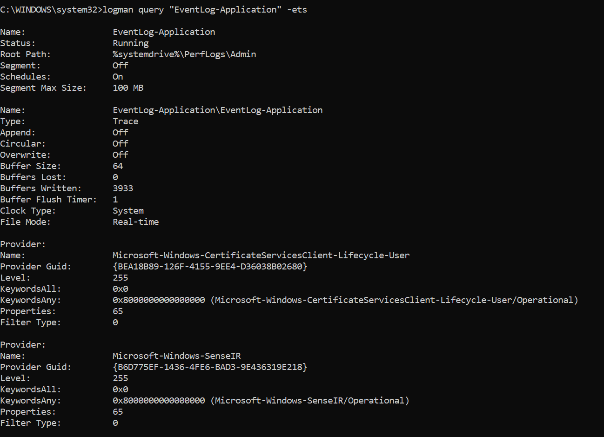

*Source reference: [JPCERT/CC — ETW Forensics: Why use Event Tracing for Windows over EventLog?](https://blogs.jpcert.or.jp/en/2024/11/etw_forensics.html); locally packaged named-session provider listing from the Ret2desync source repository.*


<div class="guided-fold-start" data-label="AutoLogger structure in detail"></div>

- Each subkey under `Autologger\` is a Session definition, with values like `Start`, `MaxFileSize`, `Guid`, `LogFileMode`.
- Each session subkey has its own child keys, one per provider GUID, holding per-provider `Enabled`, `EnableLevel`, `MatchAnyKeyword`, `MatchAllKeyword`.
- ETW itself starts these sessions during boot, before most services come up — this is what makes AutoLogger the vehicle for early-boot capture.
- **Attacker relevance:** adding a subkey here injects a rogue Provider into a legitimate Session, or creates a new persistent AutoLogger Session without a Service or Scheduled Task footprint. Changes to `Autologger\` subkeys are worth alerting on.

<div class="guided-fold-end"></div>

### § 2.4. Enabling a Provider inside a Session {#sec-2-4}

The emit path below assumes at least one Session in the subscriber list. Getting there is called **enabling** the Provider: a Controller (`logman`, `xperf`, `wevtsvc.dll`) calls `EnableTraceEx2(sessionHandle, providerGuid, ...)`; the kernel opens the Provider object by GUID, access-checks the caller against the Provider's SD (`TRACELOG_GUID_ENABLE (0x80)` required), and if the check passes appends the Session to the `ETW_GUID_ENTRY` subscriber list along with per-Session filter state (Level cap, keyword masks). Until at least one Session has been enabled, the emitter's `EventWrite` exits early when it finds no subscribers, so the write is a couple-of-nanoseconds no-op. This is the fast-path answer to why having thousands of unsubscribed Providers registered on the system costs nothing.

Filter state is stored per (Session, Provider) tuple, not globally on the Provider — two Sessions subscribing to the same Provider can filter it very differently.

#### Filter math

The filter check in that emit path is bitmask arithmetic:

- **Level** — event carries a severity byte (0–255; typically only 1–5 are used: Critical, Error, Warning, Info, Verbose). Session provides a cap; event passes if `event.level <= session.level`.
- **Keyword** — event carries a 64-bit bitmask. Session provides two masks:
  - `MatchAnyKeyword`: event passes if `(event.keyword & any) != 0`, or if `any == 0` (session accepts all).
  - `MatchAllKeyword`: event passes if `(event.keyword & all) == all`.
- Both must pass. No allocations, no string work, just bitmask arithmetic on the emitter's fast path.

<div class="guided-fold-start" data-label="Internals - What happens when a provider emits a new event?"></div>

This is what the `ETW_GUID_ENTRY` / `ETW_REG_ENTRY` machinery actually does when an emitter calls `EventWrite`:

1. Emitter calls `EventWrite(handle, ...)`.
2. In `ntdll`, `EtwEventWrite` validates and invokes syscall `NtTraceEvent`.
3. Kernel walks the `ETW_GUID_ENTRY` list of Sessions subscribed to this Provider's GUID.
4. For each subscribed Session, apply Level and Keyword filters.
5. If it passes, copy the event bytes into that Session's per-CPU buffer for the current CPU.
6. Return to the emitter — the entire call is nonblocking.
7. The Logger Thread eventually drains buffers, writing to `.etl` or invoking the real-time consumer callback (or both).

Notably, the access check does not run per emit. It ran once at handle acquisition (`EtwEventRegister` / `EtwRegister`, against `TRACELOG_REGISTER_GUIDS`) and never again — an emitter that already holds a handle keeps emitting even if the Provider's SD is tightened later.

<div class="guided-fold-end"></div>

### § 2.5. In-process (private) Sessions {#sec-2-5}

Registered with `EventRegister` and a Consumer callback in the same process — no `svchost` involvement, no persistence, no global visibility. This is how the CLR (`Microsoft-Windows-DotNETRuntime`), AMSI, and many WinRT diagnostic events are consumed: the emitting process (or a same-user helper subscribing in-process) is both the Provider host and the Consumer. Because in-process Sessions do not appear in `logman query -ets`, the property cuts both ways — EDRs use them to be invisible to attackers, and attackers use them to be invisible to EDRs.

Everything so far has been about how events are produced and buffered. What actually reads them on the other end is the Consumer.

---

## § 3. Consumers {#sec-3}

A Consumer receives events from a Session, in one of two modes:

- **Real time** — the Session was created with `EVENT_TRACE_REAL_TIME_MODE`; the Consumer calls `OpenTrace` with a real-time `LogFileMode` and registers an `EventRecordCallback`. The Logger Thread invokes that callback per event.
- **On disk** — the Consumer calls `OpenTrace` on an `.etl` file a Session finished writing. `ProcessTrace` walks the file and invokes the same callback per event.

Unlike Sessions and Providers, a Consumer has no persistent registry entry and no long-lived GUID or name. It exists for the duration of the process holding the trace handle.

**Identifying a Consumer**

- **Identifier:** none, beyond the PID of the host process.
- **Query:** none — Consumers are visible only through their PIDs surfaced in `WMI_LOGGER_CONTEXT` of the Session they are attached to.
- **Registry:** nothing; Consumers are not registered globally.
- **Memory:** the trace handle in the user-mode process, plus the entry in that Session's `WMI_LOGGER_CONTEXT` Consumer list.

Prominent examples:

- **Windows Event Log Service (`wevtsvc.dll`)** — the biggest Consumer on the box. Runs inside `svchost.exe`. Owns one persistent real-time Session per channel-group. Its per-event work is: pull the `EVENT_RECORD` off the Session's real-time delivery, look up the Provider's `MessageFileName` DLL to render the description string, then serialize the whole record into an `.evtx` chunk. Details in [§ 9](#sec-9).
- **`xperf.exe`, PerfView.exe, WPA.exe** — offline Consumers, invoked on saved `.etl` files.
- **EDR agents** — real-time Consumers of behavioural Providers, including ETW-TI. The subscribing process must satisfy the Provider's PPL requirement (see [§ 5](#sec-5)).
- **In-process Consumer** — a same-process helper reading its own emissions (the CLR case above).

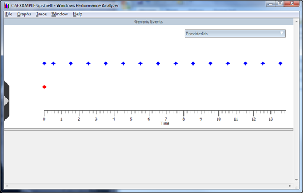

*Source screenshot: [Microsoft Learn — Viewing a USB Event Trace in Xperf](https://learn.microsoft.com/en-us/windows-hardware/drivers/usbcon/viewing-a-usb-event-trace-in-xperf).*


---

## § 4. Security Descriptors {#sec-4}

Every Provider and every Session carries an SD. What each gates is different, and each access mask bit lines up with a specific ETW API call. The SD is duplicated at runtime — one copy in the Registry (for defensive comparison), one in the live kernel object.

### Session SD

- **Controls:** who can Start, Stop, Query, Update the Session, and attach as Consumer.
- **Enforced by:** `StartTrace`, `ControlTrace`, `QueryTrace`, `OpenTrace` (real-time attach), and `EnableTraceEx2` when the Controller is enabling Providers *into* an existing Session.
- **Where stored:**
  - Registry: `HKLM\SYSTEM\CurrentControlSet\Control\WMI\Security\<SESSION_GUID>` (self-relative `SECURITY_DESCRIPTOR` as REG_BINARY).
  - Memory: `SecurityDescriptor` field of `WMI_LOGGER_CONTEXT`, in non-paged kernel pool.

### Provider SD

- **Controls:** who can enable the Provider from a Session, who can register as an emitter, who can read real-time events off it, who can query its metadata.
- **Enforced by:**
  - `EnableTraceEx2` → checks `TRACELOG_GUID_ENABLE (0x80)`.
  - `EtwEventRegister` / `EtwRegister` → check `TRACELOG_REGISTER_GUIDS (0x800)`.
  - Kernel-mode `EtwWrite` → `TRACELOG_LOG_EVENT (0x200)`.
  - Real-time Consumer attach on Provider-scoped streams → `TRACELOG_ACCESS_REALTIME (0x400)`.
  - Metadata queries → `WMIGUID_QUERY (0x1)`.
- **Where stored:**
  - Registry: `HKLM\SYSTEM\CurrentControlSet\Control\WMI\Security\<PROVIDER_GUID>`.
  - Memory: `SecurityDescriptor` field of `ETW_GUID_ENTRY`, non-paged pool. Per-registration `ETW_REG_ENTRY` inherits from it.

Access is checked at open time, not per emit — a stale handle keeps its rights across SD changes on the underlying object.

### Access mask reference

- `WMIGUID_QUERY = 0x0001`
- `WMIGUID_SET = 0x0002`
- `WMIGUID_NOTIFICATION = 0x0004`
- `WMIGUID_READ_DESCRIPTION = 0x0008`
- `WMIGUID_EXECUTE = 0x0010`
- `TRACELOG_CREATE_REALTIME = 0x0020`
- `TRACELOG_CREATE_ONDISK = 0x0040`
- `TRACELOG_GUID_ENABLE = 0x0080`
- `TRACELOG_ACCESS_KERNEL_LOGGER = 0x0100`
- `TRACELOG_LOG_EVENT = 0x0200` (kernel-mode write)
- `TRACELOG_ACCESS_REALTIME = 0x0400`
- `TRACELOG_REGISTER_GUIDS = 0x0800`
- `WMIGUID_ALL_ACCESS = 0x0012_0FFF`

The two bits most useful to memorise are `TRACELOG_GUID_ENABLE (0x80)` — a Session enabling a Provider — and `TRACELOG_LOG_EVENT (0x200)` — a kernel-mode emitter. Provider SDs that grant `TRACELOG_GUID_ENABLE` to `Everyone` are the ones an unprivileged process can subscribe to.

The SD is the general access mechanism. One Provider bends the rules further, and it happens to be the one most useful for defense.

---

## § 5. ETW Threat Intelligence Provider (ETW-TI) {#sec-5}

The single most important Provider for defensive purposes: `Microsoft-Windows-Threat-Intelligence` (GUID `{f4e1897c-bb5d-5668-f1d8-040f4d8dd344}`), introduced in Windows 10 1809. Fires kernel-mode events for suspicious API activity — remote thread creation, cross-process memory writes/allocations, driver load, image mapping into other processes, and more. This is the primary source most EDRs use for post-execution behavioural detection.

### What makes ETW-TI different from every other Provider

- **PPL-gated.** The Provider's SD requires the subscribing process to be Protected Process Light (PPL — a lightweight variant of Windows' protected-process signing requirement, blocking non-Antimalware code from opening handles to the subscriber) at antimalware signer level. A regular SYSTEM process cannot subscribe — even with the SD's ACL (Access Control List) permitting it, the ETW subsystem enforces the PPL check separately in the kernel.
- Consequence: an attacker with SYSTEM cannot silence ETW-TI without first defeating the PPL check, which typically requires kernel code execution.
- Vendor EDRs subscribing to ETW-TI must ship a signed PPL binary.

### Attacker patterns targeting ETW-TI specifically

- Bring-your-own-vulnerable-driver (BYOVD) to obtain kernel primitives and either unlink the AV process from the PPL-check path or clear its `_PS_PROTECTION` field long enough to unregister the ETW subscription.
- Direct patch of `EtwWrite` (kernel) or the provider registration entry to skip the emit.
- Because ETW-TI events originate in `ntoskrnl.exe`, patching the emit site requires kernel primitives — user-mode `EtwEventWrite` patches do not blind ETW-TI.

---

## § 6. Channels {#sec-6}

A Channel is a Provider-defined partition of its event stream, used by the Windows Event Log service to route events into named log files. A Provider declares its channels in its manifest.

**Identifying a Channel**

- **Identifier:** name, e.g. `Microsoft-Windows-Sysmon/Operational`.
- **Query:** `wevtutil el` (list all); `wevtutil gl <ChannelName>` (get configuration).
- **Registry:** `HKLM\SOFTWARE\Microsoft\Windows\CurrentVersion\WINEVT\Channels\<ChannelName>`.
- **On disk:** `%systemroot%\System32\winevt\Logs\<ChannelName>.evtx`.


*Source screenshot: [CARNet sys.portal — Windows 7: brisanje logova](https://sysportal.carnet.hr/node/1359).*


The four default channels are:

- **Admin** — end-user actionable events (errors a sysadmin can act on). *Enabled by default.*
- **Operational** — routine operational events, security-relevant. *Enabled by default.* Most EDR-interesting events live here (`Microsoft-Windows-Sysmon/Operational`, etc.).
- **Analytic** — high-volume diagnostic events. *Disabled by default.* Enable via `wevtutil sl <ChannelName> /e:true`.
- **Debug** — developer-level diagnostics. *Disabled by default.*

The default-off state of Analytic/Debug matters defensively: valuable security-relevant events (parts of `Microsoft-Windows-WMI-Activity/Trace`, several PowerShell channels) live in these channels and require explicit enablement. Providers may declare custom channels beyond the four defaults; the same registry key holds them.


*Source screenshot: [CARNet sys.portal — Windows 7: brisanje logova](https://sysportal.carnet.hr/node/1359).*

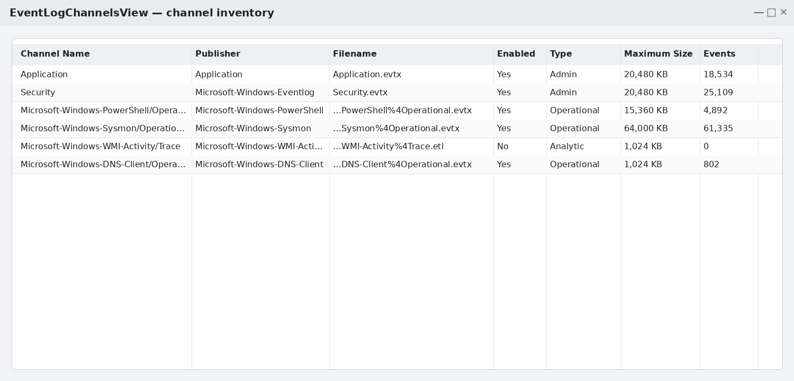

*Source reference: [NirSoft — EventLogChannelsView](https://www.nirsoft.net/utils/event_log_channels_view.html); channel inventory rendered locally from the fields documented by the utility.*


---

## § 7. Events, manifests, and schemas {#sec-7}

An event is a structured record, represented at both kernel and user level as an `EVENT_RECORD`. Its header carries the Provider GUID, an Event ID, Level, Keyword, timestamp, process/thread IDs, and activity ID; its payload is variable-length, laid out according to the Provider's declared schema. Where that schema lives depends on the Provider type:

- **Classic (MOF)** — a MOF file registered with the WMI repository.
- **Manifest-based** — a compiled resource DLL, pointed at by `MessageFileName` and `ResourceFileName` in the Publisher's registry key.
- **TraceLogging** — inline in the event itself. Nothing pre-registered.

For manifest-based Providers, the pipeline is: developer writes a `.man` XML file → `mc.exe` compiles it to headers + binary resources → resources baked into a DLL → `wevtutil im <path>` registers the Provider by writing `HKLM\...\WINEVT\Publishers\{GUID}` with `MessageFileName` and `ResourceFileName` values pointing at that DLL. The raw `.man` does not need to survive on the system after installation; the DLL is what any consumer or `wevtutil gp` reads from. SDK examples ship raw manifests under `%windir%\schemas\Provider\*.man`, but that path is illustrative — installed Providers live behind their registry entry, not behind a fixed manifest path.

Working with manifests:

- `wevtutil el` — list installed Providers (Publishers).
- `wevtutil gp <ProviderName>` — dump a Provider's effective manifest (the way to inspect an event schema on a live system).
- `wevtutil im <MANIFEST_PATH>` — install a manifest.


*Source screenshot: [CARNet sys.portal — Windows 7: brisanje logova](https://sysportal.carnet.hr/node/1359).*

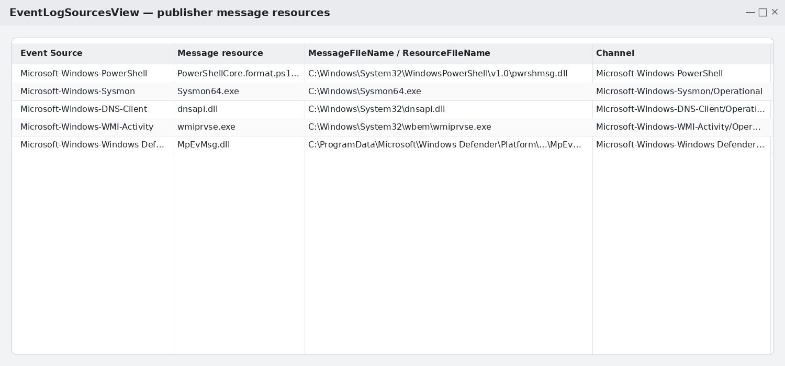

*Source reference: [NirSoft — EventLogSourcesView](https://www.nirsoft.net/utils/event_log_sources_view.html); publisher-resource inventory rendered locally from the documented fields.*


The event format is now in place. The remaining operational question is how ETW sustains this path under load.

---

## § 8. Performance and buffering {#sec-8}

ETW's write path is engineered for millions of events/sec on commodity hardware because of three architectural decisions:

- **Per-CPU buffers.** Each Session allocates buffers per logical CPU, from non-paged kernel pool. The emitting thread writes into its own CPU's active buffer — no cross-CPU contention, no cache-line ping-pong, no fault path (crucial, since kernel Providers can emit at DISPATCH_LEVEL where paging is illegal).
- **Lockless write path.** Buffer append uses interlocked operations on the write pointer. Producers never take a spinlock in the common case.
- **Async flush.** The Logger Thread is the only entity draining buffers; emitters never wait on I/O.

An emit costs on the order of a few dozen cycles (filter check + bytewise copy). Disk cost is amortized across every event in a flush cycle.

Sessions also define buffer size and overflow behaviour — which records get overwritten when a buffer fills. `Circular` mode overwrites the oldest.

### File modes (chosen at `StartTrace`)

- `EVENT_TRACE_FILE_MODE_SEQUENTIAL` — write until `MaximumFileSize`, then drop new events.
- `EVENT_TRACE_FILE_MODE_CIRCULAR` — circular file buffer.
- `EVENT_TRACE_FILE_MODE_APPEND` — append to an existing file.
- `EVENT_TRACE_FILE_MODE_NEWFILE` — start a new numbered file at max size.
- `EVENT_TRACE_REAL_TIME_MODE` — no file; events delivered directly to a Consumer callback. Frequently combined with a file mode for durability.

### Lost events

After creating a `UserSession` with `xperf.exe -on Base -start UserSession -on Microsoft-Windows-TCPIP`, then stopping it with `xperf.exe -stop UserSession -stop -d c:\temp\merged.etl`, a warning about the number of lost events sometimes appears.

When a per-CPU buffer fills before the Logger Thread drains it, subsequent emits on that CPU are dropped. The Session records the drop count in `EVENT_TRACE_PROPERTIES.EventsLost`. This is a bounded failure — the emitter never blocks — a deliberate design choice: ETW would rather drop events than slow the workload.

Mitigations:

- Enlarge the buffer: `xperf.exe -on Base -start UserSession -on Microsoft-Windows-TCPIP -BufferSize 1024`.
- Reduce the number of Providers writing to this Session.

<div class="etw-image-pair">
  <figure>
    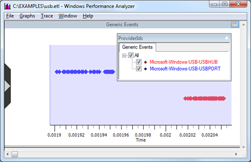
  </figure>
  <figure>
    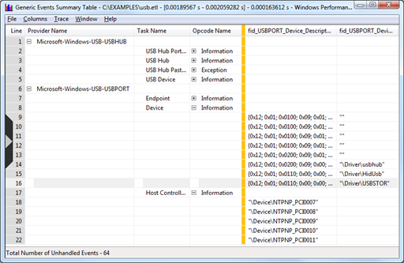
  </figure>
</div>

*Source screenshots: [Microsoft Learn — Viewing a USB Event Trace in Xperf](https://learn.microsoft.com/en-us/windows-hardware/drivers/usbcon/viewing-a-usb-event-trace-in-xperf).*


Additionally, the Logger Thread keeps a shadow copy of events at `%systemroot%\System32\LogFiles\WMI\RtBackup\` — **real-time traces only**. Files are named `EtwRT<SessionName>.etl`; if the real-time Consumer detaches or falls behind, events aren't lost outright. These files are frequently overlooked forensic targets — they can contain events that a real-time Consumer either processed and forgot, or missed entirely.

How does this buffered ETW stream become the `.evtx` data shown in Event Viewer? That is the layer above ETW itself.

---

## § 9. Windows Event Log (WinLog) — the layer above ETW {#sec-9}

Windows Event Log ("WinLog") is often conflated with ETW itself, but the two are distinct layers with a specific relationship:

- ETW is the low-level event streaming infrastructure — Providers, Sessions, per-CPU buffers, `.etl` files.
- WinLog is a **specialised ETW Consumer**, implemented by the Event Log Service (`wevtsvc.dll` inside `svchost`), that persists events into `.evtx` files and exposes them to Event Viewer, `wevtutil query-events`, and the EventLog COM API.

Concretely:

- WinLog owns one persistent real-time Session per channel-group (`EventLog-Application`, `EventLog-System`, `EventLog-Security`, `EventLog-Setup`, `EventLog-ForwardedEvents`, plus one per custom channel-group).
- Providers that want their events to end up in Event Viewer declare a Channel in their manifest, pointing at a built-in log or a custom one.
- When such a Provider emits, WinLog's Session captures the event via its `EventRecordCallback` (`wevtsvc!EtwEventCallback`), looks up the Provider's message DLL to render the description string, and serialises the whole record as an `EVENT_RECORD` into an `.evtx` chunk.
- Consumers reading Event Viewer are reading `.evtx` files, not raw ETW — they are one hop removed from the emitter.

This explains why:

- Not every ETW event appears in Event Viewer (only those routed through a Channel).
- `.etl` and `.evtx` files exist side-by-side (different formats for different consumers).
- The evtx-tampering attacks below target the `.evtx` layer, which is downstream of ETW itself.

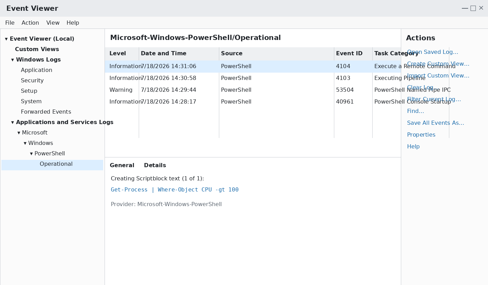


---

## § 10. Internals: WMI_LOGGER_CONTEXT, ETW_GUID_ENTRY, ETW_REG_ENTRY {#sec-10}

The DKOM (Direct Kernel Object Manipulation — writing to kernel structures from a privileged context to alter object state without going through the normal APIs) view of what has already been named:

- `WMI_LOGGER_CONTEXT` — Session runtime state, non-paged pool. Holds the Session SD, buffer-list pointers, per-Provider filter state, and the PIDs of currently attached Consumers.
- `ETW_GUID_ENTRY` — one per Provider on the system. Holds the Provider SD and both directions of subscription: the list of `ETW_REG_ENTRY` per registered emitter and the list of `WMI_LOGGER_CONTEXT` per subscribing Session.
- `ETW_REG_ENTRY` — one per emitter registration, returned by `EtwRegister`. Belongs to the Object Manager and inherits its SD from the Provider.

The `WMI_` prefix on the Session structure is not cosmetic — WMI and ETW share kernel primitives and are effectively one subsystem split by API surface, which is why the same structure names recur on both sides.

Two observability properties fall out of this layout:

- `WMI_LOGGER_CONTEXT` surfaces the Consumers attached to a Session as PIDs of their host processes.
- `logman query providers -pid <PID>` goes the other direction — given a PID, it lists the Providers that process writes to.

Between the two, both ends of every emit→consume path are observable from user mode.

### DKOM angles worth stating explicitly

With a kernel primitive, an attacker can:

- Zero out or replace the SD in `WMI_LOGGER_CONTEXT` to defeat access checks on Session control.
- Modify buffer-list pointers to inhibit flush.
- Unlink the Session from the ETW subsystem's session list, making it invisible to `logman query -ets`.

Defensive comparison against the registry-stored SD (in `HKLM\SYSTEM\CurrentControlSet\Control\WMI\Security`) catches the first.

---

<div class="guided-fold-start" data-label="Bonus: WMI–ETW Relationship"></div>

The `WMI_` prefix has already been called out; the depth of that entanglement is worth a short aside.

WMI's architecture also uses Providers, and communication with them goes through a COM/DCOM bridge and their Interfaces (in fact, ETW's Event Forwarding — the remote-collection scenario — uses the WinRM protocol).

Every IRP carries a **major function code** that says what kind of I/O request it represents. `IRP_MJ_SYSTEM_CONTROL` is only one such code, reserved for WMI requests; ordinary device activity uses other codes such as `IRP_MJ_CREATE`, `IRP_MJ_READ`, `IRP_MJ_WRITE`, and `IRP_MJ_DEVICE_CONTROL`.

Each Driver Object therefore has a dispatch-table slot for `IRP_MJ_SYSTEM_CONTROL`. A driver that registers as a WMI data provider with `IoWMIRegistrationControl` handles those requests in its `DispatchSystemControl` routine. Such a routine can call `WmiSystemControl`, which validates the WMI request and dispatches it to the driver's WMI callbacks. A driver that does **not** expose WMI data should instead pass the request to the next lower driver in the device stack; only the lowest driver completes it when no lower driver exists. WMI requests are commonly triggered by a user-mode WMI consumer, but the IRP itself is sent through the driver stack by WMI's kernel-mode component.

Additional WMI touchpoints when working on ETW:

- Access-mask names — `WMIGUID_QUERY (0x1)`, `WMIGUID_SET (0x2)`, …, `WMIGUID_ALL_ACCESS (0x120FFF)`.
- Additional constants — `TRACELOG_GUID_ENABLE (0x80)`, `TRACE_GUID_ACCESS_KERNEL_LOGGER (0x100)`, `TRACELOG_ACCESS_REALTIME (0x400)`.

`WMI_LOGGER_INFORMATION` appears in user-mode documentation as a more limited structure called `EVENT_TRACE_PROPERTIES`.

To serve as Providers, Windows Defender drivers (including the Windows Defender ELAM driver — Early Launch Anti-Malware, a driver class loaded before other boot drivers to protect the boot chain — `WdBoot.sys`) use **WPP Tracing** — designed to ease the developer experience and to work more efficiently than the synchronous `DbgPrint`.

WPP is best understood as a **build-time instrumentation layer over ETW**. The developer writes tracing macros such as `TraceEvents` or `DoTraceMessage` and defines a control GUID with `WPP_CONTROL_GUIDS`. During the build, the WPP preprocessor scans those calls and generates a `.tmh` header containing the tracing code that is compiled into the driver or application.

At runtime, `WPP_INIT_TRACING` registers that control GUID as an ETW trace Provider, and the generated code writes compact binary trace messages into an ETW Session. The human-readable format strings do not travel as ordinary text with every event: WPP records the decoding information in the Provider's PDB, from which tools can produce `.tmf` files for offline formatting. In other words, WPP supplies the source-level macros and decoding metadata; ETW supplies the runtime transport, buffering, and Sessions.

<div class="guided-fold-end"></div>

---

---

## § 11. Ways log integrity can be undermined {#sec-11}

The attacks below act on different parts of the logging path:

- **Logging services** — stop events from being collected, rendered, or forwarded.
- **ETW write paths** — prevent a Provider from emitting events before they reach any Session.
- **Stored logs** — alter or hide records after WinLog has written them to `.evtx`.
- **Logger Sessions and Provider configuration** — stop collection, remove a Provider, or make new events overwrite too quickly.
- **Provider message DLLs** — exploit a writable rendering dependency loaded by the Event Log Service.

Keeping those layers separate makes it easier to see both the scope of each attack and the defensive signal it leaves behind.

### 1. Disrupting the logging services

#### Windows Event Log Service

The **Windows Event Log Service** is the WinLog consumer that receives events from ETW Sessions and persists channel-backed events to `.evtx` files.

- In `services.msc`: **Windows Event Log**.
- From the command line: `sc queryex eventlog`.
- The service runs inside `svchost.exe`, which hosts `wevtsvc.dll`.


##### Methods

**Set the startup type to Disabled.** Once the service is no longer running, events stop flowing into Windows Event Log channels.

**Terminate or suspend the `wevtsvc.dll` threads.** This requires a thread handle with `THREAD_TERMINATE` or `THREAD_SUSPEND_RESUME`.

The relevant process or threads can be located in several ways:

1. Enumerate processes and threads, then identify the `svchost.exe` instance that has `wevtsvc.dll` loaded.
2. Query WMI:

   ```text
   wmic /namespace:\\root\cimv2 path Win32_Service Where "Name=eventlog" get ProcessId
   ```

3. Query the Service Control Manager:

   ```text
   sc queryex eventlog
   ```

**Hook `wevtsvc.dll`.** The Windows Event Log Service is not a Protected Process Light service, so a process with the necessary access — typically obtained through `SeDebugPrivilege` — can modify it in user mode. A hook on `wevtsvc!EtwEventCallback` sits at a particularly useful chokepoint because that callback receives the records delivered by the ETW Sessions owned by WinLog.

#### Windows Event Collector

**Windows Event Forwarding** sends selected events from endpoints to a central collector, usually the system whose retained data is ultimately queried by a SIEM. The path depends on the **Windows Event Collector** service and WinRM.

- In `services.msc`: **Windows Event Collector**.
- From the command line: `sc queryex wecsvc`.
- Collection requires the relevant services to be running and WinRM communication to be allowed between the endpoint and collector.

##### Methods

**Block WinRM in the firewall.** For example:

```text
netsh advfirewall firewall set rule name="Windows Remote Management (HTTP-In)" new enable=no
```

**Remove or alter the forwarding subscription.** The subscription XML defines which events are forwarded and the destination channel on the collector. A subscription can be deleted with:

```text
wecutil delete-subscription <SUBSCRIPTION_NAME>
```

Failures appear in `Microsoft-Windows-Forwarding/Operational`; Event ID 102 is one example.

***Note:*** the Windows Event Collector command-line utility is `wecutil.exe`.

### 2. Patching ETW write paths

For user-mode ETW, patching the write path is usually more targeted than disrupting an entire service. The important distinction is **scope**: a user-mode patch blinds only the process whose code was modified, whereas a kernel patch can affect kernel Providers system-wide.

- **Patch `ntdll!EtwEventWrite`.** Replacing its entry instructions with an immediate return prevents later user-mode ETW writes from that process from reaching the syscall boundary.
  - **Scope:** only that process's mapped copy of `ntdll`.
  - **Defensive signal:** the in-memory code bytes no longer match the image on disk.
- **Patch `ntdll!NtTraceEvent`.** This moves the patch one layer closer to the syscall boundary and also affects callers that reach `NtTraceEvent` without using the ordinary `EtwEventWrite` wrapper.
- **Patch kernel `EtwWrite`.** This requires kernel code execution and is the relevant level for blinding kernel Providers, including ETW-TI.
- **Patch a nearby subsystem-specific chokepoint.** `AmsiScanBuffer` and CLR tracing callbacks are common examples: the mechanism is similar, but the effect is restricted to that subsystem.

#### Detection

- Compare ETW-related code in the in-memory `ntdll` image with a known-good copy.
- Maintain known-good hashes for the entry bytes of the relevant functions.
- Use **HVCI** for kernel code integrity: it prevents ordinary writable-executable kernel mappings and makes direct kernel text patching substantially harder.

### 3. Modifying existing `.evtx` logs

Events routed through a WinLog channel are stored in `.evtx` files. After a **4096-byte file header**, the body is divided into fixed **64 KB chunks**. Each chunk contains a 512-byte chunk header, variable-length Event Records, and the string and template data needed to decode those records.

***Terminology note:*** ETW Sessions write raw `.etl` traces. WinLog, acting as an ETW Consumer, serializes channel-backed events into `.evtx`. Modifying `.evtx` changes what Event Viewer and WinLog APIs see; modifying `.etl` changes what ETW consumers such as `xperf` and WPA see. The discussion below concerns `.evtx`.


*Source reference: [Forensic Artifact — Windows Event Logs](https://www.forensic-artifact.com/windows-forensics/windowseventlogs); the `winevt\Logs` directory is rendered locally so it remains available offline.*

Several structural properties must remain consistent after a record is changed or hidden:

- **Record size.** The size is stored in the record header because records are variable-length. Increasing one record's declared size can cause a parser to step over the following record, effectively hiding it.
- **Record sequence number.** Records are numbered in order. Removing one cleanly requires the later numbers to remain contiguous.
- **Checksums.** The file header has its own CRC32. Each chunk header stores one CRC32 for the populated event-record area and another for the chunk header. Modifying bytes covered by either calculation requires the corresponding checksum to be recomputed.


<div class="etw-image-pair">
  <figure class="etw-online-figure">
    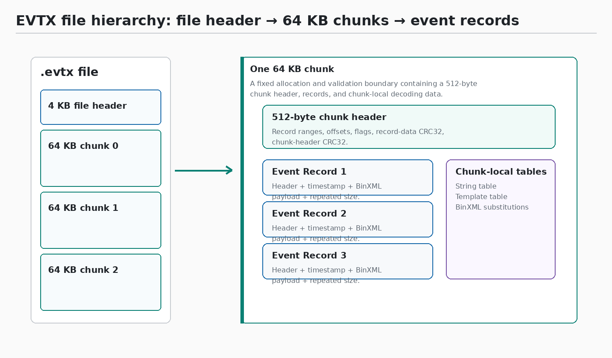
    <figcaption>High-level <code>.evtx</code> hierarchy: file header, chunks, and records.</figcaption>
  </figure>
  <figure class="etw-online-figure">
    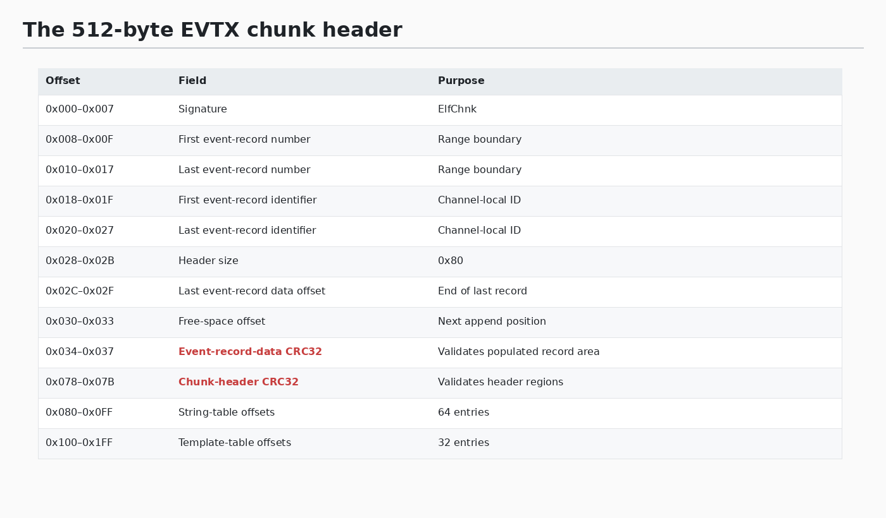
    <figcaption>The fields exposed by the chunk header, including its two checksum fields.</figcaption>
  </figure>
</div>

<div class="etw-image-pair">
  <figure class="etw-online-figure">
    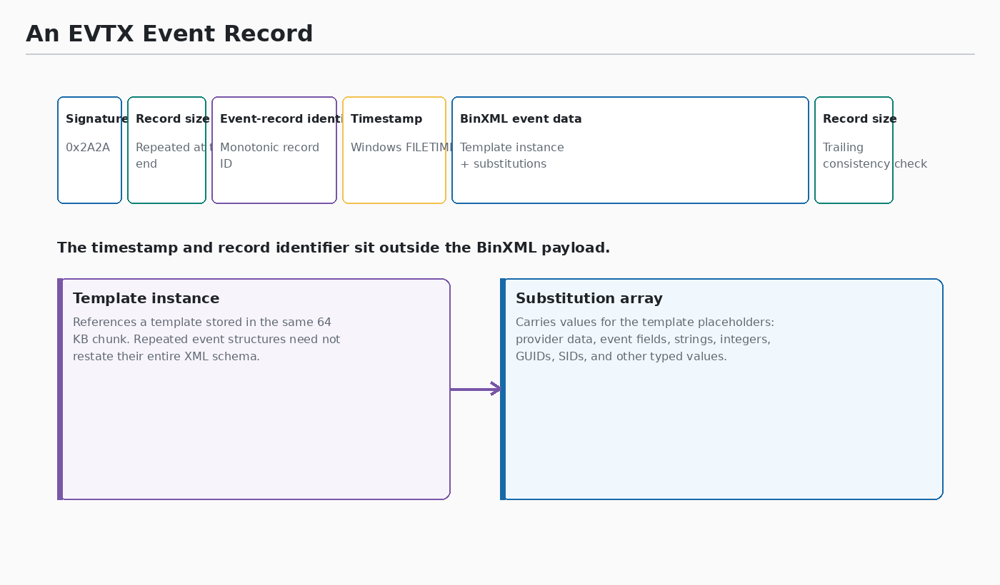
    <figcaption>An individual Event Record and the data stored before its BinXML content.</figcaption>
  </figure>
  <figure class="etw-online-figure">
    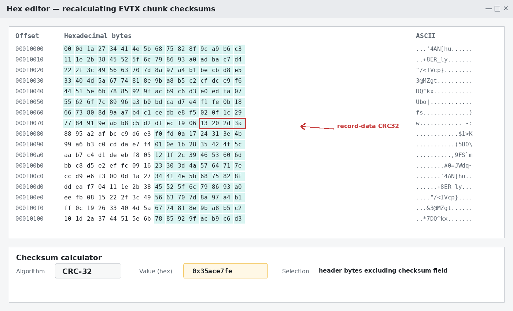
    <figcaption>The selected chunk-header bytes and recalculated CRC32 shown in the article.</figcaption>
  </figure>
</div>

<p class="etw-figure-caption"><em>Original figures extracted from the article’s own image elements; no webpage crop is used. Source: <a href="https://svch0st.medium.com/event-log-tampering-part-2-manipulating-individual-event-logs-3de37f7e3a85">svch0st — Event Log Tampering Part 2: Manipulating Individual Event Logs</a>.</em></p>

<figure class="etw-online-figure">
  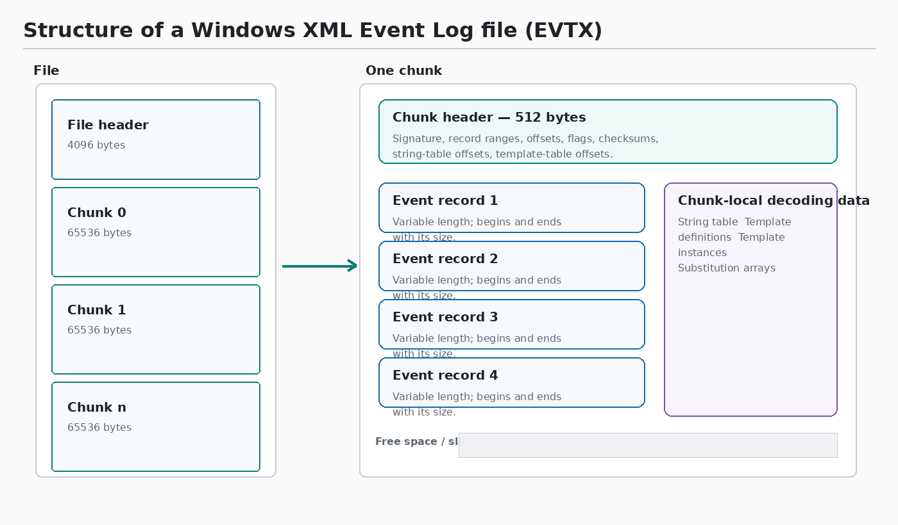
</figure>

<p class="etw-figure-caption"><em>Figure 1, “Structure of an XML event log file,” appears at the lower right of the page. Source: <a href="https://dfrws.org/sites/default/files/session-files/2007_USA_paper-introducing_the_microsoft_vista_log_file_format.pdf">Andreas Schuster — Introducing the Microsoft Vista event log file format</a>.</em></p>

#### Why the chunk concept exists

The same 64 KB unit serves several related purposes:

1. **Record-range boundary.** The chunk header stores the first and last record numbers and identifiers in that chunk. Each Event Record stores its own `TimeCreated` value outside the BinXML payload, so a reader can inspect record order and timestamps without first rendering the XML.
2. **Recovery unit.** The record-data and chunk-header CRCs allow a parser to validate one chunk independently. Damage in one chunk does not automatically invalidate every other chunk in the file.
3. **Bounded append unit.** Records are appended inside the current fixed-size chunk. When there is no room for another record, writing proceeds in a new chunk rather than extending the current one arbitrarily.
4. **Template and string scope.** Each chunk carries local string and template tables. Repeated BinXML structures can therefore refer to definitions stored once within the same chunk.

A chunk is consequently a fixed allocation boundary, a validation and recovery boundary, a record-range boundary, and the scope within which strings and BinXML templates are reused.

> **Bonus — Record Identifier versus Event ID.** Records also contain a Record Identifier determined by the event type. For Event Log records, it is derived from the Event ID and Qualifier declared by the Provider; in other cases the rendering information can come from the Provider's message DLL. It is not another independent sequence number that must be repaired when a record is hidden.

> **Bonus — Operational drawback.** The Event Log Service keeps `.evtx` files open. Direct file modification therefore generally requires stopping the service first, which creates its own observable service-state transition and must be considered part of the timeline.

### 4. Attacking the Logger Session

These techniques interfere with collection before the data becomes a stable `.etl` or `.evtx` record.

#### Stop the Trace Session

- Pass `EVENT_TRACE_CONTROL_STOP` through the ETW control API; `NtTraceControl` is the lower-level alternative.
- In PowerShell: `Stop-EtwTraceSession`.

#### Remove a Provider from the Session

- Call `EnableTraceEx2` for the Provider GUID with `EVENT_CONTROL_CODE_DISABLE_PROVIDER`.
- In PowerShell: `Remove-EtwTraceProvider`.

#### Clear a channel

Use either:

```text
wevtutil.exe cl "ChannelName"
```

or Event Viewer → right-click the channel → **Clear Log**.

Clearing is itself observable. Event IDs 1102 and 104 are the principal log-clear signals, depending on the channel involved.

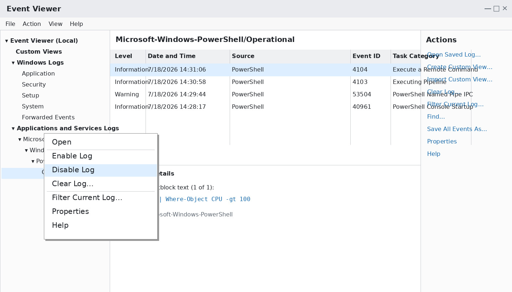

*Source reference: [Velociraptor — Disabled Event Log files](https://docs.velociraptor.app/blog/2021/2021-01-29-disabled-event-log-files-a3529a08adbe/); the demonstrated UI or registry state is rendered locally for this repository package.*

#### Change Logger Session registry settings

Two values are particularly relevant:

- **`MaxSize`.** Reducing the maximum size to 1024 KB makes old events roll over quickly.
- **`Retention = 0xFFFFFFFF`.** Under this policy, new events do not overwrite old ones; once the available space is exhausted, new events stop appearing.

Together, a very small maximum size and restrictive retention policy can sharply reduce useful coverage.

Logger Session definitions can appear under:

1. `HKLM\SYSTEM\CurrentControlSet\Services\EventLog\<LOGGER_NAME>`
2. `HKLM\SYSTEM\CurrentControlSet\Control\WMI\Autologger\<LOGGER_NAME>`


*Source reference: [Velociraptor — Disabled Event Log files](https://docs.velociraptor.app/blog/2021/2021-01-29-disabled-event-log-files-a3529a08adbe/); the demonstrated UI or registry state is rendered locally for this repository package.*


*Source reference: [Velociraptor — Disabled Event Log files](https://docs.velociraptor.app/blog/2021/2021-01-29-disabled-event-log-files-a3529a08adbe/); the demonstrated UI or registry state is rendered locally for this repository package.*

### 5. Replacing a writable Provider message DLL

A manifest-based Provider can register `MessageFileName` and `ResourceFileName` under:

```text
HKLM\SOFTWARE\Microsoft\Windows\CurrentVersion\WINEVT\Publishers\{PROVIDER_GUID}
```


*Source reference: [Velociraptor — Disabled Event Log files](https://docs.velociraptor.app/blog/2021/2021-01-29-disabled-event-log-files-a3529a08adbe/); the demonstrated UI or registry state is rendered locally for this repository package.*

The **Message DLL** contains the resources used by `FormatMessage` to render an event's human-readable description. If an unprivileged user can replace that DLL, but the Event Log Service loads it under a stronger principal, the writable file becomes a privilege boundary violation.

***Note:*** a message-definition file with the `.mc` extension can be compiled into message resources with the Message Compiler, `mc.exe`.

#### Mechanics

- The Event Log Service (`wevtsvc.dll` inside `svchost.exe`) loads the registered Message DLL when a consumer requests a formatted event description.
- The load occurs under the service host's security context, such as `NT AUTHORITY\LOCAL SERVICE`, or another stronger service principal depending on the host group.
- Replacing a DLL at a path writable by a weaker principal can therefore cause attacker-controlled code to be loaded by the stronger process.
- Querying an event from that Provider — through Event Viewer, `wevtutil query-events`, or a subscription that requests rendered text — can provide the trigger.

#### Common vulnerable configurations

- Third-party installers place message DLLs in directories with overly permissive DACLs, including misconfigured subdirectories of `C:\Program Files (x86)` or `C:\ProgramData`.
- A Publisher's `MessageFileName` is itself redirected to a user-writable path.

#### Detection

- Baseline `MessageFileName` and `ResourceFileName` under `HKLM\...\WINEVT\Publishers`.
- Alert when a non-`SYSTEM`, non-`TrustedInstaller` principal writes to one of the referenced files.
- Alert when a Publisher's `MessageFileName` value changes, because redirecting the value is equivalent to replacing the original DLL.

---

---

## § 12. Detection Summary {#sec-12}

Coverage sources against known tampering, in decreasing order of breadth:

- **Registry write auditing** on:
  - `HKLM\SYSTEM\CurrentControlSet\Control\WMI\Security` (SD changes)
  - `HKLM\SYSTEM\CurrentControlSet\Control\WMI\Autologger` (rogue provider injection)
  - `HKLM\SOFTWARE\Microsoft\Windows\CurrentVersion\WINEVT\Publishers\*\MessageFileName` (Message DLL redirection)
- **Event Log integrity events:** 1102 (Security log cleared), 104 (log cleared for a channel), 6005/6006 (Event Log service start/stop), 7040 (service startup-type change).
- **Code integrity on `ntdll` ETW entry points** for user-mode patch detection.
- **HVCI** to force kernel-level ETW patches to require SMM or firmware compromise.
- **Baseline of active Sessions** from `logman query -ets` — sudden disappearance of a Session (especially an AutoLogger one) is a signal.
- **Presence and freshness of `.etl` files** in `%systemroot%\System32\LogFiles\WMI\` and `RtBackup\` — an unexpectedly empty RtBackup on a busy system suggests real-time Consumer tampering.
- **Comparison of registry-stored SD against in-kernel SD** (in `WMI_LOGGER_CONTEXT`) — catches DKOM zeroing of the in-kernel copy.
