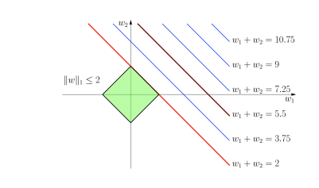
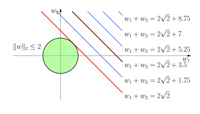
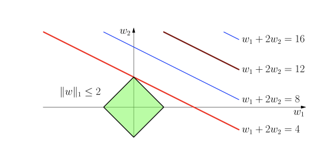

**Key observation:
Feature dependence is a problem that will constantly thwart explainability methods.
Each explainability method will have its own problems regarding feature dependence.**

## Feature Dependence in Linear Regression

Feature-dependence in linear regression is often termed multicollinearity. The OLS (ordinary least squares) solution is:

$$
\hat{\beta} = (X^\top X)^{-1} X^\top y.
$$

Features sit in the columns of $X$. When features are linearly dependent — some feature can be written as a linear combination of the others — the columns of $X$ are linearly dependent, and this forces $X^\top X$ to be **singular**.

> [!Info] Why linear dependence in the columns of $X$ forces $X^\top X$ to be singular
>
> Suppose the columns of $X$ are linearly dependent. Then there exists a nonzero vector $v$ with $Xv = 0$ (the coefficients of the linear combination that produces the redundant feature). Multiplying by $X^\top$: $X^\top X v = X^\top (Xv) = 0$, so $v \in \mathcal{N}(X^\top X)$ and $X^\top X$ has a nontrivial null space — hence singular.
>
> Conversely, if the columns of $X$ are linearly independent, $Xv = 0 \Rightarrow v = 0$, and $v^\top X^\top X v = \|Xv\|^2 = 0 \Rightarrow v = 0$; then $X^\top X$ is positive definite.
>
> The rank of $X^\top X$ therefore equals the rank of $X$, and the redundancy among features translates directly into rank-deficiency of the Gram matrix. **Near-dependence — the practical case — leaves $X^\top X$ technically invertible but with tiny eigenvalues in the directions that "almost" satisfy the redundancy.**

> [!Info] Reminder - the solutions of normal equations:
>
> Consider the normal equations: $A^\top A \mathbf{x} = A^\top \mathbf{b}$
> where $A \in \mathbb{R}^{N \times M}$, $\mathbf{b} \in \mathbb{R}^N$, and $\mathbf{x} \in \mathbb{R}^M$.
> We have:
>
> 1. A solution $\mathbf{x}$ **always exists**.
> 2. The solution $\mathbf{x}$ is unique when $A^\top A$ is invertible (i.e., when $N \geq M$ and $A$ has full rank). In this case, the solution is given by: $\mathbf{x} = (A^\top A)^{-1} A^\top \mathbf{b}$
> 3. There exist infinitely many solutions $\mathbf{x}$ when $A^\top A$ is singular.
> 4. Under (3), any two solutions $\mathbf{x}_1$ and $\mathbf{x}_2$ will differ by a vector in the null space of $A$: $\mathbf{x}_1 - \mathbf{x}_2 \in \mathcal{N}(A)$

_**Bonus:**_ (4) above is a prime motivator for ridge regularization; even though we have infinite solutions we take the smallest one, and it doesn't matter since they are all equivalent (they differ by a vector in the null space).

> [!Info] Ridge regression as the direct counter to multicollinearity
>
> Ridge replaces $(X^\top X)^{-1} X^\top y$ with $(X^\top X + \lambda I)^{-1} X^\top y$. The spectral effect is direct: if $X^\top X = Q \Lambda Q^\top$, then
>
> $$
> X^\top X + \lambda I = Q (\Lambda + \lambda I) Q^\top,
> $$
> so every eigenvalue is shifted upward: $\lambda_i \to \lambda_i + \lambda$. The eigenvectors are unchanged.
>
> The per-coefficient variance becomes $\sigma^2 \sum_i \frac{q_{ji}^2}{\lambda_i + \lambda}$. Tiny eigenvalues, which used to dominate the sum through $1/\lambda_i$, are now bounded below by $1/(\lambda_i + \lambda) \leq 1/\lambda$; the runaway variance in near-dependent directions is capped.
>
> The price is bias: the solution shrinks. In the eigenbasis, the OLS solution $\hat\beta_i^{\text{OLS}} = (X^\top y)_i / \lambda_i$ becomes $\hat\beta_i^{\text{ridge}} = (X^\top y)_i / (\lambda_i + \lambda)$ — every component is attenuated, and directions with small $\lambda_i$ get attenuated most (they were the noisiest). This is why ridge is described as "shrinkage biased toward the well-supported directions."

In the case of near-dependence, some eigenvalues of $X^\top X$ are very small.
**We detect it by proxy — the variance of the OLS solution $\hat{\beta}$:**

$$
\text{Var}(\hat{\beta}) = \sigma^2 (X^\top X)^{-1}
$$

where $\sigma^2$ is the variance of the errors.
Using the spectral decomposition: $X^\top X = Q \Lambda Q^\top$; it also holds $(X^\top X)^{-1} = Q \Lambda^{-1} Q^\top$.

The eigenvectors of $X^\top X$ are directions in feature-space; the eigenvalues measure how much the training data varies in each of those directions. A near-dependency among features corresponds to a direction along which the samples barely differ — the samples in that direction look like a tight cluster rather than a spread — and this direction is exactly the eigenvector with a tiny eigenvalue.

The per-coefficient variance is the $j$-th diagonal element of $\sigma^2 (X^\top X)^{-1}$:

$$
\text{Var}(\hat{\beta}_j) = \sigma^2 \sum_{i=1}^p \frac{q_{ji}^2}{\lambda_i}
$$

The $j$-th coefficient inherits variance from every eigen-direction $i$, weighted by $q_{ji}^2$ (how much that direction participates in coefficient $j$) and inversely by $\lambda_i$ (how well-supported that direction is by the data). A tiny $\lambda_i$ dominates the sum.
**This makes linear regression unstable, since a small change in $\lambda_i$ yields a significant change in $\hat{\beta}_j$.**

> [!NOTE] Variance Inflation Factor (VIF) and R-Squared
> For each predictor $X_j$ in $\mathbf{X}$, the variance inflation factor $VIF_j$ is defined as:
>
> $$
> VIF_j = \frac{1}{1 - R_j^2}
> $$
> In a multiple linear regression model, the variance of the $j$th coefficient estimate is:
> $$
> \text{Var}(\hat{\beta}_j) = \sigma^2 \cdot \left[(X^\top X)^{-1}\right]_{jj}
> $$
>
> **We express $\text{Var}(\hat{\beta}_j)$ in terms of other features, thereby uncovering the correlation structure.**
>
> If we regress $X_j$ on the other predictors $X_{-j}$, we have: $X_j = \mathbf{X}_{-j} \boldsymbol{\gamma}_j + \mathbf{u}_j$
> where $R_j^2$ is the proportion of variance in $X_j$ explained by $X_{-j}$.
> Decomposing $X^\top X$:
> $$
> X^\top X = \begin{pmatrix}
> X_j^\top X_j & X_j^\top X_{-j} \\
> X_{-j}^\top X_j & X_{-j}^\top X_{-j}
> \end{pmatrix}
> $$
>
> The $j$th diagonal element of $(X^\top X)^{-1}$ is:
>
> $$
> \left[(X^\top X)^{-1}\right]_{jj} = \frac{1}{X_j^\top M_{-j} X_j}
> $$
> where $M_{-j} = I - X_{-j} (X_{-j}^\top X_{-j})^{-1} X_{-j}^\top$ is the projection matrix.
>
> **Connection to Multicollinearity:**
> The projection matrix $M_{-j}$ eliminates the component of $X_j$ that is explained by the other predictors, leaving us with the unexplained part, which has variance $\text{Var}(X_j) \cdot (1 - R_j^2)$
>
> Thus,
>
> $$
> \left[(X^\top X)^{-1}\right]_{jj}
> = \frac{1}{\operatorname{Var}(X_j)(1-R_j^2)}.
> $$
>
> The factor $\frac{1}{1-R_j^2}$ quantifies how much multicollinearity inflates the variance of $\hat{\beta}_j$. This is the variance inflation factor:
>
> $$
> \operatorname{VIF}_j = \frac{1}{1-R_j^2}.
> $$

---

## Regularization and Feature Dependence

Regularization is often introduced as a bias-variance tradeoff — cap the coefficients, accept a bit of bias, gain a lot of variance reduction. Under feature dependence, though, each of the two standard penalties has its own distinctive misbehavior, and the misbehaviors are different enough that combining them (§"Elastic Net Regularization") solves problems neither penalty solves on its own. The next two subsections trace what each penalty does for two archetypal cases of feature dependence — identical features, and linearly dependent-but-not-identical features — and the elastic net section returns to show why the sum of the two penalties has strictly better behavior than either alone.

> [!Info] Recall: $\ell_1$ Geometric Interpretation
>
> In 2D,
> The equation $|\beta_1| + |\beta_2| = t$ describes a **diamond** shape.
>
> **Vertices:** The vertices of the diamond are at $(t,0)$, $(-t,0)$, $(0,t)$, and $(0,-t)$.
>
> - **First Quadrant ($\beta_1 \geq 0$ and $\beta_2 \geq 0$):**
>   $\beta_1 + \beta_2 = t$
>   This represents a line segment from $(t,0)$ to $(0,t)$.
>
> - **Second Quadrant ($\beta_1 \leq 0$ and $\beta_2 \geq 0$):**
>   $-\beta_1 + \beta_2 = t$
>   This represents a line segment from $(-t,0)$ to $(0,t)$.
>
> - **Third Quadrant ($\beta_1 \leq 0$ and $\beta_2 \leq 0$):**
>   $-\beta_1 - \beta_2 = t$
>   This represents a line segment from $(-t,0)$ to $(0,-t)$.
>
> - **Fourth Quadrant ($\beta_1 \geq 0$ and $\beta_2 \leq 0$):**
>   $\beta_1 - \beta_2 = t$
>   This represents a line segment from $(t,0)$ to $(0,-t)$.

> [!Info] Why $\text{sign}(0)$ is a *set*, not a value: the subdifferential of $|\beta|$
>
> The Karush–Kuhn–Tucker (KKT) arguments ahead use
>
> $$
> \text{sign}(\beta_j) = \begin{cases} +1 & \beta_j > 0, \\ -1 & \beta_j < 0, \\ \text{any value in } [-1, 1] & \beta_j = 0. \end{cases}
> $$
> The set-valued convention at zero is not a workaround — it is what the KKT conditions actually require.
>
> **What KKT is, briefly.** The KKT conditions are the first-order optimality conditions for constrained optimization. For an *unconstrained* smooth problem, "the gradient vanishes at the optimum" is the whole story. Once we add either constraints or non-smooth penalties (like $\|\beta\|_1$), the plain gradient equation isn't quite right — at the optimum, the gradient of the loss can be *balanced* against a contribution from the constraint or penalty rather than vanishing outright. KKT formalizes this balance:
>
> - At an unconstrained smooth minimum: $\nabla L(\beta^*) = 0$.
> - At the minimum of $L(\beta) + \lambda \|\beta\|_1$: $\nabla L(\beta^*)$ is cancelled by a term from the subdifferential of $\|\beta\|_1$, giving $0 \in -\nabla L(\beta^*) + \lambda \cdot \partial \|\beta\|_1$.
>
> The subdifferential is the tool that makes this precise when the penalty has corners.
>
> The $\ell_1$ penalty $|\beta|$ is convex but not differentiable at $\beta = 0$: the graph has a corner. Convex analysis replaces the derivative with the **subdifferential** — the set of all slopes $g$ such that $|\beta| \geq |\beta_0| + g(\beta - \beta_0)$ for every $\beta$ (any line through $(\beta_0, |\beta_0|)$ that stays under the graph). At a smooth point, the subdifferential collapses to the single tangent slope. At the corner $\beta = 0$, the entire pencil of lines with slope in $[-1, 1]$ passes under the V-shaped graph, so the subdifferential is the whole interval $[-1, 1]$.
>
> At the corner, the subdifferential is
>
> $$
> \partial |\beta|\big|_{\beta=0}=[-1,1].
> $$
>
> The KKT condition for a non-smooth convex objective is: $0$ belongs to the subdifferential of the full objective. Concretely, at the optimum
>
> $$
> 0 \in -\nabla L(\beta) + \lambda \cdot \partial \|\beta\|_1,
> $$
> which unpacks componentwise to "$\text{sign}(\beta_j)$ equals a specific number when $\beta_j \neq 0$, and lies somewhere in $[-1, 1]$ when $\beta_j = 0$." **The freedom at zero is what allows features to be zeroed out**: an inactive coordinate isn't forced to have gradient magnitude exactly $\lambda$; it only needs $|\partial L / \partial \beta_j| \leq \lambda$. This is the geometric reason $\ell_1$ produces sparse solutions and $\ell_2$ does not — the smooth $\ell_2$ penalty has a unique gradient everywhere, so shrinking never *hits* zero exactly.

**For identical features:**

- $\ell_1$ : spreads weight arbitrarily (all weights same sign).
- $\ell_2$ : spreads weight evenly.

| $\ell_1$ regularization for identical features | $\ell_2$ regularization for identical features |
|:--:|:--:|
|  |  |

> [!Proof] Why $\ell_1$ Spreads Weight Arbitrarily for Identical Features
>
> The gradient of the loss function $L(\beta)$ is given by:
> $$
> \nabla L(\beta) = \left[\frac{\partial L}{\partial \beta_1}, \frac{\partial L}{\partial \beta_2}\right]
> $$
>
> When features are identical, the partial derivatives $\frac{\partial L}{\partial \beta_1}$ and $\frac{\partial L}{\partial \beta_2}$ are symmetrical and hence equal, so the gradient vector $\nabla L(\beta)$ is proportional to $[1, 1]$.
>
> The KKT condition for optimality states that:
> $$
> -\nabla L(\beta_1, \beta_2) + \lambda \cdot [\text{sign}(\beta_1), \text{sign}(\beta_2)]^T = 0
> $$
>
> This implies that $\nabla L(\beta)$ must point in the opposite direction of $[\text{sign}(\beta_1), \text{sign}(\beta_2)]$.
> Therefore, $[\text{sign}(\beta_1), \text{sign}(\beta_2)]$ cannot be proportional to $[1, 0]$ or $[0, 1]$.
>
> Instead, $[\text{sign}(\beta_1), \text{sign}(\beta_2)]$ must be proportional to $[1, 1]$ (or $[-1, -1]$).
> Therefore, both $\beta_1$ and $\beta_2$ must be non-zero.
> Meaning that $\ell_1$ spreads weight arbitrarily for identical features.

**For linearly dependent features:**

- $\ell_1$ : chooses the variable with larger scale, and gives $0$ weight to the others.
- $\ell_2$ : prefers variables with larger scale — spreads weight proportional to scale.

**$\ell_1$ regularization for linearly dependent features**

The intuition: with linearly dependent features the loss surface has a flat valley of equally-good solutions. $\ell_1$ picks the vertex of the diamond that touches the valley first, and vertices lie on the axes — one coordinate wins, the others are zeroed. $\ell_2$ picks the point on the circle that touches the valley, and the circle has no preferred direction — weight spreads.

> [!Info] Why $\ell_1$ chooses the variable with larger scale and gives $0$ weight to the others
>
> We have two correlated variables $x_1$ and $x_2$ such that:
> $$
> x_2 = \rho x_1 + \epsilon
> $$
>
> The gradient of the loss function $\nabla L(\beta)$ is approximated as:
> $$
> \begin{bmatrix} \frac{\partial L}{\partial \beta_1} \\ \frac{\partial L}{\partial \beta_2} \end{bmatrix} \approx x_1^T x_1 \begin{bmatrix}
> \beta_1 + \rho \beta_2 \\
> \rho \beta_1 + \rho^2 \beta_2
> \end{bmatrix} - \begin{bmatrix}
> x_1^T y \\
> \rho x_1^T y
> \end{bmatrix}
> $$
>
> This means that the gradient vector $\nabla L(\beta)$ aligns closely with $[1, \rho]^T$, reflecting the correlation between $x_1$ and $x_2$.
>
> The KKT condition for optimality states that:
> $$
> -\nabla L(\beta_1, \beta_2) + \lambda \cdot [\text{sign}(\beta_1), \text{sign}(\beta_2)]^T = 0
> $$
> where $\nabla L(\beta) = \left[\frac{\partial L}{\partial \beta_1}, \frac{\partial L}{\partial \beta_2}\right]$
>
> Observe that:
>
> - The gradient vector $\nabla L(\beta)$ aligns closely with $[1, \rho]^T$.
> - According to KKT conditions, $\nabla L(\beta)$ must point in the opposite direction of $[\text{sign}(\beta_1), \text{sign}(\beta_2)]$.
> - The definition of $\text{sign}(\beta_j)$:
> $$
> \text{sign}(\beta_j) = \begin{cases}
> +1 & \text{if } \beta_j > 0, \\
> -1 & \text{if } \beta_j < 0, \\
> \text{any value in } [-1, 1] & \text{if } \beta_j = 0.
> \end{cases}
> $$
>
> Since $\rho \neq  1$, at least one of $\beta_1$ or $\beta_2$ must be zero.

## Elastic Net Regularization

Elastic net is the combined penalty

$$
L_{\text{EN}}(\beta) = \|y - X\beta\|^2 + \lambda_1 \|\beta\|_1 + \lambda_2 \|\beta\|_2^2.
$$

Each piece addresses a specific pathology of the other under feature dependence.

- **$\ell_1$ alone**, on identical features, spreads weight arbitrarily across the same-sign options; on linearly dependent features, it collapses to a single winner. Both behaviors are unstable — a small perturbation in the data can swap which feature wins.
- **$\ell_2$ alone** spreads weight evenly across correlated features, but never zeros anything out, so it doesn't help interpret which features actually matter.

Adding a small $\ell_2$ term to the $\ell_1$ objective removes the flat valley in the loss surface that $\ell_1$ alone was arbitrating over. The squared term is *strictly* convex in every direction, so the combined objective has a **unique minimizer** even under exact feature duplication — the arbitrary tie-break disappears.

> [!Info] The grouping effect
>
> For a pair of features $x_i, x_j$ with correlation $\rho$, if both coefficients have the same sign at the optimum, one can show
>
> $$
> |\hat\beta_i - \hat\beta_j| \leq \frac{\sqrt{2(1 - \rho)}}{\lambda_2} \cdot \|y\|.
> $$
> As $\rho \to 1$ (features become identical), $\hat\beta_i \to \hat\beta_j$: the coefficients are *forced* together. This is the **grouping effect** — correlated features receive similar weights.
>
> **Sketch of the bound.** At the optimum, subgradient conditions in coordinates $i$ and $j$ read
>
> $$
> -x_i^\top (y - X\hat\beta) + \lambda_1 \, s_i + 2 \lambda_2 \hat\beta_i = 0, \quad -x_j^\top (y - X\hat\beta) + \lambda_1 \, s_j + 2 \lambda_2 \hat\beta_j = 0,
> $$
> with $s_i, s_j \in \{-1, +1\}$ (same sign, by assumption). Subtracting and rearranging:
>
> $$
> 2 \lambda_2 (\hat\beta_i - \hat\beta_j) = (x_i - x_j)^\top (y - X\hat\beta).
> $$
> Cauchy–Schwarz gives $|(x_i - x_j)^\top (y - X\hat\beta)| \leq \|x_i - x_j\| \cdot \|y - X\hat\beta\| \leq \|x_i - x_j\| \cdot \|y\|$ (the residual can't exceed $\|y\|$, since $\beta = 0$ is feasible). And $\|x_i - x_j\|^2 = 2(1 - \rho)$ for unit-norm features. Combining yields the bound.

**The correlated-feature pathologies of the two penalties compose favorably:** $\ell_1$ gives the sparsity, $\ell_2$ smoothes the arbitrariness. Groups of correlated features tend to enter or leave the model together, rather than one representative being selected at random.

## Feature Importance

There are two types of feature importance:

1. **Global interpretation** (§"Global Interpretation" ahead). A feature-importance score is attached to the model as a whole and is common to all predictions. These importances are computed from the training set, *offline*, before any test predictions are made. Their roles are:

    - **Feature engineering:** Report back to the model engineer how strongly the engineered features influenced the model.

      **How?** Check the magnitudes of the importances assigned to engineered features.

    - **Detect information leakage:** Identify features that inadvertently encode information from the target labels.

      **How?** These features show up as unusually important.

    - **Uncover unwanted feature dependencies:** Detect dependencies that should not exist in the model's representation.

      **How?** In permutation feature importance (PFI, §"Permutation Feature Importance"), for instance, a large accuracy decrease can occur because permutation breaks the correlation structure and creates out-of-distribution examples on which the model performs poorly.

2. **Local interpretation** (§"Local Interpretation" ahead). This type of feature importance focuses on one prediction. The importances are computed *online*: the model is evaluated repeatedly on perturbed versions of the example to estimate the contribution of each feature.

    Its role is:

    - **Evaluate prediction trustworthiness:** The explanation shows which features most influenced the decision. Agreement with domain knowledge can help assess whether the prediction is plausible.

      **How?** Check whether the feature importances align with domain knowledge for the specific prediction being explained.

## Global Interpretation

Linear models and tree models already expose model-specific measures of feature importance:

- **Linear models:** For $y = \beta_0 + \beta_1 x_1 + \beta_2 x_2 + \dots + \beta_p x_p + \epsilon$, use the absolute value of the coefficient associated with feature $j$.

- **Tree models:** Use the reduction in impurity produced by splits on feature $j$.

    - For regression trees, node impurity is the variance of $y$ inside the node, and the gain is the reduction in weighted variance from parent to children.
    - For classification trees, node impurity is typically Gini impurity or entropy of the label distribution.

    In both cases, the gain from a split on feature $j$ is

    $$
    \operatorname{impurity}(\text{parent})
    - \sum_{c \in \text{children}}
      \frac{n_c}{n_{\text{parent}}}
      \operatorname{impurity}(c).
    $$

    If feature $j$ is used in several splits, sum the gains from those splits. In a random forest or gradient-boosted ensemble, average or sum these importances across the individual trees, according to the implementation.

### Feature importance by randomizing a feature

#### Permutation Feature Importance (PFI)

To estimate the importance of feature $j$:

1. **Perturbation:** Permute the values of feature $j$ across training examples. In sample $i$, replace $x_{ij}$ with a value $\tilde{x}_{ij}$ taken from feature $j$ in another sample.

2. **Evaluation:** Compare performance before and after permutation. For a loss metric,

    $$
    P_{\text{baseline}} = \frac{1}{n}\sum_{i=1}^{n}\mathcal{L}(f(x_i), y_i),
    $$

    and let $P_{\text{perm}}(x_j)$ be the corresponding loss after permuting feature $j$. Define the importance with a sign convention appropriate to the metric; for a score where larger is better,

    $$
    \operatorname{PFI}(x_j) = P_{\text{baseline}} - P_{\text{perm}}(x_j).
    $$

A large deterioration after shuffling indicates that feature $j$ was important to the model. The permutation also breaks any relationship between feature $j$ and the target $y$.

**Disadvantages of Permutation-Feature-Importance:**

- **Perturbed examples might be misleading:** by permuting, we are potentially evaluating _out-of-distribution_ examples, whose model predictions are not meaningful.
- **Assumes independent features:** if some features are dependent, permutation breaks this structure, resulting in out-of-distribution examples.

> [!Info] What "out-of-distribution" concretely means here
>
> The true joint distribution is $p(x_j, x_{-j})$ — features co-vary. Independent permutation of the $j$-th column replaces this with the product of marginals $p(x_j) \cdot p(x_{-j})$: values of $x_j$ are drawn independently of $x_{-j}$.
>
> When the features are dependent, the product-of-marginals differs from the joint: the permuted sample $(\tilde x_j, x_{-j})$ can occupy regions the training data never reaches. Example: `height` and `weight` are correlated; permuting `weight` produces adults who are $2\,\text{m}$ tall and $40\,\text{kg}$ — bodies the model never saw. The model's prediction there reflects extrapolation, not the actual influence of `weight`.
>
> The measured performance drop then confounds two things: the importance we wanted to measure (dependence of $y$ on $x_j$) and the artifact of extrapolation into empty regions of feature-space. This is the underlying reason PFI misbehaves on correlated data — and it is the same reason we later need conditional expectations for local methods.

### Feature importance by marginalizing the other features

#### Partial Dependence Plot (PDP)

Let $x_{-j}$ denote all features except $x_j$. To describe the influence of feature $j$:

1. **Perturbation:** Fix $x_j$ and average over the distribution of the other features. The resulting function captures the model's average behavior as $x_j$ changes:

    $$
    f_j(x_j)
    = \mathbb{E}_{x_{-j}}[f(x_j, x_{-j})]
    = \int p(x_{-j}) f(x_j, x_{-j})\,dx_{-j}.
    $$

2. **Evaluation:** If $f_j(x_j)$ changes substantially with $x_j$, then feature $j$ strongly influences the model. Two possible summaries are:

    - **Range:** $\max f_j(x_j) - \min f_j(x_j)$.
    - **Variance:** The variance of $f_j(x_j)$ over the distribution of $x_j$.

**Disadvantages of Partial Dependence Plots:**

- If a generalized additive model assumption does not hold—because cross terms or feature dependencies exist—the averaging can wash out interactions.

    For example, suppose

    $$
    Y = 0.2X_1 - 5X_2 + 10X_2\mathbf{1}[X_3 > 0] + \epsilon,
    $$

    where $\epsilon \sim N(0,1)$ and $X_1,X_2,X_3 \sim \operatorname{Unif}(-1,1)$. Then

    $$
    \begin{aligned}
    f_2(x_2)
    &= \mathbb{E}_{X_1,X_3}[f(X_1,x_2,X_3)] \\
    &= 0.2\mathbb{E}[X_1] - 5x_2 + 10x_2\mathbb{P}(X_3>0) \\
    &= 0.
    \end{aligned}
    $$

    The interaction involving $X_2$ is real, but marginalization cancels it in the one-dimensional PDP.

> [!Info] Partial Dependence captures the additive effect of GAM
>
> GAM (Generalized Additive Models) assumes that a prediction $\hat{y}$ can be decomposed as: $\hat{y} = \beta_0 + \sum_{i=1}^{N} g_i(x_i)$
>
> where $\sum_{i=1}^{p} g_i(x_i)$ represents the additive contribution of each feature.
>
> **Partial Dependence captures this additive effect**,
> Assume that $f(x) = \beta_0 + \sum_{i=1}^{N} g_i(x_i)$, then:
> $$
> \begin{aligned}
> f_j(x_j) &= \mathbb{E}_{\mathbf{x}_{i \mid i \neq j}}\left[\beta_0 + \sum_{i=1}^{N} g_i(x_i)\right] \\
>          &= \mathbb{E}_{\mathbf{x}_{i \mid i \neq j}}\left[\beta_0 + g_j(x_j) + \sum_{\mathbf{x}_{i \mid i \neq j}} g_i(x_i)\right] \\
>          &= g_j(x_j) + \left(\beta_0 + \mathbb{E}_{\mathbf{x}_{i \mid i \neq j}}\left[\sum_{\mathbf{x}_{i \mid i \neq j}} g_i(x_i)\right] \right)
> \end{aligned}
> $$
>
> - $\left(\beta_0 + \mathbb{E}_{\mathbf{x}_{i \mid i \neq j}}\left[\sum_{\mathbf{x}_{i \mid i \neq j}} g_i(x_i)\right] \right)$ is constant with respect to $x_j$, and hence does not affect the variation of $f_j(x_j)$ due to $x_j$ (whether by range or variance).
>
> Therefore, Partial-Dependence-Plot isolates the additive contribution of each feature, assuming the model can be decomposed as $\hat{y} = \beta_0 + \sum_{i=1}^{N} g_i(x_i)$ .
>
> **_NOTE:_** GA$^2$M (Generalized Additive Models with Pairwise Interactions) assumes that a prediction $\hat{y}$ can be decomposed as: $\hat{y} = \beta_0 + \sum_{j=1}^{p} g_j(x_j) + \sum_{i < j} g_{ij}(x_i, x_j)$.
> Meaning that it introduces an extra term - $\sum_{i < j} g_{ij}(x_i, x_j)$, which captures the pairwise interactions.

## Conditional vs Marginal Expectation

Every method that "removes" a feature has to answer: *what stands in for the removed value?* Two answers, with genuinely different meanings.

- **Marginal expectation** — draw the missing feature from its marginal $p(x_j)$, independent of the other features:

$$
f_j^{\text{marg}}(x_{-j}) = \mathbb{E}_{x_j \sim p(x_j)} [f(x_j, x_{-j})] = \int f(x_j, x_{-j}) \, p(x_j)\, dx_j.
$$

- **Conditional expectation** — draw the missing feature from its conditional given the observed features $p(x_j \mid x_{-j})$:

$$
f_j^{\text{cond}}(x_{-j}) = \mathbb{E}_{x_j \sim p(x_j \mid x_{-j})} [f(x_j, x_{-j})] = \int f(x_j, x_{-j}) \, p(x_j \mid x_{-j})\, dx_j.
$$

When features are independent, $p(x_j \mid x_{-j}) = p(x_j)$ and the two coincide. When features are dependent, they disagree, and the disagreement is the entire story of feature-dependence pathologies.

**Marginal keeps causal cleanliness, at the cost of realism.** Sampling $x_j$ independently probes the model in regions it never saw during training. The score reflects "what would $f$ predict if $x_j$ were free of its usual correlations" — clean for causal attribution, but the model's output there is extrapolation, not measurement. PFI and PDP both use the marginal implicitly.

**Conditional keeps distributional realism, at the cost of causal cleanliness.** Sampling $x_j$ conditionally never leaves the data manifold — every point examined is one the model has evidence for. But now correlated features share their importance: a strong correlated feature $x_k$ can "cover" for $x_j$ through the conditional draw, and $x_j$'s measured importance drops even if the model actually uses it.

There is no way to have both. The two are the same estimator only under independence, and independence is exactly what real feature-dependence violates.

> [!Info] The same tension resurfaces throughout local interpretation
>
> Every local method makes an implicit or explicit choice on this axis:
>
> - **PFI, PDP:** marginal by construction (permute or average over marginals).
> - **LIME:** marginal by default (perturb each feature independently to its baseline). See §"LIME".
> - **Kernel-SHAP:** marginal, by assumption of feature independence. See §"Kernel-SHAP".
> - **SHAP with conditional expectation:** conditional. See §"The SHAP variants" — the formulation is written in terms of the conditional, but sampling from it is what makes practical implementations difficult.
>
> The "which one is right?" question doesn't have a universal answer — it depends on whether the question we're asking of the model is "how does it use $x_j$ in isolation" (marginal, causal reading) or "what does it associate with $x_j$'s value in the wild" (conditional, observational reading).

### Leave-One-Covariate-Out (LOCO)

*Leave-one-covariate-out (LOCO) is accurate but expensive.* It is perhaps the most direct global method.

**Preparation:**

1. Fit the model using all features.
2. Record the original loss $e_{\text{original}}$.

**Evaluate each feature:**

For every feature $j$:

1. Refit the model without feature $j$.
2. Record the new loss $e_j$.

**Assign the score:**

Use the increase in loss,

$$
e_j - e_{\text{original}}.
$$

A larger increase indicates greater importance. The cost is one full refit per feature—$N+1$ training runs in total—so LOCO is often used as a reference method for evaluating faster alternatives such as PFI and PDP.

## Local Interpretation

### Baseline and "feature missingness"

Local interpretation methods rely on _online_ evaluations of the model. But an instance whose prediction we want to explain gives us nothing to compare against on its own — a single number can't be decomposed unless there's something to decompose it *relative to*. This is what a **baseline** is for: an anchor input against which contributions are measured.

The same baseline serves two roles:

- **Reference point for attribution.** Contributions are measured as $f(x) - f(x^{\text{baseline}})$ decomposed across features. Every local method covered here — LIME (§"LIME"), SHAP (§"The SHAP variants"), DeepLIFT (§"DeepLIFT") — is at heart a scheme for splitting this difference into per-feature pieces.
- **Default value for "missing" features.** When we mask feature $i$, we need to replace $x_i$ with something — the baseline value $x_i^{\text{baseline}}$ is what we plug in. This is the operational meaning of "feature missingness" in a model that requires a complete input.

**The choice of baseline changes what "importance" means.** A zero baseline (black image) asks "how much did each feature push the prediction away from a black canvas?" A dataset-mean baseline asks "how much did each feature push the prediction away from the typical example?" A conditional-expectation baseline asks "how much did each feature push the prediction away from what we'd expect given the rest?" These give quantitatively different attributions on the same input, and there is no baseline-free notion of local importance.

> [!Info] Baselines
>
> #### Image Data
>
> - **Zero Baseline (Black Image):**
>   - **Practicality:** Common in convolutional neural networks (CNNs, e.g., ResNet, VGG). Provides clear attribution for features contributing to predictions.
>   - **Mathematical Rigor:** Importance of pixel $p$ is $I_p - 0$, where $0$ is the baseline pixel value.
>
> - **Mean Image Baseline:**
>   - **Practicality:** Used in healthcare models (e.g., chest X-rays). Shows deviation from average case.
>   - **Mathematical Rigor:** Mean baseline $I_{\text{mean}} = \frac{1}{|D|} \sum_{i=1}^{|D|} I_i$. The difference $f(I) - f(I_{\text{mean}})$ highlights feature deviations.
>
> - **Blurred Image Baseline:**
>   - **Practicality:** Applied in autonomous driving. Highlights critical high-resolution features.
>   - **Mathematical Rigor:** Blurred image $I_{\text{blur}} = G_\sigma * I$, using Gaussian filter $G_\sigma$.
>
> #### Text Data
>
> - **Padding (e.g., "[PAD]"):**
>   - **Practicality:** Used in natural-language processing (NLP) models for fixed input lengths.
>   - **Mathematical Rigor:** For sequence $S$ with length $L$, padding to $S_{\text{pad}}$ where $|S_{\text{pad}}| = L_{\text{max}}$. Contribution of tokens is computed against padded tokens.
>
> - **Empty Text Baseline:**
>   - **Practicality:** Used in sentiment analysis (e.g., product reviews). Isolates impact of specific words.
>   - **Mathematical Rigor:** Importance of word $w$ is $f(w) - f(\text{" "})$.
>
> - **Neutral Text Baseline:**
>   - **Practicality:** Used in finance (e.g., market news). Serves as a stable reference point.
>   - **Mathematical Rigor:** Importance of word $w$ is $f(w) - f(w_{\text{neutral}})$.
>
> #### Tabular Data
>
> - **Typical Feature Imputations:** Mean Imputation, Median Imputation, Historical Imputation, etc.
> - **Conditional Expectation Baseline:**
>   - **Practicality:** Used in models with interdependent features (e.g., insurance pricing, personalized medicine).
>   - **Mathematical Rigor:** Baseline is $\mathbb{E}[x_i | X_{-i}]$, considering dependencies among features. Example: In credit scoring, the expected loan amount given high income as a baseline.

### LIME

**Local Interpretable Model-Agnostic Explanations**

LIME approximates the model $f(\mathbf{x})$ near the instance $\mathbf{x}_0$. It evaluates $f$ on perturbed instances $\mathbf{x}'$ and fits a simpler local linear explanation model $g(\mathbf{x}')$.

- $S \in \{0,1\}^N$ is a binary mask. $S[i]=0$ means that feature $i$ is replaced by a baseline value; $S[i]=1$ means that the original value is retained.
- $\mathbf{x}'_S$ is the perturbation of $\mathbf{x}_0$ produced by mask $S$.

**Optimization problem:**

$$
\min_{\mathbf{w}=(w_1,\ldots,w_N)}
\frac{1}{2^N}
\sum_{S\in\{0,1\}^N}
\pi_{\mathbf{x}_0}(\mathbf{x}'_S)
\left(\mathbf{w}^{\top}\mathbf{x}'_S-f(\mathbf{x}'_S)\right)^2.
$$

Here, $\pi_{\mathbf{x}_0}(\mathbf{x}'_S)$ down-weights perturbations far from $\mathbf{x}_0$. A common choice is the radial-basis-function kernel

$$
\pi_{\mathbf{x}_0}(\mathbf{x}'_S)
= \exp\!\left(-\frac{\|\mathbf{x}_0-\mathbf{x}'_S\|^2}{\sigma^2}\right).
$$

**LIME feature importances** are the fitted weights $w_i$. The weight associated with feature $i$ represents its importance near $\mathbf{x}_0$.

The proximity weighting encourages a local linear approximation. In the Taylor expansion of $f$ around $\mathbf{x}_0$, higher-order terms become important farther from the reference point. The kernel reduces their influence by assigning smaller weights to distant perturbations.

**The bandwidth $\sigma$ is a hyperparameter:**

- **Small $\sigma$:** emphasizes points very close to $\mathbf{x}_0$, producing a highly local approximation.
- **Large $\sigma$:** considers a wider neighborhood, capturing more global behavior at the cost of local fidelity.

**In practice, LIME uses Monte Carlo sampling rather than all $2^N$ masks:**

1. Sample masks $S_1,S_2,\ldots,S_M$ from $\{0,1\}^N$.
2. Solve

    $$
    \widehat{L}(\mathbf{w})
    = \frac{1}{M}\sum_{i=1}^{M}
      \pi_{\mathbf{x}_0}(\mathbf{x}'_{S_i})
      \left(\mathbf{w}^{\top}\mathbf{x}'_{S_i}
      - f(\mathbf{x}'_{S_i})\right)^2.
    $$

> [!NOTE] LIME — solving for $\mathbf{w}$
>
> Expanding the quadratic objective gives
>
> $$
> L(\mathbf{w})
> = \frac{1}{2^N}\sum_{S\in\{0,1\}^N}
> \pi_{\mathbf{x}_0}(\mathbf{x}'_S)
> \left(
> \mathbf{w}^{\top}\mathbf{x}'_S\mathbf{x}_S'^{\top}\mathbf{w}
> -2f(\mathbf{x}'_S)\mathbf{w}^{\top}\mathbf{x}'_S
> +f(\mathbf{x}'_S)^2
> \right).
> $$
>
> Setting the gradient to zero yields
>
> $$
> \sum_S \pi_{\mathbf{x}_0}(\mathbf{x}'_S)
> \mathbf{x}'_S\mathbf{x}_S'^{\top}\mathbf{w}
> =
> \sum_S \pi_{\mathbf{x}_0}(\mathbf{x}'_S)
> f(\mathbf{x}'_S)\mathbf{x}'_S.
> $$
>
> Therefore $\mathbf{A}\mathbf{w}=\mathbf{b}$, with
>
> $$
> \mathbf{A}=\sum_S \pi_{\mathbf{x}_0}(\mathbf{x}'_S)
> \mathbf{x}'_S\mathbf{x}_S'^{\top},
> \qquad
> \mathbf{b}=\sum_S \pi_{\mathbf{x}_0}(\mathbf{x}'_S)
> f(\mathbf{x}'_S)\mathbf{x}'_S.
> $$

**Feature dependence in LIME.** Flipping each bit of $S$ independently treats features as independent: every subset is considered possible, regardless of correlations in the training distribution. This has two consequences:

- **Off-manifold evaluations:** Setting $S[i]=0$ for one feature and $S[k]=1$ for a strongly correlated feature can create combinations that do not occur naturally. The resulting prediction is extrapolation, but it enters the weighted least-squares fit as if it were an ordinary sample.
- **Weight sharing across correlated features:** Correlated columns of $\mathbf{x}'_S$ make the local Gram matrix nearly singular. The fitted weights can then trade off arbitrarily, just as coefficients do under multicollinearity in ordinary linear regression.

The proximity kernel partially mitigates the first problem by down-weighting distant perturbations, but binary masking still does not preserve the joint feature distribution.

### Feature Importance using the coalition game

The model produces a prediction; we want to distribute the total across the features that produced it. The "coalition" framing treats each subset of features as a coalition of players, and asks how much value each feature contributes across all coalitions it could join. The Shapley Additive exPlanations (SHAP) family of methods, developed in the sections that follow, are the operational answer.

**Example**
A model that predicts house prices based on `location`, `rooms` and `condition`.

- Suppose a prediction of \$386,000 for a house with:
    `Location: Prime (1)`, `rooms: 4`, `condition: 0.8`
Our SHAP model:

- **Baseline (all features at 0)**: \$200,000.
- **Location**: `Prime (1)` location increases price by \$50,000.
- **Rooms**: `rooms: 4` adds \$120,000.
- **Condition**: `condition: 0.8` adds \$16,000.

_**NOTE:**_ Feature importance is sensitive to the scale of inputs. In a linear model, $f(\lambda x) = \lambda f(x)$, and then we distribute a total of $\lambda f(x)$ across the features — every attribution scales with the input. Contrast this with the coefficient-based importance from OLS, which is scale-invariant only after standardization; SHAP inherits scale-dependence directly from the model's output.

### The Coalition Game

- $N$ is the number of features.
- $w_S(x)=\sum_{j\in S}\phi_j(x)$ is the value reconstructed from the feature attributions in coalition $S$.
- $q_{|S|}$ is a weight that depends only on coalition size $|S|$.

**Optimization problem:**

$$
\begin{aligned}
\min_{\phi_1(x),\ldots,\phi_N(x)}\quad
&\sum_{S\subseteq N}\left[w_S(x)-f_S(x)\right]^2 q_{|S|} \\
\text{subject to}\quad
&w_{\{1,\ldots,N\}}(x)
=\sum_{j=1}^{N}\phi_j(x)
=f_{\{1,\ldots,N\}}(x)-f_\emptyset(x).
\end{aligned}
$$

This is a weighted least-squares problem.

**The general solution is** (proved in §"Deriving the General Solution for the Coalition Game"):

$$
\phi_j(x)
= \frac{f_{\{1,\ldots,N\}}(x)-f_\emptyset(x)}{N}
+ \frac{1}{\beta}
\sum_{S\subseteq[N]:\,j\in S}
\left(
\frac{N-|S|}{N}q_{|S|}f_S(x)
-\frac{|S\setminus\{j\}|}{N}q_{|S\setminus\{j\}|}f_{S\setminus\{j\}}(x)
\right),
$$

where

$$
\beta=\sum_{s=1}^{N-1}q_s\binom{N-2}{s-1},
$$

provided $\beta\neq0$.

> [!Info] The boundary weights $q_0$ and $q_N$
>
> The Shapley weighting $q_s = \frac{1}{N} \binom{N-2}{s-1}^{-1}$ blows up at the endpoints: $\binom{N-2}{-1}$ and $\binom{N-2}{N-1}$ are both zero, so $q_0$ and $q_N$ are formally infinite. This isn't a defect — it's how the two endpoint constraints are wired in.
>
> - **$s = 0$:** the only subset is $S = \emptyset$, with $w_\emptyset(x) = 0$ (empty sum of $\phi_j$). An infinite weight on $(0 - f_\emptyset(x))^2$ forces $f_\emptyset(x) = 0$ in the optimization, or equivalently, pins $\phi_0 = f_\emptyset(x)$ as the constant baseline outside the sum. It's the anchor.
> - **$s = N$:** the only subset is $S = \{1, \ldots, N\}$. An infinite weight on $(w_N(x) - f_N(x))^2$ forces $\sum_j \phi_j(x) = f_N(x) - f_\emptyset(x)$ — the efficiency axiom.
>
> Both endpoints act as **hard constraints** rather than soft residuals. This is why the optimization is written with the efficiency constraint made explicit, and the sum $\beta = \sum_{s=1}^{N-1} q_s \binom{N-2}{s-1}$ runs from $1$ to $N-1$ rather than $0$ to $N$: the interior weights do the fitting; the boundary weights do the anchoring.

> [!Info] Feature Dependency Sensitivity in SHAP
>
> SHAP values are sensitive to feature dependencies. For instance, if $x_3 = x_1 + x_2$, SHAP can distribute importances among $\{x_1, x_2, x_3\}$ in various ways, potentially assigning zero importance to one feature while allocating the total importance between the others.
>
> **Ubiquity of Feature Dependencies:**
> Feature dependencies are inherent in most real-world scenarios. For example, in house price models, features like `location`, `rooms`, and `condition` are naturally correlated, leading to inherent ambiguity in feature importance.
>
> **Addressing Ambiguity:**
> To resolve this ambiguity, we take several approaches:
>
> - Break the ambiguity by introducing conventions, such as ordering of the features.
> - We can orthogonalize the features before applying SHAP. However, transparency is crucial because the orthogonalized features may show reduced importance compared to the original features.

### The SHAP variants

The landscape of SHAP methods and their assumptions goes as follows.

- **Shapley values** (game-theoretic version) require training a fresh model $\hat{f}_S$ for every subset $S$ of features; there are $2^N$ subsets, so this is prohibitive. Even sidestepping the $2^N$ blowup with a Monte-Carlo sample over subsets (§"Monte-Carlo approach for Subset Sampling"), we still need $\hat{f}_S$ for each sampled $S$.

    The Monte-Carlo approach handles the subset explosion; what remains is finding $\hat{f}_S$ without retraining.

- **SHAP values** approximate $\hat{f}_S(x)$ — the "model trained on only features $S$" — using the *original* model $f$ under a conditional expectation on the missing features:
    $$
    \bar{f}_S(x) = \mathbb{E}_{p(\mathbf{x}_{\bar S} \mid \mathbf{x}_S)} \left[f(\mathbf{x}_S, \mathbf{x}_{\bar S}) \right].
    $$
    This trades one hard problem for another: instead of retraining $\hat{f}_S$, we need to estimate the conditional density $p(\mathbf{x}_{\bar S} \mid \mathbf{x}_S)$ — the distribution of the missing features given the observed ones. Estimating conditional densities in high dimensions is its own difficult problem.

    There is a further shortcut that trades correctness for tractability: replace the expectation of $f$ by $f$ evaluated *once* at the expected input,

    $$
    \bar{f}_S(x) \approx f\!\left(\mathbf{x}_S, \, \mathbb{E}_{p(\mathbf{x}_{\bar S})}[\mathbf{x}_{\bar S}]\right).
    $$
    This is **not recommended** — it only agrees with the conditional expectation when $f$ is linear, and for nonlinear $f$ it silently biases every coefficient.

_**NOTE**_: The formulation above is what is commonly called SHAP (Shapley Additive exPlanations), distinct from the game-theoretic "Shapley values" of the previous bullet.

- **Kernel-SHAP** avoids the conditional density altogether by replacing it with the marginal:

    $$
    p(\mathbf{x}_{\bar S} \mid \mathbf{x}_S) \;\longrightarrow\; p(\mathbf{x}_{\bar S}),
    $$
    and further assumes independence among missing features so the marginal factorizes:

    $$
    p(\mathbf{x}_{\bar S}) = \prod_{i \in \bar S} p(x_i).
    $$
    This gives

    $$
    \bar{f}_S(x) = \mathbb{E}_{p(\mathbf{x}_{\bar S})} \left[f(\mathbf{x}_S, \mathbf{x}_{\bar S}) \right],
    $$
    which is now cheap to estimate by sampling each missing $x_i$ from its marginal, independently. The cost is the same one we saw with PFI: independent sampling ignores feature dependence and generates off-manifold combinations.

### Monte-Carlo approach for Subset Sampling

The expectation is approximated by sampling:

$$
\bar{f}_S(x) \approx \frac{1}{M} \sum_{m=1}^{M} f(\mathbf{x}_S, \mathbf{x}_{\bar{S}}^{(m)})
$$

Here:
    where $\mathbf{x}_{\bar{S}}^{(m)}$ is a sample drawn from the marginal distribution $p(\mathbf{x}_{\bar{S}})$.
    and $M$ is the number of samples.

- Rather than sampling from $p(S)$ directly, it’s easier to first sample the size of $S$, and then sample uniformly from subsets of the selected size.

- Kernel Shap samples each $x_i^{(m)} \in \mathbf{x}_{\bar{S}}^{(m)}$ from the marginal: $p(x_i)$ (as kernel shap assumes independence).

- From the code for Kernel Shap (December 8, 2021),
    it seems that they have a budget (which can be user-provided) for the number of subsets they’re going to sum over.

    1. They start with subsets of size $1$ and $N-1$, and see if they can fit all of those subsets into their budget. If so, they sum over all those subsets explicitly.
    2. Next, they check if they can also include all subsets of size $2$ and $N-2$ within the remaining budget. If so, they add those in.
    3. They continue until they get to an $i$ for which they cannot fit all the subsets of size $i$ and $N-i$ within the remaining budget. At this point, they switch to random sampling from remaining subsets with the remaining budget.

### Deriving the General Solution for the Coalition Game

Note: $w_{\{1, \ldots, N\}}(x)$ is $w_N(x)$.

> [!NOTE] Solving the Coalition Game Optimization Using the Lagrangian
>
> The Lagrangian is
> $$
> L(w_{S}(x), \lambda) = \sum_{S \subseteq N} \left(w_{S}(x) - f_{S}(x)\right)^2 q_{|S|} - \lambda \left( w_{N}(x) - f_{N}(x) + f_\emptyset(x) \right)
> $$
>
> 1. By setting $\frac{\partial}{\partial w_{S}(x)} L(w_{S}(x), \lambda) = 0$, we have
> $$
> \frac{1}{2} \lambda = \sum_{S \subseteq N : j \in S} \left(w_{S}(x) - f_{S}(x)\right) q_{|S|}
> $$
>
> 2. Summing this over $j$ and dividing by $n$, we get
> $$
> \frac{1}{2} \lambda = \frac{1}{n} \sum_{j} \sum_{S : j \in S} \left(w_{S}(x) q_{|S|} - f_{S}(x) q_{|S|}\right)
> $$
>
> 3. We examine the two terms on the right-hand side. Counting the terms involving $w_{j}(x)$ and $w_{k}(x)$ for $k \neq j$, and using $w_{N}(x) = f_{N}(x) - f_\emptyset(x)$, we have:
> $$
> \sum_{S \subseteq N : j \in S} w_{S}(x) q_{|S|} = \sum_{s=1}^{N} \binom{N-1}{s-1} q_{|S|} w_{j}(x) + \sum_{k \neq j} \sum_{s=2}^{N} \binom{N-2}{s-2} q_{|S|} w_{k}(x)
> $$
> $$
> = q_{1} w_{j}(x) + \sum_{s=2}^{N} q_{|S|} \left(\binom{N-1}{s-1} w_{j}(x) + \sum_{k \neq j} \binom{N-2}{s-2} w_{k}(x) \right)
> $$
> $$
> = q_{1} w_{j}(x) + \sum_{s=2}^{N} \left(\binom{N-2}{s-1} w_{j}(x) + \binom{N-2}{s-2} \left(f_{N}(x) - f_\emptyset(x)\right)\right) q_{|S|}
> $$
> $$
> = \sum_{s=1}^{N-1} \binom{N-2}{s-1} q_{|S|} w_{j}(x) + \sum_{s=2}^{N} \binom{N-2}{s-2} q_{|S|} \left(f_{N}(x) - f_\emptyset(x)\right)
> $$
>
> 4. Summing over $j$, we obtain:
> $$
> \sum_{j} \sum_{S : j \in S} w_{S}(x) q_{|S|} = \sum_{s=1}^{N-1} \binom{N-2}{s-1} q_{|S|} \left(f_{N}(x) - f_\emptyset(x)\right) + \sum_{s=2}^{N} N \binom{N-2}{s-2} q_{|S|} \left(f_{N}(x) - f_\emptyset(x)\right)
> $$
> $$
> = N \sum_{s=1}^{s} \binom{N-1}{s-1} q_{|S|} \left(f_{N}(x) - f_\emptyset(x)\right)
> $$
> For the second term, we have $\sum_{j} \sum_{S : j \in S} f_{S}(x) q_{|S|} = \sum_{S \subseteq N} |S| f_{S}(x) q_{|S|}$.
>
> 5. Plugging the results into the earlier equation gives
> $$
> \frac{1}{2} \lambda = \frac{1}{n} \left(N \sum_{s=1}^{s} \binom{N-1}{s-1} q_{|S|} \left(f_{N}(x) - f_\emptyset(x)\right) - \sum_{S \subseteq N} |S| q_{|S|} f_{S}(x)\right)
> $$
>
> 6. Finally, solving for $w_{j}(x)$:
> $$
> w_{j}(x) = \frac{1}{n} \left(f_{N}(x) - f_\emptyset(x)\right) + \left(\sum_{s=1}^{N-1} \binom{N-2}{s-1} q_{|S|}\right)^{-1} \left(\sum_{S : j \in S} q_{|S|} f_{S}(x) - \frac{1}{n} \sum_{S \subseteq N} |S| q_{|S|} f_{S}(x)\right)
> $$
>
> By splitting all subsets of $N$ into ones that contain $j$ and ones that do not, and pairing them up, we have:
>
> $$
> \sum_{S \subseteq N} |S| q_{|S|} f_{S}(x) = \sum_{S : j \in S} \left(|S| q_{|S|} f_{S}(x) + (|S| - 1) q_{|S|-1} f_{S - j}(x)\right)
> $$
>
> Plugging this back in, we get the desired result. □

### Shapley values

For Shapley values, $q_s = \frac{1}{N} \cdot \binom{N-2}{s-1}^{-1}$. The undefined-at-$s=0$ and $s=N$ boundary is handled by treating those endpoints as hard constraints (efficiency and the baseline anchor), as spelled out earlier.

The Shapley values are:

$$
\phi_j(x) = \sum_{S \subseteq [N] \setminus \{i\}} \frac{|S|! \cdot (N - |S| - 1)!}{N!} \left[f_{S \cup \{i\}}(x) - f_S(x)\right]
$$

Rewriting the weight as $p_S = \frac{|S|! \cdot (N - |S| - 1)!}{N!} = \frac{1}{N}\binom{N-1}{|S|}^{-1}$ reveals its meaning: $p_S$ is the uniform distribution over subsets of $[N] \setminus \{i\}$ when we first sample the *size* $|S|$ uniformly from $\{0, 1, \ldots, N-1\}$, then sample a subset uniformly among all subsets of that size. So

$$
\phi_j(x) = \mathbb{E}_{S \sim p_S}\big[f_{S \cup \{i\}}(x) - f_S(x)\big]
$$

— the Shapley value is the *expected marginal contribution* of feature $i$, when a coalition $S$ (without $i$) is drawn by first choosing a random size and then a random subset of that size.

> [!info] Deriving Shapley Values from the General Solution
> **We plug $q_s = \frac{1}{N} \cdot \binom{N-2}{s-1}^{-1}$ into the solution.**
>
> - Calculating $\beta = \sum_{s=1}^{n-1} q_s\binom{N-2}{s-1}$
> $$
> \beta = \frac{1}{N-1} \sum_{s=1}^{N-1} \frac{N}{s} \cdot \binom{s-1}{N-2}^{-1} \cdot \binom{s-1}{N-2} = \frac{N-1}{N} :
> $$
>
> **Shapley Value Expression:**
>
> - Combinatorial Identities:
>     1. $\binom{N-1}{|S|} = \frac{N - |S|}{N} \binom{N-2}{|S|-1}$
>     2. $\binom{N-1}{|S|-1} = \frac{|S|}{N} \binom{N-2}{|S|-2}$
>
> $$
> \phi_j(x) = \frac{1}{N} \left[ f_{\{1, \dots, N\}}(x) - f_\emptyset(x) \right] + \frac{N-1}{N} \sum_{S \subseteq [N]: j \in S} \left( \frac{N - |S|}{N^2} \cdot \binom{N-2}{|S|-1}^{-1} f_S(x) - \frac{|S \setminus \{j\}|}{N^2} \cdot \binom{N-2}{|S|-2}^{-1} f_{S \setminus \{j\}}(x) \right)
> $$
>
> **Rewriting with Sets:**
> We note that each set $T$ appears once as $f_S(x)$ and once as $f_{S \setminus \{j\}}(x)$.
> Since $T$ is of the same size in both cases, the coefficient preceding it is the same. Thus:
> $$
> \phi_j(x) = \sum_{T \subseteq [N] \setminus \{j\}} \frac{N!}{|T|! \cdot (N - |T| - 1)!} \left[ f_{T \cup \{j\}}(x) - f_T(x) \right]
> $$

$$
\phi_j(x) = \sum_{S \subseteq [N] \setminus \{i\}} \frac{|S|! \cdot (N - |S| - 1)!}{N!} \left[f_{S \cup \{i\}}(x) - f_S(x)\right]
$$

_It turns out that by requiring some axioms on $\phi_j(x)$,
their solution will be **unique** - the one and only shapley-values!_
The first axiom (efficiency) will be our optimization constraint on $\phi_j(x)$.
The rest (symmetry, monotonicity), will be conditioned on $f(x)$!
**Axioms:**

1. **Efficiency:** $w_{\{1, \ldots, N\}}(x) = \sum_{j=1}^N \phi_j(x) = f_{\{1, \ldots, N\}}(x) - f_\emptyset(x)$
2. **Symmetry:** If $f_{S \cup \{i\}}(x) = f_{S \cup \{j\}}(x)$ for all subsets $S \subseteq N \setminus \{i, j\}$, then $\phi_i(x) = \phi_j(x)$.
3. **Monotonicity:** If $f_{S \cup \{i\}}(x) - f_{S}(x) \geq f_{S \cup \{j\}}(x) - f_S(x)$ for all $S \subseteq N \setminus \{i, j\}$, then $\phi_i(v) \geq \phi_j(v)$.

Combining all three axioms—Symmetry, Efficiency, and Monotonicity
constrains the function $\phi_i(v)$ to be the shapley-values:

$$
\phi_j(x) = \sum_{S \subseteq [N] \setminus \{i\}} \frac{|S|! \cdot (N - |S| - 1)!}{N!} \left[f_{S \cup \{i\}}(x) - f_S(x)\right]
$$

Lets check:

1. It sums contributions to the total value (Efficiency).
2. It averages contributions across symmetric features (Symmetry).
3. It respects the ordering of marginal contributions ($f_{S \cup \{i\}}(x) - f_S(x)$) (Monotonicity).

_The last two can be easily verified for shapley-values. The first (efficiency), however, is less clear._

> [!NOTE] Shapley values satisfies Efficiency axiom
> We will analyze appearance of terms across the entire sum.
>
> - For each set $S$, such that $|S| = k \ (<N)$:
>     1. Appears $N - |S|$ times _positively_ as $f_{S \cup \{i\}}(x)$ (for each $i \in N \setminus S$), with coefficient $p_{S:|S|=k-1} = \frac{(k-1)! \cdot (N - k)!}{N!}$.
>     2. Appears $|S|$ times _negatively_ as $f_S(x)$ (for each member in $S$), with coefficient $p_{S:|S|=k} = \frac{k! \cdot (N - k-1)!}{N!}$.
>     3. Overall, $S$ appears $\binom{N}{k}^{-1}$ times with a positive sign, and $\binom{N}{k}^{-1}$ times with a negative sign.
> - $f_{\{1, \ldots, N\}}(x)$ appears once for every $i \in {\{1, \ldots, N\}}$ as $f_{S \cup \{i\}}(x)$.
>   Each time the coefficient is $p_{S:|S|=N-1} = \frac{(N-1)! \cdot (N - N)!}{N!} = \frac{1}{N}$, summing to 1.
>   (The same is true for $f_\emptyset(x)$, albeit with a negative sign).

**We can show this more rigorously.** We show that the Lagrangian $\mathcal{L}$ is strictly convex, meaning the minimization of $\mathcal{L}$ is unique.
> [!info] Solution uniqueness using the Lagrangian's strict convexity
>
> **Lagrangian Function**
>
> $$
> \mathcal{L}(\phi_1(x), \dots, \phi_N(x), \lambda) = \sum_{S \subseteq N} \sum_{j \in S} \frac{\left( \phi_j(x) - f_S(x) \right)^2}{q_{|S|}} + \lambda \left( \sum_{j=1}^N \phi_j(x) - \left[f_{\{1, \ldots, N\}}(x) - f_\emptyset(x)\right] \right)
> $$
>
> 1. **Compute the First Derivatives**
>
> - With respect to $\phi_j(x)$:
> $$
> \frac{\partial \mathcal{L}}{\partial \phi_j(x)} = 2 \sum_{S \subseteq N: j \in S} \left( \sum_{k \in S} \phi_k(x) - f_S(x) \right) q_{|S|} + \lambda
> $$
>
> - With respect to $\lambda$:
> $$
> \frac{\partial \mathcal{L}}{\partial \lambda} = \sum_{j=1}^N \phi_j(x) - \left[f_{\{1, \ldots , N\}}(x) - f_\emptyset(x)\right]
> $$
>
> 2. **Compute the Hessian**
>
> - Hessian with respect to $\phi_i(x)$ and $\phi_j(x)$:
> $$
> H_{ij} = \frac{\partial^2 \mathcal{L}}{\partial \phi_i(x) \partial \phi_j(x)} = 2 \sum_{S \subseteq N: i, j \in S} q_{|S|}
> $$
>
> - Mixed partial derivatives with respect to $\lambda$:
> $$
> \frac{\partial^2 \mathcal{L}}{\partial \phi_j(x) \partial \lambda} = 1
> $$
>
> - Second derivative with respect to $\lambda$:
> $$
> \frac{\partial^2 \mathcal{L}}{\partial \lambda^2} = 0
> $$
>
> 3. **Form the Hessian Matrix**
>
> The Hessian matrix $\mathcal{H}_{\mathcal{L}}$ is an $(N+1) \times (N+1)$ matrix:
> $$
> \mathcal{H}_{\mathcal{L}} = \begin{bmatrix}
> H_{\phi \phi} & \mathbf{1} \\
> \mathbf{1}^\top & 0
> \end{bmatrix}
> $$
>
> where:
>
> - $H_{\phi \phi}$ is the $N \times N$ submatrix:
> $$
> (H_{\phi \phi})_{ij} = 2 \sum_{S \subseteq N: i, j \in S} q_{|S|}
> $$
>
> - $\mathbf{1}$ is an $N \times 1$ vector of ones.
>
> 4. **Positive Definiteness of the Hessian**
>
> To ensure positive definiteness, check that $v^\top \mathcal{H}_{\mathcal{L}} v > 0$ for any non-zero vector $v = \begin{bmatrix} u \\ v_\lambda \end{bmatrix}$:
> $$
> v^\top \mathcal{H}_{\mathcal{L}} v = u^\top H_{\phi \phi} u + 2 v_\lambda (\mathbf{1}^\top u)
> $$
> $H_{\phi \phi}$ is positive definite, since:
>
> $$
> u^\top H_{\phi \phi} u = \sum_{j=1}^N \sum_{k=1}^N u_j u_k \frac{\partial \phi_j(x)}{\partial \phi_k(x)} \frac{\partial^2 F}{\partial \phi_j(x) \partial \phi_k(x)} = \sum_{S \subseteq N, j, k \in S} 2 q_{|S|}  \left( \sum_{j \in S} u_j \right)^2 > 0
> $$
> Since $q_{|S|} > 0$ and $\left( \sum_{j \in S} u_j \right)^2 \geq 0$ for all subsets $S$, the sum can only be zero if $u_j = 0$ for all $j$. If $\mathbf{u}$ is orthogonal to $\mathbf{1}$, then $\mathbf{1}^\top \mathbf{u} = 0$ and the Hessian still satisfies: $\mathbf{v}^\top H_{\mathcal{L}} \mathbf{v} = \mathbf{u}^\top H_{\phi \phi} \mathbf{u} > 0$

### Monotonicity absorbs linearity and null-player

The original characterization of the Shapley solution used four axioms: efficiency, symmetry, linearity (in the function $f$), and the null-player property (a feature contributing nothing anywhere gets weight zero). A result from later work showed that **monotonicity + efficiency + symmetry** picks out the same solution.

The two axiom sets are equivalent as *characterizations of the Shapley solution* — they cut out the same unique $\phi_j$. They are not equivalent as *statements*: monotonicity is strictly stronger than the combination of linearity and null-player.

- **Monotonicity implies null-player.** If a feature $i$ satisfies $f_{S \cup \{i\}}(x) - f_S(x) = 0$ for every $S$, then monotonicity applied twice (in both directions, since equality is $\geq$ and $\leq$) forces $\phi_i$ to equal any other feature that also contributes zero, and the only value consistent with efficiency is $\phi_i = 0$.
- **Monotonicity implies linearity.** For two games $f$ and $g$ and any $\alpha, \beta \geq 0$, monotonicity applied to $\alpha f + \beta g - (\alpha \phi(f) + \beta \phi(g))$ forces the mixed contributions to match; combined with efficiency and symmetry, this yields $\phi(\alpha f + \beta g) = \alpha \phi(f) + \beta \phi(g)$.

So we don't lose the Shapley solution by dropping linearity and null-player — monotonicity is doing that work already, plus additional constraints that turn out to be redundant with symmetry and efficiency. This matters because monotonicity is the more intuitive axiom to defend: "a feature whose marginal contribution never decreases relative to another's should not receive a smaller attribution."

### Kernel-SHAP

Kernel-SHAP is the coalition-game optimization with a specific choice of weighting that lands us exactly on the Shapley values, solved as a weighted linear regression. The mechanics are the same as in "The Coalition Game" above; only the kernel is named.

- $N$ is the number of features.
- $w_{S}(x) = \sum_{j \in S} \phi_{\text{j}}(x)$
- $q_{|S|}$ is a weighting that depends only on $|S|$.

**Optimization problem:**

$$
\begin{aligned}
\min_{\phi_1(x), \ldots, \phi_N(x)}\quad
& \sum_{S \subseteq N} \left[w_S(x)-f_S(x)\right]^2 q_{|S|} \\
\text{subject to}\quad
& w_{\{1,\ldots,N\}}(x)
= \sum_{j=1}^{N}\phi_j(x)
= f_{\{1,\ldots,N\}}(x)-f_\emptyset(x).
\end{aligned}
$$

In Kernel-SHAP, $q_{|S|}$ is renamed to $\kappa_{|S|}$ — the "kernel" — and defined as:

$$
\kappa_{|S|} = \frac{(N-1)}{|S| \cdot (N - |S|) \cdot \binom{N}{|S|}} = \frac{(|S|-1)! \cdot (N-|S|-1)!}{N \cdot (N-2)!} = \frac{1}{N} \cdot \binom{N-2}{|S|-1}^{-1}
$$

_**NOTE:**_ this is the same $q_{|S|}$ that appears in Shapley values: $q_{|S|} = \frac{1}{N} \cdot \binom{N-2}{|S|-1}^{-1}$. The "kernel" is just a rebranding of the coalition-game weight.

_**NOTE:**_ Another notation for $\kappa_{|S|}$ is $\pi_x (S)$.

_**NOTE:**_ Do **not** confuse $\kappa_{|S|}$ with $p_S = \frac{|S|! \cdot (N - |S| - 1)!}{N!} = \frac{1}{N}\binom{N-1}{|S|}^{-1}$, which is the weight appearing inside the closed-form Shapley expression:

$$
\phi_j(x) = \sum_{S \subseteq [N] \setminus \{i\}} \frac{|S|! \cdot (N - |S| - 1)!}{N!} \left[f_{S \cup \{i\}}(x) - f_S(x)\right]
$$

$\kappa_{|S|}$ is the *regression weight* in the least-squares view; $p_S$ is the *combinatorial coefficient* in the summation view. They are different objects that both arise when the same Shapley solution is derived from two different starting points.

> [!Info] LIME and Kernel-SHAP are the same regression, with different kernels
>
> LIME's optimization is:
>
> $$
> \min_{\mathbf{w}} \sum_S \pi_{x_0}(x_S') \cdot \big(\mathbf{w}^\top x_S' - f(x_S')\big)^2.
> $$
> Kernel-SHAP's optimization is (with efficiency constraint):
>
> $$
> \min_{\phi_1, \ldots, \phi_N} \sum_S \kappa_{|S|} \cdot \big(w_S(x) - f_S(x)\big)^2, \quad \sum_j \phi_j = f_N(x) - f_\emptyset(x).
> $$
> These are the same weighted least-squares problem. The only differences:
>
> - **The weighting.** LIME uses a distance kernel $\pi_{x_0}$ (typically RBF around $x_0$). Kernel-SHAP uses the Shapley kernel $\kappa_{|S|}$, which depends only on the *size* of the coalition, not the geometry of $x_0$.
> - **The efficiency constraint.** LIME doesn't impose one; Kernel-SHAP does.
>
> The Shapley kernel is *exactly* the choice that makes the solution to this regression equal the Shapley values. The proof is by matching: derive Shapley values from the axioms (§"Shapley values"), derive the weighted-least-squares (WLS) solution from setting the gradient to zero, and check that the two agree iff $\kappa_{|S|}$ has this specific form.
>
> So Kernel-SHAP inherits everything LIME has — the local surrogate, the WLS solution, the Monte-Carlo subset sampling — and picks the kernel that makes the resulting weights carry Shapley's fairness axioms. Not marketing, but not novel machinery either; the payoff is that the axiomatic guarantees come for free by choosing the kernel right.

**Solving Kernel-SHAP as a weighted regression.** Encode each subset $S$ as a row $x_S' \in \{0,1\}^N$ (a 1 in coordinate $i$ iff $i \in S$), stack them into $X$, put the weights $\kappa_{|S|}$ on the diagonal of $W$, and place $f_S(x)$ in $y$. The Shapley values are the WLS solution:

$$
\boldsymbol{\phi}(x) = (X^\top W X)^{-1} X^\top W \mathbf{y}.
$$

Componentwise, with $I[\cdot]$ the indicator:

$$
(X^\top W X)_{i,j} = \sum_{S \subseteq N} \kappa_{|S|} \cdot I[i \in S] \cdot I[j \in S],
$$

$$
(X^\top W)_{i,S} = \kappa_{|S|} \cdot I[i \in S].
$$

The efficiency constraint is handled by Lagrangian augmentation or by parameterizing out one $\phi_j$ using $\sum_j \phi_j = f_N(x) - f_\emptyset(x)$.

### Deep SHAP

Deep SHAP extends DeepLIFT by replacing a single reference point with a background *distribution* of references. A SHAP attribution against a marginal baseline decomposes

$$
\mathbb{E}_{\mathbf{x}^0\sim p(\mathbf{x})}
\left[f(\mathbf{x})-f(\mathbf{x}^0)\right]
$$

across features. Deep SHAP approximates each term with DeepLIFT for a particular reference $\mathbf{x}^0$, then averages the resulting contributions.

1. **Multiple reference points:**

    - **DeepLIFT:** computes contributions relative to one reference input $\mathbf{x}^0$.
    - **Deep SHAP:** computes contributions $C_{\Delta x_i}^{(k)}$ for multiple references sampled from a background distribution.

2. **Average the contributions:**

    $$
    \phi_i \approx \frac{1}{m}\sum_{k=1}^{m}C_{\Delta x_i}^{(k)}.
    $$

---

### DeepLIFT (Deep Learning Important FeaTures)

DeepLIFT assigns a contribution score to each feature $x_i$ by comparing the model's output on the actual input with its output on a reference input $x_i^{\text{ref}}$.

A Taylor-based attribution would write

$$
f(\mathbf{x})-f(\mathbf{x}^{\text{ref}})
\approx
\sum_i
\frac{\partial f}{\partial x_i}
\bigg|_{\mathbf{x}^{\text{ref}}}
\left(x_i-x_i^{\text{ref}}\right).
$$

This can fail for saturated activation functions such as sigmoid or tanh, where the local derivative is nearly zero even when the input differs substantially from the reference.

> [!Info] The saturation problem, concretely
>
> A sigmoid unit $\sigma(z)=1/(1+e^{-z})$ has derivative $\sigma'(z)=\sigma(z)(1-\sigma(z))$. In the saturated regime, $\sigma'(z)\approx0$. A finite-difference slope between the reference and actual input can still be nonzero because it measures the whole traversal rather than only the tangent at the endpoint.

DeepLIFT therefore propagates a *difference from reference*:

- $\Delta x_i=x_i-x_i^{\text{ref}}$ is the difference at the input.
- $\Delta y_j=y_j-y_j^{\text{ref}}$ is the corresponding difference in the next layer.

It defines multipliers $m_{\Delta y_j\rightarrow\Delta x_i}$ and composes them with a chain rule. The contribution of feature $i$ is

$$
C_i=m_{\Delta f(\mathbf{x})\rightarrow\Delta x_i}\,\Delta x_i.
$$

The contributions satisfy the **summation-to-delta** property:

$$
\sum_{i=1}^{N}C_{\Delta x_i\rightarrow f(\mathbf{x})}
=f(\mathbf{x})-f(\mathbf{x}^{\text{ref}}).
$$

**Linear layers — linear rule**

For $y_j=\sum_i w_{ji}x_i+b_j$, define

$$
m_{\Delta y_j\rightarrow\Delta x_i}=w_{ji}.
$$

**Nonlinear layers — rescale rule**

For a scalar nonlinearity, define the secant slope

$$
m_{\Delta y_j\rightarrow\Delta x_i}
=\frac{y_j-y_j^{\text{ref}}}{x_i-x_i^{\text{ref}}}.
$$

The secant can remain informative when the tangent at the actual input is nearly zero.

> [!NOTE]
> DeepLIFT also includes details such as the reveal-cancel rule and separate positive and negative contributions. Implementations vary in which rules they support.
_**NOTE:**_ DeepLIFT has more nuances, such as the "reveal cancel rule" and positive-and-negative contributions. In practice, these aspects are not implemented in most packages.
---
