McAfee ePO is a centralized policy and reporting server for endpoint security agents. The architectural choices that carry through to the current release: SPIPE (a 1998 protocol) rides on HTTP, a hardcoded 3DES key wraps repository catalogs and SPIPE registration packets, a DSA-1024 signing rail coexists with a newer RSA-2048 one, and the codebase still carries "TVD" (Total Virus Defense, 1998) and "Network Associates" registry keys.

Throughout, **MA** is the McAfee Agent on the endpoint, **AH** is an Agent Handler (an optional intermediate tier), **ePO core** is the central server, and **ENS** / **VSE** / **DLP** / **TIE** / **RSD** are product modules that plug into the ePO framework.

The deepest historical view of ePO internals — the SPIPE crypto, the rogue-agent registration path, the master-repository signing scheme, pivoting from a foothold on the ePO server to every managed endpoint — comes from Jerome Nokin's **epowner** project (2012–2013), packaged as CVE-2013-0140 and CVE-2013-0141 at [github.com/funoverip/epowner](https://github.com/funoverip/epowner), with commentary at [funoverip.net](http://funoverip.net). The specific bugs epowner exploited were in ePO 4.6.0–4.6.5 and the direct exploits do not survive to 5.10, but the internals it documented — the shape of the SPIPE handshake, the `srpubkey`/`reqseckey` roles, the `catalog.z` signing pipeline, the ePO SQL schema — are the same architecture as what ships today. The sitelist password decryption (§ 9.4) is from Jerome Nokin, FXWarChest, and the PowerSploit team; the DLP internals reverse-engineering (§ 17) draws on `mrd0x`'s McAfee Agent zero-day work; the SPIPE DataChannel authentication bypass (§ 3.5) is Cisco Talos's TALOS-2016-0229.

---

## § 1. Lineage

### 1.1. Network Associates → McAfee → Intel → McAfee LLC → Trellix

Network Associates Inc. (NAI) formed in 1997 when McAfee Associates absorbed a family of related security tools under one brand. Bill Larson took operational control in late 1997 after John McAfee's heart attack; John McAfee did not return to the software business.

Public statements from John McAfee about the product he founded include the following, to CNN after the Intel acquisition: *"I am now everlastingly grateful to Intel for freeing me from this terrible association with the worst software on the planet."* Two Netflix trailers about McAfee and a video of John McAfee explaining "how to uninstall McAfee antivirus" circulate widely.


*John McAfee in the widely circulated satirical “How to Uninstall McAfee Antivirus” video.*


*John McAfee in the trailer for Netflix’s documentary about his later life.*

Intel bought McAfee in February 2011 for $7.68 billion and rebranded the security business to **Intel Security** in 2014. In April 2017 Intel sold the business to TPG Capital for $3.1 billion, and the name reverted to McAfee — first "McAfee LLC," later "McAfee Enterprise" after a 2020 IPO.

In March 2021, Symphony Technology Group (STG) bought the enterprise portion of McAfee for $4 billion. In June 2021, STG bought FireEye's product portfolio for $1.2 billion. In January 2022 the combined company was announced as **Trellix**. The name references a **trellis** — a garden structure for training climbing plants.


*A garden trellis — the physical structure referenced by the Trellix name.*

The **SSE/CASB** portion of the old McAfee stack was split off at the same 2022 event as **Skyhigh Security**. Trellix retained on-prem endpoint and the SaaS ePO codebase.

### 1.2. The May 2026 source code breach

On **May 1, 2026**, Trellix disclosed unauthorized access to a portion of its source-code repository. **RansomHouse** claimed responsibility, dating initial compromise to **April 17, 2026**. The group's public toolkit includes **Mario ESXi** ransomware (lineage shared with leaked Babuk source) and **MrAgent** for ESXi automation. Cybernews researchers identified seven screenshots published by the group on dark-web portals as **dashboards for VMware, Rubrik, and Dell EMC infrastructure**, indicating the breach extended beyond source code.

Trellix's — and previously McAfee's — source code has been in the wild before. In October 2017 McAfee ended foreign-government source-code reviews after spinning off from Intel; **SAP, Symantec, McAfee, IBM, Cisco, and HPE (ArcSight)** had all submitted source to Russian agencies FSTEC and FSB via "clean room" reviews at approved contractors like Echelon.

### 1.3. ePO over the years

The table tracks the major architectural transitions. Every later ePO version is a refinement of the choices made in ePO 4.0 (2007), when the product moved from a Win32 console to the Apache+Tomcat+SQL stack it still uses.

| Version                 | Era / Year                   | Owner                                                         | Architecture & Stack                                                                                                                                                              | Major Technical / Strategic Milestone                                                                                                                                                                                                                                                                                                                                                                                              |
| ----------------------- | ---------------------------- | ------------------------------------------------------------- | --------------------------------------------------------------------------------------------------------------------------------------------------------------------------------- | ---------------------------------------------------------------------------------------------------------------------------------------------------------------------------------------------------------------------------------------------------------------------------------------------------------------------------------------------------------------------------------------------------------------------------------- |
| **ePO 1.x – 2.x**       | **~1999–2001**               | Network Associates → McAfee, Inc.                             | Win32 console + IIS + MSDE/SQL. Custom `NAIMSRV` agent (precursor to CMA).                                                                                                        | Centralized policy/reporting server for VirusScan + NetShield. First "managed AV" platform.                                                                                                                                                                                                                                            |
| **ePO 3.0 / 3.5 / 3.6** | **2003–2006**                | McAfee, Inc. (publicly traded, MFE)                           | IIS-hosted ASP/COM backend, MMC-style Win32 console. Common Management Agent (CMA) 3.5/3.6 introduced (`FrameworkService.exe`, `naPrdMgr`).                                       | "Directory" hierarchy of groups (forerunner of System Tree). Repositories formalized (Master + distributed/SuperAgent). 3.6 adds notifications and ASCI tuning. VSE 8.0/8.5 era.                                                                                                                                                        |
| **ePO 4.0**             | **Sept 2007**                | McAfee, Inc.                                                  | Re-architected onto Apache + Tomcat + Java; first web-based console. SPIPE 1.0. CMA is replaced by **McAfee Agent 4.0** (`masvc`/`macmnsvc`). MS SQL is now the only DB.          | First platform to manage McAfee and non-McAfee security from one console. Introduces the **System Tree** (replacing the Directory), Policy Catalog, web URL queries, reporting.                                                                                                                                                        |
| **ePO 4.5**             | **2009**                     | McAfee                                                        | Apache 2.2 + Tomcat 6 + Java 1.6, SPIPE. SQL 2005/2008.                                                                                                                           | **Agent Handlers** introduced as a separate role (Apache + Event Parser only, no Tomcat) for horizontal scale and DMZ deployments. Software Manager pulls directly from McAfee.                                                                                                                                                         |
| **ePO 4.6**             | **2011**                     | **Intel** (announced Aug 2010 / closed Feb 2011, $7.68 B)     | Apache/Tomcat refresh, **public Web API** introduced, full 64-bit support, RSD 4.7 integrated.                                                                                    | **DataChannel** introduced — duplex agent↔server messaging, basis for later products (TIE, MAR, DE key escrow). Client tasks become independent reusable objects. EOL Dec 2015. **Version targeted by epowner (2012).**                                                                                                                 |
| **ePO 5.0**             | **2013**                     | Intel Security                                                | Apache 2.2 + Tomcat 7, SHA-2 signing, modern SQL.                                                                                                                                 | First version under the Intel Security rebrand. EOL Dec 2014.                                                                                                                                                                                                                                                                          |
| **ePO 5.1**             | **2014**                     | Intel Security                                                | Apache 2.4 + Tomcat 7 + Java 7. SPIPE + DataChannel formalized; `dcRedirect`/`receiveDataChannelMsg.dcp` servlets present (CVE-2016-8027 was found here).                         | **DXL (Data Exchange Layer)** and **TIE (Threat Intelligence Exchange)** ship as ePO-managed products — reputation-based prevention over an MQTT-style pub/sub bus between agents.                                                                                                                                                      |
| **ePO 5.3**             | **2015–2016**                | Intel Security                                                | Tomcat 7→8 transition, expanded Web API.                                                                                                                                          | **ENS 10.0/10.1** ships — replaces VSE 8.8 + HIPS + SAE with a unified Endpoint Security agent (`mfehcs`, `mfehcinj`, `mfehcthe`, AMCore engine, DAT v3). **Active Response (MAR)** and **Adaptive Threat Protection (ATP)** attach on DXL.                                                                                             |
| **ePO 5.9**             | **2017**                     | **McAfee LLC** (Intel spin-off to **TPG Capital**, Apr 2017)  | Tomcat 8.5, Java 8, TLS 1.2 default, OpenSSL 1.0.2.                                                                                                                               | First post-Intel release. Cumulative-update model formalized. ENS 10.5/10.6 era. **VSE 8.8 enters extended/EOL**; migration path via Endpoint Migration Assistant.                                                                                                                                                                      |
| **ePO 5.10**            | **2018** (still current LTS) | McAfee → McAfee Enterprise → **Trellix** (Jan 2022)           | Apache 2.4 + Tomcat 8.5/9 + Java 11/17 (via cumulative updates), SQL 2012–2022, IPv6, SHA-2-only CAs, TLS 1.0 disabled by default.                                                | **MVISION** ePO (SaaS), MVISION EDR, MVISION Cloud added. **ENS 10.7** ships. Post-Trellix rename: product is called **"Trellix ePO – On-prem"** in docs, but the version string stays **5.10.x SP1 UpdateN** (Update 15 shipped Jan 2026). No ePO 6.x has shipped.                                                                    |
| **ePO SaaS**            | **2018→present**             | Trellix                                                       | Multi-tenant cloud-hosted ePO 5.10 codebase.                                                                                                                                      | Formerly MVISION ePO; on-prem 5.10 and SaaS converge in feature set but remain distinct products.                                                                                                                                                                                                                                      |

The Java servlet stack from 2007, the SPIPE protocol from 1998, and the 3DES-obfuscated repository catalog format still ship in the 2026 Update-15 build.

---

## § 2. Endpoint agent lineage: VSE and ENS

**VirusScan Enterprise (VSE, 8.x)** was the McAfee AV shipping through ~2018. **Endpoint Security (ENS, 10.x)** replaced it. Two OS-level changes forced the switch.

### 2.1. Why VSE became untenable

**VSE predates Microsoft's AMSI.** The Antimalware Scan Interface (AMSI, Windows 10 / Server 2016) is the OS-provided pipe that lets an AV inspect content run through the scripting engines: **PowerShell, JScript, VBScript, WSH, Office VBA, and .NET assemblies loaded via reflection**. Without AMSI, a script that never touched disk was invisible to the file-scanning AV. VSE's file-scanning core had no place to plug AMSI into; ENS was designed AMSI-native.

**VSE stored exclusions in the clear on disk and in the registry.** The on-access-scan configuration lived at readable keys such as:

```
reg query HKLM\SOFTWARE\McAfee\AVSolution\ODS\541* /v exclusions
reg query HKLM\SOFTWARE\McAfee\AVSolution\OAS\EXCLUSION_EXCLUDE_OAS_PROCESS_GROUP_DEFAULT /v exclusions
reg query HKLM\SOFTWARE\McAfee\AVSolution\OAS\EXCLUSION_EXCLUDE_OAS_PROCESS_GROUP_HIGH /v exclusions
reg query HKLM\SOFTWARE\McAfee\AVSolution\OAS\EXCLUSION_EXCLUDE_OAS_PROCESS_GROUP_LOW /v exclusions
reg query HKLM\SOFTWARE\McAfee\AVSolution\OAS\OAS_PROCESS_GROUP_DEFAULT /v exclusions
reg query HKLM\SOFTWARE\McAfee\AVSolution\OAS\OAS_PROCESS_GROUP_HIGH /v exclusions
reg query HKLM\SOFTWARE\McAfee\AVSolution\OAS\OAS_PROCESS_GROUP_LOW /v exclusions
```

A local unprivileged process could enumerate the exclusion list and stage payloads to excluded paths. VSE also stored console-user hashes accessible to a normal-privileged process on the endpoint (in `SITELIST.XML` and related files); the Metasploit module `post/windows/gather/credentials/mcafee_vse_hashdump` codifies the extraction. ENS moved this material behind kernel-protected paths and, for endpoint-console interactions, out of the registry entirely.

### 2.2. What ENS is architecturally

ENS is a set of modules that share the ePO management plane and run as one process family on the endpoint: **ENS Threat Prevention** (the AV core, `mfetp.exe`), **ENS Firewall** (`mfefirek.sys` kernel + user-mode components), **ENS Web Control**, plus optional add-ons (**ENS Adaptive Threat Protection**, **ENS Exploit Prevention**). The scanning engine underneath all of them is called **AMCore** (drivers `mfencbdc.sys` for AMCore main, `mfencrk.sys` for the rootkit scanner) and its content updates come as versioned **DAT v3** packages via the ePO repositories (§ 9).

The sub-component of ENS that matters for reverse engineering is **HookCore** (§ 16.1), which does user-mode API interception. VSE had the same thing under the **HIPS** brand; ENS reimplemented it.

---

## § 3. The ePO stack in three tiers

### 3.1. The three tiers

| Tier               | Component                | Runs what                                                                                                             | Talks to                                                       |
| ------------------ | ------------------------ | --------------------------------------------------------------------------------------------------------------------- | -------------------------------------------------------------- |
| **ePO Core**       | The central server       | Apache (`httpd`) + Tomcat (Java Foundation Services, code-named **Orion**) + the ePO admin web console + Event Parser | SQL Server; Agent Handlers; McAfee Labs public update CDN     |
| **Agent Handler**  | Intermediate scaling tier | Apache with `mod_epo` + `naimserv` only. Terminates SPIPE from agents; talks to SQL directly.                          | SQL Server (via `db.properties`); agents                       |
| **McAfee Agent (MA)** | On the endpoint       | `masvc.exe` (framework), `macmnsvc.exe` (Common Services), plus product plug-ins (ENS, DLP, TIE, etc.)                | Its assigned AH or ePO Core; optionally other agents (P2P)     |

The core runs the admin console, the event parser, the policy engine, and holds the master repository on disk. The AH's job is terminating agent-server communication and forwarding events to SQL; a fleet of AHs lets a single ePO core scale horizontally without adding CPU to the Tomcat JVM. The endpoint agent is a self-updating client.

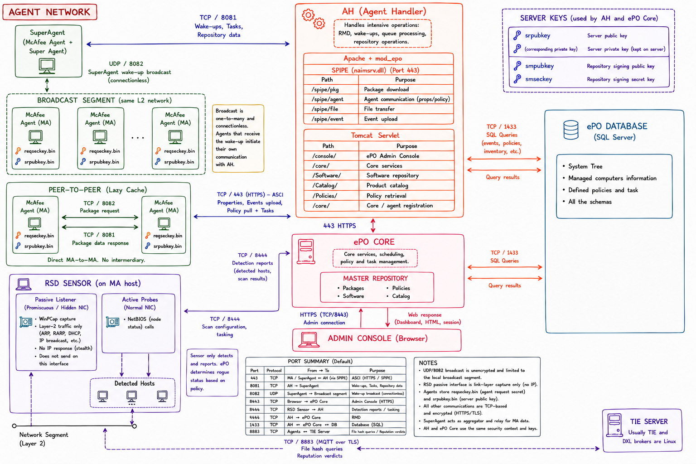

*End-to-end ePO architecture: McAfee Agents, SuperAgent broadcast and peer-to-peer paths, RSD sensors, the Agent Handler, ePO core, SQL Server, and the DXL/TIE path.*

### 3.2. Ports

| Port      | Direction     | Purpose                                                        | Notes                                                                            |
| --------- | ------------- | -------------------------------------------------------------- | -------------------------------------------------------------------------------- |
| **TCP 8443** | Console → Core | Admin console (HTTPS to Tomcat)                                 | Java Servlet `j_security_check` login; TLS via `keystore.bin`                    |
| **TCP 443**  | Agent → AH/Core | SPIPE over HTTPS (`/spipe/agent`, `/spipe/pkg`, `/spipe/event`) | HTTPS transport; inner body is SPIPE-encoded (§ 8)                              |
| **TCP 80** or **TCP 8081** | Agent → repo | HTTP GET for repository content                    | Not encrypted — content packages are signature-protected                         |
| **TCP 8081** | AH/Core → Agent, SuperAgent → Agent | Wake-up call to force an ASCI                | Broadcast to **UDP 8082** by SuperAgents in the segment (§ 6)                    |
| **TCP 8082** | SuperAgent → Agent (broadcast) | Wake-up broadcast to a whole segment            | Reduces N point-to-point wake-ups to one broadcast                                |
| **TCP 8883** | Agent / TIE → DXL broker | MQTT over TLS (DXL bus)                                    | Persistent connection (§ 15)                                                     |
| **TCP 8444** | (historic) direct RSD Sensor → ePO | Legacy direct channel used by RSD 4.7 and earlier | Superseded — RSD now routes through the McAfee Agent DataChannel                 |
| **UDP 8431** | Sensor ↔ Sensor | RSD sensor-election multicast (§ 18)                        | Configurable per RSD policy                                                       |

### 3.3. Three transport planes

1. **HTTP** — carries **content**: DAT and AMCore content packages, engine binaries, product packages, agent updates. All plaintext from a repository; integrity is enforced by the DSA/RSA signature over the catalog (§ 9.3).

2. **SPIPE over HTTPS** — carries **control**: policies (server → agent), events (agent → server), and properties (agent → server). Doubly protected: outer TLS (Tomcat's `keystore.bin`) plus inner SPIPE encryption (agent/server RSA + 3DES) plus signature (§ 8).

3. **SMB** — carries **evidence**. DLP-captured file evidence is written to an evidence share over SMB, not through the SPIPE plane, because the payloads are large.

The DXL bus (§ 15) is a fourth plane in ENS-era deployments — MQTT pub/sub between agents, brokers, and TIE, distinct from the client-server planes above.

---

## § 4. ePO core: request routing

### 4.1. Apache + `mod_epo` + `naimserv.dll`

The ePO server is a two-process front: **Apache (`httpd`)** for HTTPS termination and the SPIPE endpoints, and **Tomcat** for the admin console and Java servlet-backed APIs. Apache holds two ePO-specific modules:

- **`mod_epo.dll`** — the Apache handler for SPIPE URIs. When a request arrives at `/spipe/*`, `mod_epo` accepts it as HTTPS POST, extracts the SPIPE-encoded body, and hands it to `naimserv.dll`.

- **`naimserv.dll`** ("Network Associates Interface Manager Server") — parses the SPIPE inner request. Calls `NAISIGN` for RSA unwrap plus DSA/RSA signature verification, decrypts the 3DES/AES payload, decompresses, and hands the resulting properties XML / events / package upstream.

- **`mod_eporepo.dll`** — the Apache module that serves repository content on `/Software/*` (§ 4.4).

The SPIPE plug-ins live in Apache rather than Tomcat because the SPIPE decode is cheap CPU work and does not need the JVM. The Tomcat side handles anything that requires application logic — policies, reports, the console.

**Orion** is McAfee's internal name for the **Foundation Services platform**, the Java application running inside Tomcat. Every servlet class name in the ePO codebase begins `com.mcafee.epo.orion.*`; a stack trace or log line mentioning Orion is on the Tomcat side.

### 4.2. URI routing across Apache and Tomcat

Everything under `/spipe/*` and `/Software/*` goes to Apache; everything under the console URIs and the Web API goes to Tomcat.

| URI                                                                                                                                                                                                                  | Served by                                  | Protocol notes                                                                                                                                                                                                                                                                                                                                                                      |
| -------------------------------------------------------------------------------------------------------------------------------------------------------------------------------------------------------------------- | ------------------------------------------ | ----------------------------------------------------------------------------------------------------------------------------------------------------------------------------------------------------------------------------------------------------------------------------------------------------------------------------------------------------------------------------------- |
| `/spipe/agent`, `/spipe/agent2`, `/spipe/pkg`, `/spipe/file`, `/spipe/event`                                                                                                                                          | Apache + `mod_epo.dll` + `naimserv.dll`    | HTTPS transport; body must be POST, SPIPE-encoded                                                                                                                                                                                                                                                                                                                                   |
| `/Software/Current/...`, `/Software/Previous/...` (backup)                                                                                                                                                           | Apache repo handler (`mod_eporepo.dll`)    | Plain HTTPS GET (agent pulls)                                                                                                                                                                                                                                                                                                                                                       |
| `/Catalog/`, `/Repository/`, `/Policies/`                                                                                                                                                                            | Tomcat servlets                            | JSON/XML API, HTTPS                                                                                                                                                                                                                                                                                                                                                                 |
| `/core/orionSplashScreen.do`, `/core/config.do`, `/core/orionDefaultPage.do`, `/core/orionNavigationLogin.do`                                                                                                          | Tomcat — admin console (port 8443)         | `.do` = Apache Struts `ActionServlet` mapping                                                                                                                                                                                                                                                                                                                                       |
| `/SoftwareMgmt/*` (Master Repository / Extensions / Licensing), e.g. `/SoftwareMgmt/enterLicenseKey.do`                                                                                                               | Tomcat — admin console                     | The license key page has a `returnURL` GET parameter that was abused in **CVE-2021-23888** (see [blog.vibri.us](https://blog.vibri.us/CVE-2021-23888-McAfee-ePolicy-Orchestrator-HTML-Injection/))                                                                                                                                                                                    |
| `/PolicyMgmt/*` (Policy Catalog), e.g. `/PolicyMgmt/policyDetailsCard.do`                                                                                                                                             | Tomcat — admin console                     | Policy Catalog reflected XSS in **CVE-2020-7318**                                                                                                                                                                                                                                                                                                                                    |
| `/remote/*` (Web API): `/remote/core.help`, `/remote/core.executeQuery`, `/remote/core.listTables`, `/remote/core.listDatatypes`, `/remote/system.findGroups`, `/remote/system.importSystem`                          | Tomcat — Web API                           | Documented at [docs.trellix.com](https://docs.trellix.com/bundle/trellix-epolicy-orchestrator-on-prem-web-api-scripting-reference-guide/page/UUID-8df5c181-2be6-8b3e-f562-e5b292a385ca.html). Example: `https://servername:8443/remote/core.executeQuery?target=OrionTaskLogTaskMessage&select=(select OrionTaskLogTask.Name OrionTaskLogTaskMessage.Message)&joinTables=OrionTaskLogTask` |
| DataChannel **processing**: `/receiveDataChannelMsg.dcp`<br>DataChannel **redirect**: `/dcRedirect/dataChannelMsg.dc`                                                                                                | Apache + `mod_epo.dll` + `naimserv.dll`, plus Tomcat servlets | HTTPS POST, SPIPE-encoded body. The redirect endpoint is a Tomcat servlet class `com.mcafee.epo.dataChannel.servlet.redirect.EPODataChannelRedirectServlet` (see § 4.5)                                                                                                                                                                                                             |

### 4.3. Admin console: authentication and where credentials live

The admin console is served on TCP 8443. Authentication uses the Java Servlet spec's form-login handler `j_security_check`; credentials are validated against the `OrionUsers` table (for local accounts) or delegated to a configured LDAP/AD server (for AD-backed accounts).

AD-backed console accounts are immune to compromise of the `OrionUsers` table, because authentication is delegated at login time. Local account passwords, in contrast, are stored in `OrionUsers` and are compromised if the table is exfiltrated. Local accounts include the default `admin` account created at ePO installation.

Password hashes in `OrionUsers` can be brought into a format John the Ripper accepts using the `mcafee_epo2john.py` extractor at [github.com/willstruggle/john/blob/master/mcafee_epo2john.py](https://github.com/willstruggle/john/blob/master/mcafee_epo2john.py). The salt is per-account and the hash construction is SHA-based.

### 4.4. Serving repository content: `mod_eporepo` and the cache

When a managed McAfee Agent issues a `GET /Software/Current/VSCANENG1000/Engine/0000/replica.log`, Apache's `mod_eporepo` module walks these steps:

1. Resolves the URI path against the repository's filesystem layout.
2. Checks whether the file is already in `\DB\RepoCache\` (the served cache).
3. If not, and **lazy caching** is enabled, pulls the file from the canonical source. For the ePO server itself the canonical source is `\DB\Software\` (the Master Repository); for a SuperAgent or Distributed Repository, it is an upstream fetch from the Master Repository.
4. Copies it into `\DB\RepoCache\` and streams it back to the requesting agent.
5. Logs success/failure to `server.log` with the `MOD_EPOREPO` component prefix.

`\DB\Software\` vs `\DB\RepoCache\`: only the Master Repository writes to `\DB\Software\`; the cache is the *served* copy, subject to lazy-caching policy and eviction. Repos configured **without** lazy caching pre-stage everything to `\DB\RepoCache\` via a Repository Replication server task.

### 4.5. The DataChannel authentication bypass (CVE-2016-8027 / TALOS-2016-0229)

**DataChannels** were introduced around ePO 5.x to allow simultaneous ASCI and DataChannel communications for optimal efficiency. Intended flow: authenticated console users POST to `/receiveDataChannelMsg.dcp` on Tomcat, carrying the session cookie, and the servlet class `EPODataChannelServlet` (`com.mcafee.epo.dataChannel.servlet.EPODataChannelServlet`) processes the message.

Talos's TALOS-2016-0229 disclosed a forwarding pivot. A **second** servlet — `EPODataChannelRedirectServlet` mapped at `/dcRedirect/dataChannelMsg.dc` — accepts a POST and internally calls:

```java
getRequestDispatcher("/receiveDataChannelMsg.dcp").forward(req, resp);
```

Tomcat then runs `EPODataChannelServlet.doPost()` with the same request, but the dispatch is an internal forward rather than a fresh external request, so the servlet-container authentication filter that normally guards `/receiveDataChannelMsg.dcp` does not fire. The redirect servlet is unauthenticated by design (it accepts messages from agent side channels), and it forwards to an endpoint that assumes it is protected.

The fix (delivered in a subsequent ePO update) added an explicit authentication check inside `EPODataChannelServlet.doPost()` rather than relying on the container filter — moving trust out of the URI-based ACL into the request handler.

---

## § 5. Agent Handler

An Agent Handler terminates SPIPE from agents, forwards to SQL, and serves repository content — nothing else.

- **Terminates SPIPE from agents.** All the crypto in § 8 runs on the AH. From the agent's perspective, an AH is indistinguishable from the ePO core; the same `srpubkey.bin` verifies its keying and the same DSA/RSA challenges apply.
- **Talks directly to SQL.** For routine things — events, property updates, policy fetch — the AH opens a direct connection to the ePO database. Its `db.properties` file holds SQL connection info; the secret is DPAPI-encrypted under `LOCAL_SYSTEM`. An attacker with `LOCAL_SYSTEM` on the AH host can decrypt it and reach SQL directly.
- **Serves repository content via HTTP** with lazy caching, pulling content from the Master Repository when a client asks for it.
- **Issues ePO-initiated wake-up calls.** When an admin clicks "Wake Up Agents" in the console, the core delegates the outbound TCP/8081 connection to each endpoint to an AH. The AH walks its list of target agents and opens a TCP/8081 connection to each.

An AH does **not** run:

1. The full Tomcat application server or any of the console business logic.
2. The Event Parser.
3. Policy evaluation.

---

## § 6. SuperAgent and Peer-to-Peer content distribution

`macmnsvc.exe` (registered as the `McAfeeFramework` "Common Services" service) hosts the SuperAgent functionality. A SuperAgent is a regular McAfee Agent with the "Convert to SuperAgent" flag set in its policy — the same `macmnsvc.exe` binary runs everywhere; the policy flag turns on the extra roles.

### 6.1. The two roles a SuperAgent plays

**Role 1 — Wake-up broadcast relay.** An AH that receives an admin "Wake Up Agents" request for endpoints in segment X sends *one* wake-up call to the SuperAgent in segment X (TCP 8081). The SuperAgent re-broadcasts on **UDP 8082** to the segment. Every MA on that segment sees the broadcast and initiates an ASCI to its AH.

**Role 2 — Local repository mirror.** A SuperAgent holds a local mirror of the distributed repository, serving DAT / AMCore / product content over HTTP on TCP 8081 to nearby agents. Two modes:

- **Replication mode** (default): a Repository Replication server task pushes the full Master Repository contents to the SuperAgent. Pre-staged mirror.
- **Lazy Caching mode** (opt-in checkbox in the SuperAgent's repository config): pulls content only as clients request it.

### 6.2. "Am I a SuperAgent?"

Registry check:

```
HKLM\SOFTWARE\Mcafee\ePolicy Orchestrator\Agent  →  IsSuperAgent
```

A non-zero value means the local `macmnsvc.exe` is running the SuperAgent code paths.

---

## § 7. McAfee Agent internals: services, drivers, and ASCI

### 7.1. The two services

- **`masvc.exe`** (registered as `McAfeeFramework`) — the primary McAfee Agent service. It performs property collection, policy enforcement, scheduling, ASCI invocation, and update sessions.
- **`macmnsvc.exe`** (`McAfeeFramework` "Common Services") — hosts the SuperAgent code paths, the P2P listener, and inter-agent RPC over named pipes (§ 7.3).

### 7.2. ASCI: the heartbeat

**ASCI (Agent-Server Communication Interval)** is the client-initiated heartbeat. Every hour by default, `masvc.exe` opens an HTTPS connection to its assigned AH (or the ePO core) over TCP/443 and runs the SPIPE handshake. During ASCI the agent sends up its collected properties and any queued events, and pulls down policy or task updates.

Wake-up calls (§ 5.1, § 6.1) are the server-initiated trigger to force an out-of-schedule ASCI without waiting for the natural interval. They are how the admin-visible "Apply Policy" and "Deploy Software" actions get pushed to endpoints in minutes instead of the next ASCI cycle.

### 7.3. The kernel driver stack

The endpoint agent installs a family of kernel drivers, each covering a specific piece of endpoint security.

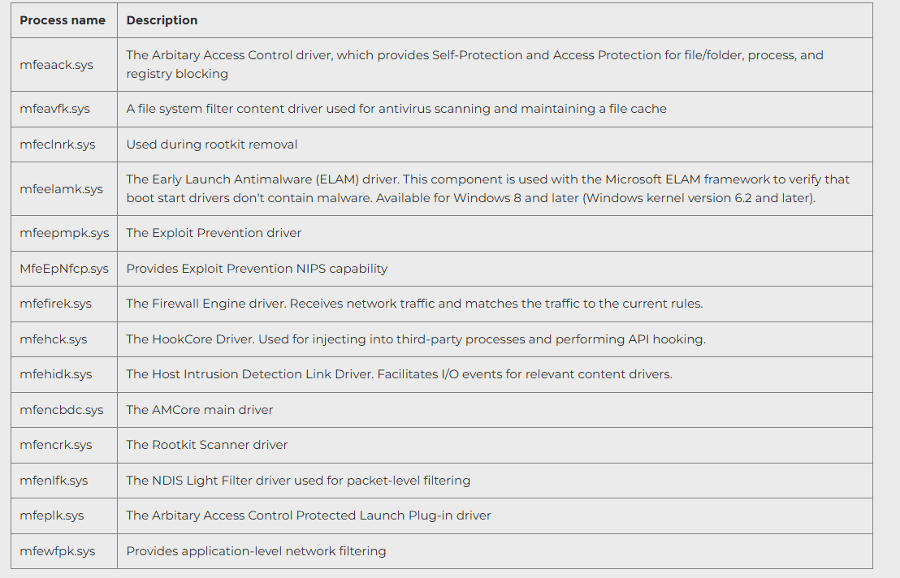

*Source: [Trellix KB87791](https://support.trellix.com/s/article/KB87791?language=en_US).*

Dependencies inside the driver graph: **`mfehidk.sys`** is the "link" driver that most product content drivers hang off — its description is "Facilitates I/O events for relevant content drivers." If `mfehidk` is dead or bypassed, the rest of the stack loses its I/O plumbing. **`mfencbdc.sys`** is the AMCore main driver and depends on `mfehidk` for the I/O events it inspects. **`mfewfpk.sys`** anchors ENS Threat Prevention's network / exploit-prevention hooks on top of the Windows Filtering Platform (WFP) — Microsoft's post-Vista framework for kernel-mode network inspection without NDIS hooking.

### 7.4. Named pipes

The endpoint agent processes talk to each other and to loaded plug-ins over named pipes with GUID-and-PID-encoded names:

```
\\.\pipe\ma_<guid>_<pid>_...
```

`masvc.exe` is the server end of most of these. Any process that wants to speak to the agent — DLP's `fcag.exe`, ENS's `mfehcs.exe`, TIE, MAR — opens a client end and speaks a McAfee-defined RPC frame. The GUID/PID naming lets multiple product plug-ins co-exist without namespace collisions.

---

## § 8. SPIPE: the wire protocol

### 8.1. What SPIPE actually is

- Not a Windows named pipe.
- An add-on on top of HTTP(S) POST.
- Heritage name from the late-1990s NAI (Network Associates) architecture. The protocol was originally designed for a transport that *did* use Windows named pipes for in-host agent communication; the abstraction was preserved verbatim when the implementation moved to HTTP(S).

SPIPE is an outer envelope that wraps a compressed, signed, and encrypted inner blob (properties XML, an event batch, a package). The wrapper uses RSA to protect an ephemeral 3DES / AES session key; the payload is encrypted with that session key. Sessions do not persist — each SPIPE message carries its own ephemeral key.

SPIPE also applies a 0xAA XOR obfuscation over parts of the outer wrapper. This is not cryptographic. Its historical role was to make casual sniffing of Windows named-pipe traffic in the 1998 era harder.

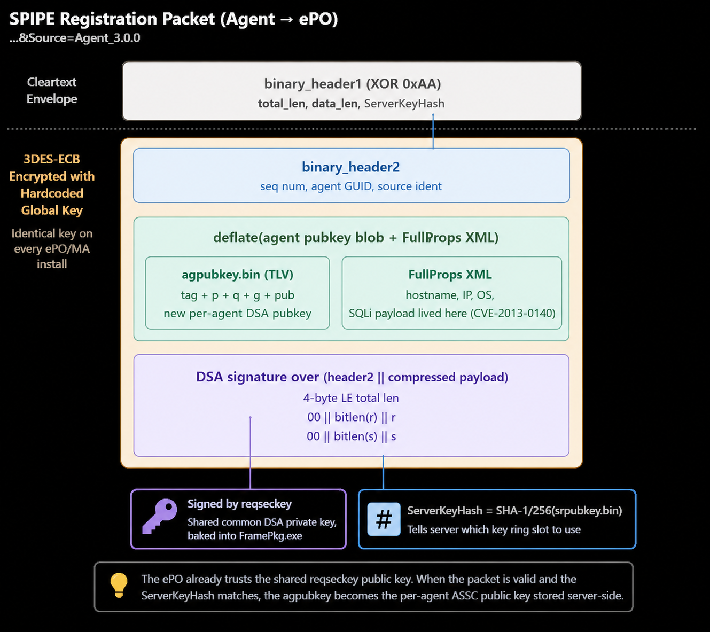

*The SPIPE frame at the wire — outer HTTP wrapper, then binary header 1 (RSA-encrypted session key), binary header 2 (metadata), then the encrypted-and-compressed payload.*

### 8.2. SPIPE fields

Details drawn from Talos's [TALOS-2016-0229 report](https://talosintelligence.com/vulnerability_reports/TALOS-2016-0229) and the epowner protocol notes.

- **`SequenceNumber`** — replay-prevention counter. Increments per ASCI; ePO rejects out-of-order updates. Only effective if the server enforces it; ePO 4.6 accepted stale values (one of the doors epowner walked through).

- **`ServerKeyHash`** — the SHA hash of ePO's public key (`srpubkey.bin`). The agent embeds this in requests so the server can select the correct private key when multiple key rails coexist (1024-bit and 2048-bit rails both live on the server; see § 8.3).

- **`AgentGuid`** — the agent's assigned identity, issued by ePO on first successful registration. Before that, the agent uses a temporary GUID it generated for itself.

- **`TenantId`** — MVISION / SaaS tenant scoping. Absent on on-prem 5.10.

### 8.3. 1024-bit and 2048-bit key rails, coexisting

An agent's keystore holds two parallel rails: **`srpubkey.bin`** (1024-bit RSA, the legacy rail) and **`sr2048pubkey.bin`** (2048-bit RSA). Each is used to encrypt the ephemeral session key inside SPIPE `binary_header1`. Both sets exist simultaneously to support legacy infrastructure — an agent talking to an older ePO can fall back to 1024-bit; a modern ePO prefers 2048-bit.

The `ServerKeyHash` field tells the server *which* rail this specific message is using, so the correct private key (`srseckey.bin` or `sr2048seckey.bin`) is loaded on the server side to decrypt.

---

## § 9. Repositories and packages

### 9.1. The content pipeline, top to bottom

Content flows from McAfee's public CDN down to the endpoint through a fixed chain of repositories. Every hop is a *pull* — nothing is pushed except the admin-initiated check-in at step 3.

1. **Trellix public catalog (cloud)** — McAfee Labs' CDN at `update.nai.com`.
2. **Poll ePO Master Catalog (in the ePO DB)** — an admin server task pulls updates from step 1 into the ePO DB metadata.
3. **"Check in" to the ePO Master Repository (on-disk on the ePO server)** — `C:\Program Files (x86)\McAfee\ePolicy Orchestrator\DB\Software\Current\` (and `Previous\` for rollback). This is the admin decision point.
4. **Replicate to Distributed Repositories (UNC / HTTP / SuperAgent)** — these mirror subsets of the Master Repository. Replication is scheduled or triggered by the admin.
5. **Pull by endpoint** — the McAfee Agent uses its `siteList.xml` (§ 9.4) to pick the closest reachable repo and pulls content from it.

### 9.2. Package types

Two categories:

1. **Content packages.** For instance **DAT v3** (AMCore content), which is file signatures and detection logic. Content packages update frequently — daily or more often — and every managed endpoint eventually pulls each one.

2. **Product packages.** Actual installable software: VSE, ENS Threat Prevention, ENS Firewall, ENS Web Control, DLP, the McAfee Agent itself, Solidcore, and so on. Each is an MSI or CAB bundle with a `PkgCatalog.z` metadata file describing what it deploys, its dependencies, and which Product Deployment task can pick it up. Product packages are versioned by product version (e.g. ENS 10.7.0 → 10.7.1) and carry a `PkgCatalog.xml` describing the contents.

### 9.3. Catalogs and signing

Two catalog files sit at the top of the format tree:

- **`catalog.z`** — the **site catalog**. Located at `/Software/catalog.z`. Repository-level metadata: it enumerates which products and branches this repository contains, plus signatures over each branch. Small (a few KB). Signed with the master repo private key (`smseckey`). When an agent first contacts a repo it pulls `catalog.z`, verifies the signature against `smpubkey`, and reads the branch list.

- **`PkgCatalog.z`** — the **package catalog**, one per product/branch. Located at `/Software/Current/<ProductID>/PkgCatalog.z`. Lists the actual package files with versions, sizes, hashes, and incremental-update relationships. The DAT product's `PkgCatalog.z` tells the agent that the current full DAT is `avvdat-10563.zip` with MD5 X, and that an incremental from version 10562 can be applied using `gdeltaavv.ini`. Each delta is itself a normal signed package.

The extension `.z` is a McAfee convention: it does **not** mean raw zlib. The on-disk format is **encrypted CAB** (Microsoft Cabinet) containing the XML manifest plus its detached signature.

All McAfee packages are signed. `smpubkey.bin` is distributed in the agent's keystore so it can verify catalogs and packages before installation. The encryption over the CAB uses a hardcoded 3DES-ECB key:

```
key = SHA.new(b'<!@#$%^>').digest() + bytearray(4)
```

The same hardcoded key wraps `catalog.z`, `PkgCatalog.z`, and (as § 8 noted) parts of the SPIPE registration packets. Encryption is obfuscation, not security — the DSA-1024 / RSA-2048 signature is the integrity gate.

Server side: `catalog.xml` → `.cab.tmp` → `.cab` (signed with `smseckey`) → `.z` (3DES-wrapped). Agent side: pull the `.z`, unwrap the 3DES with the hardcoded key, verify the signature via `smpubkey` selected by `key_hash`, extract the XML.

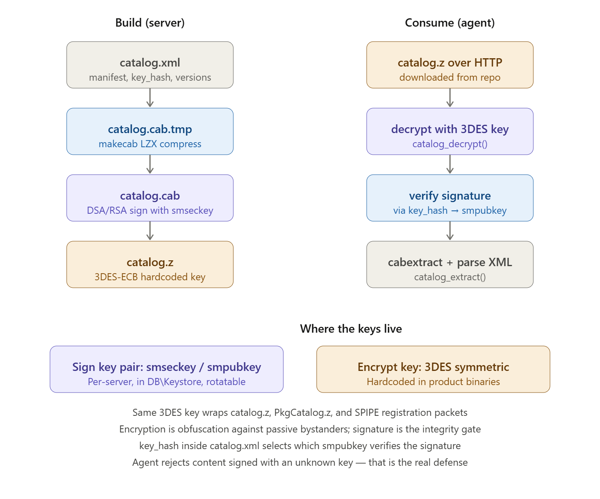

*The `catalog.z` build and consume paths: the server signs before applying the hardcoded 3DES wrapper; the agent decrypts, verifies with `smpubkey`, and only then extracts the catalog.*

Key rotation: `smseckey` and `smpubkey` can be rotated per-server; the 3DES key is hardcoded and never rotates. Whenever a new package is checked in, the admin is prompted about signature verification:

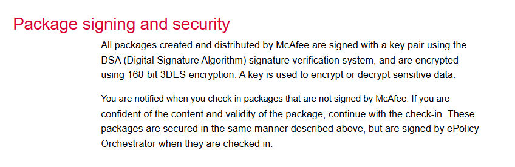

*McAfee’s package-signing documentation: checked-in packages are signature-verified, while package encryption protects sensitive package data. Source: [ePolicy Orchestrator 3.6 walkthrough guide](https://www.manualslib.com/manual/384331/Mcafee-Epolicy-Orchestrator-3-6-Walkthrough-Guide.html?page=44).*

Anything not signed by McAfee triggers a check-in warning; if the admin proceeds, the ePO server re-signs the package with its own `smseckey` before storing it. This is how community-supplied or reverse-engineered products enter the ePO repository.

Related registry entry: `HKLM\SOFTWARE\McAfee\Endpoint\Common\Certs → AMCore`. This is the AMCore root-CA blob used to verify AMCore content packages (`amcore_content_*.zip`) at load time — a separate verification anchor alongside the `smpubkey` rail.

### 9.4. `siteList.xml`: how repositories are located, and how the passwords were broken

`siteList.xml` is an ordered list of repositories with weights and priorities. The list typically contains: ePO master, distributed repos (SuperAgent Distributed Repositories, HTTP repos, UNC repos), and `McAfeeHttp` / `McAfeeFtp` fallbacks that point at the public McAfee update CDN.

The agent obtains `siteList.xml` from two places: from policies (delivered via SPIPE during ASCI), and during initial agent bootstrap via `FramePkg.exe` (§ 22). The assigned Agent Handler or SuperAgent is written into `HKLM\SOFTWARE\Mcafee\ePolicy Orchestrator\Agent → ePOServerList`.

Runtime lookup, when the agent needs content:

1. The agent reads its `siteList.xml`.
2. Picks the highest-priority reachable repo. A SuperAgent SADR for this segment is usually at the top.
3. Plain HTTP GET on port 8081: `http://<superagent>:8081/Software/Current/catalog.z`.
4. Verifies `catalog.z`'s signature with `smpubkey.bin`.
5. Reads `catalog.z` to find which products live in this repo.
6. For each product the agent updates: `GET /Software/Current/<ProductID>/PkgCatalog.z`, verify, parse.
7. GET the actual package files referenced inside `PkgCatalog.xml`.
8. If the SuperAgent is in Lazy Caching mode and does not have the file, it transparently pulls from the master and serves it back.

The credentials embedded in `siteList.xml` are the machine-credentials for each distributed repository. The file is plaintext and the passwords are only obfuscated:

- Static 3DES key from ASCII `<!@#$%^>` via SHA-1 + 4 null bytes (same key as the catalog wrapper).
- 16-byte XOR mask `12 15 0F 10 11 1C 1A 06 0A 1F 1B 18 17 16 05 19`.

Three decryption tools implement this:

1. **PowerSploit** — [Get-SiteListPassword](https://powersploit.readthedocs.io/en/latest/Privesc/Get-SiteListPassword/).
2. **FXWarChest** — [github.com/FXWarChest/McAfeeSiteList](https://github.com/FXWarChest/McAfeeSiteList).
3. **funoverip** — [mcafee_sitelist_pwd_decrypt.py](https://github.com/funoverip/mcafee-sitelist-pwd-decryption/blob/master/mcafee_sitelist_pwd_decrypt.py) (same author as epowner).

`siteList.xml` on-disk ACL depends on install version:

- Older installs: `C:\ProgramData\McAfee\Agent\` had ACLs `SYSTEM:F, Administrators:F, Users:R`, allowing any local user to read the file. This directory holds the agent runtime state including `DB\ma.db`, `data\`, and `logs\`.
- More recent installs restrict the ACL. `mrd0x`'s [research](https://mrd0x.com/discovering-mcafee-products-zero-day-vulnerabilities/) shows the parent-folder permission issue that let a low-privileged user copy the McAfee Agent directory to their desktop and then execute `maconfig.exe -getsiteinfo`.

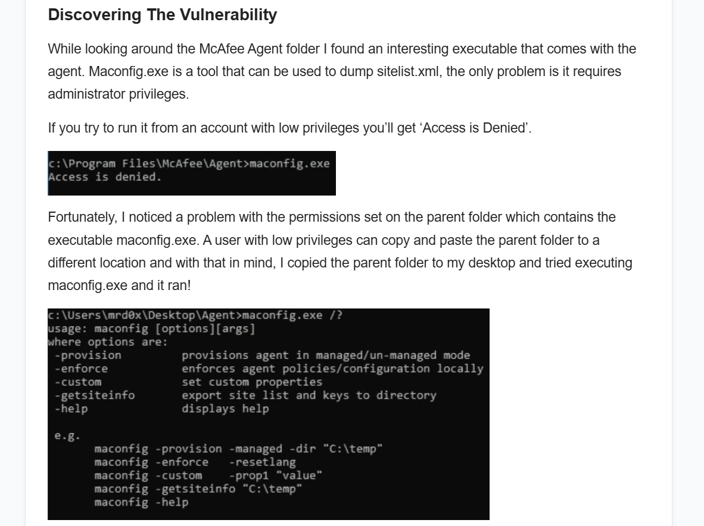

*From `mrd0x`'s McAfee Agent zero-day research: `maconfig.exe` refuses to run from `C:\Program Files\McAfee\Agent\` for a low-privileged user, but the parent folder can be copied to a writable location and `maconfig.exe -getsiteinfo` executed there — dumping `sitelist.xml` and its keys.*

Even where `siteList.xml`'s file ACL is tight, an executable with an over-permissive parent folder ACL undoes the file-level protection.

---

## § 10. Keys

Every ePO deployment holds three families of keys. All are provisioned at agent installation time — for a normal McAfee Agent, by the `FramePkg.exe` installer process (§ 22). ePO supports an optional PKI infrastructure on top; it is not mandatory.

### 10.1. ASSC keys — Agent-Server Secure Communication

- **`srpubkey.bin`** + **`srseckey.bin`** — the server's RSA-1024 key pair.
- **`sr2048pubkey.bin`** + **`sr2048seckey.bin`** — the server's RSA-2048 key pair. Both rails coexist; the `ServerKeyHash` field (§ 8.2) selects which is used per message.
- **`reqseckey.bin`** — the agent-side key used for request signing.

Open question: is `reqseckey.bin` a standalone symmetric key, or the private counterpart of a public–private key pair? `FramePkg.exe` writes only `reqseckey.bin` to the agent — no corresponding `reqpubkey.bin`. The most consistent story with epowner's crypto module is that `reqseckey.bin` is treated as a DSA private key whose public counterpart is derived on the server from the agent's registration record. Not proven from binaries; no McAfee document states it cleanly.

### 10.2. Master Repository keys — package signing

- **`smseckey.bin`** — server-side, holds the signing private key ("sm" = **S**oftware **M**anagement).
- **`smpubkey.bin`** — the corresponding public key, distributed to all agents and distributed repos in their keystores. Verifies `catalog.z` and `PkgCatalog.z` signatures.

These are the keys the § 9.3 signing pipeline uses. Rotating `smseckey` requires re-signing every package and re-distributing `smpubkey` to every agent — which is why in practice this rotation is rare.

### 10.3. Tomcat / ePO console TLS

- **`keystore.bin`** under `Server\conf\orion\` — a normal X.509 certificate for the HTTPS console on TCP 8443. Separate from both key families above; used only for the console's TLS.

### 10.4. The keystore layout on disk

The database side holds the keystore records in the SQL `Keystore` table (§ 11.1); the disk side holds the actual binary key files. Anyone with `LOCAL_SYSTEM` on the ePO server can read `smseckey.bin`, `srseckey.bin`, and the `db.properties` DPAPI-encrypted SQL credentials — meaning the security boundary on the ePO server is `LOCAL_SYSTEM`, not any application-level ACL. This is what CVE-2024-4844 (the `orion.keystore` password disclosure) made concretely exploitable.

---

## § 11. The ePO database

### 11.1. Two databases per server

From ePO 5.10 onwards a fresh install creates two databases per ePO server:

1. **`ePO_<servername>`** — the primary database. System tree, policies, tasks, users, repository state, agent properties, keystore metadata.
2. **`ePO_<servername>_Events`** — events-only. Threat events, audit events, DLP events, and everything else that grows unbounded and needs its own retention policy.

The split exists because the events table churns much faster than any other; separating it lets an operator drop the events DB (or restore an older one) without touching policy or agent state.

The **DAL (Data Abstraction Layer)** is the middleware for the Event Parser: it takes parsed event objects, normalises them to CEF, and inserts into SQL Server.

### 11.2. Tables

1. **`EPOLeafNodeMT`** — core managed/unmanaged systems table, one row per endpoint. Holds `AgentGUID`, the agent's public key, `LastUpdate` (the last ASCI timestamp), and the `Managed` bit.
2. **`EPOComputerPropertiesMT`** — `ComputerName`, `DomainName`, `IPAddress`, `OSType`, `OSVersion`, `OSCsdVersion` (service pack), `UserName`, MAC address, free disk space, RAM.
3. **`EPOPolicyTypes`** and **`EPOPolicyObjectMT`** — policy catalog and the concrete policy objects.
4. **`EPOTaskTypes`** and **`EPOTaskObject`** — catalog of task types (`Deployment`, `Update`, `On-Demand Scan`, etc.), keyed by `ProductCode` + `TaskType`.
5. **`OrionUsers`** — console users (local accounts have their password hashes here; AD-backed users do not).
6. **`OrionDirectoryAdministrator`** — service accounts ePO uses to act on the network (pushes agents onto endpoints).
7. **`OrionPermissionSetUser`** — M:N join between users and permission sets.
8. **`EPOSyncDir`** — AD/LDAP sync targets: `server`, `authServer`, `authUser`, `authPassword`. Service-account credentials for AD-synced OUs.
9. **`EPOEvents`** (lives in `ePO_<servername>_Events`) — threat and audit events from products. `AgentGUID`, `ThreatName`, `ThreatType`, `ThreatEventID`, `ThreatCategory`, `ThreatSeverity`, `AnalyzerDetectionMethod`, `ThreatActionTaken`, `TargetFileName`, `TargetHostName`, `SourceProcessName`, and more.

SQL access to `ePO_<servername>` exposes policy, agent inventory, and — via `OrionUsers` and `OrionDirectoryAdministrator` — credential material for lateral movement (sometimes reversible obfuscation, sometimes hash cracking). In the epowner playbook (§ 22.4), the first move after registering a rogue agent is elevation to SQL access.

---

## § 12. Plugins: ENS, DLP, TIE, Drive Encryption

### 12.1. What a plugin is

An ePO **plugin** has two sides: a server-side **extension** (console UI, policy schema, query catalog) and an **endpoint plugin** (the actual product binary that runs on the managed host). Examples: ENS Threat Prevention, ENS Firewall, ENS Web Control, DLP Endpoint, Application Control / Solidcore, Drive Encryption. A fresh install has the McAfee Agent and nothing else.

Endpoint registry key:

```
HKLM\SOFTWARE\McAfee\ePolicy Orchestrator\Application Plugins
```

Each subkey is one installed plugin. Some plugins also have an `active` / `online` value under their plugin key (DLP in particular).

### 12.2. Disabling and removing a plugin: three levers

| Lever                            | Where                                                                                                                                                                            | Effect                                                                       |
| -------------------------------- | -------------------------------------------------------------------------------------------------------------------------------------------------------------------------------- | ---------------------------------------------------------------------------- |
| **Extension removal**            | ePO console → Software → Extensions                                                                                                                                              | Drops server-side policy management; does **not** uninstall the endpoint plugin |
| **Product Deployment task = Remove** | Client Tasks → McAfee Agent → Product Deployment                                                                                                                                | Uninstalls the plugin on the next ASCI                                       |
| **Policy "Enable" toggles**      | Per-policy (ENS-TP Options "Enable On-Access Scan", ENS-FW "Enable Firewall", Web Control "Enable", HIPS IPS "Enable", DLP "Operational Mode", Solidcore Begin/End Update, etc.) | Leaves drivers and services loaded; disables enforcement                       |

Removing the extension server-side does not disable protection on the endpoint — the plugin keeps running with the last policy it received until an explicit uninstall is delivered. Disabling an "Enable" toggle in a policy does not remove the driver — `mfehidk.sys`, `mfewfpk.sys`, and their kin remain loaded and hooking. Only enforcement is silenced.

### 12.3. The Uninstall Key mechanism

For every plugin, the registry key at `HKLM\SOFTWARE\McAfee\ePolicy Orchestrator\Application Plugins\<PLUGIN>` holds an `Uninstall Command` value:

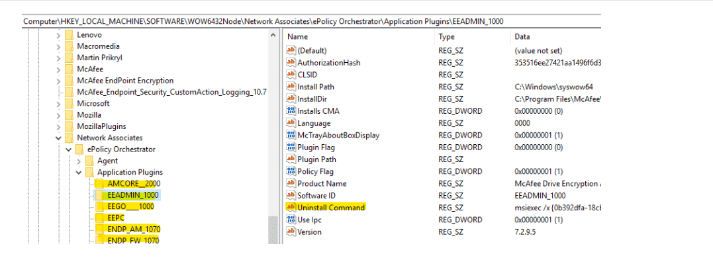

*Example: `EEADMIN_1000` — the Drive Encryption plugin — with its `Uninstall Command` set to `msiexec /x {0b392dfa-18c...`. Every plugin subkey follows this shape, with a product-specific GUID and a version code appended to the plugin name.*

Running `msiexec /x {GUID}` without additional parameters prompts the client for a **Release Code**. Sequence:

- The endpoint generates a machine-specific **Identification Code** (challenge) tied to its current policy revision hash.
- The admin enters this string into the ePO **Systems → Help Desk** console.
- The console derives a time-locked, 64-bit / hexadecimal **Uninstall Key** (Release Code) that expires within a 60-minute window.
- The response is supplied locally through the agent UI or appended to the Windows Installer command via CLI parameters:

```
msiexec.exe /x {DLP-Product-GUID} UNINSTALL_KEY="<Generated_Release_Code>" /qn /norestart
```

This prevents a low-privileged local user (or malware) from uninstalling protection by running the `Uninstall Command` — the plugin refuses to uninstall without a code only the ePO admin can derive.

Why an *identification code* rather than a shared password: a single shared password would let one compromised admin credential disable protection on every host. Binding the response to the endpoint's identification code and current policy revision means a captured response cannot be replayed on a different host, and cannot be replayed on the same host after the policy revision changes.

§ 17.3 covers DLP's variant (challenge–response bypass and uninstall codes) — same mechanism, with more granular time windows and code lengths configurable per-policy.

---

## § 13. Self-protection and VTP

### 13.1. What VTP is

**`mfevtps.exe`** (registered as the `mfevtp` service) is the **Validation and Trust Protection Service**. It establishes a trusted-relationship graph between McAfee processes and the drivers they load, using Microsoft cryptographic APIs to verify that only McAfee-signed (or Microsoft-signed) code touches McAfee-owned kernel driver interfaces. The service is set to `start=auto` and cannot be stopped through Service Control Manager without disabling it first via `sc config`.

VTP:

- Examines DLLs and running processes that interact with McAfee code and verifies they are trusted.
- Controls **VTP privileges** — McAfee-controlled process trust bits — that determine which processes are allowed to open handles to `mfehidk.sys` and the other content drivers.
- Resolves mutual signature checks between SYSCORE / ENS processes. The validation is done in `vtploader.dll`'s exported `ValidateModule` routine.

The service depends on `mfehidk.sys`; if the link driver is dead, VTP cannot function.

`vtpinfo.exe` is a diagnostic tool bundled with the ENS distribution that reports VTP status: currently trusted modules, signature verification outcomes, and pending validations.

### 13.2. How VTP privileges flow from process signatures

McAfee's product binaries (`mcshield.exe`, `mfehidk.sys`, `fcag.exe`, `ESConfigTool.exe`, `Launch.exe`) carry Authenticode signatures with subjects "McAfee, LLC", "Musarubra US LLC", or "Trellix". A running process either has a chain that resolves to one of these subjects (and gets full VTP privileges) or does not (and is restricted from most McAfee-driver interactions).

Historically VTP used path-based checks to identify "which process is this?" before validating the signature. An attacker who convinced VTP to look at the wrong path could get privileges assigned to the wrong process. Two published bypasses:

- **[the-deniss.github.io — "Discovering and exploiting McAfee COM objects" (May 2021)](https://the-deniss.github.io/posts/2021/05/17/discovering-and-exploiting-mcafee-com-objects.html)** — a PEB modification attack that changes the string a McAfee validation routine reads for the current process's path, tricking `ValidateModule` into approving on the wrong signature.

- **[blog.unauthorizedaccess.nl — "Bypass McAfee with McAfee" (Oct 2019)](https://blog.unauthorizedaccess.nl/2019/10/12/bypass-mcafee-with-mcafee.html)** — a file-copy attack: copy a McAfee-signed binary to an attacker-controlled path, have it load an attacker DLL, and let VTP's path-based decisions apply McAfee privileges to an attacker process.

Both bypass the same way: the signature check is authoritative, but the *identity* being signed is derived from something the attacker controls.

### 13.3. Other self-protection processes and drivers

- **`mfeesp.exe`** — the Access Protection rule engine (user-mode). Blocks writes to protected registry keys and files based on Access Protection policy.

- **`mfecanary.exe`** — the tamper watchdog. If it dies, something tried to kill the stack; its death is itself a detected event.

- **`mfehidk.sys`** ("Host Intrusion Detection Link", a minifilter driver) registers callbacks for:
  1. Service stopping.
  2. Registry tampering.
  3. Debugging.

  It decides which processes to protect based on file paths — the same class of path-confusion bug as VTP. See the `blog.unauthorizedaccess.nl` writeup above for a file-copy bypass.

---

## § 14. Host Firewall: ENS-FW and its drivers

### 14.1. Adaptive mode, stateful FTP, stateful SIP

Three features that show up as policy options and change the endpoint's traffic pattern:

- **Adaptive Mode** — learning mode. Instead of blocking on a rule miss, the firewall creates a **Client Rule** permitting whatever the application just did and reports it up to ePO. Admins then review harvested client rules and promote useful ones into policy.

- **Stateful FTP** — the FTP control channel (TCP 21) and data channel (TCP 20 or ephemeral) are negotiated dynamically. Stateful inspection means the firewall parses PORT / PASV commands on the control channel and dynamically opens the data channel rather than requiring the admin to allow wide port ranges.

- **Stateful SIP** — same for SIP / RTP: parse SIP signaling to identify the negotiated RTP ports and open them dynamically only for the duration of the call.

### 14.2. Two kernel drivers, two jobs

Both anchor to the Windows Filtering Platform (WFP) but at different layers:

**`mfewfpk.sys`** — McAfee **Windows Filtering Platform Kernel** driver. A WFP callout / filter driver that anchors ENS Threat Prevention's behavioral and exploit-prevention hooks at the network and process layers via WFP. WFP is Microsoft's post-Vista framework for inspecting and modifying network traffic in kernel mode without NDIS hooking. `mfewfpk` registers callouts at WFP sublayers so ENS can inspect connections, enforce reputation-based blocks (tied into TIE / GTI verdicts), and feed connection metadata to the user-mode policy engine. Generic network inspection plane.

**`mfefirek.sys`** — McAfee ENS **Firewall Kernel** driver. Rule-engine kernel driver for the stateful host firewall component of ENS (descendant of the HIPS / Host IPS firewall). Owns the firewall rule table, connection state tracking, and the permit/deny decision for packets matching ENS Firewall policy. Also hooks into WFP — modern McAfee firewall is WFP-based, not the old NDIS-IM design — but at a different layer than `mfewfpk`. Policy enforcement point for the stateful firewall.

`mfewfpk` inspects everything; `mfefirek` decides on packets that match a firewall rule.

**`mfenlfk.sys`** — NDIS Light Filter driver for lower-level packet filtering, coexisting with the two WFP drivers. Its scope in modern ENS is IPv6 fallback paths where WFP's callout is not enough.

**`MfeEpNfcp.sys`** — Exploit Prevention NIPS (Network IPS) capability specifically, distinct from `mfewfpk`'s general Threat Prevention role.

---

## § 15. TIE and DXL

### 15.1. What TIE stores

**TIE (Threat Intelligence Exchange)** stores a database of file hashes (`MD5`, `SHA-1`, `SHA-256`) along with a reputation record per file. Every reputation carries:

- **`providerId`** — source of the verdict.
  ```
  1 = Enterprise (locally set by admin)
  2 = GTI cloud (McAfee's Global Threat Intelligence)
  3 = ATD sandbox (Advanced Threat Defense on-prem sandbox)
  4 = certificate (verdict tied to the signing cert)
  15 = External (third-party enrichment)
  ```

- **`trustLevel`** — 0–99 integer with named breakpoints:
  ```
  KNOWN_MALICIOUS = 1
  MOST_LIKELY_MALICIOUS = 15
  MIGHT_BE_MALICIOUS = 30
  UNKNOWN = 50
  MIGHT_BE_TRUSTED = 70
  MOST_LIKELY_TRUSTED = 85
  KNOWN_TRUSTED = 99
  ```

0–99 rather than a boolean because endpoint enforcement is often "block below N, prompt between N and M, allow above M" — the granularity lets policy have soft zones.

Server-side, the TIE reputation database is **PostgreSQL** owned by user `mfetie` under `/data/tieserver_pg`. Separate from ePO's SQL Server. TIE's query pattern (millions of point-lookups per second by hash) does not match anything ePO's SQL Server was tuned for.

### 15.2. DXL: pub/sub, not client/server

TIE and the DXL-attached endpoints connect to **DXL brokers on TCP/8883** (MQTT over TLS) and keep the connection open. **DXL (Data eXchange Layer)** is McAfee's brand name for what is mechanically **OpenDXL** — equivalently, Mosquitto 1.4 — with per-node auth handled by the DXL layer.

Pub/sub rather than client-server: the publisher and subscriber are mediated by a broker that validates mutual authentication but otherwise does not participate in the exchange. A new endpoint joins the network, connects to the broker, and starts subscribing to reputation updates without any change to TIE's configuration. A third-party product publishes reputations to `/mcafee/event/tie/file/detection` without becoming a first-class TIE data source.

**TIE subscribes to:** (examples)

- `/mcafee/service/tie/file/reputation` — listens for requests for file reputation.
- `/mcafee/event/tie/file/detection` — receives a file to send to a sandbox provider.

**TIE publishes to:**

- `/mcafee/service/tie/file/reputation` — replies to requests for file reputation.

MQTT topic naming follows McAfee's tree convention: `/mcafee/{event|service}/{product}/{object}/{action}`. An endpoint publishing a novel event only needs to know the topic string; it does not need to know which TIE instance will consume it.

---

## § 16. Hooks: HookCore (ENS) and hdlphook (DLP)

Two user-mode hooking engines coexist on the modern endpoint. Both inject a DLL into every process and patch prologues of NT-level APIs to route calls through a McAfee callback. They differ in origin, in which products load them, and in their kernel-driver plumbing.

### 16.1. HookCore — the ENS user-mode hooking engine

HookCore is part of **ENS (Endpoint Security)**. It injects three DLLs into every monitored process:

1. **`mfehcinj.dll`** — McAfee HookCore Injection.
2. **`mfehcthe.dll`** — McAfee HookCore Thin Hook Environment.
3. **`mfedeeprem32.dll`** — Deep Remediation.

HookCore uses **inline (trampoline) hooking**. Load sequence:

1. `mfehcinj.dll` runs first and calls `GetThinHookInterface`, loading `mfehcthe.dll` via `LoadLibraryA`.

2. Inside `mfehcthe.dll`, the function at `sub_10006180` resolves ~19 NT-level API addresses (via `LdrLoadDll` / `LdrResolveDelayLoadedAPI`) and patches them by calling `WriteProcessMemory` on the **prologue of each function**, writing a 5-byte `JMP` to a McAfee stub. The stub inspects arguments, applies policy, and either returns a policy verdict or continues to the original API with the arguments modified.

   The ~19 hooked APIs skew toward process, service, and memory manipulation (`OpenSCManager`, `CreateService`, `CreateRemoteThread`, `ZwWriteVirtualMemory`, `CoCreateInstance*`, `LdrLoadDll`).

   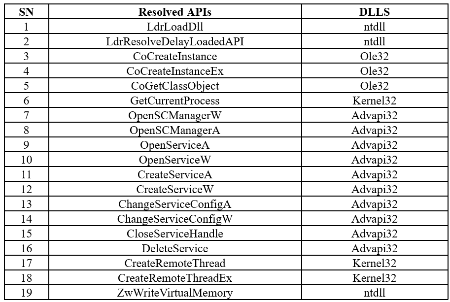

   *The resolved API list from the reverse-engineering writeup at [cyberwarfare.live](https://cyberwarfare.live/edr-series-how-edr-hooks-api-calls-part-1/): 19 NT-level functions spread across `ntdll`, `ole32`, `kernel32`, and `advapi32`.*

3. `mfehcinj.dll` then loads `mfedeeprem32.dll` via `LoadLibraryA`. `mfehcinj.dll` does the trampoline hooking, `mfehcthe.dll` hosts the hooks, `mfedeeprem32.dll` provides remediation actions (kill process, quarantine file).

Kernel and service companions:

- **`mfehcs.exe`** — the HookCore Service, the user-mode process that manages the inline hooks and receives out-of-band control from the ENS user-mode components.
- **`mfehcbdk.sys`** / **`mfencbdc.sys`** — kernel filter drivers in the ENS driver set. Full picture: kernel callbacks + user-mode inline hooks.

Inline trampoline hooking has a fundamental limit: the trampoline lives in the target process's own memory space, so any code inside that process can restore the original prologue with `VirtualProtect` + `memcpy` and un-hook the API. This is the "AV/EDR user-mode unhooking" primitive. ENS Expert Rules (introduced ~ENS 10.7 on ePO 5.10) added a rule-driven engine that does not rely on user-mode hooking at all.

### 16.2. hdlphook — DLP's hooking driver

**`hdlphook.sys`** is McAfee's rebadge of the commercial **madCodeHook** injection driver from Systemsoftware 1999 (its `OriginalFilename` is `madshi.sys`; the `FileDescription` reads "McAfee Injection Driver"). See the [herdprotect signature analysis](https://www.herdprotect.com/hdlphook.sys-2b66332a468c46f2749f51cc431c2c11a5aeb943.aspx). It is not a minifilter driver — it is a code-injection driver.

DLP configures `hdlphook.sys` with its list of allowed hook DLLs (the `fcag*.dll` set below) and signs the configuration with McAfee's Verisign / DigiCert code-signing certificate. The driver uses two Windows kernel APIs to accomplish injection:

- **`PsSetCreateProcessNotifyRoutine(Ex)`** — callback fires on every process creation. `hdlphook` uses this to allocate per-process bookkeeping and section memory, and to decide whether to inject at all (based on the application-template list — § 16.3).

- **`PsSetLoadImageNotifyRoutine`** — callback fires on every image (DLL) map. `hdlphook` waits until `ntdll` and `kernel32` are mapped in the new process, then calls `KeInitializeApc` / `KeInsertQueueApc` to queue a kernel-to-user APC that runs `LdrLoadDll` / `NtMapViewOfSection` in user-mode context to map the McAfee hook DLL.

The APC-based injection lets `hdlphook.sys` inject at process-start time without needing a user-mode helper — delivery happens entirely from kernel mode into a process that has not yet run its first thread's user-mode code.

**CVE-2021-23887** was triggered by `hdlphook.sys` reading invalid memory during this injection sequence — a bad pointer in the callback path led to a kernel BSOD, weaponizable as a DoS against a DLP-protected endpoint.

### 16.3. What DLP hooks: application templates and hook DLLs

DLP's policy engine selects which applications get `hdlphook.sys`-loaded DLLs. Configured in the **Application Template** — an ePO console object that identifies applications by executable name, hash, publisher, or window title. See the [Trellix blog post on preventing ChatGPT data leakage](https://www.trellix.com/blogs/platform/using-data-loss-prevention-to-prevent-data-leakage-via-chatgpt/) for a modern example: DLP templates bring the browser tabs communicating with ChatGPT into scope.

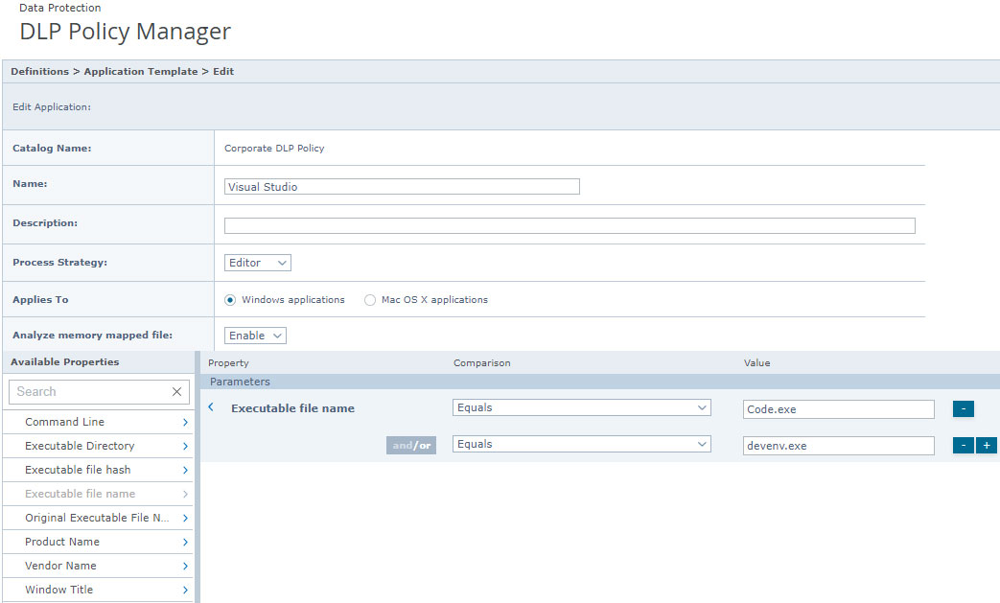

*An Application Template in the DLP Policy Manager: `Visual Studio` is defined by executable file names `Code.exe` OR `devenv.exe`. The "Process Strategy" (Editor) tells the DLP engine to treat the application as an editor for the purposes of clipboard / screen-capture rule application. The AND / OR structure combines constraints (e.g., executable name AND publisher).*

Which DLLs get injected depends on the application category and the enabled rules. Naming convention: `fcag<function-code>[<n>].dll`.

- **Clipboard (`fcagcbh*.dll`)** — hooks the Win32 clipboard APIs in `user32.dll`: `OpenClipboard`, `EmptyClipboard`, `SetClipboardData`, `GetClipboardData`, `CloseClipboard`. Enforces Clipboard Protection rules — blocking or sanitizing copy-paste between classified and unclassified apps.

- **Screen capture (`fcagsch*.dll`)** — hooks the GDI capture APIs in `gdi32.dll` / `user32.dll`: `BitBlt`, `StretchBlt`, `PrintWindow`, `GetWindowDC`, `GetDC(NULL)`. Blocks screen-capture tools from capturing classified windows.

- **Network — cloud upload (`fcagff*.dll`, `fcagchrome*.dll`, `fcagiep*.dll`, `fcagclh*.dll`)** — browser-specific hooks. For Chrome / Edge, `fcagchrome*.dll` performs analogous hooks plus a native messaging component; an installed Chrome extension provides DOM-level integration. Generic `WinINet` / `WinHTTP` (`HttpSendRequest`, `WinHttpSendRequest`) and Winsock (`send`, `WSASend`) are hooked in `fcagclh*.dll` (Cloud Hook) to cover uploads to cloud-storage and SaaS endpoints.

- **File I/O (`fcagafa*.dll`, `fcagcfh*.dll`)** — hooks `CreateFileW`, `ReadFile`, `WriteFile`, `CopyFileW` / `CopyFileExW`, `MoveFileW`, `SHFileOperation` in `kernel32.dll` / `shell32.dll`. Captures application-semantic context (which file was opened from inside Word, including originating thread and parent UI). Actual block / allow / encrypt decisions are made by `hdlpflt.sys` minifilter callbacks (`PreCreate`, `PreWrite`, `PreSetInformation`) in the kernel.

- **Outlook / MAPI (`fcagolh*.dll`)** — an Outlook add-in plus MAPI export-table hooks. Intercepts `Application.ItemSend`-style events in Outlook and the underlying `MAPISendMail` / `OpenIMsgSession` paths, enforcing Email Protection rules before SMTP / Exchange RPC submission.

- **Printing (`fcagpph*.dll`)** — print-spooler `StartDocPrinter` / `WritePrinter` and the GDI printing path for the Printing Protection channel. Often observed loaded into `conhost`, `rundll32`, `taskhostw`, `runtimebroker`, `trGUI`, `msoia` (Microsoft Office), and `SCToastNotifications` (SCCM) — processes that drive print jobs.

The user-mode hooks capture what the application is doing at the API level. The kernel drivers (`hdlpflt.sys` for file, `hdlpdbk.sys` for device, `hdlpevnt.sys` for event channel) make the allow / block / encrypt decisions when file or device I/O crosses the boundary.

---

## § 17. DLP internals

### 17.1. Lineage and process family

DLP is part of the **2008 Reconnex acquisition**. The `fcag` prefix is a Fidelis-era artifact; the `hdlp` prefix is "Host DLP". Three tiers:

- **`fcag*`** — user-mode processes and services.
- **`hdlp*`** — kernel-mode drivers.
- **Application templates** (§ 16.3) — ePO policy objects that select what gets inspected.

An `fcags.exe` strings dump (from a hybrid-analysis sample: [b4254e5d2b46...](https://hybrid-analysis.com/sample/b4254e5d2b461800c3aa457a786eecf8384291f23f4d0df7e2bf747a3700ac19/5cae47eb028838410c30a805)) is a starting point for reverse engineering the internal command tokens.

DLP supports Clipboard content analysis, text extraction, OCR, and screen-capture controls. Policy authoring treats each enforcement point as a **vector**. The product guide shows the complete split between gateway-capable and endpoint-only controls:

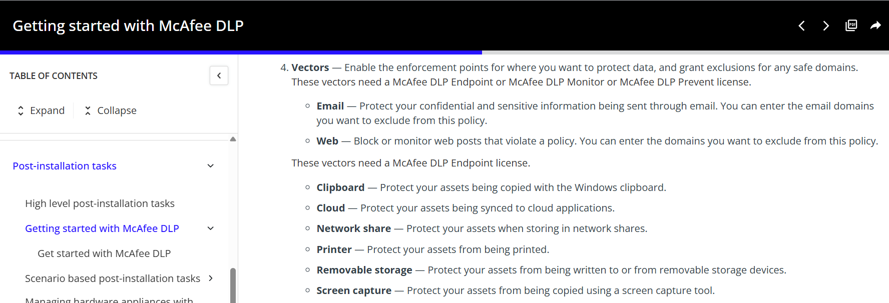

*The full vectors list: Email and Web can be enforced by DLP Endpoint, Monitor, or Prevent; the remaining controls depend on the endpoint client.*

Not every DLP vector requires a full DLP Endpoint license. The DLP product guide identifies **Email** and **Web** as base vectors; six vectors specifically require the DLP Endpoint license:

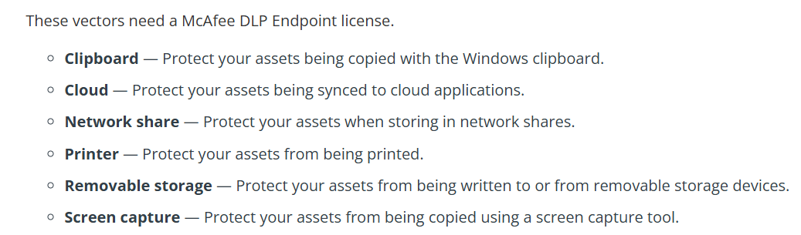

*Focused view of the endpoint-only vectors: Clipboard, Cloud, Network share, Printer, Removable storage, and Screen capture.*

This two-tier split lets an environment install the DLP extension on the ePO server for Email/Web policies on outbound mail gateways without deploying the endpoint agent to every workstation.

### 17.2. The DLP process and driver family

| Process / module                                                                                                                           | What it is                         | What it does                                                                                                                                                                                                                                                                                                                              |
| ------------------------------------------------------------------------------------------------------------------------------------------ | ---------------------------------- | ----------------------------------------------------------------------------------------------------------------------------------------------------------------------------------------------------------------------------------------------------------------------------------------------------------------------------------------- |
| **`fcag.exe`**                                                                                                                             | Main DLP agent (user-mode)          | Rule engine. Loads policy from MA, matches content against rules, decides allow / block / notify / evidence-store.                                                                                                                                                                                                                        |
| **`fcags.exe`**                                                                                                                            | DLP agent service host              | The Windows service wrapper. Hosts `fcag.exe` as a service.                                                                                                                                                                                                                                                                              |
| **`fcagswd.exe`**                                                                                                                          | Self-protection watchdog            | Monitors the other DLP processes; restarts on crash, blocks termination.                                                                                                                                                                                                                                                                 |
| **`fcagte.exe`**                                                                                                                           | Text Extractor (sandboxed)          | The out-of-process text-extraction subprocess. Given any file (Word, Excel, PDF, ZIP, image, etc.), it parses / cracks the format and returns plain text for `fcag.exe` to classify. It runs in a separate process because cracking complex or untrusted file formats is risky — if a malformed PDF crashes the parser, the main agent stays up. |
| **`fcagmt.dll`**                                                                                                                           | Manual tagging shell extension      | Right-click → "Tag" / "Untag" in Explorer. Registered as `fcagmt.dll` added to Windows Explorer under the name "DLP Manual Tagging".                                                                                                                                                                                                     |
| **`hdlphook.dll`**                                                                                                                         | User-mode hook DLL loader            | Injected into apps (browsers, Office, mail, etc.). Intercepts API calls — clipboard, screen-capture, file open / save, network sends — and routes them to `fcag.exe` for policy decision. The `hdlp` prefix is the legacy "Host DLP" name.                                                                                                |
| **`hdlphook.sys`** / **`hdlpdrv.sys`** / **`hdlpctrl.sys`** / **`hdlpdbk.sys`** (device blocking) / **`hdlpevnt.sys`** (event channel)      | Kernel-mode drivers                  | File-system minifilter plus low-level device / process callbacks. The DLP minifilter is what enforces blocks on file open / write to removable media. `hdlphook.sys` itself is the madCodeHook rebrand (§ 16.2).                                                                                                                          |

The named pipes registered under `fcag.exe`:

```
\\.\pipe\AgentServicePipe
\\.\pipe\HdlpDiagServicePipe
\\.\pipe\PropertiesRetrieverPipe0
\\.\pipe\TextExtractorPipe
```

`TextExtractorPipe` is the fast path between `fcag.exe` and the sandboxed `fcagte.exe`. `HdlpDiagServicePipe` is the diagnostic channel used by DLP's local reporting tools.

**One open question about `fcagte.exe`.** Its documented role is text extraction: given a file, return plain text for classification. But `fcagte.exe` also handles original-file copies, screen captures, and clipboard content OCR. It is not clear from the public documentation whether these secondary functions occur only in the case of a triggered DLP event (i.e., only when a rule matches and evidence is being preserved), or whether they run on every inspected file/window. Behaviour observed in the wild suggests the former — evidence capture is triggered by rule match, not by inspection — but this deserves explicit confirmation by anyone tracing DLP CPU spikes.

### 17.3. Bypass, uninstall, and the Help Desk mechanism

**DLP Help Desk** is the ePO console extension that generates the overrides described in § 12.3, specifically for DLP. From the product documentation:

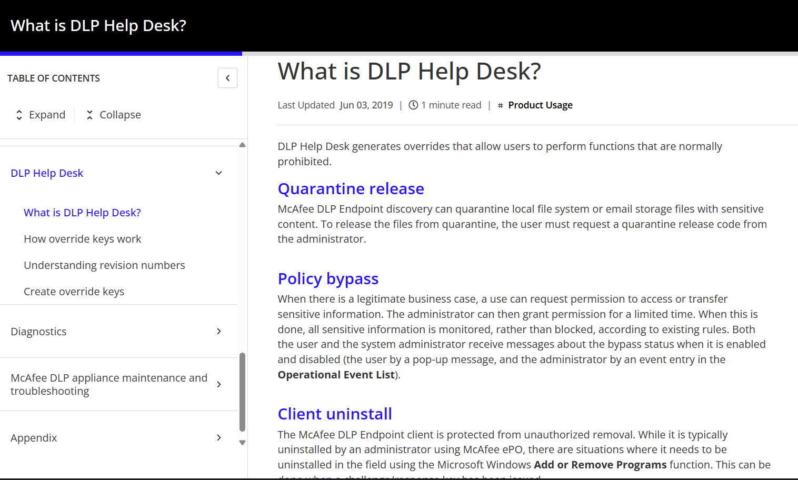

*The DLP Help Desk overview: Quarantine Release, Policy Bypass, and Client Uninstall are the three override types.*

**Quarantine release.** McAfee DLP Endpoint's discovery scanning can quarantine local files or email storage files that contain sensitive content. To release the files from quarantine, the endpoint operator must request a Quarantine Release code from the administrator.

**Policy bypass** flips the DLP agent from enforce mode to **monitor-only mode** — events are still logged and sent to ePO, but all block / encrypt / quarantine actions are suppressed. Traffic is monitored rather than blocked, according to existing rules. Both the endpoint operator and the system administrator receive messages about the bypass status when it is enabled and disabled — the operator by a pop-up, the administrator by an event entry in the Operational Event List.

**Client uninstall.** The McAfee DLP Endpoint client is protected from unauthorised removal. It is typically uninstalled by an administrator using McAfee ePO, but the field-uninstall path via Add or Remove Programs uses the challenge-response mechanism (§ 12.3) so the endpoint operator can uninstall with the right override code.

The mechanics of a bypass:

1. The endpoint operator opens the DLP Endpoint Console, which emits an **Identification Code** (the challenge) and a **Revision ID** (which policy revision this endpoint currently has).
2. The operator reads both codes to the help desk operator.
3. The help desk enters them into the ePO Help Desk extension.
4. The help desk reads a **Release Code** back to the operator.

Internally, the machine computes a MAC using shared DLP-policy key material (established between MA and ePO core during policy delivery) over the Identification Code and Revision ID. The Release Code the ePO Help Desk computes must match — this is why the response is bound to both the specific machine and the specific policy revision.

5. The agent enters bypass mode / allows the uninstall to proceed.

**Where the DLP Settings live.** Within DLP Settings, the relevant section for bypass configuration is the **Advanced** tab. The **Challenge-Response key length** setting is either long (16-digit) or short (8-digit). This is a standing, ordinary product policy that sits in the ePO Policy Catalog under `Data Loss Prevention → DLP Settings`. It is a permanent, always-enforced policy — not something created per-bypass event.

**Timing note.** At bypass time there is no new policy push, no wake-up call, no synchronous exchange with ePO. The client shows the Identification Code and Revision ID *read from its already-deployed policy*, and the help desk's Release Code is verified locally against the same policy material. This is what lets DLP bypass work on an endpoint that is currently disconnected from ePO.

The full override matrix:

| Bound to                                | Individual Bypass / Uninstall code                                     | Master / Global code             |
| --------------------------------------- | ---------------------------------------------------------------------- | -------------------------------- |
| Specific machine (Identification Code)  | ✅ yes                                                                  | ❌ no — works on any endpoint    |
| Specific policy revision                | ✅ default for bypass, mandatory for uninstall                          | ✅                                |
| Specific user / Windows account         | ❌ machine-scoped, not user-scoped                                      | ❌                                |
| Specific session                        | ❌ persists across logoff/logon for the duration window                 | ❌                                |
| Time window                             | 5 min – 30 days (admin-chosen)                                         | 60 min hard cap                  |
| Survives policy push                    | Yes, unless "Stop agent bypass immediately when a new client configuration is loaded" flag is set | Same                             |
| Survives reboot                         | Yes (state restored from policy / event store; timer continues)         | Same                             |
| One-shot vs repeatable                  | Uninstall = one-shot; Bypass / Quarantine / Evidence = repeatable within the window | Same                             |

### 17.4. Device Whitelist

DLP's device whitelist rules can be configured on four kinds of matcher, in decreasing order of specificity:

1. **VID/PID pair** — `VID_0951&PID_1666`. Specific to a device model.
2. **Device Class GUID** — `{4d36e967-e325-11ce-bfc1-08002be10318}`. Covers all devices of a class (this GUID is disk drives).
3. **Device serial number** — specific to an individual device.
4. **Device description** — matches on the string reported by the device's descriptor. This one is fragile (descriptors can be spoofed) and best avoided in production policy.

### 17.5. Evidence encryption

The DLP Endpoint **evidence** store — the local encrypted copy of content that triggered a detection — is encrypted with the **Shared Password**: the `DLP Settings → Shared Password` value, a static password separate from the HMAC key material used for bypass codes. Anyone with the Shared Password can decrypt the evidence store. Mature deployments hold the Shared Password in an HSM-backed vault and rotate it with the DLP Settings policy revision.

Further context on DLP internals and CVE-2019-3621 (a DLP lock-screen bypass): [hackandpwn.com/cve-2019-3621](https://hackandpwn.com/cve-2019-3621/) documents the pre-11.3 issue where killing DLP Endpoint processes immediately before / while the screen was locked let an attacker with physical access bypass the lock via a USB-insert notification.

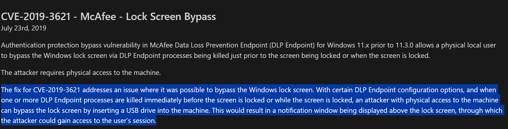

*Published summary of CVE-2019-3621: under affected configurations, killing DLP processes around lock time could expose a USB notification above the Windows lock screen.*

### 17.6. What content ends up in the evidence store

`fcagte.exe` is vendor-confirmed as a text extractor for content classification. The evidence store may hold multiple derivations of a single triggering event:

- Original-file copies (the file that triggered the rule).
- Screen captures of the offending application window (if screen-capture rules matched).
- Clipboard content and its OCR (if the source was image-based).

DLP captures at trigger time and encrypts to the evidence store. The store grows only when rules fire. Under a broad policy (e.g. "all clipboard operations from browser tabs") the volume can be substantial.

---

## § 18. Rogue System Detection (RSD)

RSD is the ePO sub-product that finds unmanaged endpoints on the network by passive listening plus active probing. Managed McAfee Agent endpoints elect a subset of themselves as **sensors**; sensors report findings back through the normal MA→AH channel.

Reference: the [Rogue System Detection 4.7 Product Guide](https://www.microsa.es/biblioteca/McAfee/rogue_system_detection/rsd_471_pg_en-us.pdf).

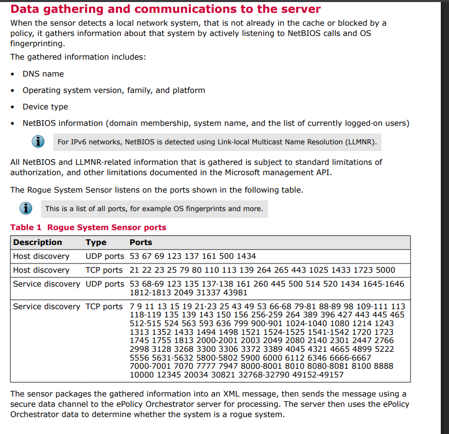

*The RSD architecture from the 4.7 Product Guide: sensors on the LAN discover devices passively (via ARP, DHCP, LLMNR) and actively (via NetBIOS, TCP scan). Findings flow back to ePO via the McAfee Agent DataChannel.*

### 18.1. Sensor election

Within a broadcast domain, ePO elects specific managed McAfee Agent endpoints to act as RSD sensors. The election uses:

- **Sensor Agent GUID** as the comparator (not IP, not uptime — the published criterion is GUID-based).
- **IPv4 / IPv6 multicast group** addresses configurable in policy ("used by the local election feature to send multicast messages").
- **Sensor-to-Sensor communication port**. Default on ePO 5.x is **UDP 8431**.
- **"Wait time for an election result"** (4.x policy setting only) and **"Wait time between active sensor elections"** — cadence tuning.
- **"Set the number of active sensor(s)"** — admin over-ride of the count.

Using Agent GUID rather than uptime or IP keeps the sensor role stable across reboots. An election that flipped the role every reboot would flood ePO with role-change events. GUID is a stable per-endpoint identifier; the endpoint with the lowest GUID wins, and the outcome persists across reboots as long as the same endpoints remain in the segment.

### 18.2. Processes and services

**Services:**

- **`RSSensor.exe`** — runs as the `McAfee Rogue System Sensor` service. Performs broadcast and DHCP detection.

**Processes:**

1. **`RSDPP.exe`** — listens to broadcast (ARP / NetBIOS / DHCP request/response) and DHCP unicast traffic, optionally probing via TCP, to enumerate NICs on the wire: printers, IoT, BYOD laptops, switches, lab equipment, rogue VMs.

2. **`BalashApp.exe`** (from ePO 5.x) — detection-processing helper. Runs the network-event analysis: parsing captured packets and reconciling them against the known-managed-agent inventory.

3. **`Twiddle.exe`** — performs active probes against detected systems (NetBIOS query, OS fingerprint, optional agent-presence ping). Spawned by `RSDPP` when a newly-detected system needs deeper enumeration.

### 18.3. The passive detection phase

The RSD sensor operates in a passive listening mode, sniffing the network segment to identify uncached or unauthorized assets. Parses the following broadcast and multicast protocols at the packet level:

- **ARP / RARP** — the sensor intercepts Address Resolution Protocol (**ARP**, EtherType `0x0806`) and Reverse ARP (**RARP**, EtherType `0x8035`) broadcast requests and replies to map MAC addresses to IPv4 addresses.

- **DHCP** — monitoring **UDP 67 (Server)** and **UDP 68 (Client)**, the sensor captures `DHCPDISCOVER`, `DHCPREQUEST`, and `DHCPACK` packets to extract IP assignments, lease times, and client identifiers.

- **IP Multicast and LLMNR** — the sensor listens to local IP multicast groups. For IPv6 environments lacking NetBIOS broadcasting, it intercepts Link-Local Multicast Name Resolution (**LLMNR**) traffic on **UDP 5355** (targeting multicast address `224.0.0.252` for IPv4 and `ff02::1:3` for IPv6) to detect active network nodes.

The full port list the sensor listens on is documented in the RSD 4.7 Product Guide, page 14. The guide splits it into host discovery (UDP + TCP) and service discovery (UDP + TCP). Notable entries include the OS-fingerprint ports (Windows RPC, NetBIOS SMB, SunRPC portmapper on TCP 111) and a broad service-discovery TCP set that overlaps standard Nmap default port sweeps.

### 18.4. Active probing and record enrichment

When a passive probe uncovers a device missing from the ePO cache, the sensor transitions to active interrogation.

**NetBIOS Node Status.** The sensor generates a NetBIOS Name Service (**NBNS**) **Node Status Query** (Opcode `0x21`), directing the payload to the target asset over **UDP 137** (and connecting via **TCP 139** where applicable). Equivalent to `nbtstat -A <IP>`. The returned NetBIOS name table is parsed for:

- Unique system name and domain / workgroup membership.
- Hex suffixes (e.g. `<00>` = Workstation, `<20>` = File Server).
- Currently logged-on user strings.

**Active probes by the elected sensor (ePO 5.x):**

- TCP 22, 80, 443, 445.
- UDP — the sensor selects the first unused port from 65532, 65533, 65534.

Each detection carries: IP, MAC, DNS name (when resolvable), OS guess, and managed / unmanaged status.

The sensor uses a **hidden network interface in promiscuous mode**. "Hidden" here means the interface is opened via a low-level packet-capture driver rather than a standard adapter binding — `ipconfig` / `netstat` do not show a McAfee interface entry, even though a driver-level tap is active. Historically the driver was **WinPcap** (also used by Wireshark and Nmap); the modern successor is **Npcap**. RSD appears to have moved from WinPcap through Npcap to its own `BalashApp` code path, with `BalashApp` doing detection processing on top of a low-level capture handle it opens directly.

### 18.5. Sensor reporting to ePO

From the RSD 4.7 release notes: sensor communications route through the McAfee Agent DataChannel, eliminating the direct connection formerly needed to the ePO server over **TCP 8444**. Default reporting period for active sensors is 5 minutes.

Port 8444 is still exposed by ePO for some administrative endpoints; its role in the modern RSD flow is unclear — RSD sensor traffic now rides the DataChannel, not port 8444. The port is a legacy holdover.

---

## § 19. Permission Sets and administrative surface

ePO assigns **permission sets** as bundles of specific permissions. A permission set is an M:N relationship between users (in `OrionUsers`) and product actions (defined by the installed extensions), stored in `OrionPermissionSetUser`.

Notable ones:

- **Read-only permission** — dashboard and report visibility, no writes.
- **Master repository check-in permission** — allows an operator to upload packages to the ePO repository. Packages must carry a valid signature; a warning is shown at check-in for anything not signed by McAfee (§ 9.3).
- **DLP Help Desk** — permission included with the DLP extension, unlocking the Help Desk console described in § 17.3.

The DLP extension exposes the same three actions as independently grantable permissions: **Quarantine Release**, **Policy Bypass**, and **Client Uninstall**. This mirrors the three override types shown in § 17.3.

An admin granted DLP Help Desk can issue Bypass codes on demand, which flips DLP into monitor-mode on the target endpoint for hours to weeks. In deployments where DLP is the outbound-data-loss control, DLP Help Desk is equivalent to the ability to disable that control and should be treated with the same care as full ePO admin.

---

## § 20. PPL, shell extension, minifilter altitudes

### 20.1. PPL — Protected Process Light

- **`HKLM\SOFTWARE\Mcafee\Endpoint\AV\PPL`** — registry key controlling PPL configuration.
- **`mfeensppl.exe`** runs as a **PPL anti-malware process**. Windows prerequisite for consuming the **`Microsoft-Windows-Threat-Intelligence`** ETW provider — the kernel-level provider that surfaces process creation with detailed image-load information, which Microsoft protects by requiring the consumer process be AM-PPL.

PPL means:

- Only PPL processes at equal or higher level can open handles to the PPL process.
- Non-PPL processes (including `LOCAL_SYSTEM` shells without PPL) cannot inject code, debug, or terminate `mfeensppl.exe`.

Constraint: PPL requires the Microsoft AM-PPL certificate chain, and any bug in a PPL process is a bug in a heavily-privileged component. McAfee holds the AM-PPL certificate.

### 20.2. Shell extension: `fcagmt.dll` in Explorer

DLP registers a shell extension with a specific CLSID so its right-click menu appears in Explorer:

- CLSID `{BB95DD2C-8D74-4D48-80D4-681549F47188}`.
- `HKCR\CLSID\{BB95DD2C-8D74-4D48-80D4-681549F47188}\InprocServer32` = `C:\Program Files\McAfee\DLP\Agent\fcagmt.dll`.

Shell extensions on Windows are always registered as `InprocServer32` — Explorer loads them into its own process. `fcagmt.dll` in `explorer.exe` then calls into `fcag.exe` via the `AgentServicePipe` named pipe (§ 17.2) to actually perform the tag or untag operation.

### 20.3. Minifilter altitudes

Higher-altitude AV / EDR minifilters get the **first chance** to inspect or veto a write before encryption, replication, or backup filters see it. On the read path, the same filter sees the plaintext result *last* — after decryption, undelete, and so on.

This is why FSFilter Anti-Virus drivers are placed above FSFilter Encryption in the Microsoft-published altitude table: the AV inspects content *before* it becomes ciphertext (write path) and *after* it has become plaintext (read path). The altitude enforces this ordering.

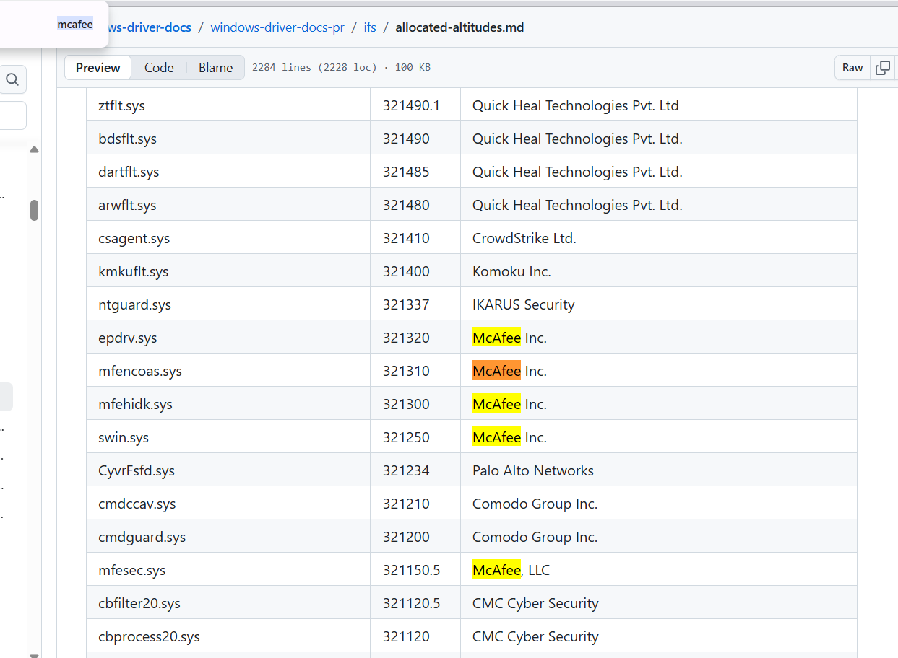

*McAfee's `mfehidk.sys` at altitude `321300.x`, sitting inside the FSFilter Anti-Virus band (320000–329999). CrowdStrike's `csagent.sys` is a band higher at 321410 (still Anti-Virus). Palo Alto's `CyvrFsfd.sys` and Comodo drivers occupy nearby slots. The full altitude allocation is at [MicrosoftDocs/windows-driver-docs · ifs/allocated-altitudes.md](https://github.com/MicrosoftDocs/windows-driver-docs/blob/staging/windows-driver-docs-pr/ifs/allocated-altitudes.md).*

The full minifilter altitude bands, with their `LoadOrderGroup` names, altitude ranges, and representative occupants:

| Band (LoadOrderGroup)                   | Altitude range    | Purpose                                                                                                                                                                            |
| --------------------------------------- | ----------------- | ---------------------------------------------------------------------------------------------------------------------------------------------------------------------------------- |
| Filter                                  | 420000–429999     | `ntoskrnl.exe` itself (425000, 425500).                                                                                                                                            |
| FSFilter Top                            | 400000–409999     | `wcnfs`, `bindflt`, `cldflt`, `iorate`, `dfs`, `csvflt`.                                                                                                                            |
| FSFilter Activity Monitor               | 360000–389999     | Sysmon (385201), MsSecFlt (385600), Carbon Black, EDRs, Digital Guardian, Netskope.                                                                                                 |
| FSFilter Undelete                       | 340000–349999     | Undelete tools, Diskeeper.                                                                                                                                                          |
| FSFilter Anti-Virus                     | **320000–329998** | **mfehidk (321300.x)**, WdFilter (328010), most third-party AV.                                                                                                                     |
| FSFilter Replication                    | 280000–289999     | DFSR, Veeam.                                                                                                                                                                        |
| FSFilter Continuous Backup              | 260000–269999     | Backup agents.                                                                                                                                                                       |
| FSFilter Content Screener               | 240000–249999     | Content inspection.                                                                                                                                                                  |
| FSFilter Quota Management               | 220000–229999     | Quotas.                                                                                                                                                                              |
| FSFilter System Recovery                | 200000–209999     | System Restore.                                                                                                                                                                      |
| FSFilter Cluster File System            | 180000–189999     | CSV.                                                                                                                                                                                 |
| FSFilter HSM                            | 160000–169999     | Hierarchical Storage Management.                                                                                                                                                     |
| FSFilter Compression                    | 140000–149999     | NTFS compression filters.                                                                                                                                                            |
| FSFilter Encryption                     | 140000–149999     | EFS, BitLocker filters (per the Easefilter-republished MS table).                                                                                                                    |
| FSFilter Virtualization                 | 130000–139999     | App-V, virtualization.                                                                                                                                                               |
| FSFilter Physical Quota Management      | 120000–129999     | Hardware quotas.                                                                                                                                                                     |
| FSFilter Open File                      | 80000–89999       | Backup open-file filters.                                                                                                                                                            |
| FSFilter Security Enhancer              | 60000–69999       | Security add-ons.                                                                                                                                                                    |
| FSFilter Copy Protection                | 40000–49999       | DRM.                                                                                                                                                                                 |
| FSFilter Bottom                         | 20000–29999       | Diagnostic / minispy bottom.                                                                                                                                                         |
| FSFilter Activity Monitor (bottom band) | varies            | Lower-band activity filters.                                                                                                                                                         |

---

## § 21. EDR: from MVISION EDR to Trellix EDR

The EDR product ePO manages was announced in 2018 as **MVISION EDR** and renamed **Trellix EDR** after the STG merger. It attaches to the **DXL** broker (§ 15.2), which lets a single detection be published as a signal that both TIE and EDR consume without either being coupled to the other.

Event correlation is done by trace IDs. Fields that appear when tracing an event across ePO logs:

```
parentTraceId
traceId
maTrace          — McAfee Agent trace identifier
some..guid       — usually the AgentGUID or a session-scoped GUID
av               — Antivirus verdict field, present for TP-originated events
```

The `parentTraceId`/`traceId` pair stitches a single behavioral chain — process → child process → file write → network connection — into an EDR case in the console.

---

## § 22. Agent installation bootstrap and epowner

Every ePO deployment gains its first endpoint via `FramePkg.exe`. Every piece of key material and every trust decision the endpoint makes for the rest of its lifetime is derived from what happens in the first few seconds of that installation.

### 22.1. The bootstrap sequence

Reference: the [Dr.Web sandbox capture of a modern FramePkg.exe run](https://vms.drweb.com/virus/?i=24088713), which walks every process spawn and file drop.

1. **Operator runs `FramePkg.exe`** with administrative rights on the target. `FrmInst.exe` is launched.

2. **`FrmInst.exe`** unpacks files into `%TEMP%\mfeXXXX.tmp\`, and runs `tasklist.exe` to detect any pre-existing McAfee processes (the Dr.Web capture confirms calls checking for `macompatsvc.exe`, `masvc.exe`, `UpdaterUI.exe`, `McScript_InUse.exe`).

3. **`maconfig.exe -provision -managed -dir <TEMP>`** is invoked. It installs all four key files plus `SiteList.xml` and `agentfipsmode` into the agent data directory:
   - Windows: `C:\ProgramData\McAfee\Agent\`
   - macOS: `/private/var/McAfee/agent/`
   - Linux: `/opt/McAfee/agent/`

4. **`msiexec.exe /i MFEagent_x64.msi ADDLOCAL=Main,Agent,Svc_x64 SITELISTINFO=<TEMP> ...`** installs all binaries into `C:\Program Files\McAfee\Agent\`, registers `masvc`, `mfemms`, `McAfeeFramework` services, drops drivers (`mfehidk.sys` and the rest of the § 7.3 driver table) into `C:\Windows\System32\drivers\`, and creates HKLM entries:

   - `HKLM\SYSTEM\CurrentControlSet\Services\masvc → ImagePath = "C:\Program Files\McAfee\Agent\masvc.exe" /ServiceStart`
   - `HKLM\SYSTEM\CurrentControlSet\Services\mfemms → ImagePath = "%CommonProgramFiles%\McAfee\SystemCore\mfemms.exe"`
   - `HKLM\SYSTEM\CurrentControlSet\Services\McAfeeFramework → ImagePath = "C:\Program Files\McAfee\Agent\x86\macompatsvc.exe"`
   - `HKLM\SOFTWARE\Network Associates\TVD\Shared Components\Framework\Version` — the **"TVD" key (Total Virus Defense)** is a 1998 NAI fossil that has never been renamed.
   - `HKLM\SOFTWARE\Network Associates\ePolicy Orchestrator\Application Plugins\<PRODUCT>_<VERSION>_WIN`

5. **First ASCI** kicks off seconds later. The agent constructs a SPIPE `Properties` packet with a **newly generated Agent GUID** (until ePO acknowledges and re-issues one, this is the agent's identity). The packet is signed with `reqseckey.bin` and the wrapper is encrypted to `srpubkey.bin`.

6. **ePO's `EPOComputerService` accepts the new agent**, persists it into the `EPOLeafNode` table, and in the response includes a fresh repository list, initial policies, and any client tasks. From this point onward the agent's GUID is anchored.

### 22.2. What `FramePkg.exe /gengpomsi` contains

When an operator runs `FramePkg.exe /gengpomsi /SiteInfo=...`, the extracted files are:

- **`FrmInst.exe`** — the bootstrapping installer.
- **`MFEAgent.msi` / `MFEagent_x64.msi`** — the actual MSI.
- **`Sitelist.xml`** — the repository list, including the `SpipeSite` pointer to the ePO server.
- **`srpubkey.bin`** — ePO server's 1024-bit RSA public key.
- **`reqseckey.bin`** — the agent's 1024-bit request signing key.
- **`sr2048pubkey.bin`** — ePO server's 2048-bit RSA public key (post-Master-Key-Updater era).
- **`req2048seckey.bin`** — the agent's 2048-bit request signing key.
- **`agentfipsmode`** — a flag file controlling FIPS mode.
- **`cleanup.exe`** — the old-agent removal helper (the file **CVE-2021-31854** abuses).

Anyone with a legitimate `FramePkg.exe` from a given ePO server has, therefore, all the material needed to compute valid SPIPE registration packets targeting that ePO server. This is the door epowner uses.

### 22.3. The `maconfig.exe` local-privilege-escalation surface (mrd0x)

The `maconfig.exe` executable that step 3 above invokes is the same tool with the `-getsiteinfo` mode that `mrd0x` used in a low-privileged local attack against the deployed McAfee Agent. The screenshot in § 9.4 (the terminal capture where `maconfig.exe -getsiteinfo` succeeds from a copied folder) is the concrete artefact; the analysis is in the [mrd0x blog](https://mrd0x.com/discovering-mcafee-products-zero-day-vulnerabilities/).

The vulnerability, restated cleanly:

- `maconfig.exe` refuses to run from `C:\Program Files\McAfee\Agent\` when invoked by a low-privileged user.
- The parent folder ACL, however, allows *read* access to Users. Users can therefore copy the entire `Agent\` folder to a writable location (e.g., their Desktop).
- Once copied, `maconfig.exe -getsiteinfo <target>` executes from the new location and dumps the site list and keys, because its internal privilege check is on the *current directory*, not on the caller's token.

This is a straight instance of a "copy-then-run" bypass where the wrong integrity check gates the sensitive operation.

### 22.4. epowner: what it did in ePO 4.6

epowner (Jerome Nokin, 2012) chains what the § 22.1–22.2 bootstrap makes possible into attacks against **ePO 4.6.0 – 4.6.5**. The tool is at [github.com/funoverip/epowner](https://github.com/funoverip/epowner); CVE-2013-0140 (pre-auth SQL injection) and CVE-2013-0141 are the vulnerabilities it patched together.

The playbook:

1. **Register a rogue agent** (`--register`). epowner downloads `FramePkg.exe` from the ePO server, extracts the keys, constructs a valid SPIPE registration packet, and gets ePO to accept a rogue agent that does not correspond to any real endpoint.

2. **Remote command execution on the ePO server** (`--srv-exec --wizard`). Two modes:
   - **DBA mode** — if the ePO service account is SYSTEM and MSSQL is reachable, use `xp_cmdshell` to run commands as SYSTEM on the ePO server.
   - **Non-DBA mode** — abuse the ePO **Automatic Response Rule** feature: configure a response that starts a "Registered EXE" (like `cmd.exe`) whenever the rogue agent emits an event, then emit events.

3. **Deploy commands to endpoints** (`--cli-deploy`). Once RCE on the ePO server is established, add an "evil product" to `/Software/Current/replica.log`, sign it (or re-use ePO's own re-signing path), and use ePO's own Product Deployment task to push it to any managed endpoint. From the endpoint's perspective this is a normal signed deployment.

4. **Wipe traces** (`--wipe`). Delete the rogue agent's rows from `EPOLeafNode`, `EPOComputerProperties`, and the event tables.

Step 1 worked in 4.6 because the SPIPE registration path did not sufficiently validate state — ePO accepted any well-formed SPIPE packet from an unknown source and created a new agent record. CVE-2013-0140's patch added state validation to the registration path; later releases hardened it further. **The direct exploit does not survive to ePO 5.10.**

The internals epowner documented are still the internals ePO uses: the same `srpubkey`/`reqseckey` roles (§ 8, § 10), the same `catalog.z` signing pipeline (§ 9.3), the same SQL table names (§ 11.2), the same `Software/Current/replica.log` layout (§ 9). The Perl modules worth reading:

- `Epowner/Epo.pm` — the SPIPE crypto.
- `Epowner/DSA.pm` — the McAfee DSA signature format.
- `Epowner/ModeClientDeploy.pm` — the Product Deployment table-fill sequence.

---

## § 23. Loose ends

- **The optional PKI infrastructure.** ePO can be configured to use an X.509 PKI for agent-server authentication in addition to the RSA rails. Off by default, deployed rarely, and does not replace `srpubkey.bin` / `reqseckey.bin` — it layers on top.

- **`orion.keystore` and CVE-2024-4844.** The keystore's password was recoverable through a misconfigured path; anyone with SYSTEM on the ePO server could recover the credential material to re-sign packages under the ePO's identity. Patched in early 2024. The class of issue (secrets recoverable given SYSTEM on ePO) is a design property, not a single bug.

