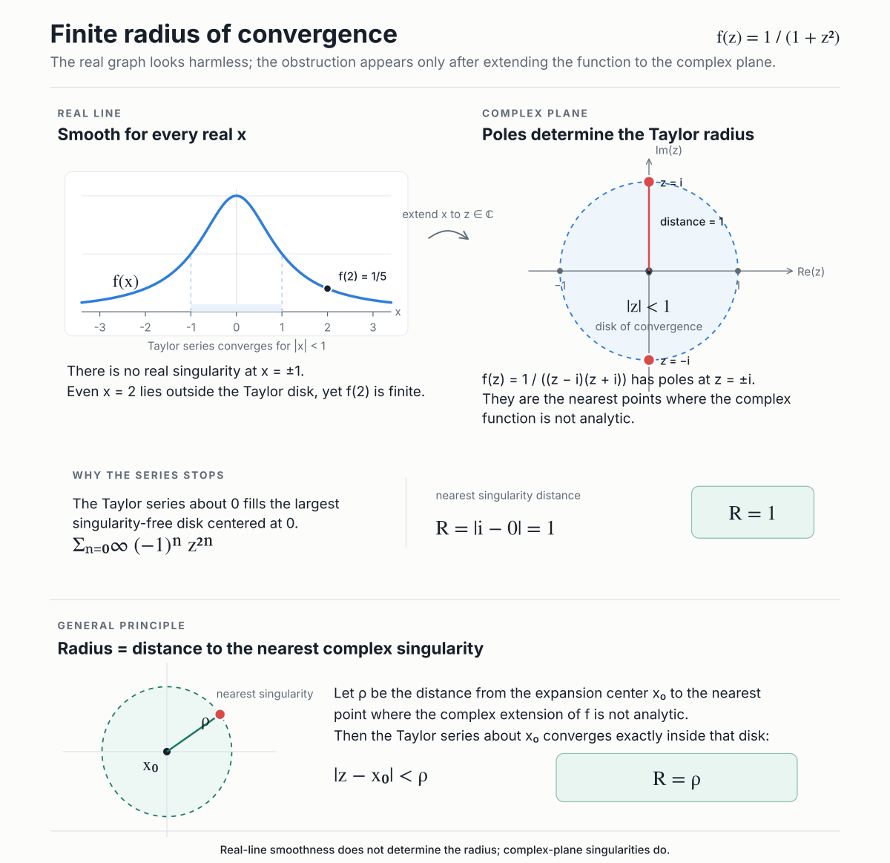

## Derivation of Taylor from Rolle's theorem

**Higher-order Rolle's theorem** (iterative application of Rolle's theorem)
Let $f$ be continuous on $[x_0, x_0+h]$ and $n$-times differentiable on an open interval containing $[x_0, x_0+h]$. Let $p$ be a polynomial of degree $n$ such that:

- $p^{(k)}(x_0) = f^{(k)}(x_0)$ for $k = 0, 1, \dots, n-1$ (i.e., $p$ and $f$ match up to the $(n-1)$th derivative at $x_0$),
- $p(x_0 + h) = f(x_0 + h)$ (i.e., $p$ and $f$ match at the point $x_0 + h$).

Then, there exists some $\theta \in (0, 1)$ such that $f^{(n)}(x_0 + \theta h) = p^{(n)}(x_0 + \theta h)$.

#### Why this follows from ordinary Rolle
Not a new theorem — Rolle applied $n$ times to the right auxiliary function.

Set $g(x) = f(x) - p(x)$. The matching conditions translate into a **zero structure** for $g$:
- $g^{(k)}(x_0) = 0$ for $k = 0, 1, \dots, n-1$ (a zero of multiplicity $n$ at $x_0$),
- $g(x_0 + h) = 0$ (a simple zero at $x_0 + h$).

Now iterate:
- $g$ vanishes at $x_0$ and at $x_0 + h$. Rolle gives $\xi_1 \in (x_0, x_0 + h)$ with $g'(\xi_1) = 0$.
- But $g'$ already vanishes at $x_0$ (multiplicity $n$ at $x_0$ means the first $n-1$ derivatives kill it too). So $g'$ has zeros at $x_0$ and at $\xi_1$. Rolle gives $\xi_2 \in (x_0, \xi_1)$ with $g''(\xi_2) = 0$.
- The pattern continues: at step $k$, we know $g^{(k)}$ vanishes at $x_0$ (from the multiplicity) and at $\xi_k$ (from the previous Rolle step), so $g^{(k+1)}(\xi_{k+1}) = 0$ for some $\xi_{k+1} \in (x_0, \xi_k)$.

After $n$ applications, $g^{(n)}(\xi_n) = 0$ for some $\xi_n \in (x_0, x_0 + h)$. Writing $\xi_n = x_0 + \theta h$ with $\theta \in (0,1)$ recovers the stated conclusion.

The mechanism can be summarized as: **each derivative "eats" one zero, and the multiplicity-$n$ zero at $x_0$ is exactly the fuel needed to survive $n$ rounds of differentiation while the wandering zero migrates.**

#### Constructing $p$

We need a polynomial that meets both matching conditions. Start with the obvious attempt:
$$q(x) = \sum_{k=0}^{n-1} f^{(k)}(x_0) \frac{(x - x_0)^k}{k!}$$

Then $q^{(k)}(x_0) = f^{(k)}(x_0)$ for $0 \leq k \leq n-1$, because each differentiation peels off one term and evaluating at $x_0$ kills all remaining $(x - x_0)$ factors — only the constant survives.

Two problems with $q$ standing alone:
- $q(x_0 + h)$ is generally not equal to $f(x_0 + h)$, so condition (2) fails.
- $q$ has degree $n-1$, so $q^{(n)} \equiv 0$. Higher-order Rolle would then force $f^{(n)} \equiv 0$ on some interval — trivially false in general.

We therefore add a **correction term** to $q$. The correction must:
- Not disturb the derivative matches at $x_0$,
- Contribute one tunable parameter to enforce $p(x_0 + h) = f(x_0 + h)$,
- Produce a nonzero $n$-th derivative.

A term of the form $\lambda(x - x_0)^n$ does all three:
- It has a zero of multiplicity $n$ at $x_0$, so its first $n-1$ derivatives vanish there — condition (1) survives untouched.
- $\lambda$ is a single free parameter, exactly what condition (2) needs.
- Its $n$-th derivative is $n!\lambda$, a nonzero constant.

**Why this specific power?** A term $\lambda(x - x_0)^m$ with $m \geq n$ also preserves the derivative matches at $x_0$. But if $m > n$, the $n$-th derivative involves $(x - x_0)^{m-n}$, dragging the evaluation point into the final formula. The choice $m = n$ is what makes $p^{(n)}$ a clean constant — independent of where higher-order Rolle happens to land $\theta$.

##### Solving for $\lambda$

$$p(x) = q(x) + \lambda(x - x_0)^n$$

Evaluating at $x_0 + h$ and using $q(x_0 + h) = \sum_{k=0}^{n-1} f^{(k)}(x_0) \frac{h^k}{k!}$:

$$p(x_0 + h) = q(x_0 + h) + \lambda h^n$$

Setting $p(x_0 + h) = f(x_0 + h)$ and solving:

$$\lambda = \frac{f(x_0 + h) - q(x_0 + h)}{h^n}$$

So
$$p(x) = q(x) + \frac{f(x_0 + h) - q(x_0 + h)}{h^n} \cdot (x - x_0)^n$$

#### Deriving Taylor's theorem

Higher-order Rolle gives $\theta \in (0,1)$ with $f^{(n)}(x_0 + \theta h) = p^{(n)}(x_0 + \theta h)$. Since $q$ has degree $n-1$, $q^{(n)} \equiv 0$, and $p^{(n)}(x) = n!\lambda$ everywhere. Substituting $\lambda$:

$$f^{(n)}(x_0 + \theta h) = \frac{f(x_0 + h) - q(x_0 + h)}{h^n} \cdot n!$$

Rearranging:

$$f(x_0 + h) = q(x_0 + h) + \frac{h^n}{n!} f^{(n)}(x_0 + \theta h)$$

$$\boxed{\;f(x_0 + h) = \sum_{k=0}^{n-1} \frac{f^{(k)}(x_0)}{k!} h^k \;+\; \frac{h^n}{n!} f^{(n)}(x_0 + \theta h)\;}$$

The last term is the **Lagrange remainder** $R_n$:
$$R_n = \frac{h^n}{n!} f^{(n)}(x_0 + \theta h)$$

Structurally, $R_n$ is exactly the shape of the "next term" of the Taylor sum — except $f^{(n)}$ is evaluated at an interior point $x_0 + \theta h$ rather than at $x_0$. The intermediate-point evaluation is the price paid for truncating at finite $n$.

#### Other forms of the remainder

The Lagrange form is one packaging of the same underlying object. Two others matter in practice.

**Cauchy form.** Repeating the construction with a different correction ansatz (a term proportional to $(x - x_0)$ instead of $(x - x_0)^n$, inside a slightly reshuffled auxiliary function) gives
$$R_n = \frac{(1 - \theta)^{n-1} h^n}{(n-1)!} f^{(n)}(x_0 + \theta h)$$
for some $\theta \in (0,1)$. The extra $(1-\theta)^{n-1}$ factor makes this form sharper near the boundary of the interval of convergence — a case where Lagrange over-estimates.

**Integral form.** Repeated integration by parts of the fundamental theorem of calculus gives
$$R_n = \frac{1}{(n-1)!} \int_{x_0}^{x_0 + h} (x_0 + h - t)^{n-1} f^{(n)}(t) \, dt$$
No mystery $\theta$. This is what actually gets used when there is integrable control on $f^{(n)}$.

The three forms are reconciled by mean-value theorems: the ordinary mean-value theorem applied to the integral form recovers Lagrange; a weighted mean-value theorem with weight $(1 - t)^{n-1}$ produces Cauchy.

#### When the series equals the function

Two questions are commonly conflated, and separating them clears up most confusion:

- **Does the Taylor series converge?** — a question about the formal power series $\sum \frac{f^{(k)}(x_0)}{k!}(x - x_0)^k$.
- **If it converges, does it converge to $f(x)$?** — a question about the remainder $R_n(x) \to 0$.

Smoothness alone does not settle the second question. The standard warning is
$$f(x) = \begin{cases} e^{-1/x^2} & x \neq 0 \\ 0 & x = 0 \end{cases}$$

Every derivative at $0$ equals $0$: the exponential decay $e^{-1/x^2}$ crushes any polynomial factor coming from the chain rule. So the Taylor series of $f$ at $0$ is identically zero, convergent everywhere, and equal to $f$ only at the single point $x = 0$. Smoothness gave a Taylor series, but the series describes a different function.

The function equals its Taylor series at $x$ precisely when $R_n(x) \to 0$. A common sufficient condition follows from the Lagrange form: if the derivatives are uniformly bounded on a neighborhood as $|f^{(n)}(y)| \leq M \cdot C^n$, then
$$|R_n(x)| \leq M \frac{(Ch)^n}{n!} \xrightarrow{n \to \infty} 0$$
(the factorial in the denominator beats any exponential). This is why $\sin$, $\cos$, and $\exp$ equal their series everywhere — their derivatives cycle through bounded functions or through the function itself.

A function that equals its Taylor series on some neighborhood of $x_0$ is called **analytic at $x_0$**. Analytic implies smooth; smooth does not imply analytic.

#### Radius of convergence

For a power series $\sum a_n (x - x_0)^n$, the radius of convergence $R$ is given by
$$\frac{1}{R} = \limsup_{n \to \infty} \sqrt[n]{|a_n|}$$

The series converges absolutely for $|x - x_0| < R$, diverges for $|x - x_0| > R$, and requires case-by-case analysis on the boundary $|x - x_0| = R$.

**Why "radius."** The criterion has nothing intrinsically real about it: allowing $x$ to be complex, the same computation carves out a **disk** in the complex plane. On the real line, we only see the intersection of that disk with $\mathbb{R}$ — a segment of length $2R$ centered at $x_0$. The word "radius" is a fossil of the complex picture underneath.

##### Derivation via the root test

The root test states that $\sum b_n$ converges absolutely if $\limsup \sqrt[n]{|b_n|} < 1$ and diverges if the limsup exceeds $1$. (The weaker statement "$b_n \to 0$" is only necessary, not sufficient — the harmonic series has terms tending to zero and still diverges.)

**Why comparing $n$-th roots to $1$ is the right criterion.** Suppose $L = \limsup_{n \to \infty} \sqrt[n]{|b_n|} < 1$. Pick any $r$ with $L < r < 1$. By the definition of limsup, all but finitely many terms satisfy $\sqrt[n]{|b_n|} < r$, so $|b_n| < r^n$ from some point on. The tail of $\sum |b_n|$ is dominated by the tail of the geometric series $\sum r^n$, which converges — direct comparison finishes the argument. If instead $L > 1$, then $\sqrt[n]{|b_n|} > 1$ happens infinitely often, so $|b_n| > 1$ infinitely often, and the terms fail to tend to zero.

The engine is comparison against a geometric series. The root test asks whether the sequence eventually behaves like $r^n$ with $r < 1$; the $n$-th root is exactly the operation that strips off the geometric part to leave $r$ visible.

Applied to $b_n = a_n (x - x_0)^n$:
$$\limsup_{n \to \infty} \sqrt[n]{|a_n (x - x_0)^n|} = |x - x_0| \cdot \limsup_{n \to \infty} \sqrt[n]{|a_n|}$$

Convergence requires this quantity to be less than $1$, which rearranges to
$$|x - x_0| < \frac{1}{\limsup_{n \to \infty} \sqrt[n]{|a_n|}} = R$$

##### Where finite radii come from

A real-analytic function can have finite $R$ even when it is smooth on all of $\mathbb{R}$. Concretely, $f(x) = \frac{1}{1 + x^2}$ is smooth everywhere on the real line, yet its Taylor series at $0$,
$$\sum_{n=0}^{\infty} (-1)^n x^{2n}$$
has $R = 1$. Nothing on the real line explains this.

The explanation lives in the complex plane: as a complex function, $\frac{1}{1+z^2}$ has poles at $z = \pm i$, each at distance $1$ from the origin. The power series cannot converge past the nearest obstruction, and the nearest obstruction happens to sit off the real axis.

*The Taylor radius is the distance from the expansion center to the nearest complex singularity. For $f(z)=1/(1+z^2)$, the poles at $z=\pm i$ give $R=1$, although the function is smooth for every real $x$.*

This is a general phenomenon. For a function analytic in a region of the complex plane, the radius of convergence of its Taylor series at $x_0$ equals the distance from $x_0$ to the nearest point where analyticity fails — pole, branch point, essential singularity. **Real-line pathology usually has a complex-plane explanation.**

##### Ratio-test companion

When the limit exists,
$$\frac{1}{R} = \lim_{n \to \infty} \left| \frac{a_{n+1}}{a_n} \right|$$
This is often easier to compute than the root formula.

**Why a ratio limit forces the same root limit.** Suppose $|a_{n+1}/a_n| \to L$. For large $n$ the successive ratios sit near $L$, so telescoping a chain of them from some anchor index $N$ gives
$$|a_n| \approx L^{n - N} |a_N|$$
Taking $n$-th roots:
$$\sqrt[n]{|a_n|} \approx |a_N|^{1/n} \cdot L^{(n-N)/n}$$

Two facts about the right-hand side as $n \to \infty$:
- For any fixed positive constant $c$, $c^{1/n} \to 1$. (Because $c^{1/n} = e^{(\ln c)/n}$, and $(\ln c)/n \to 0$.) So $|a_N|^{1/n} \to 1$.
- $(n - N)/n \to 1$, so $L^{(n-N)/n} \to L$.

The product tends to $1 \cdot L = L$, matching $\lim \sqrt[n]{|a_n|}$. Trapping the actual $|a_n|$ between $(L - \varepsilon)^{n - N} |a_N|$ and $(L + \varepsilon)^{n - N} |a_N|$ and following the same limits with $\varepsilon$ arbitrary turns the approximation into a proof.

Intuitively: **the root form measures coefficient growth directly; the ratio form measures it one step at a time.** Whenever the step-by-step measure has a limit, the direct measure sees the same limit. But the direct measure can still succeed when the ratios oscillate — as in gap series like $\sum x^{2^n}$, where most coefficients are zero and $a_{n+1}/a_n$ has no limit at all, yet $\sqrt[n]{|a_n|} \to 1$ along the nonzero terms and forces $R = 1$.
