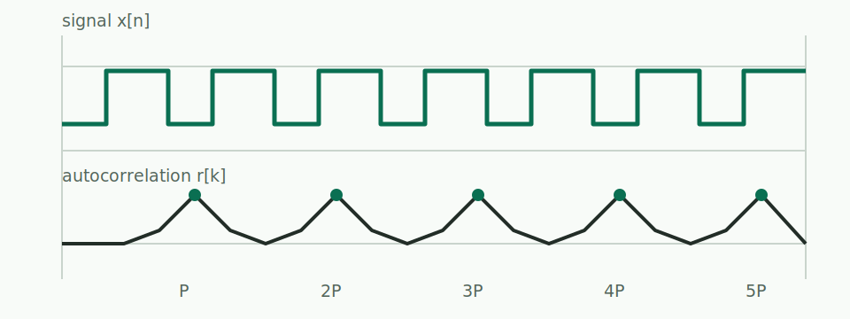

A periodic signal agrees unusually well with a delayed copy of itself. Autocorrelation makes that agreement visible.

For a discrete signal $x[n]$, one useful definition is

$$
r[k] = \sum_n x[n]x[n-k].
$$

The value at $k=0$ compares the signal to itself. At a true period $P$, the shifted signal $x[n-P]$ resembles $x[n]$, so $r[P]$ becomes large too.

The interesting details are not the definition itself, but the choices around it: subtracting the mean, deciding between linear and circular correlation, and deciding which peaks are evidence rather than noise.

## Why centre the signal?

If the signal has a strong nonzero average, then all delays look artificially similar. Replacing $x[n]$ by $x[n]-\bar{x}$ asks a narrower question: *which changes repeat?*

That is usually what we mean by periodicity in observed data.
