Shadow Copy (a.k.a. VSS) is a snapshot/backup mechanism. It can be implemented in software or in hardware.
VSS operates at the **raw volume** level — i.e., beneath the filesystem. It stores a temporary snapshot of a volume and exposes it as a *separate* volume that consumers can read.

Example naming: if the original volume is `\Device\HarddiskVolume1\`, the shadow copy will appear as `\Device\HarddiskVolumeShadowCopy{N}\`.

The default provider is *Microsoft Software Shadow Copy Provider 1.0*, implemented in software by `volsnap.sys`. Its catalog files carry the GUID `{3808876b-c176-4e48-b7ae-51abd60b20d5}`.
Commercial providers (e.g., ShadowProtect) also ship as software providers; hardware providers are typically bundled with SAN/array firmware and expose snapshots through the same VSS API.

**Why this specific GUID appears on disk.** The GUID is the identifier of the default provider itself. Provider registration lives at `HKLM\SYSTEM\CurrentControlSet\Services\VSS\Providers\{3808876b-c176-4e48-b7ae-51abd60b20d5}\` (default value: `MS Software Shadow Copy provider 1.0`; backed by `%SystemRoot%\System32\swprv.dll` in user mode and `%SystemRoot%\System32\drivers\volsnap.sys` in kernel mode). The same GUID becomes the on-disk namespace: on any volume, `\System Volume Information\{3808876b-c176-4e48-b7ae-51abd60b20d5}` is the catalog file for this provider, and each store's file is named `\System Volume Information\{3808876b-c176-4e48-b7ae-51abd60b20d5}{STORE_GUID}` (a per-store GUID appended). Third-party providers (ShadowProtect/StorageCraft, hardware/array providers) register under the same `HKLM\SYSTEM\CurrentControlSet\Services\VSS\Providers\` key with their own GUID, and leave *that* GUID as the filename prefix in `System Volume Information`. `vssadmin list providers` prints the mapping between friendly name and GUID; a filename prefix in `System Volume Information` that doesn't correspond to any entry in `list providers` output is the primary triage indicator of a rogue or since-removed provider on the box.

---

## VSS Architecture: Writer / Requester / Provider

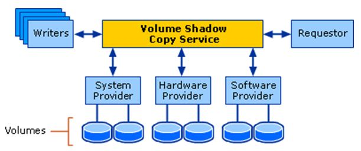

*Source screenshot: [Microsoft Learn — Volume Shadow Copy Service, Figure 1](https://learn.microsoft.com/en-us/windows-server/storage/file-server/volume-shadow-copy-service).*

The Provider is one of three cooperating roles. Without the other two, a "raw volume snapshot" would not stay consistent with filesystem state:

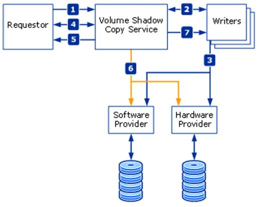

*Source diagram: [Microsoft Learn — Volume Shadow Copy Service, Figure 2](https://learn.microsoft.com/en-us/windows-server/storage/file-server/volume-shadow-copy-service). The numbered arrows are explained in the source as the requester/writer/provider coordination sequence.*

- **Requester** — the process that *asks* for a snapshot. `vssadmin`, System Restore, Windows Backup, third-party backup agents, `wbadmin`, and ransomware doing `vssadmin delete shadows /all` are all Requesters.
- **Writer** — an in-process component inside an application whose files must be flushed and paused before the snapshot instant. Examples: the NTFS writer, SQL Server writer, Exchange writer, Registry writer, IIS writer. Every registered writer maps to a specific Windows service (the SQL Server writer maps to `SQLWriter` service, Exchange to `MSExchangeIS`, Registry/System/COM+ REGDB writers to `VSS` itself, etc.). Enumerated with `vssadmin list writers`, which also shows each writer's last-error state:

  

  *Source screenshot: [BackupVault — VSS Troubleshooting for BackupVault Pro](https://support.backupvault.co.uk/hc/en-us/articles/11274997234589-VSS-Troubleshooting-for-BackupVault-Pro). When a writer is absent or reports an error, the article recommends checking the Event Log and restarting the service associated with that writer.*
- **Provider** — the component that actually creates the snapshot. `volsnap` is the default; hardware providers push the work down to the array.

The snapshot lifecycle from the Provider's point of view: Requester calls in → VSS service tells each Writer to *freeze* (flush caches, complete open transactions, block new writes) → Provider takes an atomic point-in-time picture → Writers are told to resume. The freeze window is bounded (~10 seconds by default); if a Writer overruns, the snapshot fails with `VSS_E_HOLD_WRITES_TIMEOUT` (`0x80042313`) or `VSS_E_WRITER_ERROR_TIMEOUT` (visible in the Application log under source `VSS` and in `%SystemRoot%\System32\Winevt\Logs\Microsoft-Windows-VolumeSnapshotService%4Operational.evtx`).

Without the Writer step, a raw-volume snapshot would be equivalent to a "crash-consistent" image — we'd catch NTFS mid-transaction, SQL mid-log-flush, etc. Writers are what make VSS backups *application-consistent* instead of merely crash-consistent.

**Where volsnap sits in the storage stack:** it is a *volume filter driver*, layered above the volume manager but below the filesystem driver stack. That is why "raw volume" is the natural granularity — `volsnap` intercepts `IRP_MJ_WRITE` at the volume level, redirects the *old* contents of any about-to-be-modified block into the diff area, then lets the write proceed. The filesystem never has to know.

---

## The Copy-on-Write Mechanism

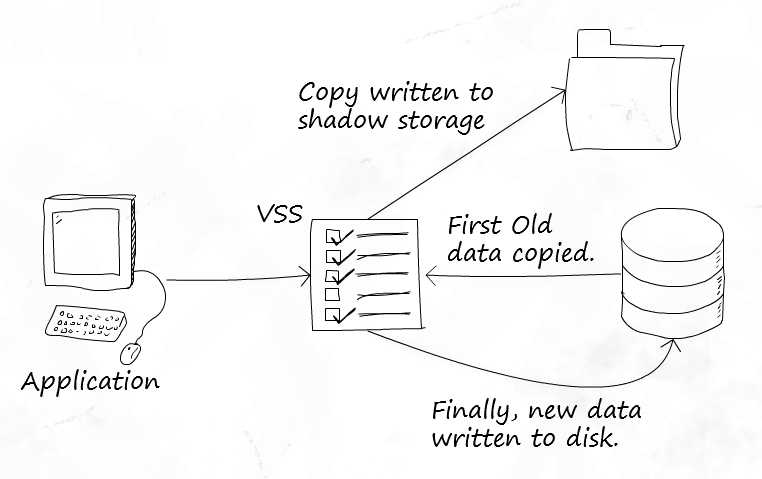

*Source diagram: [Macrium — What is VSS, how does it work and why does Macrium use it?](https://www.macrium.com/blog/backup-internals-what-is-vss-how-does-it-work-and-why-do-we-use-it-4e566223125a).*

Without this, the block types below don't make sense. VSS on Windows is copy-on-write:

- The **live volume stays live**. There is no separate cloned volume anywhere.
- When a snapshot is taken at time T, effectively nothing is copied.
- Later, when a write comes in to block B on the live volume, `volsnap` first reads the *old* contents of B (the pre-image, the state B had at time T) and writes it into the diff area. *Only then* is the new write allowed to hit B on the live volume.
- Reading the shadow copy at any time after T reconstructs the state-at-T like this:
  - If block B has never been modified since T → read directly from the live volume.
  - If block B has been modified since T → read the pre-image from the diff area.

### Black Hat walkthrough: how successive Stores are populated

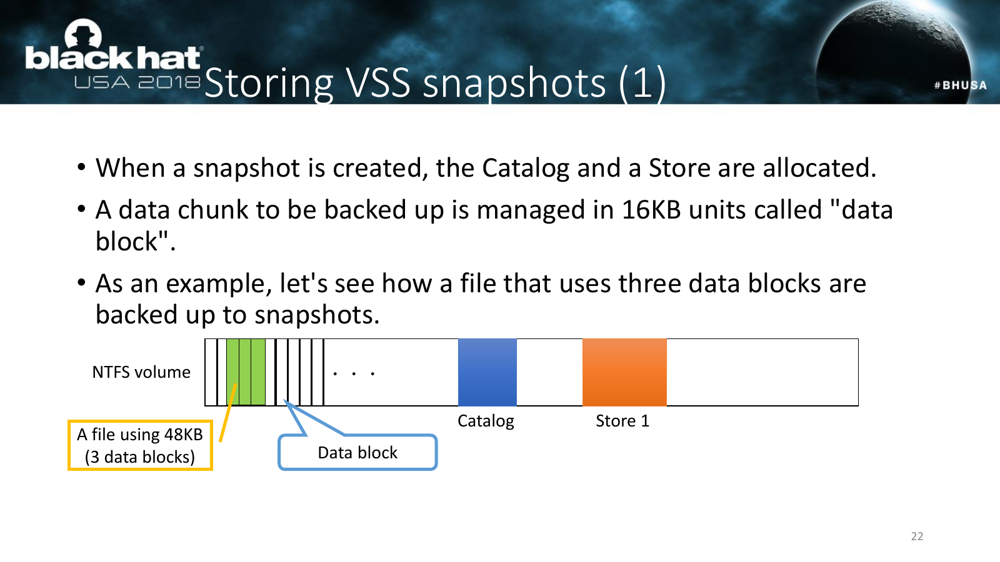

*At snapshot creation, VSS allocates the Catalog and Store. The example file spans three 16 KB data blocks. Source: Kobayashi and Suzuki, Black Hat USA 2018, slide 22 — [open the English PDF at this slide](https://i.blackhat.com/us-18/Thu-August-9/us-18-Kobayashi-Reconstruct-The-World-From-Vanished-Shadow-Recovering-Deleted-VSS-Snapshots.pdf#page=22).*

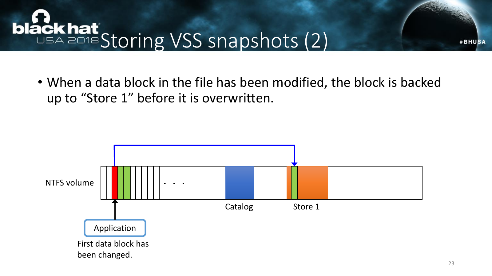

*The first modified block is copied to Store 1 before the application write replaces it on the live NTFS volume. Source: Kobayashi and Suzuki, Black Hat USA 2018, slide 23 — [open the English PDF at this slide](https://i.blackhat.com/us-18/Thu-August-9/us-18-Kobayashi-Reconstruct-The-World-From-Vanished-Shadow-Recovering-Deleted-VSS-Snapshots.pdf#page=23).*

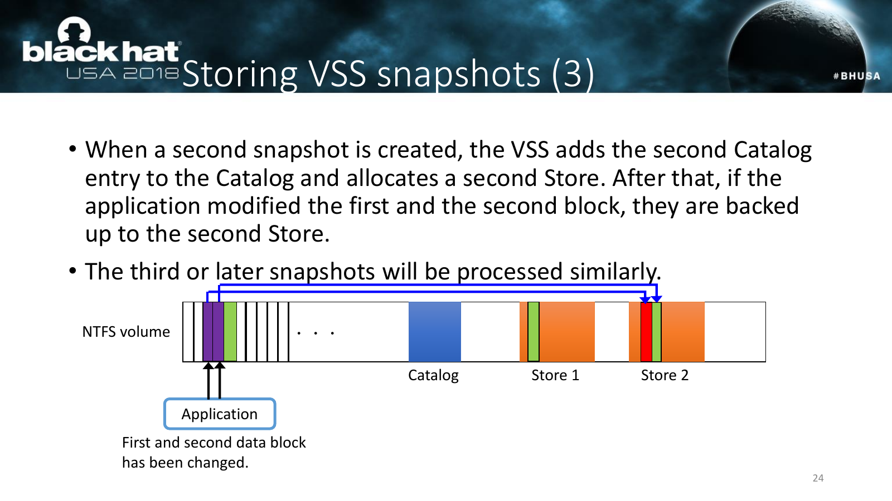

*After snapshot 2 is created, later changes are copied into Store 2 rather than duplicated in Store 1. Source: Kobayashi and Suzuki, Black Hat USA 2018, slide 24 — [open the English PDF at this slide](https://i.blackhat.com/us-18/Thu-August-9/us-18-Kobayashi-Reconstruct-The-World-From-Vanished-Shadow-Recovering-Deleted-VSS-Snapshots.pdf#page=24).*

Consequences that fall out of this:

1. **Storage cost scales with amount rewritten, not with volume size.** A snapshot of a 1TB idle volume costs almost nothing; a snapshot of the same volume after a 200GB rewrite costs ~200GB.
2. **Snapshots are ephemeral.** The diff area has a bounded MaxSize (`vssadmin list shadowstorage`, `resize shadowstorage`). When it fills, the oldest snapshots are silently deleted. For forensics: the *presence* of many old snapshots implies little rewriting, and the *absence* of expected snapshots can mean either eviction or attacker deletion — the two are distinguishable via events under source `volsnap` in the System log (event ID 27: "The oldest shadow copy of volume X was deleted to keep disk space usage for shadow copies of volume X below the user defined limit") vs. events under `Microsoft-Windows-VolumeSnapshotService/Operational` (which log VSS-service-initiated deletion via `IVssBackupComponents::DeleteSnapshots`).
3. **The reconstruction walk (below) is a merge, not a search.** Each intermediate snapshot only records what changed *between* itself and the next; we need to compose them.

---

## Creating Shadow Copies on the System

`vssadmin` is a built-in utility for managing shadow copies (under `System32`).

System Restore exposes VSS creation to the GUI:

- **Command:** `%SystemRoot%\System32\sysdm.cpl` → *System Protection* tab → pick a volume → *Create*.
- **Command:** `%SystemRoot%\System32\rstrui.exe` — restore-point launcher.

On Windows Server, the same is reachable through `Computer Management > System Tools > Shared Folders > All Tasks > Configure Shadow Copies`:

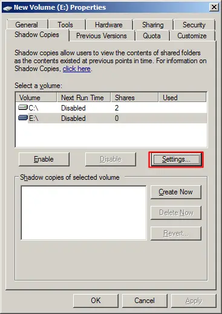

*Source screenshot: [BackupVault — VSS Troubleshooting for BackupVault Pro](https://support.backupvault.co.uk/hc/en-us/articles/11274997234589-VSS-Troubleshooting-for-BackupVault-Pro). The dialog exposes the volume, storage location, size limit, and schedule.*

**Scheduled creation.** A scheduled task drives periodic restore points. In `taskschd.msc`, under `Task Scheduler Library > Microsoft > Windows > SystemRestore` (task name `SR`, backing XML at `%SystemRoot%\System32\Tasks\Microsoft\Windows\SystemRestore\SR`). Triggers can be added for boot, midnight, post–Windows Update, and post-install. Default *conditions*: runs only when the machine is idle; if not idle, retried at the next check. The minimum interval between two auto-created restore points is 24h by default, governed by `HKLM\Software\Microsoft\Windows NT\CurrentVersion\SystemRestore\SystemRestorePointCreationFrequency` (REG_DWORD, minutes; setting to `0` disables the throttle).

**Beyond the GUI (worth knowing for automation and for detection):**

- `wmic shadowcopy call create Volume='C:\'` and the WMI class `Win32_ShadowCopy` in namespace `root\cimv2` (deprecated for `wmic.exe`, still queryable via `Get-CimInstance -Namespace root\cimv2 -ClassName Win32_ShadowCopy` in PowerShell). *Attacker relevance:* the same class exposes a `Delete()` method, which is one of the standard ransomware wipes.
- `Checkpoint-Computer -Description ...` (PowerShell) — the scripted equivalent of the *Create* button, wraps the `SystemRestore` WMI provider.
- The `IVssBackupComponents` COM interface (defined in `vssapi.dll`, implemented by `swprv.dll` for the default provider) — what real backup products actually call.

**Diff-area sizing.** `vssadmin resize shadowstorage /For=C: /On=C: /MaxSize=10%`. The default cap is around 10% of the volume, which puts a hard ceiling on how far back in time we can recover. For an active workstation this frequently means "yesterday, maybe." The cap is persisted in the diff-area's Catalog metadata and mirrored in `HKLM\SYSTEM\CurrentControlSet\Services\VSS\Diag` counters; runtime state is in `HKLM\SYSTEM\CurrentControlSet\Services\VSS\Settings`. The `No Limit` UI option (Server Manager) sets MaxSize to `UNBOUNDED`:

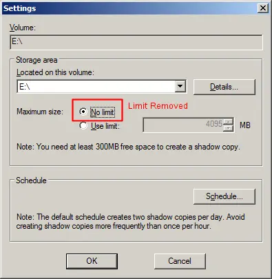

*Source screenshot: [BackupVault — VSS Troubleshooting for BackupVault Pro](https://support.backupvault.co.uk/hc/en-us/articles/11274997234589-VSS-Troubleshooting-for-BackupVault-Pro).*

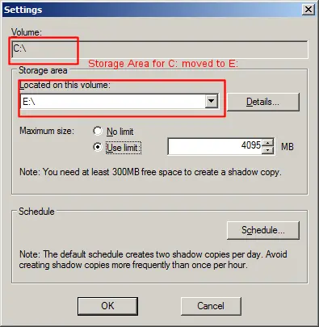

*Source screenshot: [BackupVault — VSS Troubleshooting for BackupVault Pro](https://support.backupvault.co.uk/hc/en-us/articles/11274997234589-VSS-Troubleshooting-for-BackupVault-Pro).*

---

## Bonus: Previous Versions

The Windows Server GUI path and the storage/schedule controls shown in this section are demonstrated step by step in [PeteNetLive, *Windows: Enable “Previous Versions”*](https://www.petenetlive.com/KB/Article/0001393). A practical discussion of protecting and retaining Previous Versions is also available in the [Spiceworks community thread, *How to protect Previous Version with Shadow Copy*](https://community.spiceworks.com/t/how-to-protect-previous-version-with-shadow-copy/656205). These are operational references; the on-disk format discussion later in this document relies on the Black Hat and libvshadow sources.

Given System Restore, right-click a file → *Properties* → *Previous Versions* tab → older versions appear.

Two sources feed this tab, and they are not equivalent:

- **VSS-backed previous versions** — the shell is literally opening the file inside a shadow copy and listing the resulting mtime/size. There is no separate storage; the "Previous Versions" list is a *view* over the shadow-copy chain.
- **File History–backed previous versions** — an entirely separate mechanism. Given a set of watched folders and an external drive, on every change to a file a copy is written to the external drive. Configuration is per-user under `HKCU\Software\Microsoft\Windows\CurrentVersion\FileHistory\` (target drive, watched libraries, interval, retention). The mechanism uses the NTFS **USN Journal** (`$Extend\$UsnJrnl:$J`) as its change-detection primitive — it doesn't need to poll or scan; it consumes journal records and reacts to `FILE_CREATE`, `DATA_OVERWRITE`, `DATA_EXTEND`, `RENAME_NEW_NAME`, etc. Watched-folder metadata cache lives at `%LocalAppData%\Microsoft\Windows\FileHistory\Configuration\`.

The tab merges both silently, which is why a file with no shadow-copy history can still show old versions if File History is active.

---

## Where Shadow Copy is Stored on Disk

### Terminology

Each snapshot is stored as a **Store**. The management structure over stores is the **Catalog**.

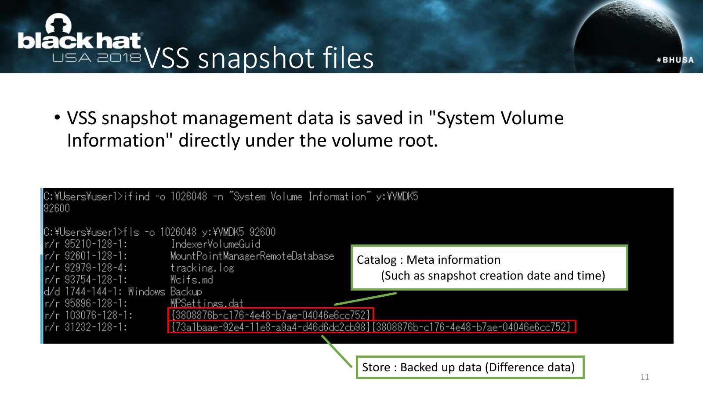

*The command-line listing distinguishes the Catalog, which holds snapshot metadata, from a Store, which holds backed-up difference data. Source: Kobayashi and Suzuki, Black Hat USA 2018, slide 11 — [open the English PDF at this slide](https://i.blackhat.com/us-18/Thu-August-9/us-18-Kobayashi-Reconstruct-The-World-From-Vanished-Shadow-Recovering-Deleted-VSS-Snapshots.pdf#page=11).*

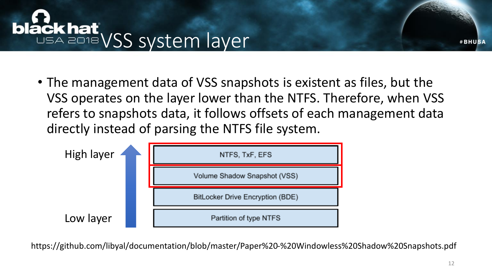

*VSS management structures are represented as files, but VSS follows their volume offsets below NTFS rather than resolving them through normal filesystem paths. Source: Kobayashi and Suzuki, Black Hat USA 2018, slide 12 — [open the English PDF at this slide](https://i.blackhat.com/us-18/Thu-August-9/us-18-Kobayashi-Reconstruct-The-World-From-Vanished-Shadow-Recovering-Deleted-VSS-Snapshots.pdf#page=12).*

### The on-disk files

On the volume that holds the shadow copy (the backup of one volume may live on another volume), several management files exist:

- **Header** — at fixed offset `0x1e00` from the start of the volume.

  **Why 0x1e00?** `0x1e00 = 7680 bytes = sector 15` (assuming 512-byte sectors). NTFS's boot sector lives at sector 0, its backup at the last sector of the volume, and sectors 1–15 are reserved as boot code / bootstrap loader area. `volsnap` sits its header in the last reserved sector *before* the filesystem's own data area begins, which is why the offset is filesystem-agnostic and stable regardless of NTFS cluster size. On a 4Kn-formatted volume the effective offset can shift because "sector 15" is a different byte offset; the constant `0x1e00` assumes 512-byte logical sectors.

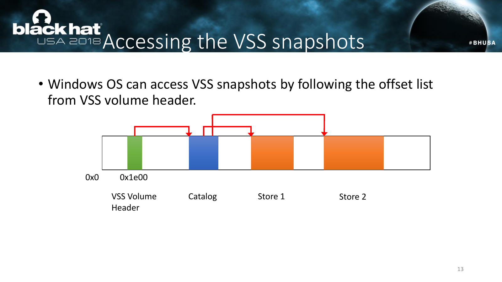

*The first VSS pointer begins at the volume header at `0x1e00`; subsequent offsets lead to the Catalog and Store structures. Source: Kobayashi and Suzuki, Black Hat USA 2018, slide 13 — [open the English PDF at this slide](https://i.blackhat.com/us-18/Thu-August-9/us-18-Kobayashi-Reconstruct-The-World-From-Vanished-Shadow-Recovering-Deleted-VSS-Snapshots.pdf#page=13).*

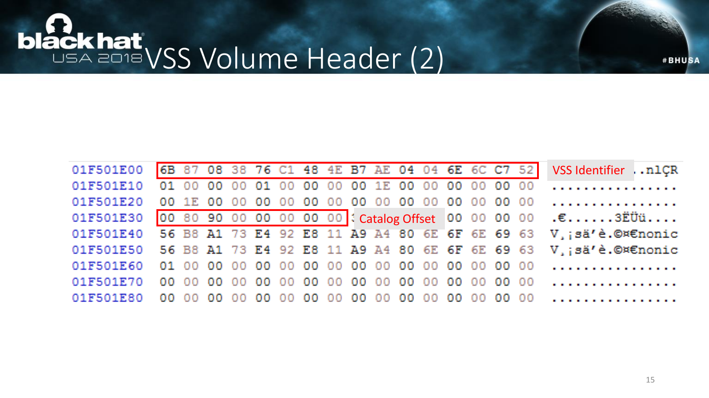

*The English deck marks the 16-byte VSS identifier and the Catalog offset inside the volume header. Source: Kobayashi and Suzuki, Black Hat USA 2018, slide 15 — [open the English PDF at this slide](https://i.blackhat.com/us-18/Thu-August-9/us-18-Kobayashi-Reconstruct-The-World-From-Vanished-Shadow-Recovering-Deleted-VSS-Snapshots.pdf#page=15).*

- **Catalog and Store metadata files** — represent the disk regions allocated to VSS *as files*. On the filesystem, these live under the `System Volume Information` directory at the root of any Windows-formatted volume. The directory's DACL grants access only to `NT AUTHORITY\SYSTEM` by default (`icacls "C:\System Volume Information"` shows `(F)` for SYSTEM and nothing for Administrators), so triage requires either running as SYSTEM (via `PsExec -s`, task scheduler as SYSTEM, or `NtObjectManager`) or granting explicit read access first with `icacls`.

  The Catalog points to the Store by storing offsets to **Block Range** and **Block List** structures that represent the Store. The Block Range holds the actual copied data plus its own management structures; the Block List is the index mapping each live-volume address to its offset within the Block Range.

  Catalogs are stored as a **linked list** — each Catalog record stores the on-disk offset of the next Catalog.

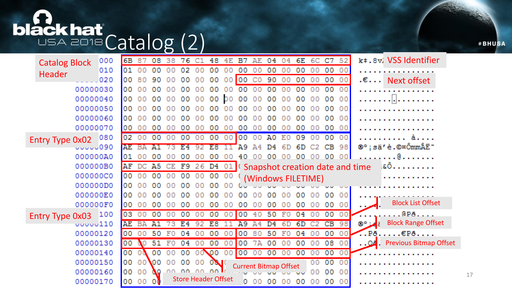

*Catalog entry type `0x02` contains the snapshot creation time, while type `0x03` contains the Store Header, Block List, Block Range, and bitmap offsets. The Catalog block header also points to the next Catalog block. Source: Kobayashi and Suzuki, Black Hat USA 2018, slide 17 — [open the English PDF at this slide](https://i.blackhat.com/us-18/Thu-August-9/us-18-Kobayashi-Reconstruct-The-World-From-Vanished-Shadow-Recovering-Deleted-VSS-Snapshots.pdf#page=17).*

  *File naming, concretely:* under the default provider, the catalog file is exactly `\System Volume Information\{3808876b-c176-4e48-b7ae-51abd60b20d5}`; each store's file is `\System Volume Information\{3808876b-c176-4e48-b7ae-51abd60b20d5}{STORE_GUID}` — i.e., the provider GUID followed by a per-store GUID with no separator. Anything with the `3808876b` prefix is `volsnap`; anything else is a different provider (ShadowProtect, hardware provider, image backup writer, etc.). The authoritative external reference for the container format is the libvshadow specification (Metz, libyal) and the 2018 Black Hat paper *Reconstruct The World From Vanished Shadow* (Kobayashi), which documents the on-disk structures used above.

---

## Restoring a Volume Using Shadow Copy

### Black Hat walkthrough: reconstructing snapshot 1

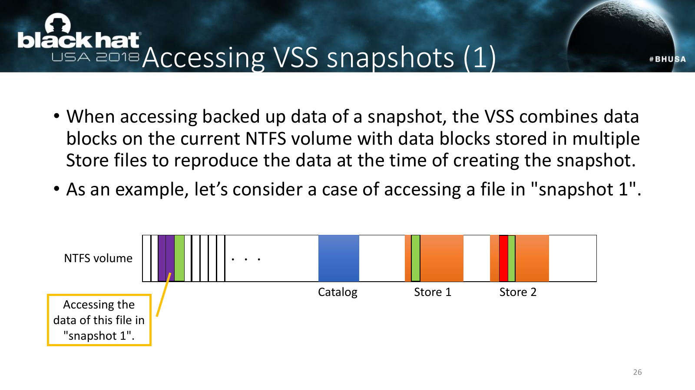

*The starting state: the reader requests the file as it existed in snapshot 1. Source: Kobayashi and Suzuki, Black Hat USA 2018, slide 26 — [open the English PDF at this slide](https://i.blackhat.com/us-18/Thu-August-9/us-18-Kobayashi-Reconstruct-The-World-From-Vanished-Shadow-Recovering-Deleted-VSS-Snapshots.pdf#page=26).*

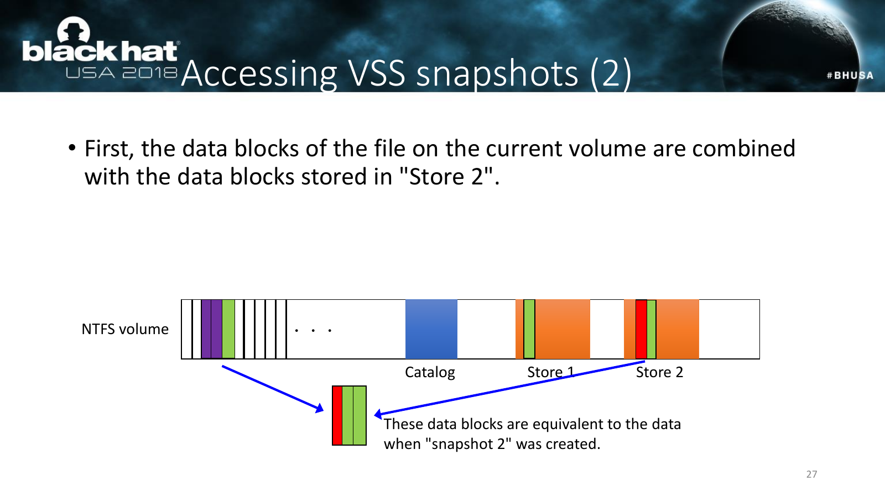

*The newest Store is applied first, producing the block state that existed when snapshot 2 was created. Source: Kobayashi and Suzuki, Black Hat USA 2018, slide 27 — [open the English PDF at this slide](https://i.blackhat.com/us-18/Thu-August-9/us-18-Kobayashi-Reconstruct-The-World-From-Vanished-Shadow-Recovering-Deleted-VSS-Snapshots.pdf#page=27).*

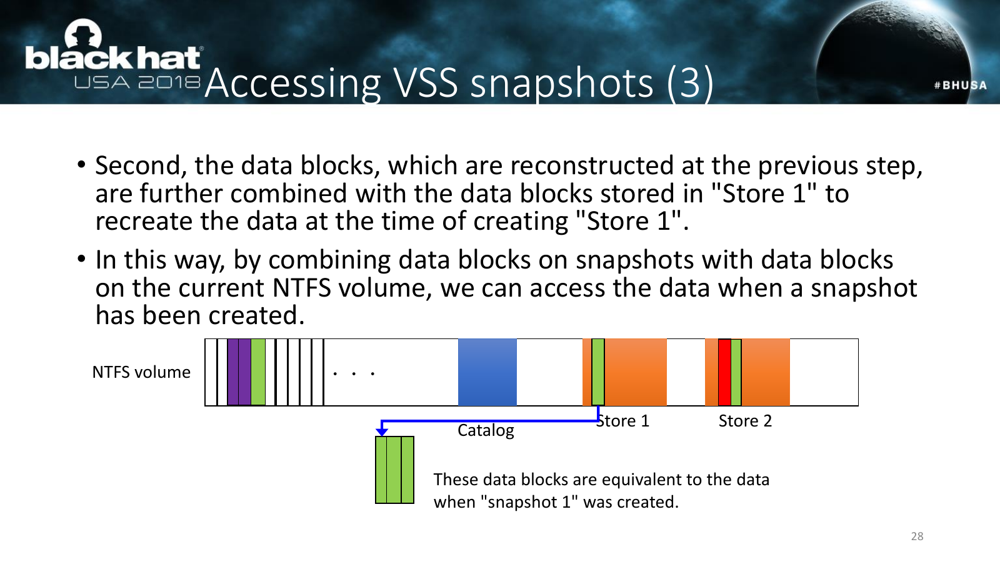

*Store 1 is then applied to the reconstructed snapshot-2 state, yielding the requested snapshot-1 data. Source: Kobayashi and Suzuki, Black Hat USA 2018, slide 28 — [open the English PDF at this slide](https://i.blackhat.com/us-18/Thu-August-9/us-18-Kobayashi-Reconstruct-The-World-From-Vanished-Shadow-Recovering-Deleted-VSS-Snapshots.pdf#page=28).*

You walk the Stores **newest to oldest** (i.e., from the newest snapshot toward the oldest).

**Why?** Because VSS is differential: if nothing changed between snapshots N and N+1, snapshot N+1 doesn't re-store the data — it stores a *reference* back to snapshot N. Each such reference is encoded as a **Forwarder block** inside a Block List.

Simultaneously, an **overwrite rule** applies between blocks: if two "regular" blocks point at the same live-volume address (blocks cover data in 16KB-aligned chunks), the data in the *newer* block (belonging to the newer Store) overwrites the data in the older block during reconstruction.

**Why 16KB?** This is the internal allocation unit of the diff area. It is a compromise: too small and the block-list index balloons; too large and every small write on the live volume triggers a large pre-image copy (write amplification). 16KB is 4× the default NTFS cluster (4KB), so a typical single-cluster write invalidates one-quarter of a diff block, which is why the Overlay-block mechanism exists (see below).

The two rules together yield a simple reconstruction algorithm: walk the Stores newest-to-oldest; for each live-volume address, the first Store to yield a real (non-forwarder) block wins; forwarders defer the answer to an older Store; the catalog-level bitmap is the final fallback.

---

## Block Types in the Block List

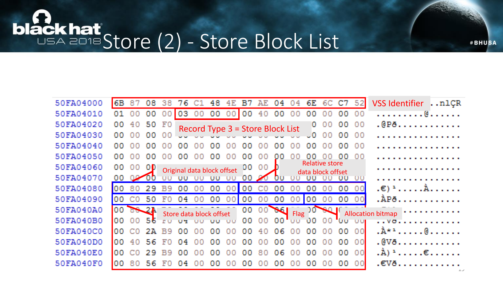

*The Store Block List maps an original volume block offset to a Store data-block offset and a relative Store offset; it also carries flags and the allocation bitmap. Source: Kobayashi and Suzuki, Black Hat USA 2018, slide 19 — [open the English PDF at this slide](https://i.blackhat.com/us-18/Thu-August-9/us-18-Kobayashi-Reconstruct-The-World-From-Vanished-Shadow-Recovering-Deleted-VSS-Snapshots.pdf#page=19).*

- **Regular block** — a mapping-table entry from live-volume addresses (in 16KB units) to snapshot data — i.e., an offset within the corresponding Block Range.
  *Original data block = address on live volume; Relative data block = offset within the Block Range.*
  Highest priority of all block types.

- **Forwarder block** — redirects a newer snapshot to data held in an older snapshot. I.e., redirects a newer Store to data in an older Store.
  *Original data block = address on live volume; Relative data block = two offsets, one within the older Store's Block Range and one within the newer Store's.*
  Lowest priority of all block types. (Rationale: if any *real* block exists for this address at any newer level, use it; the forwarder is only meaningful when nothing more direct is found.)

- **Overlay block** — an exception to the overwrite rule. Multiple Overlay blocks can be *added on top of* an existing Regular block. Using them, data changes smaller than 16KB can be recorded.

  They define a **Bitmap** field marking a contiguous range of addresses as "zeroed by the volume." Each bit represents 256 bytes; the bitmap is 32 bits wide → the bitmap covers `32 × 256 = 8192 bytes = 8KB = half a 16KB block`.
  *Original data block = address on live volume; Relative data block = offset within the Block Range.*
  Priority equal to a Regular block — highest.

  **Why the bitmap covers exactly half a block.** The most consistent reading of the format is that an Overlay block is structurally *half-sized*: it carries up to 8KB of payload plus a 32-bit bitmap of which 256-byte sub-segments of that 8KB are actually valid. To fully re-cover a 16KB range with sub-block granularity, we would use *two* Overlay blocks, one for each half. This is what lets `volsnap` capture, say, a 4KB single-cluster overwrite (one Overlay block, 16 bits of the bitmap set) without the write-amplification cost of pre-imaging the full 16KB. The alternative reading — that the block is 16KB but only half is bitmap-indexed — is inconsistent with the "each bit represents 256 bytes" statement given a 32-bit width, so the half-block interpretation is the one that arithmetic supports.

- **Catalog-level bitmap.** In addition to the per-Overlay bitmap, each Store's Catalog defines a Store-wide bitmap with the same semantics (each bit tracks a region of the live volume).
  It has the *lowest* priority in the mechanism. That is, in the absence of any block describing a given live-volume address, we consult this bitmap, where each bit represents one block.

  **Why the Catalog also stores the offset to the previous Store's bitmap.** This is the reconstruction algorithm's "have we already answered this?" lookup. When walking newest-to-oldest, before descending into an older Store's Block List, the algorithm consults the current Store's bitmap to know which regions have already been resolved (either by copy-on-write in this Store or by earlier walks) and which regions still need answering. Storing the offset to the *previous* Store's bitmap chains these together — it's the same linked-list-of-stores pattern applied to the fallback path, so the walk can stop as soon as a bit is set in any earlier bitmap. Without this chain, the fallback would require re-parsing every earlier Store's Catalog on every miss.

### Combining the block types on a single read

A concrete walkthrough. Live volume `\Device\HarddiskVolume2`, three shadow copies exist — `HarddiskVolumeShadowCopy1` (oldest, Store S1), `HarddiskVolumeShadowCopy2` (S2), `HarddiskVolumeShadowCopy3` (newest, S3). A consumer opens `\\?\GLOBALROOT\Device\HarddiskVolumeShadowCopy2\` and reads 4 bytes at byte offset 4 MB. `volsnap` must return "what the live volume held at time T₂".

1. Round the read offset down to the 16 KB block boundary containing it → block address `0x400000` (block index 256 from volume start). Everything below operates on this block address.
2. Consult S2's Block List for `0x400000`. Four outcomes are possible:
   - **Regular block hit.** The `Relative data block` field is an offset inside S2's Block Range. Read the 16 KB pre-image bytes from there — this *is* the state at T₂. Return the requested 4 bytes from within it. Done.
   - **Regular block + one or more Overlay blocks.** Read the 16 KB pre-image as above, then for each Overlay covering block `0x400000`: parse its 32-bit Bitmap and, for each set bit, copy the corresponding 256-byte sub-segment from the Overlay's payload over the Regular block's data. Return the requested 4 bytes from the composed result. Done.
   - **Forwarder block.** The forwarder's second offset points into an *older* Store's Block Range (typically S1's here). Follow it — the pre-image is stored in S1 because nothing changed for this block between T₁ and T₂, and S2 avoided duplicating it. Read it. Done.
   - **No block for `0x400000` in S2's Block List.** Fall through to step 3.
3. Consult S2's Catalog-level Bitmap for the bit corresponding to block 256.
   - **Bit set** → an older Store has the pre-image. Follow the previous-Store-bitmap-offset chain to that older Store, and re-run step 2 there. Recurse until a Regular/Overlay hit or the chain ends.
   - **Bit clear** → block 256 was never modified after T₂. The state at T₂ equals the state on the live volume *now*. Read directly from `\Device\HarddiskVolume2` at byte offset 4 MB. Done.

The precedence hierarchy summarizes as: **Regular ≡ Overlay (highest) → Forwarder → Catalog Bitmap → live volume (lowest fallback)**. The "newer overwrites older" rule mentioned above only comes into play when a full-volume *restore* rolls all Stores together — for a point read of one shadow copy, the walk stops at the first Regular/Overlay hit encountered from the target Store outward.

---

## What Can Be Extracted for Investigation

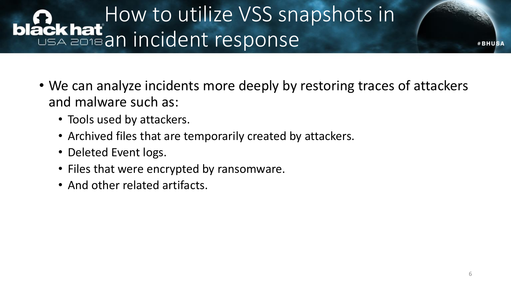

*The authors highlight attacker tools, temporary archives, deleted event logs, ransomware-encrypted files, and related artifacts as useful recovery targets. Source: Kobayashi and Suzuki, Black Hat USA 2018, slide 6 — [open the English PDF at this slide](https://i.blackhat.com/us-18/Thu-August-9/us-18-Kobayashi-Reconstruct-The-World-From-Vanished-Shadow-Recovering-Deleted-VSS-Snapshots.pdf#page=6).*

### What remains after `vssadmin.exe delete shadows /all`

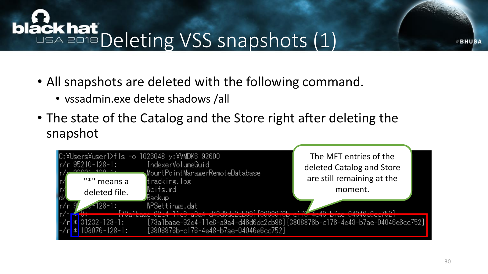

*The slide shows the deletion command and the short-lived state in which the Catalog and Store still have deleted-file MFT entries. Source: Kobayashi and Suzuki, Black Hat USA 2018, slide 30 — [open the English PDF at this slide](https://i.blackhat.com/us-18/Thu-August-9/us-18-Kobayashi-Reconstruct-The-World-From-Vanished-Shadow-Recovering-Deleted-VSS-Snapshots.pdf#page=30).*

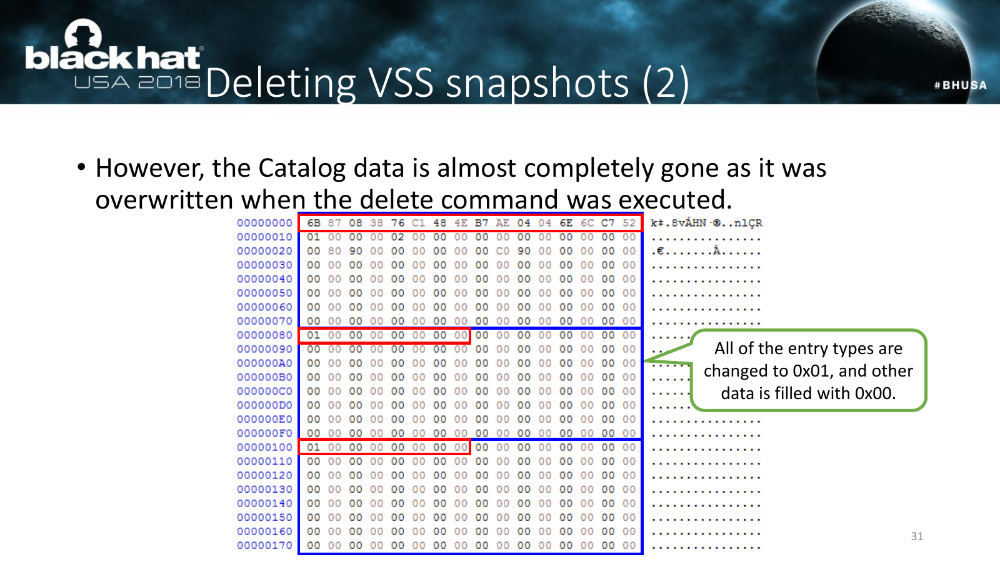

*The Catalog is largely destroyed: entry types become `0x01` and much of the remaining content is zeroed. Source: Kobayashi and Suzuki, Black Hat USA 2018, slide 31 — [open the English PDF at this slide](https://i.blackhat.com/us-18/Thu-August-9/us-18-Kobayashi-Reconstruct-The-World-From-Vanished-Shadow-Recovering-Deleted-VSS-Snapshots.pdf#page=31).*

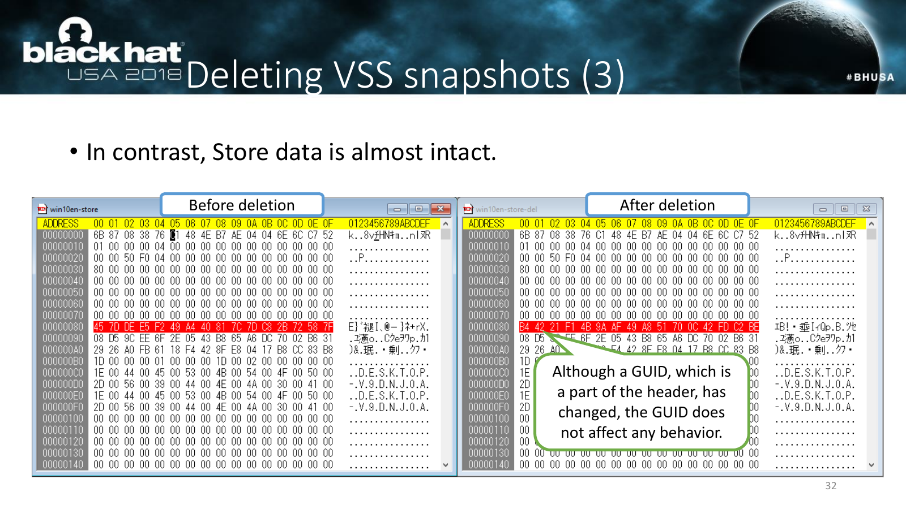

*Unlike the Catalog, most Store bytes remain intact immediately after deletion, which is the basis for carving and reconstruction. Source: Kobayashi and Suzuki, Black Hat USA 2018, slide 32 — [open the English PDF at this slide](https://i.blackhat.com/us-18/Thu-August-9/us-18-Kobayashi-Reconstruct-The-World-From-Vanished-Shadow-Recovering-Deleted-VSS-Snapshots.pdf#page=32).*

- Old (possibly malicious) files that were deleted from the live volume but still exist in a shadow copy.
- Modified files (possibly maliciously) can be diffed against an older version present in a VSS. Timeline reconstruction is often more useful than any single file: the sequence of shadow copies yields a coarse temporal grid of "what did this filesystem look like at these points."
- **SYSTEM-only files.** Files that are exclusively locked or ACL-restricted to `SYSTEM` at runtime are readable inside a shadow copy because the shadow copy is a static point-in-time snapshot with no exclusive lock. Concrete targets: `%SystemRoot%\System32\config\SAM`, `%SystemRoot%\System32\config\SYSTEM`, `%SystemRoot%\System32\config\SECURITY` (the registry hives holding local password hashes and LSA secrets); `%SystemRoot%\NTDS\ntds.dit` on a DC; open Outlook `.ost` at `%LocalAppData%\Microsoft\Outlook\*.ost`. The classic workflow — mount a shadow copy of `C:\`, copy `SAM` and `SYSTEM` out, run offline against `secretsdump.py` — is used by both attackers and defenders.
- **VSS deletion is itself a detection signal.** Common ransomware/wiper patterns: `vssadmin delete shadows /all /quiet`, `wmic shadowcopy delete`, `Get-WmiObject Win32_ShadowCopy | Remove-WmiObject`, `wbadmin delete catalog -quiet`, `bcdedit /set {default} recoveryenabled No`, `Diskshadow /s <script>` (script-file variant used to evade string-based detection). Detection sources: PowerShell 4104 (script block), Security 4688 (process creation with the CLI), `Microsoft-Windows-VolumeSnapshotService/Operational` for VSS-service-initiated deletion, System-log `volsnap` event 27 for eviction (distinguishes eviction from explicit deletion), and the sudden step-change in `Win32_ShadowCopy` instance count. The service itself is `%SystemRoot%\System32\vssvc.exe` under the service name `VSS`; `sc queryex vss` shows its state.

---

## Recovering Deleted VSS Snapshots

The Black Hat recovery method depends on the asymmetry shown above: Store data can remain on disk, while the Catalog needed to interpret it may be gone. Recovery therefore requires carving Store records, rebuilding the Catalog, and restoring the chronological order of multiple Stores.

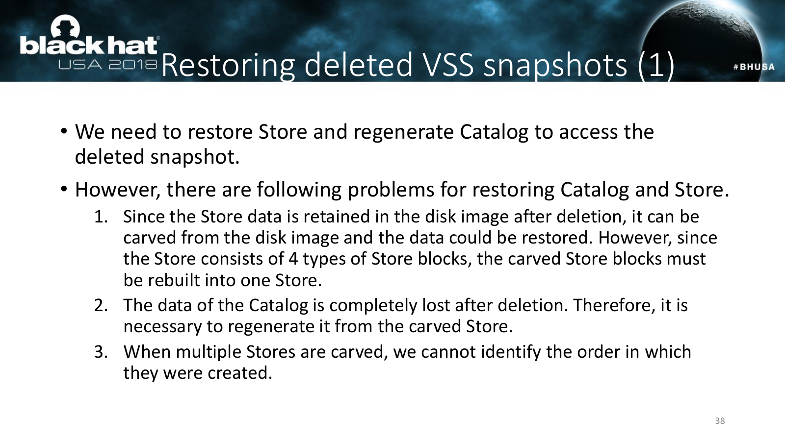

*The Store records must be rebuilt into complete Stores; the missing Catalog must be regenerated; and the creation order of multiple carved Stores must be recovered. Source: Kobayashi and Suzuki, Black Hat USA 2018, slide 38 — [open the English PDF at this slide](https://i.blackhat.com/us-18/Thu-August-9/us-18-Kobayashi-Reconstruct-The-World-From-Vanished-Shadow-Recovering-Deleted-VSS-Snapshots.pdf#page=38).*

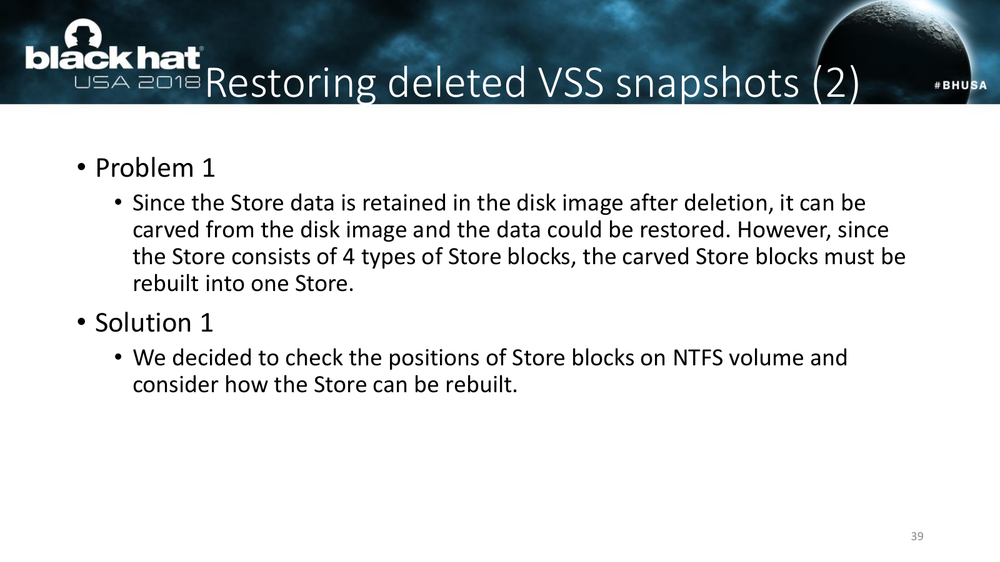

*The first recovery problem is structural: carving returns separate Store block records rather than a ready-to-mount Store. Source: Kobayashi and Suzuki, Black Hat USA 2018, slide 39 — [open the English PDF at this slide](https://i.blackhat.com/us-18/Thu-August-9/us-18-Kobayashi-Reconstruct-The-World-From-Vanished-Shadow-Recovering-Deleted-VSS-Snapshots.pdf#page=39).*

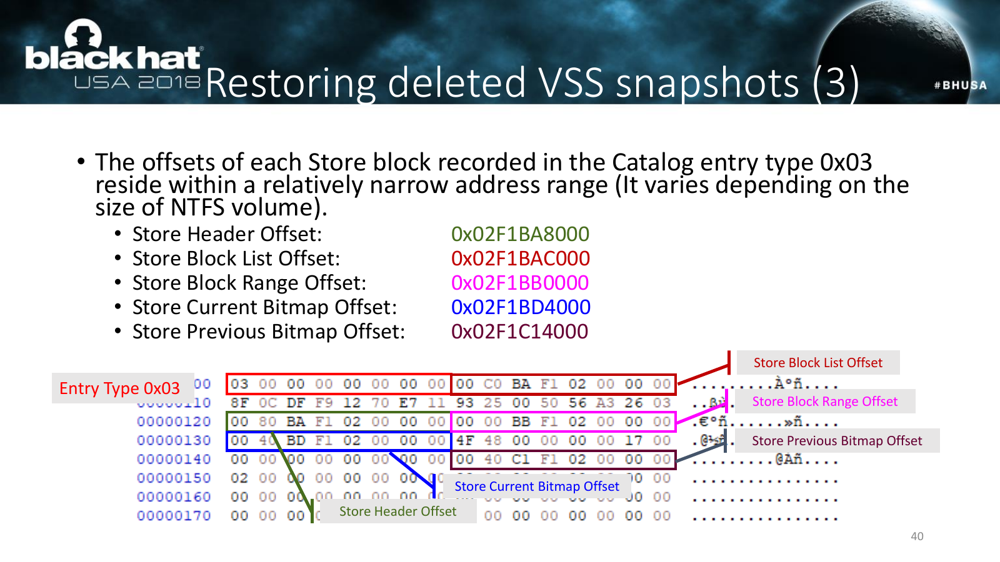

*The offsets for the Store Header, Block List, Block Range, current bitmap, and previous bitmap are normally clustered in a narrow region and can guide reconstruction. Source: Kobayashi and Suzuki, Black Hat USA 2018, slide 40 — [open the English PDF at this slide](https://i.blackhat.com/us-18/Thu-August-9/us-18-Kobayashi-Reconstruct-The-World-From-Vanished-Shadow-Recovering-Deleted-VSS-Snapshots.pdf#page=40).*

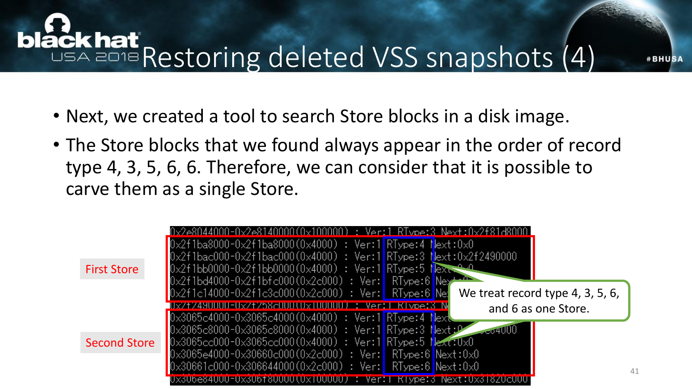

*The carver treats each recurring sequence of record types `4 → 3 → 5 → 6 → 6` as one Store. Source: Kobayashi and Suzuki, Black Hat USA 2018, slide 41 — [open the English PDF at this slide](https://i.blackhat.com/us-18/Thu-August-9/us-18-Kobayashi-Reconstruct-The-World-From-Vanished-Shadow-Recovering-Deleted-VSS-Snapshots.pdf#page=41).*

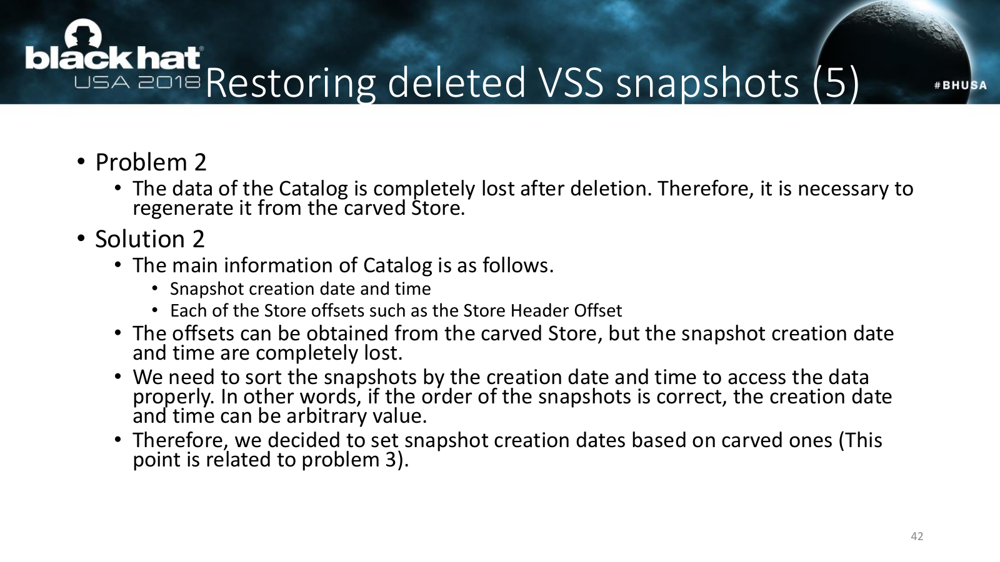

*Store offsets can be recovered, but the original snapshot timestamps are lost; correct Store order matters more than preserving the exact original timestamp values. Source: Kobayashi and Suzuki, Black Hat USA 2018, slide 42 — [open the English PDF at this slide](https://i.blackhat.com/us-18/Thu-August-9/us-18-Kobayashi-Reconstruct-The-World-From-Vanished-Shadow-Recovering-Deleted-VSS-Snapshots.pdf#page=42).*

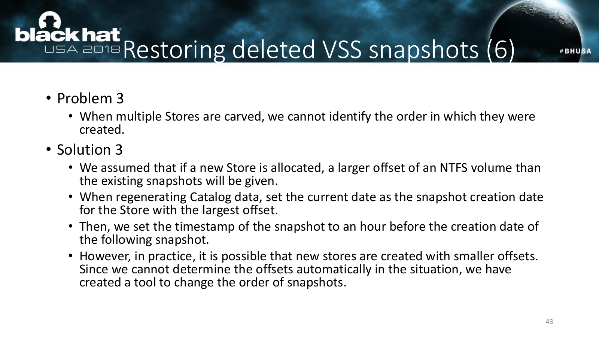

*The initial ordering heuristic uses Store offsets, but the authors also provide a tool for manually changing Catalog order when allocation offsets do not reflect creation order. Source: Kobayashi and Suzuki, Black Hat USA 2018, slide 43 — [open the English PDF at this slide](https://i.blackhat.com/us-18/Thu-August-9/us-18-Kobayashi-Reconstruct-The-World-From-Vanished-Shadow-Recovering-Deleted-VSS-Snapshots.pdf#page=43).*

---

## Parsing

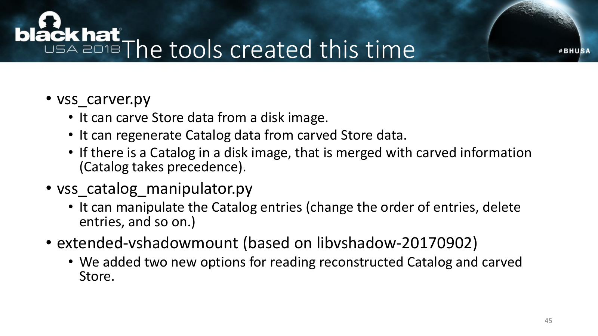

*The toolset consists of `vss_carver.py`, `vss_catalog_manipulator.py`, and an extended build of `vshadowmount`. Source: Kobayashi and Suzuki, Black Hat USA 2018, slide 45 — [open the English PDF at this slide](https://i.blackhat.com/us-18/Thu-August-9/us-18-Kobayashi-Reconstruct-The-World-From-Vanished-Shadow-Recovering-Deleted-VSS-Snapshots.pdf#page=45).*

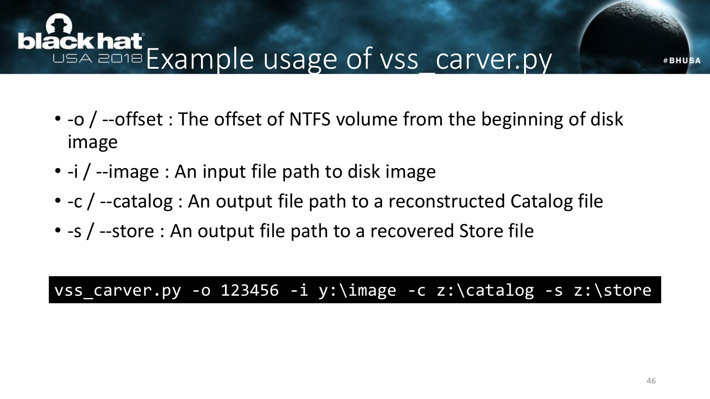

*`vss_carver.py` receives the NTFS-volume offset and disk image, then writes a reconstructed Catalog and recovered Store. Source: Kobayashi and Suzuki, Black Hat USA 2018, slide 46 — [open the English PDF at this slide](https://i.blackhat.com/us-18/Thu-August-9/us-18-Kobayashi-Reconstruct-The-World-From-Vanished-Shadow-Recovering-Deleted-VSS-Snapshots.pdf#page=46).*

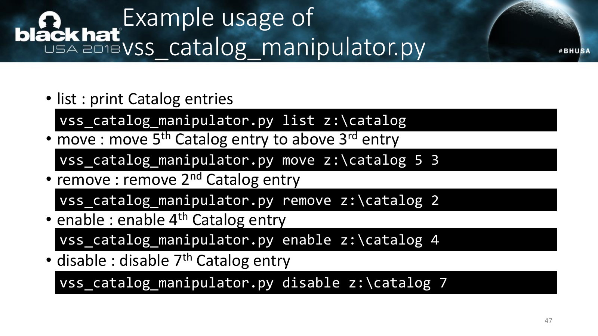

*The Catalog manipulator lists, moves, removes, enables, and disables reconstructed Catalog entries. Source: Kobayashi and Suzuki, Black Hat USA 2018, slide 47 — [open the English PDF at this slide](https://i.blackhat.com/us-18/Thu-August-9/us-18-Kobayashi-Reconstruct-The-World-From-Vanished-Shadow-Recovering-Deleted-VSS-Snapshots.pdf#page=47).*

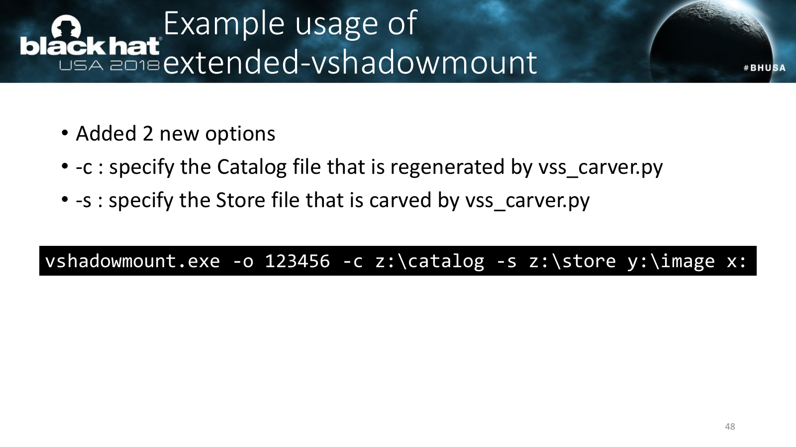

*The extended `vshadowmount` accepts the regenerated Catalog with `-c` and the carved Store with `-s`. Source: Kobayashi and Suzuki, Black Hat USA 2018, slide 48 — [open the English PDF at this slide](https://i.blackhat.com/us-18/Thu-August-9/us-18-Kobayashi-Reconstruct-The-World-From-Vanished-Shadow-Recovering-Deleted-VSS-Snapshots.pdf#page=48).*

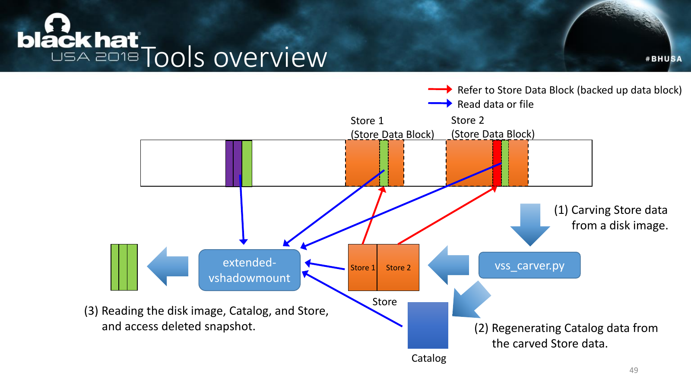

*The full workflow is: carve Store data, regenerate the Catalog, then mount the disk image together with the recovered structures and read the deleted snapshot. Source: Kobayashi and Suzuki, Black Hat USA 2018, slide 49 — [open the English PDF at this slide](https://i.blackhat.com/us-18/Thu-August-9/us-18-Kobayashi-Reconstruct-The-World-From-Vanished-Shadow-Recovering-Deleted-VSS-Snapshots.pdf#page=49).*

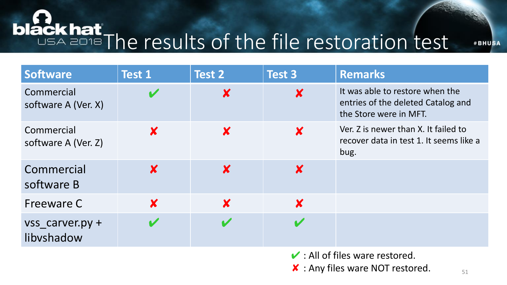

*In the authors’ tests, `vss_carver.py` with libvshadow restored all files in all three scenarios, including the test involving ransomware encryption. Source: Kobayashi and Suzuki, Black Hat USA 2018, slide 51 — [open the English PDF at this slide](https://i.blackhat.com/us-18/Thu-August-9/us-18-Kobayashi-Reconstruct-The-World-From-Vanished-Shadow-Recovering-Deleted-VSS-Snapshots.pdf#page=51).*

- **libvshadow / vshadowmount** (Joachim Metz, libyal). The reference open-source implementation of the on-disk format. `vshadowinfo` lists snapshots; `vshadowmount` FUSE-mounts a raw image and exposes each snapshot as a separate device that can then be loop-mounted as NTFS. Also the *de facto* documentation for the format — the specification PDF in that repo is the closest thing to a public spec of the structures described above.
- **vshadow.exe** — Microsoft's own sample tool, shipped in the Windows SDK under `%ProgramFiles(x86)%\Windows Kits\10\bin\<version>\<arch>\vshadow.exe`. Uses `IVssBackupComponents` directly, so it is the canonical way to script snapshot creation/deletion from a Requester that isn't `vssadmin`.
- **DiskShadow** (`%SystemRoot%\System32\diskshadow.exe`) — built-in scriptable Requester; `EXPOSE` command mounts a shadow copy as a drive letter for live triage.
- **ShadowExplorer** — GUI browser over shadow copies on a live Windows system.
- **Live mount via junction**: `mklink /d C:\vss1 \\?\GLOBALROOT\Device\HarddiskVolumeShadowCopy1\` gives a directory that transparently exposes the shadow. Useful for triage; also a technique attackers use for post-exploitation reads (e.g., of the SAM).
- **KAPE**, **Autopsy + Sleuth Kit**, **VSS-Carver** for automated collection and carving out of unallocated/partial Store fragments.
- Volatility does *not* parse on-disk VSS but does surface `volsnap`-related driver state and the diff-area pointers in memory, which can help confirm that a suspected-deleted snapshot was in fact deleted rather than never created.

---

## References

### Core VSS architecture and behavior

- Microsoft, [*Volume Shadow Copy Service (VSS)*](https://learn.microsoft.com/en-us/windows-server/storage/file-server/volume-shadow-copy-service) — requester/writer/provider roles, creation sequence, provider types, copy-on-write, diff area, and VSS tools.
- Kobayashi and Suzuki (Black Hat USA 2018), [*Reconstruct The World From Vanished Shadow: Recovering Deleted VSS Snapshots*](https://i.blackhat.com/us-18/Thu-August-9/us-18-Kobayashi-Reconstruct-The-World-From-Vanished-Shadow-Recovering-Deleted-VSS-Snapshots.pdf) — command-line screenshots, on-disk Catalog/Store structures, 16 KB blocks, reconstruction, deletion, and recovery tooling.
- Joachim Metz / libyal, [*libvshadow*](https://github.com/libyal/libvshadow) and its [VSS format documentation](https://github.com/libyal/libvshadow/tree/main/documentation) — open-source parser and format notes.
- Macrium, [*What is VSS, how does it work and why does Macrium use it?*](https://www.macrium.com/blog/backup-internals-what-is-vss-how-does-it-work-and-why-do-we-use-it-4e566223125a) — copy-on-write explanation and diagram.

### Administration and troubleshooting

- BackupVault, [*VSS Troubleshooting for BackupVault Pro*](https://support.backupvault.co.uk/hc/en-us/articles/11274997234589-VSS-Troubleshooting-for-BackupVault-Pro) — `vssadmin list writers` screenshot, writer/service mapping, storage-area settings, and common errors.
- PeteNetLive, [*Windows: Enable “Previous Versions”*](https://www.petenetlive.com/KB/Article/0001393) — Windows Server GUI path for enabling and scheduling shadow copies.
- Spiceworks Community, [*How to protect Previous Version with Shadow Copy*](https://community.spiceworks.com/t/how-to-protect-previous-version-with-shadow-copy/656205) — operational discussion about retaining and protecting Previous Versions.
- Microsoft, [`vssadmin list shadows`](https://learn.microsoft.com/en-us/windows-server/administration/windows-commands/vssadmin-list-shadows) and [`vssadmin list shadowstorage`](https://learn.microsoft.com/en-us/previous-versions/windows/it-pro/windows-server-2012-r2-and-2012/cc788045(v=ws.11)) — command syntax and interpretation.